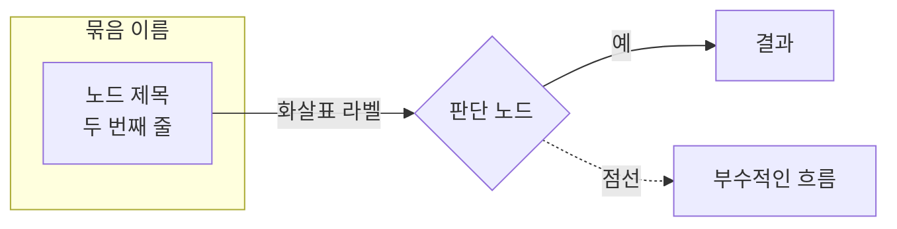

# 본문 다이어그램

블로그는 보여주는 매체다. **구조·흐름·비교가 나오는 글에는 그림이 최소 하나 들어간다.**
표와 코드블록만으로 끝나는 글은 아직 덜 된 것으로 본다.

## 1. 무엇을 그릴지 고른다

글에서 **독자가 머릿속에 그림을 그려야 하는 지점**이 후보다. 본문에 이런 문장이 있으면
거기가 그림 자리다.

| 본문에 이런 문장이 있으면 | 이런 그림 |
| --- | --- |
| "A 가 B 를 가리킨다", "체인을 이룬다" | `flowchart LR` — 포인터·참조 관계 |
| "여기서 갈라진다", "~면 A, 아니면 B" | `flowchart TB` + 마름모 판단 노드 |
| "순서대로 이렇게 흐른다" | `flowchart TB` 또는 `sequenceDiagram` |
| "X 안에 Y 와 Z 가 같이 들어있다" | `subgraph` 로 묶기 |
| "엔진마다 방식이 다르다" | 갈래마다 노드를 나눠 대비 |

**장식하지 않는다.** 본문을 그대로 옮긴 그림은 넣지 않는다. 글로 쓰면 장황해지는 관계를
한눈에 보이게 만들 때만 넣는다.

## 2. 쓰는 법

` ```mermaid ` 코드펜스를 쓰면 빌드 시점에 SVG 로 구워진다. 클라이언트 JS 는 0이고,
색은 CSS 가 라이트/다크에 맞춰 덮어쓴다. 라이브러리를 추가로 부르지 않는다.

````markdown

````

## 3. 함정 — 여기서 실제로 깨졌던 것들

### 라벨 줄바꿈은 `<br>`

`<br/>` 도 `<br>` 로 정규화되지만 **`<br>` 로 통일**한다.

과거에 `foreignObject` 안의 `<br>` 이 SVG 네임스페이스로 직렬화되면서 `<br></br>` 가 되고,
브라우저가 줄바꿈 두 번으로 읽어 **라벨이 박스 밖으로 잘리는** 문제가 있었다.
`src/utils/rehypeMermaidLineBreaks.ts` 가 줄바꿈 문자로 바꿔 고치고,
`typography.css` 의 `white-space: pre-line` 이 짝을 이룬다. **이 둘을 건드리지 말 것.**

### 괄호가 들어가면 라벨을 반드시 `"` 로 감싼다

```
A[데이터 페이지 (디스크)]     ❌ 파싱 깨짐
A["데이터 페이지 (디스크)"]   ✅
```

`(`, `)`, `[`, `]`, `{`, `}`, `:` 가 라벨에 있으면 큰따옴표로 감싼다.
**의심스러우면 그냥 항상 감싼다.**

### 노드 안에는 짧게

한 노드에 3줄을 넘기지 않는다. 설명은 본문에 쓰고 노드에는 이름과 핵심 값만 둔다.
한글 라벨은 폭이 넓어서 노드가 커지면 다이어그램이 옆으로 길어진다.

### 색을 직접 지정하지 않는다

`style`, `classDef`, `fill:#...` 같은 걸 쓰지 않는다. 테마 색은
`typography.css` 의 `svg[aria-roledescription]` 규칙이 덮어쓰므로, 직접 칠하면
다크모드에서 안 보이거나 따로 놀게 된다.

## 4. 반드시 눈으로 확인한다

**mermaid 문법 오류는 빌드를 깨뜨리지 않고 조용히 이상하게 그려진다.** 저장하고 넘어가지 말 것.

```bash
npx astro dev status || npx astro dev --background
```

`http://localhost:4321/<섹션>/<슬러그>/` 를 열어서 본다. 확인할 것:

- 라벨이 박스를 넘치지 않는가
- 화살표가 엉키거나 노드를 관통하지 않는가
- 다크모드에서도 읽히는가 (사이드바 하단 테마 버튼)
- 좁은 화면에서 가로로 넘치지 않는가

`astro.config.ts` 를 고쳤다면 dev 서버를 **재시작**해야 반영된다 (`npx astro dev stop`).
글만 고쳤으면 자동 갱신된다.

## 5. mermaid 로 안 되는 배치라면

메모리/디스크 레이아웃처럼 위치를 직접 잡아야 하는 그림은 인라인 SVG 로 그려도 된다.
`typography.css` 의 `figure.diagram` 과 `.d-*` 클래스를 쓴다.

```html
<figure class="diagram">
<svg viewBox="0 0 660 250" role="img" aria-label="설명">
  <rect x="14" y="34" width="252" height="84" rx="6" class="d-box" />
  <text x="30" y="58" class="d-mono">t_xmin = 100</text>
</svg>
<figcaption>한 줄 설명</figcaption>
</figure>
```

**raw HTML 블록 안에는 빈 줄을 넣지 않는다.** 마크다운이 빈 줄에서 HTML 블록을 끊어버려
나머지가 텍스트로 새어 나온다. (실제로 이걸로 한 번 깨졌다.)

## 6. 빌드 환경 (알아만 둘 것)

`rehype-mermaid` 가 **헤드리스 브라우저로** 빌드 시점에 렌더한다.

- 브라우저: `package.json` 의 `prebuild` 가 chromium 을 보장한다
- 한글 폰트: 라벨 폭을 빌드 시점에 재므로 폰트가 없으면 박스 크기가 어긋난다.
  CI 는 워크플로에서 `fonts-noto-cjk` 를 설치한다
- 설정: `astro.config.ts` 의 `rehypeMermaid` 옵션과
  `syntaxHighlight.excludeLangs: ["mermaid"]` (Shiki 가 먼저 채가지 않게)

이 중 하나라도 빠지면 다이어그램이 깨지거나 코드블록으로 표시된다.
