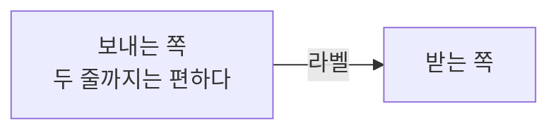

# 강의 섹션 정리

강의 정리는 형태가 정해져 있어서 매번 같은 결정을 반복하게 된다
(어느 섹션에 넣지, 태그 뭐로 하지, 제목 어떻게 짓지). 그걸 여기에 고정해 둔다.

## 0. 전제

- **이 세션에서는 이 글 하나만 쓴다.** 다른 글까지 이어서 써달라는 요청은 새 세션으로 넘긴다.
- **블로그 폴더에서 연 세션이어야 한다.** `pwd` 로 확인하고, 아니면 멈추고 안내한다.

## 1. 강의 등록부

| 강의 | 섹션 | 태그 |
| --- | --- | --- |
| [Fundamentals of Database Engineering](https://www.udemy.com/course/database-engineering-korean/) (Hussein Nasser) | `study/database` | `Fundamentals of Database Engineering` |

새 강의를 시작하면 이 표에 한 줄 추가하고, 필요하면 `src/data/sections.ts` 에
섹션을 먼저 만든다. 표에 없는 강의면 사용자에게 섹션과 태그를 물어본 뒤 표에 추가한다.

**제목 규칙: `섹션N: 주제`** — 강의 커리큘럼의 섹션 번호를 그대로 쓴다.
슬러그는 `section-N-주제영문` (예: `section-2-acid`).
나중에 목차 순으로 훑어볼 수 있게 번호를 반드시 넣는다.

## 2. 재료 모으기

```bash
ls ref/
```

`ref/` 는 커밋되지 않는 참고 자료 폴더다. 강의를 들으며 다른 AI 와 파고든 대화,
필기, PDF 가 여기 들어온다. 이번 주제와 관련 있어 보이는 파일을 **먼저 읽는다.**

- 관련 파일이 여러 개면 다 읽는다. 어느 게 이번 주제인지 애매하면 사용자에게 묻는다.
- 관련 파일이 없으면 사용자에게 무엇을 배웠는지 직접 듣는다.

그리고 사용자에게 확인한다: **강의에서 무엇이 안 풀렸고, 뭘 파고들었는지.**
이게 글의 중심이 된다.

## 3. 무엇을 쓸지 정한다

강의 요약을 쓰는 게 아니다. **강의 요약은 가치가 없다** — 강의를 보면 되기 때문이다.
이 글의 가치는 다음 셋에서 나온다.

1. **강의가 답을 안 준 지점.** "그래서 실제로는 어떻게 동작하는데?"
2. **내가 잘못 알고 있다가 고친 것.** 착각의 내용과 왜 착각했는지까지.
3. **여러 구현을 비교해서 얻은 일반 원리.** 표로 정리되면 특히 좋다.

강의 슬라이드를 그대로 옮기지 않는다. `ref/` 의 AI 답변도 그대로 붙여넣지 않는다.
**이해한 내용을 사용자의 말로 다시 쓴다.**

`ref/` 자료에 회사 정보나 개인 정보가 섞여 있을 수 있다. 그대로 통과시키지 않는다.

## 4. 글의 뼈대

내용에 안 맞으면 바꿔도 된다. 다만 **결론이 앞에 오는 순서**는 지킨다.

```markdown
강의를 듣고 뭐가 안 풀렸는지 두세 문장. 그리고 파고들어서 알게 된 결론을 먼저 말한다.

## <핵심 개념>이 실제로 어떻게 만들어지는가

전체 그림. 표가 잘 맞는 자리다.

## <갈림길 / 비교>

구현이 갈리는 지점. 각각 왜 그렇게 골랐는지.

## 여기서 내가 막혔던 것들

이 글의 핵심. 번호를 매겨 하나씩. "왜 그렇게 착각했는지"까지 쓴다.

## 정리

비교표 + "다음에 이 근처에서 막히면 이 순서로 본다" 한 문단.

## 참고

- [강의 제목](강의 URL) — 강사 이름
- 공식 문서 링크
```

- 코드 블록에는 언어를 표시한다. 도식은 ` ```text `.
- 한국어, 평서체(`~다`). 어시스턴트 말투를 남기지 않는다.
- **확인하지 않은 코드나 수치는 넣지 않는다.** 공식 문서로 확인되면 링크를 단다.


## 다이어그램을 넣는다

블로그는 보여주는 매체다. **구조·흐름·비교가 나오는 글에는 그림을 최소 하나 넣는다.**
표와 코드블록만으로 끝내지 않는다.

` ```mermaid ` 코드펜스를 쓰면 빌드 시점에 SVG 로 구워진다 (클라이언트 JS 0, 테마 자동).

````markdown

````

- 라벨 줄바꿈은 `<br>`. `(`, `)` 가 들어가면 라벨을 `"` 로 감쌀 것.
- 노드 안에는 짧게 쓰고 설명은 본문에 둔다.
- 그리고 나서 `npm run dev` 로 **실제로 렌더된 모습을 확인한다.** mermaid 문법 오류는
  빌드를 깨뜨리지 않고 조용히 이상하게 그려질 수 있다.

무엇을 그릴지 고를 때: 글에서 독자가 머릿속에 그림을 그려야 하는 지점이 있으면 그게 후보다.
"A 가 B 를 가리킨다", "여기서 갈라진다", "순서대로 이렇게 흐른다" 같은 문장이 그렇다.

## 5. 저장

```bash
node scripts/blog.mjs new \
  --section study/database \
  --title "섹션2: ACID" \
  --slug section-2-acid \
  --description "한두 문장 요약. 제목을 반복하지 말고 결론을 담는다." \
  --tags "Fundamentals of Database Engineering" \
  --body-file - <<'POST'
본문
POST
```

`draft: true` 로 저장되므로 배포되지 않는다.

## 6. 마무리

```bash
npm run dev
```

초안은 로컬에서만 보인다: `http://localhost:4321/<섹션>/<슬러그>/`

다듬을 게 있으면 `/blog-refine`, 발행은 `/blog-publish`.
여기서 커밋·푸시하지 않는다.
