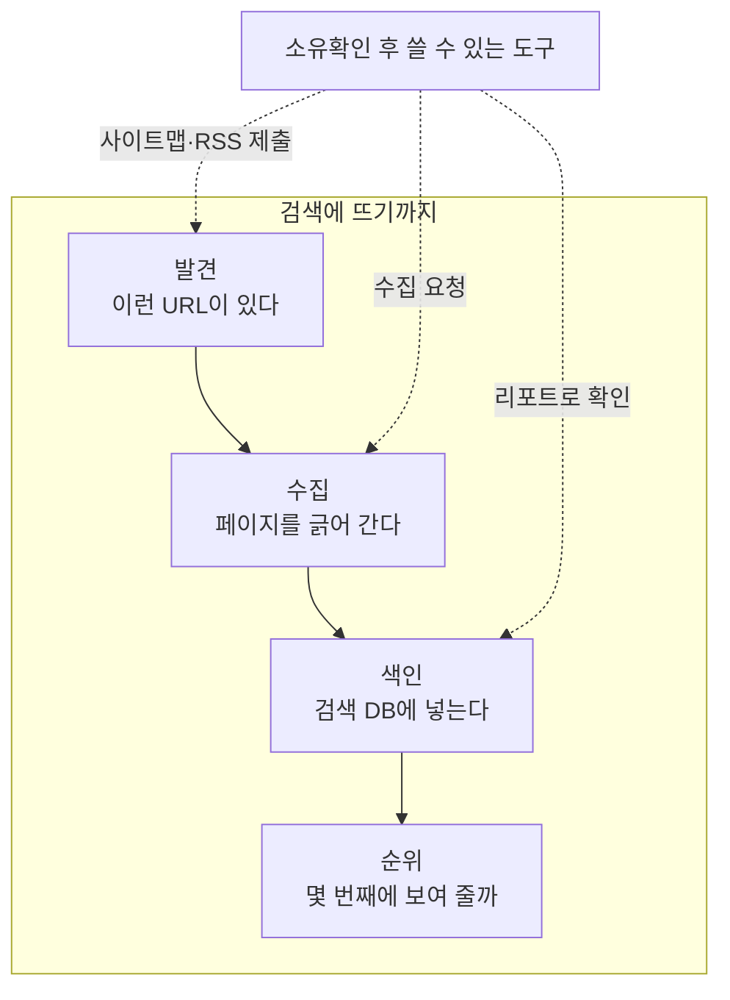

GitHub Pages로 만든 새 블로그는 SEO 태그를 다 갖춰도 검색에 잘 안 뜬다. 대개 태그가 아니라 **검색엔진에 사이트가 있다고 알리는 일**이 빠져 있다. 구글 Search Console과 네이버 서치어드바이저에 등록하는 방법과, 등록이 실제로 무엇을 바꾸는지 정리한다.

## 먼저 확인할 것: 태그는 다 있는가

배포된 사이트가 검색엔진에 어떻게 보이는지부터 본다. canonical이나 사이트맵의 주소는 배포 설정(사이트 URL)을 따라 만들어지므로, 로컬 빌드가 아니라 실제 주소로 확인해야 한다.

```bash
SITE=https://loading1031.github.io

# robots.txt 와 사이트맵이 실제로 열리는가
for p in robots.txt sitemap-index.xml sitemap-0.xml; do
  curl -s -o /dev/null -w "%{http_code} $p\n" $SITE/$p
done

# 사이트맵에 글이 다 들어 있는가
curl -s $SITE/sitemap-0.xml | grep -oE '<loc>[^<]*' | sed 's/<loc>//'

# 글 페이지에 title / description / canonical / 구조화 데이터가 있는가
curl -s $SITE/study/database/section-2-acid/ \
  | grep -oE '<title>[^<]*</title>|<meta name="description"[^>]*>|<link rel="canonical"[^>]*>|application/ld\+json'

# 소유확인 태그가 나가고 있는가
curl -s $SITE/ | grep -c 'site-verification'
```

이 블로그(AstroPaper 테마)의 결과는 이랬다.

| 항목 | 상태 |
| --- | --- |
| <abbr title="검색 로봇에게 어느 경로를 긁어도 되는지 알려 주는 사이트 루트의 텍스트 파일.">robots.txt</abbr> | 전체 허용, 사이트맵 경로 명시 |
| <abbr title="사이트에 있는 페이지 URL 목록을 담은 XML. 로봇이 링크를 따라가지 않아도 페이지를 알 수 있게 한다.">사이트맵</abbr> | 글 전부 포함 |
| title · description · <abbr title="같은 내용이 여러 주소로 열릴 때 대표 주소가 무엇인지 알려 주는 태그.">canonical</abbr> | 글마다 있음 |
| <abbr title="페이지가 글인지, 언제 쓰였는지 등을 검색엔진이 읽는 형식으로 적어 둔 구조화 데이터.">JSON-LD</abbr> | 있음 |
| 소유확인 태그 | **0건** |

테마가 챙겨 주는 태그는 다 있고, 소유확인 태그만 없다. `robots.txt`는 호스트 루트에 있어야 로봇이 읽는데, `username.github.io` 사용자 사이트라 문제가 없다. `username.github.io/repo` 같은 프로젝트 사이트는 `repo/robots.txt`를 만들어도 읽히지 않는다. 소유확인을 안 했다면 사이트맵을 제출한 적도 없다는 뜻이다. 사이트맵은 파일로 존재해도, 검색엔진이 그 파일을 읽으러 오려면 먼저 사이트를 알아야 한다.

## 검색 노출은 네 단계다

"검색에 안 뜬다"는 말 하나에 원인이 네 층으로 겹쳐 있다. 어느 층에서 막혔는지에 따라 할 일이 전혀 다르다.



- **발견**: 검색엔진은 주로 이미 아는 페이지의 링크를 따라 새 URL을 찾는다. 생긴 지 얼마 안 됐고 외부 링크도 없는 `github.io` 사이트는 이 단계에서 멈춰 있기 쉽다.
- **수집·색인**: 발견된 뒤의 일이다. robots.txt, canonical, 구조화 데이터가 여기서 쓰인다.
- **순위**: 색인된 뒤의 일이다. 제목과 본문이 검색어와 맞는지, 다른 곳에서 링크가 걸리는지가 영향을 준다.

테마가 챙겨 주는 건 둘째·셋째 단계다. 첫 단계는 사람이 직접 해야 한다.

## Google Search Console: URL 접두어 + HTML 파일

[Search Console](https://search.google.com/search-console)에서 속성을 추가하면 **도메인**과 **URL 접두어** 두 가지를 고르게 된다.

**도메인 속성은 `github.io`에서 쓸 수 없다.** 도메인 속성은 DNS에 <abbr title="도메인에 임의의 문자열을 붙여 두는 DNS 레코드. 도메인 소유 증명에 흔히 쓰인다.">TXT 레코드</abbr>를 추가해서 인증하는데, `loading1031.github.io`의 DNS는 GitHub이 관리한다. 도메인 쪽을 고르면 "이 값을 DNS 설정에 복사하라"는 안내에서 더 진행할 수 없다.

**URL 접두어**를 고르고 `https://loading1031.github.io/`를 넣는다. 앞뒤에 공백이 붙으면 "전체 URL 접두어를 입력하라"는 오류가 난다.

인증 방법은 **HTML 파일**이 간단하다. 받은 `googleXXXX.html`을 Astro의 `public/`에 넣으면 빌드 때 사이트 루트로 그대로 복사된다.

```text
public/googleb3f499b4b54cb65b.html   →   https://loading1031.github.io/googleb3f499b4b54cb65b.html
```

배포가 끝나기 전에 확인을 누르면 실패한다. 파일이 실제로 열리는지 먼저 본다.

```bash
curl -s -o /dev/null -w "%{http_code}\n" https://loading1031.github.io/googleb3f499b4b54cb65b.html
# 200 이 나온 뒤에 확인을 누른다
```

### 사이트맵 제출과 "가져올 수 없음"

인증이 끝나면 왼쪽 메뉴 **Sitemaps**로 간다. 입력칸 앞에 `https://loading1031.github.io/`가 이미 붙어 있으므로 `sitemap-index.xml`만 넣는다. 전체 주소를 붙여넣으면 주소가 두 번 들어간다.

제출 직후 상태가 **가져올 수 없음**으로 뜰 수 있다. 먼저 파일이 정상인지 본다.

```bash
UA="Mozilla/5.0 (compatible; Googlebot/2.1; +http://www.google.com/bot.html)"
for p in sitemap-index.xml sitemap-0.xml; do
  curl -sI -A "$UA" https://loading1031.github.io/$p | grep -iE '^HTTP|content-type'
  curl -s https://loading1031.github.io/$p | xmllint --noout - && echo "$p XML ok"
done
```

`200`, `application/xml`이고 XML 문법도 정상인데 이 상태가 뜨면 구글이 아직 한 번도 가져가지 않은 것일 가능성이 높다. 새 속성에서 흔히 보이고 시간이 지나면 **성공**으로 바뀐다고 알려져 있지만, 구글이 공식적으로 설명한 내용은 아니다. 확인하는 방법은 두 가지다.

- 상단 **URL 검사**에 사이트맵 주소를 넣고 **실제 URL 테스트**를 누른다. 여기서 가져올 수 있다고 나오면 처리 대기 중이다.
- 인덱스를 거치지 않도록 `sitemap-0.xml`도 따로 제출해 둔다.

## 네이버 서치어드바이저: `<head>` 안의 메타태그

네이버는 [서치어드바이저](https://searchadvisor.naver.com/guide) → 웹마스터 도구 → 사이트 등록으로 들어간다. 인증은 **HTML 태그** 방식으로 한다.

```html
<meta name="naver-site-verification" content="..." />
```

AstroPaper에는 구글용 태그 자리만 있어서 네이버용을 같은 방식으로 추가했다. 설정 파일에 값이 있을 때만 태그가 나간다.

```astro
{/* src/layouts/Layout.astro — <head> 안 */}
{
  site.naverVerification && (
    <meta name="naver-site-verification" content={site.naverVerification} />
  )
}
```

네이버 가이드에 적힌 조건은 세 가지다.

- 태그는 `<head>` 안에 있어야 한다. `<body>`나 `<frame>` 안에 있으면 검사에서 뺀다.
- 네이버의 확인 로봇은 자바스크립트를 실행하지 않는다. JS나 `meta refresh`로 다른 페이지로 넘기면 넘어간 페이지의 태그를 못 본다. 리다이렉트가 필요하면 서버의 301·302로 처리해야 한다.
- 확인은 브라우저 개발자 도구가 아니라 `view-source:` 또는 `curl`로 한다. 개발자 도구는 JS가 고친 뒤의 DOM을 보여 주기 때문이다.

정적 사이트면 셋 다 걸릴 일이 없다. 배포 후 태그가 나오는지만 보고 소유확인을 누른다.

```bash
curl -s https://loading1031.github.io/ | grep -o '<meta name="naver-site-verification"[^>]*>'
```

### 사이트맵과 RSS 제출

제출은 가이드 문서가 아니라 웹마스터 도구에서 한다. [사이트 목록](https://searchadvisor.naver.com/console/board)에서 사이트를 고르고 왼쪽 **요청** 메뉴로 간다.

| 메뉴 | 넣는 값 |
| --- | --- |
| 요청 → 사이트맵 제출 | `sitemap-index.xml` |
| 요청 → RSS 제출 | `https://loading1031.github.io/rss.xml` |

네이버도 사이트맵 인덱스를 받는다. [RSS 및 사이트맵 제출 가이드](https://searchadvisor.naver.com/guide/request-feed)에 단일 사이트맵과 "또다른 사이트맵을 포함하는 사이트맵 인덱스" 두 형식이 모두 나와 있다. 제출할 때 검증하는 조건도 같은 문서에 있다.

- 사이트맵 안의 모든 URL이 소유확인한 사이트와 같은 도메인일 것
- 10MB 미만, 사이트맵 하나에 URL 50,000개 미만
- 응답이 느리면 제출이 제한될 수 있음

같은 문서는 **RSS보다 사이트맵을 권장한다.** RSS는 본문까지 담아서 URL을 많이 넣기 어렵기 때문이다. 둘 다 제출하고 네이버 로봇이 주기적으로 다시 방문하게 두되, 전체 글 목록은 사이트맵이 책임진다고 보면 된다. 새 글은 빌드 때 두 파일에 자동으로 추가되므로 다시 제출할 필요는 없다.

### 웹 페이지 수집 요청

같은 **요청** 메뉴의 **웹 페이지 수집**은 URL 하나를 넣어 "이 페이지를 먼저 긁어 가 달라"고 요청하는 기능이다. 사이트맵이 글 목록 전체를 알린다면, 수집 요청은 특정 글을 앞으로 당긴다. [네이버 가이드](https://searchadvisor.naver.com/guide/request-crawl)에 적힌 성질은 이렇다.

- 요청해도 로봇이 바로 오지 않는다. 우선순위에 따라 **최소 1일에서 몇 주**가 걸리니 같은 URL을 매일 다시 넣을 필요는 없다.
- 사이트마다 요청할 수 있는 양에 제한이 있다.
- 수집에 성공해도 검색 결과 노출은 보장되지 않는다.

사이트맵을 제출했다면 모든 글을 넣을 필요는 없다. 홈과 먼저 노출되기를 바라는 글 몇 개만 넣는다.

## 인증값은 공개돼도 괜찮다

구글 값은 파일 이름과 내용에, 네이버 값은 모든 페이지의 HTML에 그대로 드러난다. 그래도 괜찮다.

세 인증 방식은 증명하는 게 같다. **"이 주소에 올라가는 내용을 내가 바꿀 수 있다."**

| 방식 | 값을 두는 곳 | 증명하는 것 |
| --- | --- | --- |
| HTML 파일 | 루트의 `googleXXXX.html` | 루트에 파일을 올릴 수 있다 |
| HTML 태그 | 홈페이지 `<head>` | 홈페이지 HTML을 고칠 수 있다 |
| DNS TXT | 도메인의 DNS 레코드 | 도메인 자체를 관리한다 |

값은 로그인한 계정과 사이트 주소 조합으로 발급된다. 그 값이 사이트에 나타나면, 사이트를 고칠 수 있는 사람이 그 계정 주인이라는 뜻이 된다. 남이 값을 알아내도 쓸 데가 없다. 자기 사이트에 붙이면 자기 사이트는 증명되지 않고, 내 사이트에는 붙일 권한이 없다. 비밀번호가 아니라 **내 사이트에 둘 때만 의미가 있는 표식**이다.

## 소유확인은 순위를 올리지 않는다

네이버 가이드에도 "웹마스터도구에 사이트를 등록하지 않아도 검색 결과에 반영된다"고 적혀 있다. 그럼 왜 하는가. 소유확인은 순위 점수가 아니라 **검색엔진에 직접 말을 거는 도구의 열쇠**다.

| | 소유확인 없이 | 소유확인 후 |
| --- | --- | --- |
| 발견 | 다른 곳의 링크를 타고 우연히 오기를 기다린다 | 사이트맵·RSS를 제출해 직접 알린다 |
| 수집 | 로봇이 언제 올지 모른다 | 특정 URL을 먼저 긁어 달라고 요청한다 |
| 색인 | 들어갔는지 알 수 없다 | 리포트로 몇 편이 색인됐는지, 무슨 오류가 났는지 본다 |
| 순위 | — | **달라지지 않는다** |

외부 링크가 이미 많은 사이트라면 소유확인 없이도 발견된다. 새 블로그는 외부 링크가 없어서 발견 줄의 차이가 크다.

## 색인됐는지 확인하는 법

등록 당일에는 확인할 게 없다. 네이버 **검증 → 색인 상태 확인**에 주소를 넣으면 "URL 검사 결과가 없습니다. 수집 데이터가 없거나…"가 뜨는데, 아직 한 번도 수집되지 않았다는 뜻이다. 며칠 지나 수집 기록이 쌓인 뒤에 본다.

| 어디서 | 무엇을 보나 |
| --- | --- |
| Search Console → URL 검사 | 글 하나가 색인됐는지, 안 됐다면 이유 |
| Search Console → 색인 생성 → 페이지 | 색인된 페이지 수와 제외된 이유 |
| 서치어드바이저 → 리포트 → 수집 현황 | 로봇이 언제 몇 페이지를 가져갔는지 |
| 서치어드바이저 → 검증 → 색인 상태 확인 | 글 하나가 색인됐는지 |
| 검색창에 `site:loading1031.github.io` | 실제 검색 결과에 뜨는 페이지 (대략적인 확인용) |

## 순위 단계에서 걸리는 것: 제목

색인된 다음부터는 제목이 중요해진다. 이 블로그의 강의 정리 글은 `섹션2: ACID`, `섹션6: 데이터베이스 파티셔닝` 같은 제목을 쓴다. 목록에서 강의 순서를 보여 주기엔 좋지만, "섹션2"를 검색하는 사람은 없다.

같은 블로그에서 `행 기반과 열 기반, 모니터링은 왜 열 기반인가`처럼 쓴 글은 제목에 검색어가 이미 들어 있다. 목록용 제목을 유지하고 싶으면 `<title>`에만 검색어형 제목을 따로 쓰는 방법이 있다. 이 블로그에는 아직 적용하지 않았다.

## 정리: 새 블로그를 만든 날 할 일

1. 배포된 주소로 `robots.txt`, 사이트맵, 글 페이지의 title·description·canonical을 `curl`로 확인한다. 테마를 믿지 말고 결과물을 본다.
2. Search Console에 **URL 접두어** 속성을 추가한다(`github.io`면 도메인 속성은 불가). HTML 파일을 `public/`에 넣고, 배포 후 `curl`로 `200`을 본 다음에 확인을 누른다. 사이트맵을 제출하고, "가져올 수 없음"이 떠도 파일이 정상이면 기다린다.
3. 네이버 서치어드바이저에 사이트를 등록하고, 메타태그를 `<head>`에 넣어 인증한다. **요청** 메뉴에서 사이트맵(인덱스 파일 그대로)과 RSS를 제출하고, 주요 글 몇 개는 수집 요청을 넣는다.
4. 제목에 사람들이 실제로 검색할 단어가 들어가는지 본다.

막혔을 때는 네 단계 중 어디서 막혔는지부터 가른다. 태그를 고치는 건 수집·색인 단계의 일이고, 새 블로그가 안 뜰 때는 대개 그보다 앞인 발견 단계에서 막혀 있다.

## 참고

- [Google 검색의 작동 방식](https://developers.google.com/search/docs/fundamentals/how-search-works) — 크롤링·색인·게재 단계 설명
- [Search Console 사이트 소유권 확인](https://support.google.com/webmasters/answer/9008080) — 인증 방식별 조건
- [Google 검색결과의 제목 링크](https://developers.google.com/search/docs/appearance/title-link) — `<title>`이 검색 결과에 쓰이는 방식
- [네이버 서치어드바이저 가이드](https://searchadvisor.naver.com/guide) — 사이트 등록과 소유확인
- [네이버 RSS 및 사이트맵 제출](https://searchadvisor.naver.com/guide/request-feed) — 사이트맵 인덱스 지원과 제출 조건
- [네이버 수집요청 및 검색제외](https://searchadvisor.naver.com/guide/request-crawl) — 수집 요청의 처리 방식과 한계
