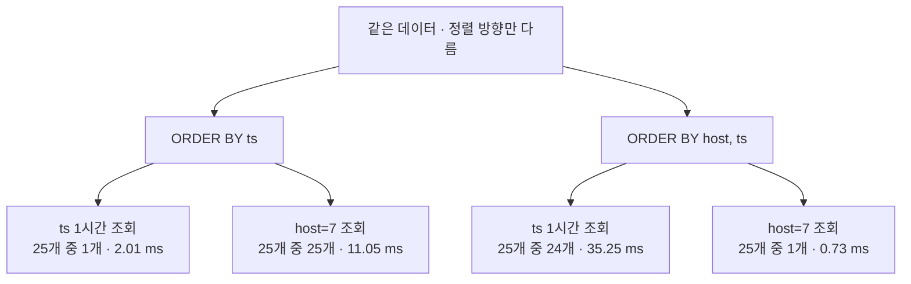

[앞 글](/study/database/row-vs-column-store/)에서 같은 7일 구간을 읽는 데 행 기반은
181.7 MB, 열 기반은 2.20 MB 를 읽는 걸 확인했다. 그런데 두 가지가 안 풀렸다.

첫째, 열 기반이 **행 수로는 오히려 더 많이 읽었다.** 1시간 구간에서 Postgres 는 3,600행,
DuckDB 는 122,880행. 왜 필요한 것보다 34배를 읽나.

둘째, 그러면 **열 기반에 인덱스를 걸면 되지 않나.** 원하는 행 범위만 정확히 집어올 수 있으면
그 34배가 사라질 텐데.

둘 다 파일 구조를 열어보고 나서야 풀렸다. 앞 글과 같은 데이터(300만 행, `ts` + `host` +
메트릭 30개, 값은 소수 1자리)를 parquet 으로 쓰면 **29.1 MB** 가 나온다.

## row group — 열 저장도 행을 먼저 자른다

열 저장이라고 300만 행짜리 컬럼을 통짜 배열로 놓지 않는다. 그러면 읽을 때 전부 메모리에
올려야 하고, 중간만 필요해도 건너뛸 방법이 없다.

그래서 **테이블을 먼저 N행씩 가로로 자르고, 그 덩어리 안에서 컬럼별로 모아 저장한다.**
그 덩어리가 row group 이다. 내 300만 행 파일은 12만 2,880행짜리 row group 25개로 나뉘었고,
각 row group 안에는 <abbr title="한 row group 안에서 컬럼 하나가 차지하는 연속된 바이트 덩어리. column chunk.">컬럼 청크</abbr> 가 테이블 컬럼 수만큼(32개) 들어 있었다.

실제 바이트 배치를 떠 보면 이렇다.

```text
RG0  [         4 ~ 1,157,969 ]   1.16 MB, 122,880행
       ts    →       4 ~   338,049   (0.338 MB)
       host  → 338,150 ~   338,545   (0.000 MB)
       m01   → 339,034 ~   376,956   (0.038 MB)
       m02   → 376,957 ~   405,779   (0.029 MB)
       ...
RG1  [ 1,157,969 ~ 2,315,000 ]   1.16 MB, 122,880행
       ts    → 1,157,969 ~ 1,496,000    ← ts 가 또 나온다
       ...
```

`ts` 가 파일 안에 **25번** 등장한다. row group 마다 자기 몫의 `ts` 12만여 개를 따로 들고 있다.

<figure class="diagram">
<svg viewBox="0 0 640 268" role="img" aria-label="열 저장 파일의 구조. 세로가 컬럼, 가로가 row group 인 격자. 조회에 필요한 것은 RG1 줄의 ts 칸과 m05 칸 두 개뿐이고, 나머지 칸은 읽지 않는다.">
  <text x="10" y="18" class="d-title">파일 = row group(가로) × 컬럼(세로) 격자</text>
  <text x="128" y="42" class="d-muted" text-anchor="middle">ts</text>
  <text x="236" y="42" class="d-muted" text-anchor="middle">host</text>
  <text x="344" y="42" class="d-muted" text-anchor="middle">···</text>
  <text x="452" y="42" class="d-muted" text-anchor="middle">m05</text>
  <text x="560" y="42" class="d-muted" text-anchor="middle">···</text>
  <text x="10" y="78" class="d-mono-muted">RG0</text>
  <text x="10" y="94" class="d-muted">12.3만 행</text>
  <rect x="76" y="54" width="104" height="54" rx="3" class="d-box-dim" />
  <rect x="184" y="54" width="104" height="54" rx="3" class="d-box-dim" />
  <rect x="292" y="54" width="104" height="54" rx="3" class="d-box-dim" />
  <rect x="400" y="54" width="104" height="54" rx="3" class="d-box-dim" />
  <rect x="508" y="54" width="104" height="54" rx="3" class="d-box-dim" />
  <text x="10" y="140" class="d-mono-muted">RG1</text>
  <text x="10" y="156" class="d-muted">12.3만 행</text>
  <rect x="76" y="116" width="104" height="54" rx="3" class="d-box-accent" />
  <rect x="184" y="116" width="104" height="54" rx="3" class="d-box-dim" />
  <rect x="292" y="116" width="104" height="54" rx="3" class="d-box-dim" />
  <rect x="400" y="116" width="104" height="54" rx="3" class="d-box-accent" />
  <rect x="508" y="116" width="104" height="54" rx="3" class="d-box-dim" />
  <text x="128" y="148" class="d-mono" text-anchor="middle">0.338 MB</text>
  <text x="452" y="148" class="d-mono" text-anchor="middle">0.028 MB</text>
  <text x="10" y="202" class="d-mono-muted">RG2</text>
  <text x="10" y="218" class="d-muted">12.3만 행</text>
  <rect x="76" y="178" width="104" height="54" rx="3" class="d-box-dim" />
  <rect x="184" y="178" width="104" height="54" rx="3" class="d-box-dim" />
  <rect x="292" y="178" width="104" height="54" rx="3" class="d-box-dim" />
  <rect x="400" y="178" width="104" height="54" rx="3" class="d-box-dim" />
  <rect x="508" y="178" width="104" height="54" rx="3" class="d-box-dim" />
  <text x="10" y="258" class="d-muted">RG24 까지 25개</text>
</svg>
<figcaption>칸 하나가 컬럼 청크다. 점선 칸은 디스크에서 읽지 않는다.</figcaption>
</figure>

여기서 눈에 띄는 게 하나 있다. **`ts` 청크가 `m05` 청크보다 12배 크다.** 파일 전체로 보면
`ts` 8.25 MB, 메트릭 30개를 다 합쳐 약 21 MB, `host` 0.01 MB 다. 메트릭 값은 소수 1자리라
dictionary 인코딩이 잘 먹는데 타임스탬프는 1초씩 증가하는 고유값이라 그만큼 못 줄인다.
**현실적인 메트릭 데이터에서는 타임스탬프가 가장 비싼 컬럼이 된다.**

## 가로 × 세로, 두 방향으로 가지치기한다

각 row group 은 컬럼별 min/max 통계를 들고 다닌다. 이게 <abbr title="블록 단위로 저장된 최소·최대값 통계. 조건에 안 걸리는 블록을 통째로 건너뛰는 데 쓴다. min-max index 라고도 한다.">zone map</abbr> 이다.

```text
RG0  2026-01-01 00:00:01 ~ 2026-01-02 10:08:00
RG1  2026-01-02 10:08:01 ~ 2026-01-03 20:16:00
RG2  2026-01-03 20:16:01 ~ 2026-01-05 06:24:00
```

`WHERE ts >= '2026-01-05' AND ts < '2026-01-12'` 가 오면 각 row group 의 범위와 겹치는지만
보고 안 겹치면 파일을 열지도 않는다. 실제로 7일 쿼리는 25개 중 **6개**만 건드렸다.

**인덱스 없이 범위 조회가 되는 게 이 구조 덕분이다.** 인덱스는 별도 자료구조를 따로 만들어
유지해야 하는데, zone map 은 데이터를 쓸 때 공짜로 따라오는 부산물이다.

그래서 가지치기가 두 방향으로 곱해진다.

- **세로**(어느 컬럼): 필요한 열만 → 32개 중 2개
- **가로**(어느 row group): zone map 으로 → 25개 중 6개

7일치 메트릭 하나짜리 쿼리가 29.1 MB 중 **2.20 MB(7.6%)** 만 읽은 게 이 곱셈의 결과다.
그 2.20 MB 중 1.98 MB 가 `ts` 다. 세로 가지치기가 메트릭 쪽에서는 잘 듣지만 타임스탬프는
어차피 읽어야 하기 때문이다.

만약 row group 없이 컬럼 하나를 통짜로 놓았다면 세로 가지치기만 되고, 기간이 아무리 좁아도
`ts` 전체 8.25 MB 를 읽어야 했을 것이다. **row group 은 열 저장에 행 방향 가지치기를
되돌려주는 장치다.**

## 그런데 이게 34배 과다 읽기의 원인이기도 하다

row group 은 **건너뛰기의 최소 단위**다. 부분적으로 겹치면 통째로 읽어야 한다.
1시간(3,600행)만 필요해도 row group 하나가 12만 2,880행이니 전부 읽는다.

그럼 잘게 쪼개면 되지 않나 싶어서 재봤다. `ts` + `m05` 두 컬럼만 뽑아 따로 파일을 만들고
1시간 구간을 조회했다.

| row group 크기 | 개수 | 파일 크기 | 1시간 스캔행 | 읽을 바이트 | 쿼리 시간 |
| --- | --- | --- | --- | --- | --- |
| 2,048 | 1,465 | 10.5 MB | 6,144 | 0.020 MB | 6.75 ms |
| 8,192 | 367 | 9.8 MB | 8,192 | 0.027 MB | 2.18 ms |
| **32,768** | 92 | 9.5 MB | 32,768 | 0.103 MB | **1.04 ms** |
| 122,880 (기본) | 25 | 9.0 MB | 122,880 | 0.367 MB | 1.53 ms |
| 1,000,000 | 3 | 8.8 MB | 1,001,472 | 2.938 MB | 10.51 ms |

**건너뛰기는 계속 좋아지는데 쿼리 시간은 U자를 그린다.** 2,048 에서 읽는 양은 18배 줄었는데
시간은 오히려 6배 느려졌다. 작게 쪼갤수록 붙는 비용이 있어서다.

- **압축률 하락** — dictionary 와 delta 는 한 블록 안 값이 많을수록 잘 먹힌다. 위 표(2컬럼)
  에서는 10.5 MB 대 8.8 MB 로 1.2배지만, 32컬럼짜리 원래 테이블로 만들어 보면 2,048행일 때
  **60.8 MB**, 12만행일 때 **29.1 MB** 로 2배가 넘는다
- **메타데이터 폭증** — 그 32컬럼 테이블에서 메타데이터 항목이 800개 → 46,880개(59배).
  쿼리 시작 전에 이걸 다 파싱해야 한다
- **I/O 조각화** — 큰 순차 읽기 하나가 작은 읽기 수천 개로 쪼개진다
- **벡터화 손실** — 덩어리가 작으면 SIMD 를 채워 돌리지 못하고 경계 처리 오버헤드가 커진다

그래서 수만~십수만 행이 스윗스팟이고, 대부분 엔진의 기본값이 그 근처다.

## 인덱스를 걸어봤다 — 범위 조회에는 안 쓰인다

그래도 인덱스를 걸면 row group 하한을 넘어설 수 있지 않을까 싶어서 직접 걸어봤다.

```sql
CREATE INDEX i_ts ON wide(ts);
CREATE INDEX i_host ON wide(host);
```

| 쿼리 | 인덱스 전 | 인덱스 후 | 변화 | 스캔 타입 |
| --- | --- | --- | --- | --- |
| 점 조회 (`ts = 한 값`, 1행) | 0.12 ms | 0.05 ms | 2.57× | **Index Scan** |
| 1시간 범위 (3,600행) | 0.15 ms | 0.15 ms | **1.00×** | Sequential Scan |
| 1일 범위 (86,400행) | 0.33 ms | 0.33 ms | **1.00×** | Sequential Scan |
| `host = 7` (6만행) | 4.08 ms | 6.07 ms | **0.67×** | Sequential Scan |

**동등 조회에만 쓰인다.** 범위가 조금이라도 걸리면 옵티마이저가 인덱스를 버리고 zone map
가지치기가 붙은 순차 스캔을 고른다.

비용은 터무니없다. 인덱스 2개에 DB 파일이 98.3 MB → **304.9 MB (+206.6 MB)** 가 됐다.
**인덱스가 데이터베이스 전체보다 2배 크다.** 정작 `m05` 컬럼은 0.70 MB 다.

### 왜 열 저장에서는 인덱스가 힘을 못 쓰나

인덱스는 "그 값이 몇 번째 행에 있다" 까지 알려준다. 문제는 그다음이다.

**행 저장**은 3,721번 행을 찾으면 그 행이 통짜로 한 페이지에 누워 있으니 페이지 하나 읽으면
끝이고 모든 컬럼이 딸려온다.

**열 저장**은 3,721번 행의 `m05` 가 압축된 덩어리 안에 있다. 압축은 블록 단위라 **500번째
값만 풀 수가 없다.** 블록을 통째로 풀어야 한다. 인덱스로 위치를 알아내도 읽는 양은 블록
하나 그대로다. 게다가 dictionary 인코딩이면 사전까지 같이 읽어야 한다.

여기에 하나 더 붙는다.

```text
행 저장 :  N번 탐색  →  각 탐색이 행 전체를 준다
열 저장 :  N × (필요한 컬럼 수)번 탐색  →  컬럼마다 따로 찾아가야 한다
```

컬럼 3개가 필요하면 탐색이 3배다. **열 저장은 인덱스가 가장 빛나는 워크로드(선택성 높은
조회)에 구조적으로 약하다.**

## 정렬 키가 유일한 인덱스다

대신 열 저장이 쓰는 건 정렬 키다. 같은 데이터를 정렬 순서만 바꿔 저장하고 재봤다.



정렬이 곧 인덱스다. `ts` 로 정렬하면 각 row group 의 `ts` 범위가 좁아져 시간 조회가 1/25 만
읽고, `host` 로 정렬하면 host 조회가 1/25 만 읽는다. **인덱스라는 별도 자료구조 없이 데이터
배치만으로** 가지치기가 된다.

그런데 세로로 보면 함정이 보인다. **정렬은 한 방향으로만 할 수 있다.** 한쪽을 얻으면 다른
쪽을 잃는다. `host` 로 정렬한 파일에서 `ts` 1시간 조회가 35.25 ms 로 17배 느려졌다.
이게 행 저장과의 근본적인 차이다.

손해가 양쪽으로 대칭은 아니다. `ts` 로 정렬했을 때 `host=7` 이 25개를 다 읽고도 11.05 ms 로
끝난 건 `host` 컬럼이 파일 전체에서 0.01 MB 밖에 안 되기 때문이다. 가지치기에 실패해도
읽어야 할 컬럼이 작으면 덜 아프다.

```text
행 저장 :  인덱스를 여러 개 만들 수 있다 (ts 에 하나, host 에 하나, ...)
           각각이 정밀하게 행을 집어낸다. 대신 유지 비용 + 쓰기 느려짐
열 저장 :  실질적으로 "인덱스" 가 하나뿐 — 정렬 순서
           공짜지만 방향을 하나만 고를 수 있다
```

실제 시스템들이 이 제약을 다루는 방법은 이렇다.

- **ClickHouse 의 `PRIMARY KEY`** 는 사실 정렬 키다. B-tree 가 아니라
  <abbr title="모든 행이 아니라 granule 같은 블록 단위로 항목을 하나씩만 두는 인덱스. 정밀도를 포기하고 크기를 얻는다.">sparse index</abbr> 라서 8,192행당 항목 하나만 둬 메모리에 다 올라간다
- **data skipping index** (`minmax`, `set`, `bloom_filter`) 도 전부 블록 단위다.
  "이 블록에는 그 값이 확실히 없다" 만 판단하지 행 단위로는 못 집어낸다
- **두 방향이 다 필요하면 답은 사본을 하나 더 두는 것**이다. ClickHouse 의 projection 이
  그것이다. 저장 공간을 쓰고 정렬 방향을 산다

## zone map 은 "이벤트 시각" 기준이다

여기서 용어를 헷갈려서 한참 돌아갔다. `RG0 2026-01-01 00:00:01 ~ 2026-01-02 10:08:00` 에서
이 숫자가 무엇인가.

**`ts` 컬럼에 담긴 값의 min/max 다. 행이 기록된 시점이 아니다.** 구분하면 이렇다.

| | 뜻 | 어디에 있나 | 무엇을 정하나 |
| --- | --- | --- | --- |
| **이벤트 시각** | `ts` 컬럼에 담긴 값. 측정이 일어난 시각 | 데이터 안의 컬럼 | **zone map** |
| **기록 순서** | 그 행이 몇 번째로 append 됐나 | 파일 안의 물리적 위치 | **어느 row group 에 들어가나** |

이게 왜 중요하냐면, **기록 순서 기준으로는 겹침이 구조적으로 불가능하기 때문이다.**
row group 은 append 순서대로 채워지므로 RG0 이 꽉 차야 RG1 이 시작한다. 그런데
zone map 은 다른 컬럼의 값으로 계산되니, 그 값이 기록 순서와 어긋나는 만큼 겹친다.

확인하려고 두 시각을 각각 컬럼으로 넣고 도착 순서대로 기록해봤다. `event_ts` 는 이벤트 발생
시각(1% 가 최대 6시간 지연), `ingest_ts` 는 기록된 순서다.

```text
     event_ts (이벤트 발생 시각)                 ingest_ts (기록된 순서)
RG0  2026-01-01 00:00:01 ~ 2026-01-02 10:09:53   2026-01-01 00:00:01 ~ 2026-01-02 10:08:00
RG1  2026-01-02 04:29:56 ~ 2026-01-03 20:17:53   2026-01-02 10:08:01 ~ 2026-01-03 20:16:00
RG2  2026-01-03 14:27:26 ~ 2026-01-05 06:25:47   2026-01-03 20:16:01 ~ 2026-01-05 06:24:00
```

인접한 25개 row group 쌍을 전부 검사하면 이렇게 갈린다.

| 컬럼 | 겹치는 인접 쌍 |
| --- | --- |
| `event_ts` (이벤트 시각) | **24 / 24** |
| `ingest_ts` (기록 순서) | **0 / 24** |

같은 파일, 같은 row group 인데 한 컬럼은 전부 겹치고 한 컬럼은 하나도 안 겹친다.

얄궂은 건 **안 겹치는 쪽을 아무도 조회하지 않는다**는 점이다. 대시보드는 "오후 3시~4시 CPU"
를 묻지 "12만 번째로 들어온 행" 을 묻지 않는다. 가지치기가 필요한 축이 정확히 어긋날 수 있는
축이다.

## 지연 도착보다 백필이 문제다

그래서 얼마나 나빠지는지 시나리오별로 재봤다.

| 시나리오 | 1시간 조회 | 시간 | 7일 조회 | 시간 |
| --- | --- | --- | --- | --- |
| 지연 없음 | 1/25 | 1.97 ms | 6/25 | 9.41 ms |
| 0.1% 가 1시간 지연 | 1/25 | 2.33 ms | 6/25 | 10.61 ms |
| 1% 가 6시간 지연 | 1/25 | 2.38 ms | 6/25 | 10.45 ms |
| 2% 과거 백필 | 2/25 | 3.83 ms | **8/25** | 12.77 ms |
| 완전 뒤섞음(인위적) | **25/25** | 35.93 ms | **25/25** | 38.37 ms |

겹침의 크기는 **"얼마나 늦었나"로 정해지지 "몇 %가 늦었나" 와는 거의 무관하다.** min/max 라서
단 한 행만 6시간 늦어도 그 row group 의 경계가 6시간 밀린다. 그래도 row group 하나가 1.4일치를
담으니 겹침이 몇 시간이면 가지치기 결과가 거의 안 바뀐다. 현실적인 지연 도착으로는 문제가
되지 않았다.

진짜 위험한 건 백필이다. 전 기간에 흩어진 2% 를 나중에 몰아 넣은 파일의 뒤쪽 row group 을
보면 이렇다.

```text
RG0   2026-01-01 00:00:01 ~ 2026-01-02 10:48:57   ← 정상
RG1   2026-01-02 10:48:58 ~ 2026-01-03 21:40:07   ← 정상
...
RG23  2026-01-01 00:00:31 ~ 2026-02-04 17:20:00   ← 전 기간을 덮는다
RG24  2026-01-06 07:04:37 ~ 2026-02-04 17:19:50   ← 한 달치를 덮는다
```

백필된 행들끼리 모여서 만들어진 row group 이라 `ts` 범위가 파일 전체만큼 넓다. 결과적으로
**어떤 기간을 조회하든 이 둘은 항상 읽어야 한다.** 7일 조회가 6/25 → 8/25 로 늘어난 게 딱
이 둘이다. 일부 데이터가 전체 조회에 세금을 매기는 꼴이다.

이게 백그라운드 <abbr title="흩어진 저장 단위를 다시 정렬해 합치고 다시 쓰는 백그라운드 작업. ClickHouse 의 part merge, TimescaleDB 의 compression 이 여기 해당한다.">compaction</abbr> 이 존재하는 이유다. 주기적으로 다시 정렬해 다시
구워서 이런 넓은 row group 을 깬다. [앞 글](/study/database/row-vs-column-store/)에서 본
"식으면 열로 굽는다" 단계가 정렬을 복구하는 단계이기도 하다.

## 정리

- **열 저장도 행을 먼저 자른다.** row group 이 그 덩어리고, 그 안에 모든 컬럼이 들어 있다
- **가지치기가 가로(row group) × 세로(컬럼) 로 곱해진다.** 29.1 MB 중 2.20 MB 만 읽은 게 그 결과
- **현실적인 메트릭 데이터에서는 타임스탬프가 가장 비싼 컬럼이다.** 메트릭 값은 dictionary
  인코딩이 잘 먹지만 1초씩 증가하는 타임스탬프는 그만큼 못 줄인다
- **row group 이 건너뛰기의 최소 단위**라서, 좁은 구간에서는 필요한 것보다 훨씬 많이 읽는다.
  잘게 쪼개면 압축률·메타데이터·벡터화가 손해라 U자 곡선이 나온다
- **인덱스를 걸어도 동등 조회에만 쓰인다.** 압축 블록 단위 제약은 인덱스로 못 넘고,
  인덱스 크기가 데이터베이스 전체의 2배였다
- **정렬 키가 유일한 인덱스고 방향은 하나뿐이다.** 두 방향이 필요하면 사본을 하나 더 둔다
- **zone map 은 이벤트 시각 기준**이라 기록 순서와 어긋나면 겹친다.
  지연 도착은 영향이 작고, 전 기간에 흩어진 백필이 진짜 문제다

## 보충 개념

### 랜덤 액세스와 정렬은 다른 축이다

"파일 안에서 랜덤 액세스가 되나" 와 "데이터가 정렬돼 있나" 는 별개다. 랜덤 액세스는 **읽는
쪽이 원하는 위치로 바로 갈 수 있나**를 말하고, 반대말은 "뒤섞임" 이 아니라 순차 접근이다.

Parquet 은 파일 끝 footer 에 각 청크의 바이트 오프셋을 들고 있어서 중간으로 바로 점프할 수
있다. 29.1 MB 파일에서 위치만 다른 1시간 구간 세 개를 조회해봤다.

| 조회 위치 | 파일 내 위치 | 시간 |
| --- | --- | --- |
| 맨 앞 | 0 MB 근처 | 1.88 ms |
| 중간 | 14 MB 근처 | 1.84 ms |
| 맨 뒤 | 28 MB 근처 | 1.03 ms |

맨 뒤가 맨 앞보다 느리지 않다. 앞의 28 MB 는 건드리지도 않는다는 뜻이다.
gzip 압축 파일이라면 정렬돼 있어도 앞에서부터 풀어야 하니 순차 접근만 가능하다.

정렬과 랜덤 액세스는 대립하는 게 아니라 가지치기의 절반씩을 담당한다. 정렬이 "어느
row group 이 필요한지" 를 알려주고, 랜덤 액세스가 "거기로 바로 가게" 해준다. 둘 중 하나만
있으면 소용이 없다.

### 랜덤 액세스의 단위

계층을 정리하면 이렇다.

```text
파일
 └─ row group        ← zone map 으로 건너뛰는 단위 (12만여 행)
     └─ column chunk  ← 바이트 오프셋으로 직접 seek 가능 ★ 여기까지 랜덤 액세스
         └─ page      ← 압축·디코딩 단위. 통째로 풀어야 한다
             └─ 값    ← 개별 접근 불가
```

★ 표시까지가 랜덤 액세스고 그 아래는 통짜다. 한 행만 뽑고 싶어도 그 행이 든 page 를 통째로
압축 해제해야 한다.

### 시스템마다 부르는 이름

| 시스템 | 이름 | 기본 크기 |
| --- | --- | --- |
| Parquet · DuckDB | row group | 12만 2,880행 |
| ORC | stripe | 약 67 MB |
| ClickHouse | granule (인덱스 단위) / part | 8,192행 |
| Prometheus TSDB | block | 2시간 분량 |

ClickHouse 가 8,192행으로 유독 작은 건 정렬 키 기준 sparse index 를 따로 두기 때문이다.
덕분에 좁은 범위 조회에서 과다 읽기가 훨씬 적다. 위 U자 곡선 표에서 8,192행이 괜찮은 성적을
낸 것과 같은 맥락이다.

## 참고

- [행 기반과 열 기반, 모니터링은 왜 열 기반인가](/study/database/row-vs-column-store/) — 이 글의 앞편
- [Parquet 파일 포맷 명세](https://parquet.apache.org/docs/file-format/)
- [DuckDB — Parquet 메타데이터 함수](https://duckdb.org/docs/stable/data/parquet/metadata)
- [ClickHouse — Primary Indexes 설계](https://clickhouse.com/docs/guides/best-practices/sparse-primary-indexes)
