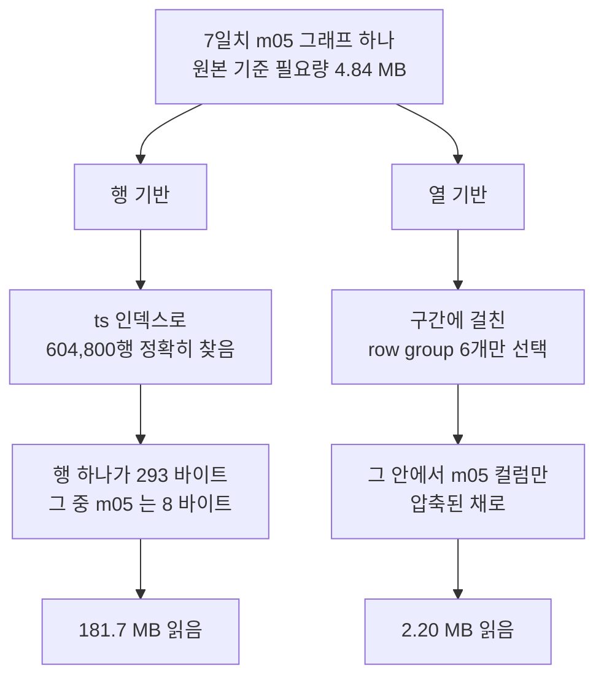
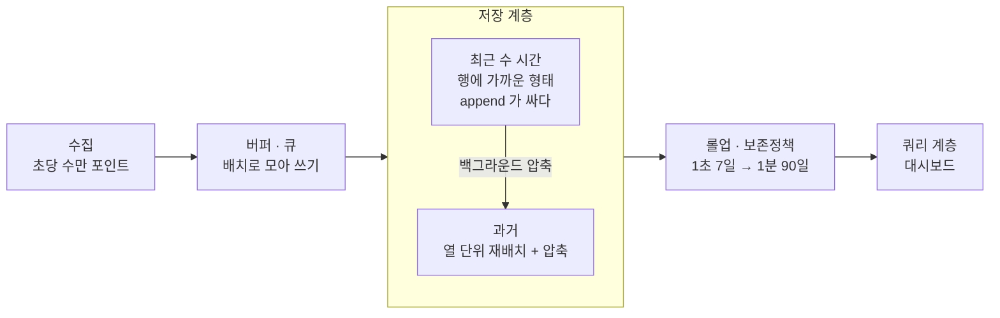

[섹션3](/study/database/section-3-internals/) 을 정리하면서 행 기반과 열 기반 이야기가 나왔고,
스터디에서 "그래서 언제 뭘 쓰냐"로 한참 이야기했다. 모니터링 시스템은 열 기반을 쓴다는
결론까지는 들었는데, 이해가 잘 안됐다.

그라파나 같은 데서 메트릭 하나를 그래프로 그린다고 하면, x축 눈금마다 행이 하나씩
들어간다고 생각하면 된다. 그러면 행 기반으로도 충분해 보인다. 기간이 걸리면 행 개수가
정해지니까 `ts` 에 인덱스를 걸어서 그 범위만 집어오면 되지 않나.

**인덱스를 걸면 결국 똑같아지는 것 아닌가**가 안 풀렸다. 직접 재봤다.

## 무엇으로 쟀나

실제 모니터링 테이블에 가까운 모양으로 만들었다. 1초 간격 300만 행(약 34.7일),
컬럼은 `ts` + `host` + 메트릭 `m01`~`m30`.

```sql
CREATE TABLE wide AS
SELECT TIMESTAMP '2026-01-01 00:00:00' + (i || ' second')::interval AS ts,
       (i % 50)::int AS host,
       round((50 + 20*sin(i/3000.0) + (i%11)*0.1)::numeric, 1)::float8 AS m01,
       -- m02 ~ m30 은 주기와 잔물결만 다르게
FROM generate_series(1, 3000000) i;
CREATE INDEX wide_ts ON wide (ts);
```

50 언저리에서 천천히 오르내리는 값에 잔물결을 얹고 **소수 1자리로 반올림**했다.
CPU 사용률 같은 메트릭을 흉내낸 것인데, 이 반올림이 중요하다. 다음 절에서 다룬다.

같은 데이터를 <abbr title="행 기반. 한 행의 모든 컬럼이 디스크에 붙어 있다.">Postgres 17</abbr> 과
<abbr title="열 기반. 컬럼별로 값을 모아 저장하고 벡터화 실행 엔진을 쓴다.">DuckDB</abbr> 에 각각 넣고,
Postgres 는 `max_parallel_workers_per_gather=0` 으로 1스레드 고정, DuckDB 도 `threads=1` 로
맞췄다. 읽은 양은 Postgres 는 `EXPLAIN (ANALYZE, BUFFERS)` 의 블록 수, DuckDB 는
parquet 메타데이터의 컬럼별 압축 크기로 쟀다.

| | 테이블 크기 |
| --- | --- |
| Postgres (행) | **838 MB** — 행 하나가 293 바이트 |
| DuckDB (열) | **28.4 MB** |

[섹션3](/study/database/section-3-internals/#세-가지-헤더가-각각-무엇에-대한-정보인가) 에서 본
튜플 헤더 24바이트가 저 293 바이트 안에 그대로 들어 있다.

## 값의 카디널리티가 열 저장을 좌우한다

처음에는 반올림 없이 `50 + 30*sin(i/1000.0) + (i%7)` 로 만들었다. 그런데 이게
**300만 행이 전부 서로 다른 값**이었다. `sin()` 이 float64 의 하위 비트까지 다 채워서
같은 값이 두 번 나오지 않는다.

300만 개짜리 컬럼 하나를 값의 성격만 바꿔가며 저장해봤다.

| 값의 성격 | 고유값 | 크기 | 압축률 | 인코딩 |
| --- | --- | --- | --- | --- |
| `sin` 그대로 (float64) | 3,000,000 | 22.42 MB | 1.1× | `PLAIN` |
| 소수 1자리로 반올림 | 661 | 0.88 MB | 27× | `PLAIN_DICTIONARY` |
| 천천히 변하는 메트릭 | 203 | 0.09 MB | 266× | `PLAIN_DICTIONARY` |
| 정수 카운터 | 5 | 0.01 MB | 3,389× | `PLAIN_DICTIONARY` |

고유값이 많으면 **dictionary 인코딩이 아예 안 걸리고** `PLAIN` 으로 떨어진다. 압축률 1.1배는
사실상 압축을 안 한 것이다. 실제 모니터링 메트릭은 소수점 자릿수가 제한적이고 값이 천천히
변해서 아래쪽에 가깝다.

**행 저장은 이 차이를 전혀 누리지 못한다.** 반올림한 데이터로 다시 만들어도 Postgres 테이블은
838 MB 로 똑같았다. 행 안에 타입이 다른 컬럼이 섞여 있어 컬럼 단위 인코딩을 걸 수가 없다.
열 저장이 28.4 MB 로 29배 작아진 건 전부 이 인코딩 덕분이다.

처음 측정은 이걸 모르고 해서 열 저장에 크게 불리했다. 아래 숫자는 전부 반올림한 현실적인
데이터로 다시 잰 것이다.

## 인덱스는 탐색을 해결하지, 읽는 양을 못 줄인다

7일치 `m05` 하나를 10분 단위로 집계하는 쿼리를 던졌다.

```sql
SELECT date_bin('10 minutes', ts, TIMESTAMP '2026-01-01') AS b, sum(m05)
FROM wide WHERE ts >= '2026-01-05' AND ts < '2026-01-12' GROUP BY b;
```

Postgres 는 Index Scan 을 정확히 탔다. 범위를 찾는 건 성공했다. 그런데 읽은 양이
**181.7 MB** 였다. 실제로 필요한 `m05` 값은 604,800 × 8바이트 = **4.84 MB** 다.

<abbr title="필요한 데이터에 비해 실제로 디스크에서 읽어야 하는 양이 몇 배인지. read amplification.">읽기 증폭</abbr> 이 **37.6배**다.
인덱스가 알려준 건 "이 행들이다" 까지고, 그 행들은 디스크에 293바이트 통짜로 누워 있으니
페이지째 끌어올 수밖에 없다. 8바이트를 쓰려고 293바이트를 읽는다.

같은 구간에서 DuckDB 가 읽은 양은 **2.20 MB** 였다. 필요한 4.84 MB 보다도 적은데, 압축된
채로 읽기 때문이다.



그러니까 갈리는 지점은 "기간이 정해졌나"가 아니라 **"한 행에서 몇 바이트를 버리나"** 였다.
인덱스를 아무리 잘 걸어도 이 증폭은 안 줄어든다.

## 행 개수로 재면 결론이 뒤집힌다

처음에 나는 "읽은 행 수"로 비교하려 했다. 그게 자연스러워 보였다. 그런데 실제로 재보니
**열 기반이 행을 더 많이 읽는다.**

| 10분 버킷 · 메트릭 1개 | PG 스캔행 | PG 읽은양 | PG 시간 | Duck 스캔행 | Duck 읽은양 | Duck 시간 |
| --- | --- | --- | --- | --- | --- | --- |
| 1시간 | 3,600 | 1.1 MB | 0.9 ms | **122,880** | 0.37 MB | 0.28 ms |
| 1일 | 86,400 | 26.0 MB | 21.0 ms | **245,760** | 0.73 MB | 1.44 ms |
| 7일 | 604,800 | 181.7 MB | 111.9 ms | **737,280** | 2.20 MB | 7.99 ms |
| 전체 | 3,000,000 | 837.5 MB | 407.9 ms | 3,072,000 | 8.96 MB | 38.85 ms |

1시간 구간에서 Postgres 는 3,600행만 집어내는데 DuckDB 는 **122,880행**을 읽는다. 34배다.
열 저장은 행을 [row group](/study/database/columnar-storage-internals/#row-group--열-저장도-행을-먼저-자른다 "열 저장이 테이블을 가로로 N행씩 잘라 놓은 덩어리. 그 안에서 컬럼별로 값을 모으며, 건너뛰기의 최소 단위가 된다") 단위로만 건너뛸 수 있어서,
3,600행이 필요해도 그 row group 을 통째로 읽어야 한다.
[다음 글](/study/database/columnar-storage-internals/)에서 이 구조와 크기 트레이드오프를 다뤘다.

**행 수는 판별력이 없는 정도가 아니라 방향이 뒤집힌다.** 달라지는 건 행 하나당 몇 바이트를
끌고 오느냐이므로, 바이트가 맞는 단위다.

## 좁은 구간에서는 격차가 작다

같은 표의 1시간 줄을 보면 0.9 ms 대 0.28 ms 로 3배 차이다. 7일 구간의 14배, 전체 구간의
10배에 비하면 훨씬 작다. 둘 다 1밀리초 아래라 실질적으로 같다고 봐도 된다.

기간이 좁으면 열 저장이 row group 하한(12만여 행) 때문에 필요한 것보다 34배를 읽어서,
행 방향 가지치기 이점이 거의 남지 않기 때문이다. 행 저장은 인덱스로 정확히 3,600행만 집어낸다.

다만 **뒤집히지는 않았다.** 바이트는 여전히 열 저장이 3배 적게 읽는다.
"행 기반으로도 충분하다" 는 내 직관은 "격차가 작다" 까지만 맞았다.

다만 1일만 가도 21.0 ms 대 1.44 ms 로 벌어지고, 대시보드는 새로고침 한 번에 패널 수십 개가
동시에 쿼리를 던진다.

## 시간 버킷을 붙이면 격차가 좁아진다

여기서 예상이 틀렸다. "10분 단위 집계 같은 조건이 붙으면 열 기반이 더 유리하겠지" 싶었는데
반대였다. 비교군도 집계이므로(값 하나로 줄이는 전역 집계) 정확히는 **그룹 수를 늘렸을 때**의
이야기다.

| 7일 · 메트릭 1개 | Postgres | DuckDB | 배수 |
| --- | --- | --- | --- |
| 버킷 없이 전역 집계 | 86.1 ms | 1.04 ms | **83×** |
| 1시간 버킷 | 123.9 ms | 7.10 ms | **17×** |

각 엔진이 자기 자신 대비 얼마나 느려졌는지를 보면 이유가 나온다.

| | 버킷 없음 → 1시간 버킷 |
| --- | --- |
| Postgres | 86.1 → 123.9 ms (**1.44배**) |
| DuckDB | 1.04 → 7.10 ms (**6.8배**) |

Postgres 는 이미 181.7 MB 를 읽느라 I/O 에 묶여 있어서 집계 CPU 비용이 그 그늘에 숨는다.
DuckDB 는 읽는 양이 2.20 MB 라 이제 CPU 가 병목이 된다.

**집계는 어차피 모든 값을 한 번씩 만져야 하는 일이라, 열 저장의 주무기(읽는 바이트 줄이기)가
안 먹힌다.** 남는 건 <abbr title="값을 한 개씩이 아니라 배열 단위로 묶어 처리하는 실행 방식. SIMD 를 채워 돌릴 수 있다.">벡터화 실행</abbr> 이점뿐이고, 그건 상수배다.

버킷 크기는 영향이 거의 없었다. 같은 7일 구간에서 1시간 버킷이든 1분 버킷이든 Postgres 가
읽은 양은 **181.7 MB 로 동일**했다. 10분 sum 을 구하려면 그 10분 안의 모든 행을 만져야 하니
당연한데, 읽는 양을 정하는 건 오직 기간이다.

## 바이트 차이가 시간 차이로 그대로 오지 않는다

메트릭 30개를 전부 가져오는 대시보드로도 재봤다. 읽은 바이트 비와 시간 비를 나란히 놓으면
이 글의 두 축이 한 표에 들어온다.

| | PG 읽은양 | Duck 읽은양 | **바이트 차이** | PG 시간 | Duck 시간 | **시간 차이** |
| --- | --- | --- | --- | --- | --- | --- |
| 7일 · 1개 | 181.7 MB | 2.20 MB | **83배** | 111.9 ms | 7.99 ms | **14배** |
| 전체 · 1개 | 837.5 MB | 8.96 MB | **94배** | 407.9 ms | 38.85 ms | **10배** |
| 7일 · 30개 | 181.7 MB | 6.96 MB | **26배** | 523.3 ms | 68.28 ms | **7.7배** |
| 전체 · 30개 | 837.5 MB | 28.39 MB | **30배** | 1558.7 ms | 336.17 ms | **4.6배** |

**바이트를 83배 덜 읽어도 시간은 14배만 빠르다.** 읽는 양을 줄여 봤자 집계는 여전히 모든 값을
만져야 하니, 남는 차이는 대부분 CPU 쪽이다. 앞 절의 결론이 여기서 다시 확인된다.

열 개수를 늘릴수록 두 비율이 같이 내려간다. 30개를 다 읽으면 바이트 이점이 83배 → 26배로
줄고, 시간 이점도 14배 → 7.7배로 줄어든다. **읽는 열이 적을수록 열 저장이 유리하다**는
원리 그대로다.

## 가장 큰 효과는 저장 구조가 아니라 사전집계였다

"10분 단위 집계" 는 실제 모니터링 시스템에서 조회 시점에 계산하지 않는 바로 그것이다.
미리 만들어 둔 [롤업](#롤업--미리-집계해-둔-테이블 "원본을 시간 단위로 미리 집계해 따로 저장해 둔 테이블. 대시보드는 원본 대신 이걸 읽는다") 테이블을 **양쪽 다** 만들어 재봤다. 834행짜리 테이블이 나온다.

| 7일치 대시보드 조회 | 원본에서 집계 | 롤업 읽기 | 롤업 효과 |
| --- | --- | --- | --- |
| Postgres (행) | 576.4 ms | **0.059 ms** | **9,800배** |
| DuckDB (열) | 63.5 ms | 0.248 ms | **256배** |

두 가지가 보인다.

**첫째, 롤업을 깔면 순서가 뒤집힌다.** 0.059 ms 대 0.248 ms 로 행 기반이 4배 빠르다.
`SELECT *` 라 31개 컬럼을 다 읽기 때문이다. **읽는 열이 많을수록 열 저장이 불리하다**는
원리가 이 작은 테이블에서도 그대로 나온다. 실제로 컬럼 하나만 뽑으면 0.076 ms 대 0.061 ms 로
다시 뒤집힌다.

**둘째, 개선 폭이 38배 차이난다.** 롤업은 행 기반의 약점(읽기 증폭)을 정확히 메우는 장치라
행 기반에서 얻는 게 훨씬 크다. 열 기반은 이미 적게 읽고 있었으니 덜 벌었다.

그래서 **대시보드가 롤업만 읽는다면 저장 구조를 바꿀 이유가 없다.** 둘 다 사람이 못 느끼는
영역이고, 굳이 따지면 행 기반이 낫다. 다만 알림을 조사하거나 원본을 임의 조건으로 뒤질 때는
롤업이 없으니, 그때는 다시 앞 표의 세계로 돌아온다.

비용이 사라진 게 아니라 자리를 옮겼다. 옮겨간 자리는 롤업을 굽는 백그라운드 쿼리다.

```text
롤업 굽기 = 전체 구간 · 30개 메트릭 · 1시간 버킷
   Postgres   1904 ms (1스레드)    1279 ms (병렬 4워커 → 1.5배)
   DuckDB      319 ms (1스레드)      51 ms (8스레드   → 6.2배)
                 ↑ 6.0배               ↑ 37배
```

여기도 조심할 게 있다. 이 쿼리는 **집계 + 전체 컬럼**이라, 앞 절에서 본 "열 저장 이점이 가장
희석되는" 조건에 정확히 해당한다. 1스레드로는 6배다.
**"롤업 굽기는 열 저장이 압도한다" 고 말하면 틀린다.**

그래도 이 자리에 열 저장을 쓰는 이유는 배수가 아니라 다른 둘이다. **절대 시간** — 1.9초짜리
작업을 몇 분마다 계속 돌려야 한다. 그리고 **병렬 확장성** — 열 저장은 스캔이 row group 단위로
깔끔하게 쪼개져 8스레드에서 37배까지 벌어지는데, Postgres 는 워커 4개를 붙여도 1.5배다.

## 그래서 모니터링 스택은 이렇게 생겼다



행이냐 열이냐를 고르는 게 아니라 **데이터 나이에 따라 갈아탄다.** 최근 데이터는 행처럼 쓰고,
식으면 열로 굽고, 더 오래되면 롤업만 남기고 원본을 버린다. 열 저장은 한 건씩 append 하는 게
비싸기 때문에(30개 컬럼에 나눠 써야 한다) 수집 지점에 바로 쓰지 못한다.

## 정리

같은 질문을 다시 만나면 이 순서로 본다.

1. **저장 구조를 바꾸기 전에 사전집계부터 검토한다.** 두 축은 독립이라 둘 다 할 수 있지만
   롤업이 훨씬 싸다. 행 기반을 그대로 두고 9,800배를 얻었고, 열 기반에서도 256배였다.
   저장 구조를 바꿔 얻는 건 시간 기준 4.6~14배다.
2. **읽는 행 수와 읽는 열 수, 두 축으로 나눈다.** 좁은 기간이면 행 기반으로 충분하고,
   넓은 기간 + 일부 컬럼이면 열 기반이 크게 앞선다.
3. **인덱스로 해결되는지 먼저 의심한다.** 인덱스는 탐색을 해결하지 읽는 양을 못 줄인다.
   행이 넓으면 인덱스를 걸어도 읽기 증폭 37배가 그대로 남는다.
4. **성능을 잴 때 단위를 행이 아니라 바이트로 잡는다.** 행 수로 재면 결론이 뒤집힌다.
5. **값의 카디널리티를 확인한다.** 열 저장의 이점은 대부분 인코딩에서 나오는데, 고유값이
   많으면 그게 통째로 날아간다. 벤치마크용 합성 데이터에서 특히 빠지기 쉬운 함정이다.

## 보충 개념

### 롤업 — 미리 집계해 둔 테이블

원본을 시간 단위로 미리 집계해 따로 저장해 둔 테이블이다. 시스템마다 이름이 다르다.

| 시스템 | 이름 |
| --- | --- |
| TimescaleDB | continuous aggregate |
| ClickHouse | materialized view (`AggregatingMergeTree`) |
| Prometheus | recording rule |
| 일반 용어 | rollup, pre-aggregation, downsampling |

**왜 되는가.** 대시보드가 화면에 찍을 수 있는 점은 그래프 폭만큼(수백~수천 개)이다.
어떤 기간을 고르든 출력은 비슷한데 입력만 기간에 비례해 커진다. 롤업은 그 입력을 미리 줄여 둔다.

보통 계층으로 쌓는다. 1초 원본 7일 → 1분 90일 → 1시간 2년. 오래된 구간일수록 거칠게 남기고
원본은 버린다. 위에서 834행짜리 테이블이 300만 행을 대신한 게 이 얘기다.

**어떻게 유지하나.** 전체를 다시 굽지 않고 새로 들어온 구간만 증분으로 갱신한다. 그래서
[지연 도착과 백필](/study/database/columnar-storage-internals/#지연-도착보다-백필이-문제다 "이벤트 시각이 기록 순서와 어긋나 저장 단위의 시간 범위가 넓어지는 문제")이
여기서도 문제가 된다. 이미 구운 구간에 과거 데이터가 끼어들면 그 구간을 다시 구워야 한다.

**대가.** 미리 정한 집계만 쓸 수 있다. `avg` 만 저장해 두면 나중에 p99 를 못 구한다.
게다가 평균의 평균은 구간별 행 수가 다르면 틀리므로, 실무에서는 `avg` 대신 `sum` 과 `count` 를
따로 저장해 두고 조회할 때 나눈다.

## 참고

- [섹션3: 데이터베이스 내부](/study/database/section-3-internals/) — 행 저장이 실제로 어떻게 생겼는지
- [열 저장은 안에서 어떻게 생겼나](/study/database/columnar-storage-internals/) — row group, 정렬 키, zone map
- [PostgreSQL `date_bin`](https://www.postgresql.org/docs/current/functions-datetime.html)
- [Parquet 인코딩 명세](https://parquet.apache.org/docs/file-format/data-pages/encodings/) — dictionary 인코딩이 걸리는 조건
- [DuckDB — Parquet 메타데이터 함수](https://duckdb.org/docs/stable/data/parquet/metadata)
