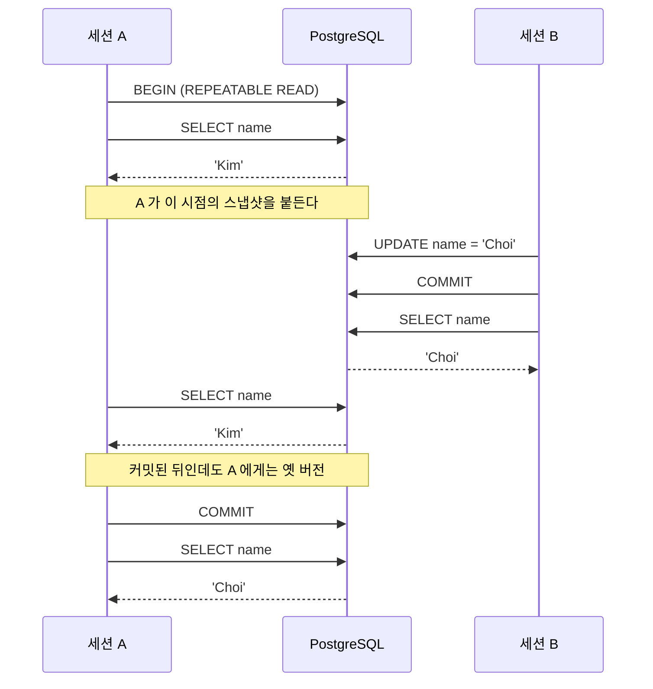

[섹션2: ACID](/study/database/section-2-acid/) 에서 "PostgreSQL은 UPDATE 때 덮어쓰지 않고
새 튜플을 쌓는다", "롤백한 데이터도 디스크에는 남아있다" 같은 이야기를 했다.
읽고 나서도 **정말 그런가**가 안 풀렸다.

다행히 PostgreSQL은 숨은 헤더를 그대로 조회할 수 있게 열어 뒀다.
`xmin`, `xmax`, `ctid` 를 직접 찍어 보면 확인이 된다.
**A → C → I → D 순서로 하나씩** 본다.

아래 **결과는 전부 실제로 돌려서 받은 것**이다. 트랜잭션 번호(`786`, `787` 같은 것)만
각자 환경에서 다르게 나온다.

## 준비

Docker 하나면 된다. 다 끝나면 컨테이너째 지우면 흔적이 남지 않는다.

```bash
docker run -d --name acid-lab \
  -e POSTGRES_PASSWORD=lab -e POSTGRES_DB=lab \
  -p 55432:5432 postgres:17

docker exec -it acid-lab psql -U postgres -d lab
```

디스크 페이지를 날것으로 들여다볼 확장 하나를 켠다.

```sql
CREATE EXTENSION IF NOT EXISTS pageinspect;
```

`pageinspect` 는 **페이지에 있는 튜플을 전부** 보여준다. `SELECT` 는 그중
가시성 검사를 통과한 것만 돌려준다. 이 글의 거의 모든 실습이 이 둘을 나란히 놓고 비교한다.

> **주의 — 두 쿼리의 헤더 값은 똑같다.** `SELECT` 의 `xmin` / `xmax` 는 시스템 컬럼이고,
> 튜플 헤더를 **가공 없이 그대로** 노출한다. `heap_page_items` 의 `t_xmin` / `t_xmax` 와
> 같은 값이다. 두 쿼리의 차이는 **어느 행이 돌아오느냐**뿐이지
> "정리된 값 vs 원본"이 아니다.

## 읽는 법 — 숨은 컬럼과 UPDATE 의 정체

A 부터 보기 전에 도구부터 익힌다. 두 가지만 알면 나머지가 다 읽힌다.

### 숨은 컬럼 꺼내 보기

**확인할 내용** — 앞 글에서 말한 `t_xmin` / `t_xmax` 가 상상이 아니라 실제 컬럼인가.

**쿼리**

```sql
CREATE TABLE member (id int primary key, name text);
INSERT INTO member VALUES (1,'Lee');

SELECT ctid, xmin, xmax, id, name FROM member;
```

**결과**

```text
 ctid  | xmin | xmax | id | name
-------+------+------+----+------
 (0,1) |  786 |    0 |  1 | Lee
```

`SELECT *` 로는 안 나오지만 이름을 직접 대면 나온다.

- `xmin = 786` — 786번 트랜잭션이 이 행을 만들었다
- `xmax = 0` — 아직 아무도 안 지웠다
- `ctid = (0,1)` — 0번 블록의 1번째 자리. 아래 `lp` 와 짝이 맞는다

### UPDATE 하면 튜플이 두 개가 된다

**확인할 내용** — UPDATE 하면 디스크에 튜플이 정말 두 개가 되는가.

**쿼리**

```sql
UPDATE member SET name = 'Kim' WHERE id = 1;

SELECT lp, t_xmin, t_xmax, t_ctid
FROM heap_page_items(get_raw_page('member', 0));
```

**결과**

```text
 lp | t_xmin | t_xmax | t_ctid
----+--------+--------+--------
  1 |    786 |    787 | (0,2)
  2 |    787 |      0 | (0,2)
```

행 하나를 고쳤는데 디스크에는 두 개가 있다. 같은 787이 **구버전의 `t_xmax`**(지운 사람)와
**신버전의 `t_xmin`**(만든 사람) 양쪽에 들어가 있다.
한 트랜잭션 안에서 삭제와 삽입이 같이 일어났다는 뜻이다.

**쿼리** — 그런데 평범하게 조회하면 여전히 한 줄이다.

```sql
SELECT ctid, xmin, xmax, name FROM member;
```

**결과**

```text
 ctid  | xmin | xmax | name
-------+------+------+------
 (0,2) |  787 |    0 | Kim
```

걸러내고 있을 뿐이다. `ctid` 가 `(0,1)` → `(0,2)` 로 바뀐 것도 눈여겨볼 것 —
행을 고치면 자리가 옮겨지므로 `ctid` 를 행 식별자로 쓰면 안 된다.

→ [t_xmin / t_xmax 설명](/study/database/section-2-acid/#postgresql--덮어쓰지-않고-새-튜플을-추가한다)

## A — 전부 아니면 전무

### 실패하면 성공했던 부분까지 무효화된다

**확인할 내용** — 여러 행을 건드리는 트랜잭션이 중간에 실패하면,
이미 성공했던 부분까지 **함께** 무효화되는가.

**쿼리** — 출금은 성공하고 입금이 `CHECK` 에 걸리는 이체.

```sql
CREATE TABLE acct (id int primary key, owner text, bal int CHECK (bal >= 0));
INSERT INTO acct VALUES (1,'Lee',1000),(2,'Kim',100);

BEGIN;
SELECT pg_current_xact_id();                      -- 795
UPDATE acct SET bal = bal - 500  WHERE id = 1;    -- 성공 (1000 -> 500)
SELECT id, bal FROM acct ORDER BY id;             -- 트랜잭션 안에서는 반영돼 보인다
UPDATE acct SET bal = bal - 1500 WHERE id = 2;    -- 실패 (100 -> -1400)
COMMIT;
```

**결과**

```text
[트랜잭션 안] 출금이 반영돼 보인다
 id | bal
----+-----
  1 | 500
  2 | 100

ERROR:  new row for relation "acct" violates check constraint "acct_bal_check"
DETAIL:  Failing row contains (2, Kim, -1400).
```

**쿼리** — 밖에서 최종 상태와 디스크를 나란히 본다.
번호만 봐서는 그 트랜잭션이 성공했는지 알 수 없으므로 **`pg_xact` 상태를 같이 찍는다.**

```sql
SELECT id, bal, xmin, xmax,
       CASE WHEN xmax::text::bigint = 0 THEN '(없음)'
            ELSE pg_xact_status(xmax::text::xid8)::text END AS "xmax 상태"
FROM acct ORDER BY id;

SELECT lp, t_xmin,
       pg_xact_status(t_xmin::text::xid8)::text AS "t_xmin 상태",
       t_xmax,
       CASE WHEN t_xmax::text::bigint = 0 THEN '(없음)'
            ELSE pg_xact_status(t_xmax::text::xid8)::text END AS "t_xmax 상태"
FROM heap_page_items(get_raw_page('acct',0));
```

**결과** — 이 트랜잭션은 795 였다.

```text
--- SELECT 결과 (가시성 검사를 통과한 행만) ---
 ctid  | id | bal  | xmin | xmin 상태 | xmax | xmax 상태
-------+----+------+------+-----------+------+-----------
 (0,1) |  1 | 1000 |  794 | committed |  795 | aborted    ← xmax 에 번호가 있는데도 살아 있다
 (0,2) |  2 |  100 |  794 | committed |    0 | (없음)

--- 페이지 전체 (heap_page_items) ---
 lp | t_xmin | t_xmin 상태 | t_xmax | t_xmax 상태
----+--------+-------------+--------+-------------
  1 |    794 | committed   |    795 | aborted     ← 잔액 1000. SELECT 의 (0,1) 과 같은 튜플
  2 |    794 | committed   |      0 | (없음)
  3 |    795 | aborted     |      0 | (없음)      ← 잔액 500. SELECT 에는 안 나온다
```

`xmin 상태` 가 둘 다 `committed` 인 것은 우연이 아니다.
**만든 트랜잭션이 커밋되지 않았다면 그 행은 애초에 `SELECT` 결과에 안 나온다.**
그래서 이 표에서 `xmin 상태` 는 늘 `committed` 다 (예외는 아래 I 절에서 다룬다).
판단이 갈리는 것은 `xmax` 쪽이다.

`ctid (0,1)` 이 `lp 1` 과 짝이다. **두 표의 헤더 값이 완전히 같은 것에 주목할 것** —
`SELECT` 의 `xmax = 795` 와 헤더의 `t_xmax = 795` 는 같은 값이다.
`SELECT` 가 값을 정리해 주는 게 아니라, **행을 걸러 줄 뿐**이다.

**`aborted` 가 출력에 직접 찍힌다.** 이제 판정 근거를 눈으로 따라갈 수 있다.

`lp 1` (잔액 1000) — `t_xmax = 795` 가 "이 행 지웠다"고 표시돼 있다.
그런데 그 795 가 `aborted` 다. **지웠다는 표시를 한 쪽이 실패했으므로 그 표시를 무시한다.**
그래서 여전히 보이고, 값도 1000 그대로다.

`lp 3` (잔액 500) — 디스크에 멀쩡히 있다. 그런데 `t_xmin = 795` 이고 795 는 `aborted` 다.
**만든 쪽이 실패했으므로 애초에 없는 데이터로 친다.**

정리하면 판정이 이렇게 갈린다.

| 튜플 | 헤더 | `pg_xact` 조회 | 판정 |
| --- | --- | --- | --- |
| `lp 1` 잔액 1000 | `t_xmax = 795` | 795 → `aborted` | 삭제 표시 **무시** → 보임 |
| `lp 3` 잔액 500 | `t_xmin = 795` | 795 → `aborted` | 생성자 실패 → **안 보임** |

**행을 하나씩 되돌린 게 아니다.** `pg_xact` 의 795 비트 하나가 `aborted` 인 것만으로
관련된 모든 튜플의 운명이 동시에 정해졌다. 이게 "전부 아니면 전무"의 구현이다.

가장 헷갈리기 쉬운 지점을 다시 짚는다.

> **`xmax` 에 번호가 있다 ≠ 그 행이 지워졌다.**
> `xmax` 는 "795 가 지우려고 **시도했다**"는 기록일 뿐이다.
> 실제로 지워졌는지는 **795 의 상태를 `pg_xact` 에 물어봐야** 알 수 있다.
> `xmax` 를 삭제 여부 플래그로 읽으면 틀린다.

앞서 나온 이야기와 같다 — **번호는 "누가"일 뿐이고, 순서도 결과도 번호가 정하지 않는다.**

### 테이블을 넘어가도 같은 XID 다

**확인할 내용** — 그럼 **테이블을 넘어가도** 같은 번호로 묶이는가.

**쿼리**

```sql
CREATE TABLE p(v text); CREATE TABLE q(v text); CREATE TABLE r(v text);
INSERT INTO q VALUES ('q 원본');
INSERT INTO r VALUES ('r 원본');

BEGIN;
SELECT pg_current_xact_id();          -- 781
INSERT INTO p VALUES ('p 에 삽입');
UPDATE q SET v = 'q 수정됨';
DELETE FROM r;
COMMIT;
```

**결과**

```text
--- p (삽입) ---          --- q (수정) ---          --- r (삭제) ---
 lp | t_xmin | t_xmax     lp | t_xmin | t_xmax     lp | t_xmin | t_xmax
  1 |    781 |      0      1 |    779 |    781      1 |    780 |    781
                           2 |    781 |      0
```

**781 하나가 세 테이블에 전부 찍혔다.** 작업 종류에 따라 들어가는 자리만 다르다.

| 작업 | 남는 흔적 |
| --- | --- |
| INSERT | 새 튜플의 `t_xmin` |
| UPDATE | 구버전 `t_xmax` + 신버전 `t_xmin` |
| DELETE | 기존 튜플의 `t_xmax` (새 튜플 없음) |

XID 는 테이블별 카운터가 아니라 **클러스터 전체가 공유하는 전역 카운터**다.
그래서 다중 테이블 원자성이 `pg_xact` 비트 하나로 끝난다 —
테이블마다 돌아다니며 되돌릴 필요가 없다.

## C — C 를 지키는 장치는 따로 없다

### 제약 위반은 A 와 같은 경로를 탄다

**확인할 내용** — 제약 위반이 났을 때, C 를 담당하는 **별도 메커니즘**이 있는가.
아니면 A 와 같은 경로를 타는가.

**쿼리**

```sql
CREATE TABLE uq (id int, email text UNIQUE);
INSERT INTO uq VALUES (1,'old@x.com');            -- 트랜잭션 시작 전에 이미 있는 행

BEGIN;
SELECT pg_current_xact_id();                      -- 769
INSERT INTO uq VALUES (2,'new@x.com');            -- 성공
INSERT INTO uq VALUES (3,'old@x.com');            -- UNIQUE 위반
COMMIT;

SELECT ctid, id, email, xmin, xmax FROM uq ORDER BY id;
SELECT lp, t_xmin, t_xmax FROM heap_page_items(get_raw_page('uq',0));
```

**결과**

```text
ERROR:  duplicate key value violates unique constraint "uq_email_key"

--- SELECT 결과 ---                      --- 페이지 전체 ---
 ctid  | id |   email   | xmin           lp | t_xmin | t_xmax
 (0,1) |  1 | old@x.com |  768            1 |    768 |      0   ← 원래 있던 행
                                          2 |    769 |      0   ← new@x.com (성공했던 것)
(1 row)                                   3 |    769 |      0   ← old@x.com (위반한 것)
```

`ctid (0,1)` 이 `lp 1` 과 짝이다. **보이는 `old@x.com` 은 트랜잭션 시작 전에 있던 768번 행**이지
위반한 `lp 3` 이 아니다.

진짜 봐야 할 것은 **`lp 2` 가 사라진 것**이다. `new@x.com` 삽입은 성공한 명령이었고
제약도 안 어겼다. 그런데 뒤의 `lp 3` 이 걸려 트랜잭션이 죽자 같이 무효화됐다.

```text
pg_xact:  769 → aborted
          ↓
lp 2 (t_xmin=769) → 안 보임
lp 3 (t_xmin=769) → 안 보임
```

**C 를 지키는 코드가 따로 없다.** 제약 검사가 트리거일 뿐,
무효화는 A 가 쓰는 것과 **완전히 같은 경로**다. `ROLLBACK` 을 쳤든 `UNIQUE` 에 걸렸든
엔진 입장에서는 "769가 실패했다" 하나뿐이다.

위반한 튜플조차 힙에 먼저 써진 뒤 인덱스 삽입에서 잡혔다는 것도 눈여겨볼 것.
지우지 않고 그냥 무효 처리한다.

## I — 같은 행의 다른 버전을 동시에 본다

### 두 세션이 다른 버전을 동시에 본다

**확인할 내용** — 한쪽이 커밋해도 다른 쪽은 자기 스냅샷의 옛 버전을 계속 보는가.
그러면서 서로 안 막는가. 터미널 **두 개**가 필요하다.



**쿼리**

```sql
-- [세션 A] 먼저 시작
BEGIN ISOLATION LEVEL REPEATABLE READ;
SELECT name FROM member WHERE id = 1;
```

```sql
-- [세션 B] 다른 터미널
UPDATE member SET name = 'Choi' WHERE id = 1;
SELECT name FROM member WHERE id = 1;
```

```sql
-- [세션 A] 다시
SELECT name FROM member WHERE id = 1;
COMMIT;
SELECT name FROM member WHERE id = 1;
```

**결과**

```text
[A] 스냅샷 시작 시점        → Kim
[B] 커밋 완료, B 가 보는 값  → Choi
[A] B 가 커밋한 뒤에도       → Kim
[A] 커밋으로 스냅샷을 놓은 뒤 → Choi
```

B가 커밋을 끝냈는데도 A는 `Kim` 을 본다. **A를 막지도 않았고 B를 기다리게 하지도 않았다.**
과거 버전이 디스크에 남아 있으니 가능한 일이다.

→ [스냅샷과 가시성 검사 설명](/study/database/section-2-acid/#스냅샷과-가시성-검사--select-가-버전을-고르는-법)

### 스냅샷의 실물은 24 바이트다

**확인할 내용** — 방금 A 가 "스냅샷을 붙들었다"고 했는데, 그게 **데이터를 통째로
복사해 두는 것**인가. 그리고 커밋 안 된 행은 애초에 디스크에 없는 건가.

**쿼리**

```sql
SELECT pg_current_snapshot()                     AS "xmin:xmax:xip_list",
       pg_column_size(pg_current_snapshot())     AS bytes;
```

**결과**

```text
 xmin:xmax:xip_list | bytes
--------------------+-------
      744:744:      |    24
```

**24 바이트가 전부다.** 스냅샷은 데이터 복사본이 아니라 **판정 기준 숫자 몇 개**다.

```text
xmin      아직 실행 중인 것 중 가장 작은 XID
xmax      아직 배정되지 않은 다음 XID
xip_list  스냅샷 뜨는 순간 실행 중이던 XID 목록
```

크기는 데이터 양이 아니라 **동시에 돌고 있는 트랜잭션 수**에 비례한다.
테이블에 행이 4천만 개여도 스냅샷은 이 크기다.

> Redis 의 RDB 스냅샷과는 완전히 다른 물건이다. 그쪽은 메모리를 통째로 뜬 **파일**이고,
> 이쪽은 "어디까지 보기로 할지" 정하는 **숫자 몇 개**다. 이름만 같다.

### 커밋 안 된 행도 디스크에는 있다

**확인할 내용** — 그럼 커밋 안 된 행은 어디 있나. 디스크에는 있나?

**쿼리** — 커밋하지 않은 세션을 열어둔 채 다른 세션에서 본다.

```sql
SELECT lp, t_xmin, t_xmax FROM heap_page_items(get_raw_page('s',0));
SELECT 742 AS xid, pg_xact_status('742'::text::xid8)
UNION ALL SELECT 743, pg_xact_status('743'::text::xid8);
SELECT xmin, v FROM s;
```

**결과**

```text
--- 페이지 전체 ---       --- pg_xact ---        --- SELECT 결과 ---
 lp | t_xmin              xid | status            xmin | v
  1 |    740              742 | aborted            740 | 커밋된 행
  2 |    741              743 | committed          743 | B 가 쓴 것
  3 |    742
  4 |    743
```

**디스크에는 4개 다 있는데 보이는 건 2개다.** 커밋 안 된 행도, 롤백된 행도
힙 페이지에 멀쩡히 써져 있다. WAL 에도 남아 있다.

그럼 dirty read 를 막는 건 스냅샷이 아니라 `pg_xact` 아닌가? **절반만 맞다.**

`pg_xact` 는 **"지금 이 순간 커밋됐나"** 만 답한다. 그 답은 매 순간 바뀐다.
`SELECT count(*)` 하나가 3초 걸린다면, 그 사이 다른 트랜잭션이 커밋할 때마다
앞 블록과 뒤 블록의 판정 기준이 달라져 버린다.

스냅샷은 그 판정 기준을 **한 시점에 얼려두는 역할**이다.

| 무엇을 막나 | 필요한 것 |
| --- | --- |
| dirty read (안 끝난 것 보기) | `pg_xact` 로 충분 |
| 한 문장 안에서 기준이 흔들리는 것 | **스냅샷** (READ COMMITTED = 문장마다) |
| non-repeatable read (문장 간 결과가 바뀜) | **스냅샷** (REPEATABLE READ = 트랜잭션당 하나) |

정리하면 역할이 이렇게 나뉜다.

```text
질문: 이 튜플이 나에게 보이나?

1. pg_xact  →  "742 는 커밋됐나?"          (사실 판정)
2. 스냅샷    →  "내 기준 시점에도 그랬나?"  (시점 고정)
```

특히 `xip_list` 가 그렇다. 내가 스냅샷 뜰 때 실행 중이던 XID 는 **그 뒤에 커밋되더라도**
나에게는 계속 안 보여야 한다. `pg_xact` 만 보면 "커밋됐네" 하고 보여줘 버린다.

### 내가 만든 행은 커밋 전에도 보인다

**확인할 내용** — A 절에서 "SELECT 에 나온 행은 `xmin` 이 항상 `committed`" 라고 했다.
그런데 **내가 방금 넣은 행**은 커밋 전에도 내 눈에 보인다. 그때 `xmin` 상태는 무엇인가.

**쿼리**

```sql
BEGIN;
SELECT pg_current_xact_id();                    -- 796
INSERT INTO acct VALUES (3,'Park',700);
SELECT ctid, id, bal, xmin,
       pg_xact_status(xmin::text::xid8)::text AS "xmin 상태"
FROM acct WHERE id = 3;
ROLLBACK;
```

**결과**

```text
 ctid  | id | bal | xmin |  xmin 상태
-------+----+-----+------+-------------
 (0,3) |  3 | 700 |  796 | in progress     ← 커밋 안 했는데 보인다
```

**`in progress` 인데 보인다.** 가시성 규칙에 조각이 하나 더 있었다.

> `t_xmin` 이 **커밋됐거나, 그게 나 자신이면** 보인다.

내가 만든 것은 커밋 전에도 나에게 보여야 한다. 그래야 트랜잭션 안에서
자기가 방금 쓴 걸 읽을 수 있다. A 절에서 "트랜잭션 안에서는 출금이 반영돼 보인다"고 한 것이
정확히 이 경우다.

| 어디서 보나 | `SELECT` 결과의 `xmin` 상태 |
| --- | --- |
| 트랜잭션 **밖** | 항상 `committed` |
| 내 트랜잭션 **안**, 내가 만든 행 | **`in progress`** — 내 것이라서 보임 |
| 내 트랜잭션 안, 남이 만든 행 | `committed` |

**남의 `in progress` 는 안 보이고 내 `in progress` 는 보인다.**
그래서 dirty read 가 아니다 — 남의 미커밋을 보는 게 아니니까.

### 팬텀과 dirty read 는 다르다

**확인할 내용** — 그럼 팬텀과 dirty read 는 어떻게 다른가.
격리 수준이 서로 다른 두 트랜잭션을 **한 타임라인**에 놓고 한 단계씩 본다.

이게 헷갈리기 쉬운 이유는 이렇다. "READ COMMITTED 는 팬텀을 못 막는다"까지 알고 나면,
**옆 트랜잭션이 INSERT 한 것이 바로 보일 것 같다.** 정말 그런지 확인한다.

**쿼리** — T1 은 READ COMMITTED, T2 는 REPEATABLE READ. 중간에 커밋이 없는 것에 주목.

```sql
CREATE TABLE test (id integer);
INSERT INTO test VALUES (2);
```

```text
T1 (READ COMMITTED)          T2 (REPEATABLE READ)
─────────────────────────────────────────────────────
BEGIN                        BEGIN
(a) SELECT
                             INSERT 4        ← 커밋 안 함
(b) SELECT
    INSERT 5                 ← 커밋 안 함
                             (c) SELECT
COMMIT
                             (d) SELECT
                             COMMIT
```

**결과**

```text
 (a) T1 첫 조회                    2
 (b) T2 가 4 를 넣은 뒤             2        ← 4 가 안 보인다
 (c) T1 이 5 를 넣은 뒤(미커밋)     2-4
 (d) T1 이 커밋한 뒤                2-4      ← 5 가 안 보인다
 둘 다 끝난 뒤                      2-4-5
```

**(b) 에서 `4` 가 안 보인다.** T1 이 READ COMMITTED 인데도 그렇다.
**T2 가 아직 커밋을 안 했기 때문**이다.

READ COMMITTED 는 이름 그대로 "**커밋된** 것을 읽는다"다.
커밋 안 된 걸 보면 그건 팬텀이 아니라 **dirty read** 이고, PostgreSQL 은
어떤 격리 수준에서도 이걸 허용하지 않는다.

| | 무엇 | READ COMMITTED 에서 |
| --- | --- | --- |
| **dirty read** | **커밋 안 된** 데이터가 보임 | **막힘** (모든 수준에서) |
| **팬텀** | **커밋된** 새 행이 나타남 | 발생 |

앞의 팬텀 실험과 나란히 놓으면 차이가 한 줄이다.

```text
[팬텀]        T1 조회 → T2 INSERT + COMMIT → T1 조회 → 행이 늘어남   ✅ 팬텀
[이 시나리오]  T1 조회 → T2 INSERT (커밋 X) → T1 조회 → 그대로       ❌ dirty read 차단
```

**`COMMIT` 한 줄 차이다.** (b) 는 격리 수준과 무관한 결과라, T1 이 SERIALIZABLE 이어도 똑같이 `2` 다.

**(d) 가 RR 의 진짜 효과다.** T1 이 커밋했는데도 `5` 가 안 보인다.
T2 의 스냅샷은 첫 문장 시점에 고정됐고, T1 의 `5` 는 그 뒤라 `xmax` 밖으로 걸러진다.

### T2 도 READ COMMITTED 면 어디가 갈리나

**확인할 내용** — 그럼 T2 도 READ COMMITTED 로 바꾸면 어디가 달라지나.

**결과**

```text
                          T2 = REPEATABLE READ    T2 = READ COMMITTED
 (a)                       2                       2
 (b)                       2                       2
 (c)                       2-4                     2-4
 (d)                       2-4                     2-4-5      ← 여기만 갈린다
```

**(d) 하나만 달라진다.** T2 가 RC 면 문장마다 스냅샷을 새로 뜨므로
그 사이 커밋된 T1 의 `5` 를 보게 된다. 이게 팬텀이다.

나머지 세 개가 같은 이유는, (a)~(c) 에서는 **아직 아무도 커밋하지 않았기 때문**이다.
격리 수준은 "커밋된 것을 언제 기준으로 볼지"를 정할 뿐,
**커밋 안 된 것을 보여줄지 말지는 애초에 선택지가 아니다.**

### xip_list 만으로는 부족하다 — xmax 의 역할

**확인할 내용** — 그럼 `xip_list` 에만 없으면 보이는 건가.
**내 스냅샷보다 나중에 시작한** 트랜잭션은 `xip_list` 에 있을 수가 없는데, 그것도 보이나.

**쿼리**

```sql
-- [세션 A] 스냅샷을 뜨고 붙든다
BEGIN ISOLATION LEVEL REPEATABLE READ;
SELECT pg_current_snapshot();              -- 741:741:  (xip_list 비어 있음)
SELECT v FROM t;
-- (여기서 B 가 끼어든다)
SELECT v FROM t;                           -- 다시 조회
COMMIT;
```

```sql
-- [세션 B] A 의 스냅샷 이후에 시작한다
BEGIN;
SELECT pg_current_xact_id();               -- 741
INSERT INTO t VALUES ('B 가 나중에 추가한 행');
COMMIT;
```

**결과**

```text
[A] 스냅샷:  741:741:              ← xip_list 가 비어 있다
[B] XID:     741, 커밋 완료
[A] 다시 조회 → '처음부터 있던 행' 만. B 의 행은 안 보인다
```

B 의 741 은 **`xip_list` 에 없고**(A 가 스냅샷 뜰 때 존재하지도 않았다) **커밋도 했다.**
그런데 안 보인다. 거른 것은 **`xmax = 741`** 이다.

`xmax` 는 "스냅샷 뜰 때 아직 배정되지 않은 다음 번호"다. 즉 **`t_xmin >= xmax` 면
나보다 나중에 시작한 트랜잭션**이므로 커밋 여부를 볼 것도 없이 안 보인다.

정리하면 판정은 세 구간으로 나뉜다.

| `t_xmin` 위치 | 판정 |
| --- | --- |
| `t_xmin < xmin` | 스냅샷 뜰 때 **이미 끝나 있었음** → 커밋됐으면 보임 |
| `xmin ≤ t_xmin < xmax` | **`xip_list` 확인** — 있으면 진행 중이었으니 안 보임 |
| `t_xmin ≥ xmax` | **내 스냅샷 이후에 시작** → 무조건 안 보임 |

세 값이 각자 다른 일을 한다.

```text
xmin      이 아래는 다 끝났다       → xip_list 볼 필요 없이 통과
xmax      이 위는 내 뒤에 시작했다  → 무조건 컷
xip_list  그 사이의 예외 목록       → 하나씩 확인
```

`xmin` 과 `xmax` 는 사실 **경계를 그어 두는 최적화**에 가깝다.
덕분에 대부분의 튜플은 `xip_list` 를 뒤지지 않고 판정된다.

### XID 는 첫 쓰기 때 배정된다

**확인할 내용** — XID 는 언제 배정되나. `BEGIN` 때인가, `COMMIT` 때인가.

이게 왜 중요하냐면, `t_xmin` / `t_xmax` 를 보다 보면 자연스럽게
"번호 순서 = 시간 순서" 라고 믿게 되기 때문이다.

**쿼리** — A 를 먼저 열되 쓰기는 나중에, B 는 나중에 열고 즉시 쓴다.

```sql
-- [세션 A] 먼저 BEGIN
BEGIN;
SELECT pg_current_xact_id_if_assigned();   -- ?
SELECT count(*) FROM member;               -- 읽기만
SELECT pg_current_xact_id_if_assigned();   -- ?
-- (여기서 B 가 끼어든다)
INSERT INTO member VALUES (9,'A');         -- 이제서야 쓴다
SELECT pg_current_xact_id_if_assigned();   -- ?
```

```sql
-- [세션 B] 나중에 BEGIN, 즉시 쓰고 커밋
BEGIN;
INSERT INTO member VALUES (8,'B');
SELECT pg_current_xact_id_if_assigned();
COMMIT;
```

**결과**

```text
[A] BEGIN 직후        → 없음 (NULL)
[A] 읽기만 한 뒤       → 없음 (NULL)
[B] INSERT 직후       → 771
[A] INSERT 직후       → 772
```

세 가지가 한꺼번에 확인된다.

- **`BEGIN` 때가 아니다.** 직후에는 NULL 이다
- **`COMMIT` 때도 아니다.** `INSERT` 직후에 이미 번호가 있다
- **읽기 전용 트랜잭션은 번호를 아예 안 받는다.** 조회만 하는 트랜잭션이 번호를 소비하면
  XID 가 순식간에 고갈되니까

즉 **XID 는 첫 쓰기 때 배정된다.** 그래서 A 가 먼저 시작했는데 번호는 A 가 더 크다.
**시작 순서와 번호 순서는 무관하다.**

### t_xmin 이 t_xmax 보다 클 수도 있다

**확인할 내용** — 그렇다면 `t_xmin > t_xmax` 인 튜플도 만들 수 있는가.

**쿼리** — L 이 낮은 번호를 먼저 확보해 두고, H 가 만든 행을 나중에 지운다.

```sql
-- [세션 L] 낮은 번호를 먼저 확보하고 계속 열어둔다
BEGIN;
INSERT INTO dummy VALUES (1);              -- 여기서 XID 774 확보
-- (H 가 행을 만들고 커밋할 때까지 대기)
DELETE FROM z WHERE v = 'H 가 만든 행';    -- t_xmax 에 774 를 찍는다
COMMIT;
```

```sql
-- [세션 H] 나중에 시작해 더 높은 번호를 받는다
BEGIN;
INSERT INTO z VALUES ('H 가 만든 행');     -- XID 775
COMMIT;
```

**결과**

```text
 lp | t_xmin | t_xmax | t_xmin 이 더 큰가
----+--------+--------+-------------------
  1 |    775 |    774 | t
```

**만든 번호(775)가 지운 번호(774)보다 크다.** 그런데 행은 정상적으로 삭제됐다
(`SELECT count(*)` → 0).

READ COMMITTED 는 **문장마다 스냅샷을 새로 뜨므로**, L 의 `DELETE` 문은 그 시점에
이미 커밋된 775의 행을 볼 수 있다. 그래서 자기 번호로 지운다.

여기서 나오는 결론이 중요하다. **가시성 판정은 번호 대소 비교가 아니다.**

```text
1. t_xmax 에 XID 가 있나?            → 774
2. pg_xact: 774 는 커밋됐나?         → 예
3. 774 가 내 스냅샷의 xip_list 에?   → 아니오 (이미 끝남)
   ⇒ 지워진 것으로 본다
```

`xip_list` 는 스냅샷을 뜨는 순간 **실행 중이던 XID 목록**이다.
이것 덕분에 "번호는 나보다 작지만 내가 시작할 때 아직 안 끝났던 트랜잭션"을 걸러낸다.
**XID 는 순서를 나타내는 값이 아니라 이름표고, 순서는 스냅샷이 담당한다.**

> 헷갈리기 쉬운데 `xmin`/`xmax` 라는 이름은 두 군데에 쓰인다.
> **튜플 헤더**의 `t_xmin`/`t_xmax` 는 방금 본 대로 대소가 뒤집힐 수 있고,
> **스냅샷**의 `xmin`/`xmax` 는 정의상 `xmin ≤ xmax` 다. 다른 물건이다.

### 쓰기끼리 겹치면 어떻게 되나

**확인할 내용** — 읽기는 안 막는다는 건 알겠는데, **쓰기끼리 겹치면** 어떻게 되나.

**쿼리**

```sql
-- [세션 1] READ COMMITTED (기본)
BEGIN;
SELECT val FROM t WHERE id = 1;            -- 'A'
-- (세션 2 가 'B' 로 바꾸고 커밋)
UPDATE t SET val = val || '2' WHERE id = 1;
SELECT val FROM t WHERE id = 1;
```

**결과**

```text
[tx1] 처음 읽은 값: A
[tx1] UPDATE 후:    B2      ← A2 가 아니다
```

tx1 은 tx2 가 커밋할 때까지 **막혀 있다가**, 깨어나서 **최신 버전 B 를 다시 읽고**
그 위에 다시 적용한다(EvalPlanQual). "덮어쓴다"가 아니라 "다시 읽고 재계산한다".

같은 상황을 REPEATABLE READ 로 하면:

```text
ERROR:  could not serialize access due to concurrent update
```

**덮어쓰지 못하고 에러로 죽는다.** 재시도는 애플리케이션 몫이다.

여기 함정이 하나 있다. READ COMMITTED 에서 재계산이 되는 건 `val || '2'` 처럼
**DB 안에서 현재 값을 참조**할 때뿐이다. 앱에서 값을 읽어 계산한 뒤

```sql
UPDATE t SET val = 'A2' WHERE id = 1;   -- 상수
```

이렇게 넣으면 재계산할 근거가 없어 **tx2 의 작업이 흔적도 없이 사라진다**(lost update).

**MVCC 가 없애 주는 것은 읽기-쓰기 충돌이지 쓰기-쓰기 충돌이 아니다.**

### RR 로도 못 막는 것 — write skew

**확인할 내용** — 그럼 REPEATABLE READ 로 올리면 안전해지나.
**서로 다른 행**에 쓰는 경우는 어떻게 되나.

같은 행이 아니면 쓰기-쓰기 충돌이 없다. 그런데 불변식은 여러 행에 걸쳐 있을 수 있다.

> 규칙: 당직 의사는 최소 1명 유지되어야 한다. 지금 Alice, Bob 둘 다 당직 중.

**쿼리** — 두 트랜잭션이 각자 "2명이니까 나 하나 빠져도 되겠지" 하고 판단한다.

```sql
-- [T1] REPEATABLE READ
BEGIN ISOLATION LEVEL REPEATABLE READ;
SELECT count(*) FROM doctor WHERE on_call;      -- 2
UPDATE doctor SET on_call = false WHERE name = 'Alice';
COMMIT;
```

```sql
-- [T2] REPEATABLE READ, 거의 동시에
BEGIN ISOLATION LEVEL REPEATABLE READ;
SELECT count(*) FROM doctor WHERE on_call;      -- 2
UPDATE doctor SET on_call = false WHERE name = 'Bob';
COMMIT;
```

**결과**

```text
[T1] 당직 수 2 → 커밋 성공
[T2] 당직 수 2 → 커밋 성공

최종 당직 수: 0        ← 규칙 위반
```

**둘 다 성공한다.** 서로 다른 행에 썼으니 쓰기-쓰기 충돌이 없고, RR 은 감지할 근거가 없다.

각자의 스냅샷은 완벽하게 일관됐는데, **합쳐 놓으니 어떤 직렬 실행으로도 나올 수 없는 결과**가
나왔다. 이것을 **write skew** 라고 한다. RR(스냅샷 격리)의 한계다.

### SERIALIZABLE 은 잡아낸다

**확인할 내용** — SERIALIZABLE 로 올리면 잡히나.

**쿼리** — 위와 똑같이 하고 격리 수준만 바꾼다.

```sql
BEGIN ISOLATION LEVEL SERIALIZABLE;
...
```

**결과**

```text
[T1] 커밋 성공
[T2] ERROR:  could not serialize access due to read/write dependencies among transactions
     DETAIL:  Reason code: Canceled on identification as a pivot, during write.
     HINT:  The transaction might succeed if retried.

최종 당직 수: 1        ← 규칙 유지
```

PostgreSQL 의 SERIALIZABLE(SSI)은 **읽기-쓰기 의존 관계**를 추적한다.
"T2 가 읽은 것을 T1 이 바꿨다"를 알아채고 한쪽을 죽인다. 잠금이 아니라 **낙관적 충돌 감지**다.

에러 메시지가 두 종류라는 것도 짚어둘 것.

| 메시지 | 언제 | 어느 수준부터 |
| --- | --- | --- |
| `...due to **concurrent update**` | 같은 행 write-write | REPEATABLE READ 이상 |
| `...due to **read/write dependencies**` | SSI 가 의존 관계로 잡음 | SERIALIZABLE 전용 |

### 격리 수준을 섞으면 보장이 깨진다

**확인할 내용** — 그럼 이 트랜잭션만 SERIALIZABLE 로 올리면 되나.
**격리 수준이 서로 다른 트랜잭션**이 섞이면 어떻게 되나.

격리 수준은 트랜잭션마다 정한다. RC 트랜잭션이 열려 있는 중에 SERIALIZABLE 트랜잭션이
시작되는 데 아무 제약이 없다. 그럼 한쪽만 올려도 보호받을까.

**쿼리** — 위 당직 시나리오에서 **T1 만 READ COMMITTED 로** 낮춘다.

```sql
-- [T1] READ COMMITTED  ← 여기만 바뀜
BEGIN ISOLATION LEVEL READ COMMITTED;
SELECT count(*) FROM doctor WHERE on_call;
UPDATE doctor SET on_call = false WHERE name = 'Alice';
COMMIT;
```

```sql
-- [T2] SERIALIZABLE 그대로
BEGIN ISOLATION LEVEL SERIALIZABLE;
SELECT count(*) FROM doctor WHERE on_call;
UPDATE doctor SET on_call = false WHERE name = 'Bob';
COMMIT;
```

**결과**

```text
[T1] read committed,  당직 2  → 커밋 성공
[T2] serializable,    당직 2  → 커밋 성공     ← 에러가 안 난다

최종 당직 수: 0        ← 다시 깨졌다
```

| 구성 | 결과 | 최종 당직 |
| --- | --- | --- |
| SERIALIZABLE + SERIALIZABLE | 한쪽이 에러 | **1** |
| **READ COMMITTED + SERIALIZABLE** | **둘 다 성공** | **0** |

**자기가 SERIALIZABLE 이어도 상대가 아니면 못 지킨다.**

SSI 는 읽기에 **SIREAD 술어 잠금**을 남기고 rw-의존 관계를 추적하는데,
**READ COMMITTED 트랜잭션은 그 잠금을 남기지 않는다.** 추적 대상이 아니니
위험한 패턴을 조립할 조각 하나가 비어 버린다.

PostgreSQL 문서에도 명시된 제약이다 — SERIALIZABLE 의 보장은
**다른 SERIALIZABLE 트랜잭션에 대해서만** 성립한다.

> **SERIALIZABLE 은 "이 트랜잭션만 올리면 되는" 옵션이 아니다.**
> 그 불변식을 건드리는 **모든 경로**를 다 올려야 한다.
> 배치 스크립트 하나, 관리자 페이지 하나, 마이그레이션 스크립트 하나가
> READ COMMITTED 로 남아 있으면 거기서 뚫린다.

### SERIALIZABLE 스냅샷 뒤의 INSERT

**확인할 내용** — 그럼 SERIALIZABLE 이 스냅샷을 뜬 뒤 RC 가 INSERT 하면,
그건 보이나? 그때 SERIALIZABLE 이 에러가 나나?

**쿼리**

```sql
-- [T2] SERIALIZABLE
BEGIN ISOLATION LEVEL SERIALIZABLE;
SELECT count(*), pg_current_snapshot() FROM emp;   -- 여기서 스냅샷 확정
-- (T1 이 READ COMMITTED 로 INSERT + COMMIT)
SELECT count(*), pg_current_snapshot() FROM emp;   -- 다시 조회
INSERT INTO emp(name) VALUES ('T2 가 추가');
COMMIT;
```

**결과**

```text
[T2] 1차 조회   행수 2,  스냅샷 747:747:
[T1] READ COMMITTED 로 INSERT + COMMIT
[T2] 2차 조회   행수 2,  스냅샷 747:747:    ← 그대로
[T2] INSERT 후 COMMIT → 성공

최종 행 수: 4
```

세 가지가 확인된다.

- **팬텀은 안 보인다.** 스냅샷이 두 번 다 `747:747:` 로 같다. SERIALIZABLE 도 RR 처럼
  트랜잭션당 스냅샷 하나를 쓰고, T1 의 INSERT 는 그 `xmax` 밖이라 걸러진다
- **T2 는 에러 없이 커밋된다.** T2 가 한 일("개수를 읽고 새 행 추가")을 T1 이 뒤엎는
  구조가 아니고, T1 이 RC 라 추적도 안 된다
- **최종 4행.** T2 는 끝까지 2행으로 알았지만 실제로는 4행이다.
  각자의 스냅샷은 일관됐는데 합쳐진 결과는 어느 쪽 시점과도 다르다

## D — 커밋했으면 안 날아간다

### WAL 은 명령마다 쌓인다

**확인할 내용** — "커밋 전까지는 아무것도 디스크에 안 쓴다"가 맞는가.

**쿼리** — 트랜잭션 안에서 명령을 하나씩 실행하며 두 가지 위치를 본다.
`insert_lsn` 은 "WAL 레코드가 만들어진 위치", `flush_lsn` 은 "디스크로 확정된 위치"다.
([LSN](/study/database/section-2-acid/#lsn--재생을-두-번-해도-안전한-이유 "Log Sequence Number. WAL 스트림 안에서의 바이트 위치다. 두 LSN 을 빼면 그 사이에 쌓인 WAL 양이 나온다.") 이 무엇인지)

```sql
BEGIN;
SELECT pg_current_wal_insert_lsn(), pg_current_wal_flush_lsn();
INSERT INTO w VALUES ('첫 번째');
SELECT pg_current_wal_insert_lsn(), pg_current_wal_flush_lsn();
INSERT INTO w VALUES ('두 번째');
SELECT pg_current_wal_insert_lsn(), pg_current_wal_flush_lsn();
COMMIT;
SELECT pg_current_wal_insert_lsn(), pg_current_wal_flush_lsn();
```

**결과**

```text
 시점             생성된 WAL 위치   디스크로 내려간 위치
 ---------------  ---------------   --------------------
 BEGIN 직후       0/19B9278         0/19B9278
 1번째 INSERT 후  0/19B92F8   ↑     0/19B9278   (멈춤)
 2번째 INSERT 후  0/19B9340   ↑     0/19B9278   (멈춤)
 3번째 INSERT 후  0/19B9388   ↑     0/19B9278   (멈춤)
 COMMIT 후        0/19B93B0         0/19B93B0   ← 여기서 따라잡음
```

**왼쪽은 명령마다 올라간다.** 커밋을 기다리지 않는다.
WAL 레코드는 **명령을 실행하는 즉시** 만들어진다.

오른쪽이 커밋에서 한 번에 따라잡는 것도 보인다. 네 단계로 나뉜다.

| 단계 | 언제 |
| --- | --- |
| ① WAL 레코드 **생성** (WAL 버퍼 = RAM) | **명령 실행 즉시** |
| ② WAL 버퍼 → 디스크 `write()` | 수시로 (버퍼 참, WAL writer, 남의 커밋) |
| ③ `fsync()` 로 영속 확정 | **COMMIT** |
| ④ 데이터 페이지(힙) 디스크 반영 | **체크포인트** (커밋과 무관) |

커밋이 하는 일은 "이제부터 기록 시작"이 아니라
**"지금까지 쌓인 것을 fsync 하고 COMMIT 레코드를 남기는 것"** 이다.

### 커밋이 하는 일은 fsync 다

**확인할 내용** — 그럼 커밋은 정말 `fsync` 를 기다리는가.
`synchronous_commit` 을 끄면 무엇이 달라지나.

**쿼리**

```sql
SET synchronous_commit = on;
BEGIN; INSERT INTO f VALUES ('A'); COMMIT;
SELECT pg_current_wal_insert_lsn(), pg_current_wal_flush_lsn();

SET synchronous_commit = off;
BEGIN; INSERT INTO f VALUES ('B'); COMMIT;
SELECT pg_current_wal_insert_lsn(), pg_current_wal_flush_lsn();
```

**결과**

```text
                          생성된 위치   fsync 된 위치   같은가
 synchronous_commit = on   0/19C2150     0/19C2150       t
 synchronous_commit = off  0/19C21B8     0/19C2150       f   ← 커밋했는데 fsync 안 됨
```

`off` 면 **커밋이 반환됐는데도 fsync 가 안 따라잡았다.**
그 차이(여기서는 104바이트)가 **전원이 나가면 날아갈 양**이다.

크래시를 내지 않고도 위험 구간을 숫자로 볼 수 있다.

> WAL 이 있는 곳은 세 군데다. "WAL 에 들어갔다"가 어디를 말하는지에 따라 답이 달라진다.
>
> | 위치 | 프로세스 죽으면 | 전원 나가면 |
> | --- | --- | --- |
> | ① WAL 버퍼 (RAM) | **날아감** | 날아감 |
> | ② OS 페이지 캐시 (`write()` 완료) | 살아남음 | **날아감** |
> | ③ 디스크 (`fsync()` 완료) | 살아남음 | 살아남음 |
>
> 지속성의 약속은 **"COMMIT 이 반환된 뒤에는 살아남는다"** 이지
> "WAL 에 쓴 건 다 살아남는다"가 아니다.

### kill -9 후 무엇이 살아남나

**확인할 내용** — 커밋 직후 체크포인트 없이 프로세스를 강제로 죽여도
커밋된 데이터가 살아남는가. 커밋 안 된 것은 어떻게 되는가.

**쿼리** — 커밋 안 한 세션 하나를 열어둔 채, 다른 쪽에서 커밋하고 즉시 죽인다.

```sql
-- [세션 U] 열어두고 커밋하지 않는다
BEGIN;
INSERT INTO d VALUES ('커밋 안 한 것');    -- XID 783
-- (커밋하지 않은 채 대기)
```

```sql
-- [세션 C] 커밋한다
INSERT INTO d VALUES ('커밋한 것');        -- XID 784, 즉시 커밋
```

```bash
docker kill -s KILL acid-lab    # 체크포인트 없이 강제 종료
docker start acid-lab
```

**결과** — 재시작 로그부터.

```text
LOG:  database system was not properly shut down; automatic recovery in progress
LOG:  redo starts at 0/1A6BF78
LOG:  redo done at 0/1A89E28
```

```sql
SELECT ctid, xmin, v FROM d;
SELECT lp, t_xmin, t_xmax FROM heap_page_items(get_raw_page('d',0));
SELECT 783, pg_xact_status('783'::text::xid8)
UNION ALL SELECT 784, pg_xact_status('784'::text::xid8);
```

```text
--- SELECT 결과 ---            --- 페이지 전체 ---      --- 상태 ---
 ctid  | xmin |     v          lp | t_xmin | t_xmax     xid | status
 (0,2) |  784 | 커밋한 것       1 |    783 |      0     783 | aborted
                                2 |    784 |      0     784 | committed
(1 row)
```

**디스크에는 둘 다 복원됐는데 보이는 건 커밋된 것 하나뿐이다.**

이 실습이 앞의 모든 것을 한 장면에 모은다.

1. **Redo** 가 WAL 을 재생해 크래시 직전 상태를 **성공·실패 가리지 않고** 그대로 복원한다
   (`lp 1` 도 돌아왔다)
2. **`pg_xact`** 가 783을 `aborted` 로 판정한다
3. **가시성 검사**가 `lp 1` 을 걸러낸다

체크포인트를 안 돌렸으니 데이터 페이지는 디스크에 안 내려가 있었다.
그런데도 `커밋한 것` 이 살아남았다 — **WAL 이 먼저 기록됐기 때문**이다. 이게 D 다.

### 남의 커밋이 내 미커밋 WAL 을 밀어낸다

**확인할 내용** — 그런데 이상하다. 커밋도 안 한 783 의 변경이 **왜 디스크에 있었나.**
복구는 WAL 버퍼를 읽을 수 없다 (크래시하면 이미 증발했다). 디스크에 있었다는 뜻인데,
아무도 그걸 fsync 하지 않았다.

**쿼리** — 커밋하지 않은 A 를 열어둔 채, 다른 트랜잭션 B 가 커밋하게 한다.

```sql
-- [A] 커밋하지 않는다
BEGIN;
INSERT INTO q VALUES ('A 가 쓴 것 - 커밋 안 함');
SELECT pg_current_xact_id(), pg_current_wal_insert_lsn(), pg_current_wal_flush_lsn();
-- (여기서 B 가 커밋)
SELECT pg_current_wal_flush_lsn();
ROLLBACK;
```

```sql
-- [B] 그냥 커밋한다
INSERT INTO q VALUES ('B 가 커밋한 것');
```

**결과**

```text
[A] 커밋 안 한 상태
  A 의 XID   A 레코드 위치   그때 fsync 경계   A 가 디스크에 갔나
  785        0/1B52990       0/1B509E8         f      ← 아직 버퍼

[B] 커밋

[A] 다시 보면
  지금 fsync 경계   A 가 디스크에 갔나
  0/1B547E0         t      ← 갔다
```

**A 는 아무것도 안 했는데 디스크로 내려갔다.**

WAL 은 트랜잭션별로 나뉜 파일이 아니라 **하나의 순차 스트림**이기 때문이다.

```text
WAL 스트림:  … [A 의 INSERT] … [B 의 INSERT] [B 의 COMMIT] …
                    ↑                              ↑
                0/1B52990                    여기까지 fsync
                    └────── 이 구간이 통째로 딸려간다
```

`fsync` 는 파일 단위라 **골라서 내릴 수가 없다.** B 가 "내 위치까지 확정해 달라"고 하면
그보다 앞선 A 의 레코드도 같이 확정된다.

그래서 크래시 실험에서 783 이 복원됐던 것이다 — **784 의 커밋이 783 을 밀어냈다.**

| 관찰 | 이유 |
| --- | --- |
| 커밋 안 한 튜플이 복원됨 | 뒤이은 커밋의 fsync 가 같이 밀어냄 |
| 아무도 커밋 안 하는 조용한 상태면? | WAL writer(기본 200ms)가 밀어냄 |
| 그마저 못 미치면? | **그냥 사라짐 — 커밋 안 했으니 문제없음** |

바쁜 시스템에서는 커밋이 계속 일어나므로 **미커밋 WAL 도 거의 즉시 디스크로 간다.**
한산할 때만 버퍼에 머무는데, 한산하면 잃을 것도 없다.

> **크래시 유실을 직접 재현하기는 어렵다.** 이 실습은 Docker 로 돌리는데,
> 컨테이너를 죽여도 ②(OS 페이지 캐시)는 안 사라진다. 페이지 캐시는 컨테이너 것이 아니라
> **커널 것**이고, 더티 페이지는 프로세스가 죽어도 커널이 알아서 디스크에 쓴다.
> `synchronous_commit=off` + 즉시 `kill` 을 반복해 보면 200ms 창에 걸리느냐에 따라
> 결과가 왔다 갔다 한다. 그래서 위처럼 **[LSN](/study/database/section-2-acid/#lsn--재생을-두-번-해도-안전한-이유 "Log Sequence Number. WAL 스트림 안에서의 바이트 위치다. 두 LSN 을 빼면 그 사이에 쌓인 WAL 양이 나온다.") 두 개를 비교하는 쪽이 확실하다.**

→ [WAL 설명](/study/database/section-2-acid/#랜덤-io와-순차-io--wal이-로그를-따로-쓰는-이유)

## 부록 — 그 찌꺼기는 VACUUM 이 치운다

### VACUUM 이 공간을 회수한다

**확인할 내용** — 지금까지 실습하면서 죽은 튜플이 잔뜩 쌓였다. 실제로 회수되는가.

**쿼리**

```sql
SELECT n_live_tup AS live, n_dead_tup AS dead
FROM pg_stat_user_tables WHERE relname = 'member';
```

**결과**

```text
 live | dead
------+------
    1 |    2
```

**쿼리** — 치운다.

```sql
VACUUM member;
SELECT lp, lp_off, t_xmin, t_xmax FROM heap_page_items(get_raw_page('member',0));
```

**결과**

```text
 lp | lp_off | t_xmin | t_xmax
----+--------+--------+--------
  1 |      2 |        |
  2 |   8160 |    743 |    744
```

`lp 1` 이 비었다. 공간이 회수돼 다음 INSERT 가 그 자리를 쓴다.

**PostgreSQL 에 VACUUM 이 필수인 이유가 이것이다.** 앞의 A·C·I·D 실습이 전부
"지우지 않고 무효 표시만 한다" 였으니, 누군가는 치워야 한다.

## 정리 — 무엇을 확인했나

| | 확인 방법 | 결과 |
| --- | --- | --- |
| **A** 원자성 | 이체 실패 후 `heap_page_items()` | 한 XID 의 성패로 **여러 행이 함께** 결정. 테이블을 넘어도 같은 XID |
| **C** 일관성 | UNIQUE 위반 후 디스크 확인 | **전용 장치 없음.** 제약 검사가 트리거고 무효화는 A 가 함 |
| **I** 격리성 | 두 세션 동시 조회 | 서로 다른 버전을 동시에 봄. 쓰기끼리는 결국 직렬화됨 |
| **I** — dirty read vs 팬텀 | 커밋 없이 INSERT 후 옆에서 조회 | **커밋 안 한 건 아무도 못 본다.** 팬텀은 커밋 뒤의 이야기 |
| **I** — write skew | 서로 다른 행에 쓰는 두 트랜잭션 | RR 로도 **못 막음**. SERIALIZABLE 이 필요 |
| **I** — 격리 수준 혼합 | RC + SERIALIZABLE 동시 실행 | SERIALIZABLE 쪽도 **보장 깨짐** |
| **D** 지속성 | `kill -9` 후 재시작 | 커밋분만 생존. Redo 가 전부 복원 → `pg_xact` 가 걸러냄 |
| **D** — WAL 시점 | 트랜잭션 중 LSN 관찰 | WAL 은 **명령마다** 쌓인다. 커밋이 하는 일은 `fsync` |
| **D** — fsync 경계 | `synchronous_commit` on/off | `off` 면 커밋 반환 후에도 미확정 구간이 남는다 |

곁다리로 얻은 것들:

- **가시성 규칙은 "커밋됐거나 내 것이거나"다.** 남의 미커밋은 안 보이지만
  내가 방금 쓴 것은 커밋 전에도 보인다. 그래서 `SELECT` 에 나온 행의 `xmin` 이
  `in progress` 일 수도 있다
- **격리 수준은 "커밋된 것을 언제 기준으로 볼지"만 정한다.** 커밋 안 된 것을 보여줄지는
  애초에 선택지가 아니다. 그래서 dirty read 는 어느 수준에서도 안 일어난다
- **격리 수준은 모든 트랜잭션이 같아야 의미가 있다.** 한쪽만 SERIALIZABLE 로 올려도
  상대가 READ COMMITTED 면 보장이 깨진다. 불변식을 건드리는 모든 경로를 함께 올려야 한다
- XID 는 `BEGIN` 도 `COMMIT` 도 아닌 **첫 쓰기** 때 배정된다. 읽기 전용은 안 받는다
- 그래서 **`t_xmin > t_xmax`** 도 나온다. 대소는 의미 없고 스냅샷이 순서를 담당한다
- `ctid` 는 갱신할 때마다 바뀐다. 행 식별자로 쓰면 안 된다
- **미커밋 WAL 은 남의 커밋에 묻어 디스크로 간다.** WAL 은 하나의 순차 스트림이라
  `fsync` 를 골라서 할 수 없기 때문이다

## 다음 — ORM 을 끼면 어떻게 되나

여기까지는 `psql` 로 직접 쿼리를 던졌다. 실무에서는 ORM 을 통해 이 모든 게 일어난다.
"조회하면 캐싱되니까 팬텀은 신경 안 써도 되지 않나" 같은 의문이 그때 생긴다.

→ **[섹션2 실습 2: Django 에서 같은 문제 겪어보기](/study/database/section-2-acid-lab-django/)**

## 정리하기

```bash
docker rm -f acid-lab
```

## 참고

- [섹션2: ACID](/study/database/section-2-acid/) — 이 실습이 확인한 내용
- [Fundamentals of Database Engineering](https://www.udemy.com/course/database-engineering-korean/) — Hussein Nasser
- [PostgreSQL 문서: pageinspect](https://www.postgresql.org/docs/current/pageinspect.html)
- [PostgreSQL 문서: System Columns](https://www.postgresql.org/docs/current/ddl-system-columns.html)
- [PostgreSQL 문서: Transaction Isolation](https://www.postgresql.org/docs/current/transaction-iso.html)
