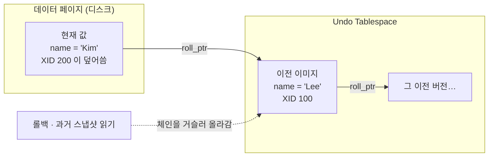
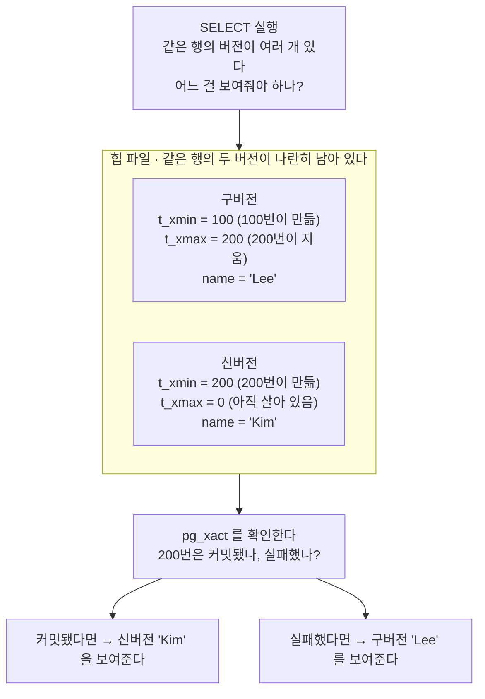
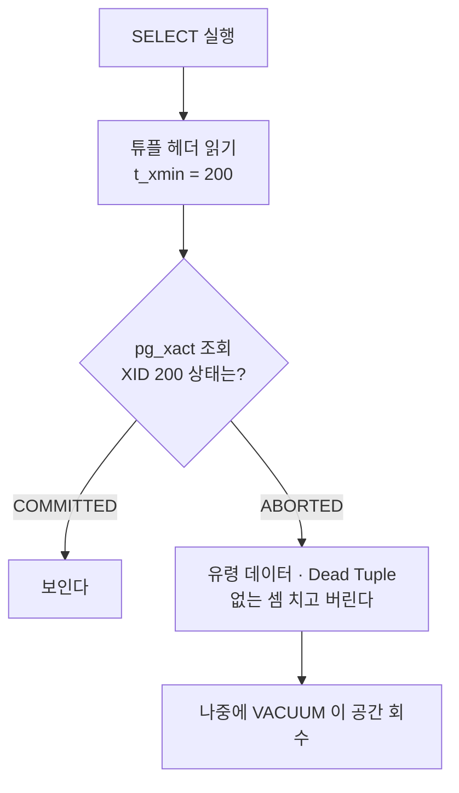
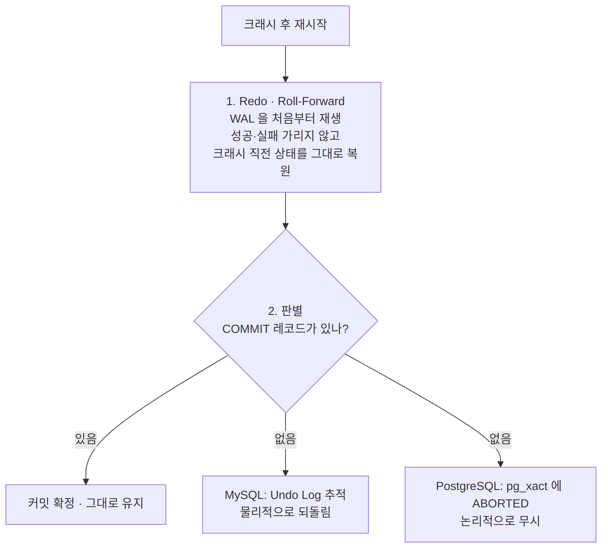
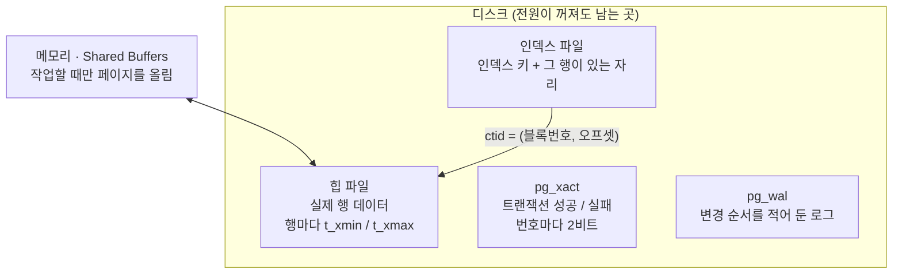
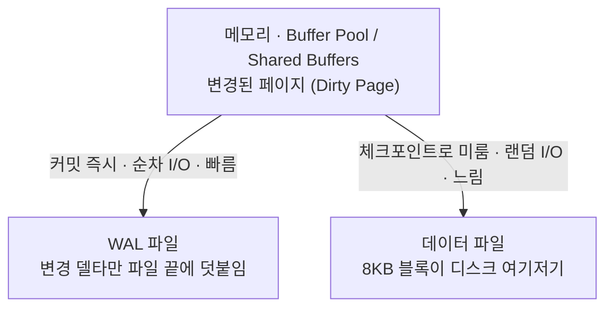

강의에서 ACID를 배우고 나서도 "그래서 DB가 실제로 뭘 하는데?"가 안 풀렸다.
원자성이 "전부 아니면 전무"라는 건 알겠는데, 트랜잭션이 중간에 죽었을 때
디스크에 이미 써버린 데이터를 **무슨 수로 없던 일로 만드는지**가 빠져 있었다.

파고들다 보니 답이 하나가 아니었다. MySQL과 PostgreSQL은 A(원자성)와 I(격리성)를
**정반대 방식으로** 구현한다. ACID는 지켜야 할 약속이고, 그 약속을 지키는 방법은
엔진이 고른다.

세 층으로 나눠 정리했다. **공부 내용**은 강의가 알려준 것,
**심화**는 거기서 파고든 것, **보충 개념**은 그걸 이해하려다 걸린 DB 일반 용어다.

## 공부 내용 — ACID 네 글자와 그걸 만드는 장치

| 글자 | 보장하는 것 | 이걸 만드는 장치 |
| --- | --- | --- |
| **A** Atomicity | 전부 아니면 전무 | <abbr title="변경 전 값을 따로 보관해 두는 로그. 롤백할 때 이걸 보고 되돌린다.">Undo Log</abbr> (MySQL) / [`pg_xact`](#pg_xact--트랜잭션이-성공했는지만-적어-둔-파일 "트랜잭션 번호마다 커밋/중단 상태를 2비트로 적어 둔 별도 파일. 힙 안이 아니다.") 상태 비트맵 (PostgreSQL) |
| **C** Consistency | 제약조건이 깨지지 않음 | 나머지 셋 + 스키마 제약 |
| **I** Isolation | 동시 실행이 서로 안 밟음 | <abbr title="Multi-Version Concurrency Control. 행을 덮어쓰는 대신 여러 버전을 두고, 읽는 쪽에 맞는 버전을 골라 주는 방식. 잠금 없이 동시성을 얻는다.">MVCC</abbr> (버전 관리 방식이 엔진마다 다름) |
| **D** Durability | 커밋했으면 안 날아감 | <abbr title="Write-Ahead Log. 데이터 파일을 고치기 전에 '무엇을 바꿀지'를 먼저 로그에 적어 두는 방식, 또는 그 로그 파일.">WAL</abbr> (Write-Ahead Log) |

여기서 A와 I가 한 몸이다. "과거 버전을 어딘가 보관한다"는 문제를 어떻게 푸느냐가
롤백 방식과 스냅샷 읽기 방식을 **동시에** 결정하기 때문이다.

## 심화 — 엔진은 A와 I를 정반대로 만든다

여기부터는 강의 밖에서 파고든 내용이다. "그래서 디스크에서 무슨 일이 일어나는가"에 대한 답.

갈림길은 하나다. **제자리에 덮어쓸 것인가, 새로 쓸 것인가.**
이 선택이 롤백 방식과 스냅샷 읽기 방식을 동시에 결정한다.

### MySQL InnoDB — 제자리에 덮어쓰고, 이전 값은 Undo Log로 밀어낸다

UPDATE가 들어오면 데이터 페이지의 원본 레코드를 **새 값으로 덮어쓴다**(In-Place Update).
덮이기 전의 이전 버전은 별도의 Undo Tablespace로 밀려나고, 레코드 헤더의
`roll_ptr`이 그 이전 이미지를 가리키면서 버전 체인이 생긴다.



- **롤백할 때**: 이 체인을 역추적해서 원래 값을 복원한다.
- **과거 스냅샷을 읽을 때**: [가시성 검사](#스냅샷과-가시성-검사--select-가-버전을-고르는-법 "여러 버전 중 지금 이 트랜잭션에게 어느 것이 보여야 하는지 판정하는 절차") 결과에 따라
  같은 체인을 거슬러 올라가 이전 버전을 재구성한다.

Undo Log 하나가 원자성과 격리성을 동시에 담당한다.

### PostgreSQL — 덮어쓰지 않고 새 튜플을 추가한다

아래 이야기는 행 데이터와 트랜잭션 상태가
[서로 다른 파일](#postgresql-은-무엇을-어디에-저장하나 "행 데이터(힙 파일), 트랜잭션 성공 여부(pg_xact), 변경 로그(pg_wal)를 각각 다른 파일에 나눠 둔다.")에 나뉘어 있다는 걸 전제로 한다.

PostgreSQL에는 **Undo Log라는 구조 자체가 없다.** UPDATE가 들어오면 기존 튜플을
그대로 두고 새 버전의 튜플을 [힙](#힙heap은-메모리가-아니다 "정렬 순서 없이 행이 쌓이는 디스크상의 테이블 데이터 파일. 프로그래밍의 힙 메모리와는 다른 것이다.")에 INSERT한다(Append-Only).

버전 정보는 테이블이 아니라 **행(튜플)마다** 헤더에 박혀 있다.

- `t_xmin` — 이 행 버전을 만든 트랜잭션 ID
- `t_xmax` — 이 행 버전을 지우거나 갱신한 트랜잭션 ID (아직 살아있으면 `0`)

XID 200번 트랜잭션이 `UPDATE table SET name = 'Kim' WHERE id = 1`을 실행하면
힙 페이지가 이렇게 된다.

```text
[구버전 튜플]
  t_xmin: 100   ← 예전에 만들어짐
  t_xmax: 200   ← 200이 이 버전을 '삭제'함
  data:   name = 'Lee'

[신버전 튜플]
  t_xmin: 200   ← 200이 이 버전을 '생성'함
  t_xmax: 0     ← 아직 살아있음
  data:   name = 'Kim'
```



행 하나를 읽는 데 파일 두 개를 봐야 한다. **힙에는 "누가 만들고 누가 지웠나"만 적혀 있고,
"그 누가 성공했는지"는 `pg_xact`에 따로 있기 때문**이다.
이 두 단계가 [가시성 검사](#스냅샷과-가시성-검사--select-가-버전을-고르는-법 "여러 버전 중 지금 이 트랜잭션에게 어느 것이 보여야 하는지 판정하는 절차")다.

같은 XID 200이 구버전의 `t_xmax`와 신버전의 `t_xmin` 양쪽에 들어간다.
**엔진 내부에서 UPDATE = DELETE + INSERT를 한 트랜잭션 안에서 처리**하기 때문이다.
순수 DELETE라면 새 튜플을 만들지 않으므로 기존 튜플의 `t_xmax`만 채워진다.

그럼 롤백은? Undo가 없으니 되돌릴 수가 없다. 대신 [`pg_xact`](#pg_xact--트랜잭션이-성공했는지만-적어-둔-파일 "트랜잭션 번호마다 커밋/중단 상태를 2비트로 적어 둔 별도 파일. 힙 안이 아니다.")라는
**트랜잭션 상태 비트맵**에 "200번은 ABORTED"라고 한 줄 찍고 끝낸다. 이후 읽는 트랜잭션들이
`pg_xact`를 보고 "200번이 만든 튜플은 무시"하고 넘어간다.

### WAL에는 실패한 트랜잭션도 기록된다

WAL은 "커밋된 것만 골라 적는 로그"가 아니다. 버퍼 풀에서 일어난 **모든 변경을
실시간 순서대로 적는 일기장**이다.

당연하다. 트랜잭션 실행 중에는 마지막에 COMMIT이 올지 ROLLBACK이 올지 **미리 알 수 없다.**
게다가 WAL 원칙상 변경된 메모리 블록이 디스크에 내려가기 전에 로그가 먼저 영속화돼야 하니,
이미 순차 기록된 로그를 "실패했다"고 찾아가 지우는 건 불가능하다.
그러면 그게 [랜덤 I/O](#랜덤-io와-순차-io--wal이-로그를-따로-쓰는-이유)다.

더 나아가서, **롤백하는 행위 자체도 WAL에 추가 기록된다.** 롤백은 버퍼 풀 페이지를
변경하는 행위이므로 그것도 로그로 남아야 한다(InnoDB에서는 CLR, Compensation Log Record).

### 복구했는데 실패한 트랜잭션의 신버전 튜플이 디스크에 남아있다

여기가 제일 안 받아들여졌다. 실패했으면 없어져야 하는 것 아닌가?

**물리적으로는 남기고, 논리적으로만 없앤다.**

PostgreSQL의 복구는 Redo-Only다. WAL을 처음부터 재생해서 크래시 직전의 디스크 상태를
**있는 그대로 똑같이** 재현한다. 실패한 트랜잭션이 쓰던 신버전 튜플도 그대로 복원된다.
그리고 `pg_xact`에 "ABORTED" 비트 하나만 찍고 복구를 끝낸다.

물리적으로 지우지 않는 이유는 **복구 속도** 때문이다. 실패한 대용량 트랜잭션이
수백만 건을 삽입했다면, 그걸 다 찾아가 지우는 건 엄청난
[랜덤 I/O](#랜덤-io와-순차-io--wal이-로그를-따로-쓰는-이유)다. DB 부팅이 몇 시간씩
걸린다. 대신 비트맵에 마킹 하나 찍고 1초 만에 끝낸다.

그래서 SELECT를 하면 이렇게 걸러진다.



애플리케이션 입장에서는 **아예 읽히지 않으므로 완벽하게 롤백된 것과 동일하다.**
남아있는 건 살아난 게 아니라 시체(Dead Tuple)다. 이건 나중에 VACUUM이 치우면서
공간을 재사용 가능하게 만든다. PostgreSQL에 VACUUM이 필수인 이유가 여기 있다.

### Redo와 Undo는 방향이 반대다

| | Redo Log | Undo Log |
| --- | --- | --- |
| 목적 | 영속성 (D) | 원자성 (A) + 격리성 (I) |
| 기록 대상 | 변경 **후** 값 (After Image) | 변경 **전** 값 (Before Image) |
| 방향 | 앞으로 감기 (Roll-Forward) | 뒤로 되감기 (Roll-Back) |
| 발동 시점 | 크래시 후 재부팅 복구 | ROLLBACK, 과거 스냅샷 조회 |
| I/O 패턴 | 순차 추가 전용 | 테이블스페이스 내 블록 I/O |

크래시 복구는 두 단계다.



1. **Redo (Roll-Forward)** — WAL을 처음부터 재생해서 크래시 직전 상태를 재현한다.
   성공했든 실패했든 일단 다 복원한다.
   (같은 로그를 여러 번 재생해도 안전한 이유는
   [LSN](#lsn--재생을-두-번-해도-안전한-이유 "Log Sequence Number. WAL 스트림 안에서의 바이트 위치다. 두 LSN 을 빼면 그 사이에 쌓인 WAL 양이 나온다.") 참고.)
2. **Undo / 판별** — COMMIT 레코드가 없는 트랜잭션을 미완료로 판정한다.
   MySQL은 Undo Log를 추적해 **물리적으로 되돌리고**,
   PostgreSQL은 `pg_xact`를 보고 **논리적으로 무시한다.**

## 실습 — 직접 확인해보기

여기까지가 "이렇게 동작한다더라"다. PostgreSQL은 `xmin` / `xmax` / `ctid` 를
직접 조회할 수 있게 열어 뒀으므로, 위 주장을 **눈으로 확인**할 수 있다.

Docker 로 컨테이너 하나 띄우면 되고, **A · C · I · D 를 차례로** 확인한다.

| | 확인하는 것 |
| --- | --- |
| **A** | 이체가 중간에 실패하면 여러 행이 한 XID 로 함께 무효화되는지. 테이블을 넘어가도 같은지 |
| **C** | 제약 위반이 A 와 **같은 경로**를 타는지 (C 전용 장치가 있는지) |
| **I** | 두 세션이 같은 행의 다른 버전을 동시에 보는지. 쓰기끼리 겹치면 어떻게 되는지 |
| **D** | `kill -9` 로 죽여도 커밋분이 살아남는지 |

→ **[섹션2 실습 1: ACID 직접 까보기](/study/database/section-2-acid-lab/)** — `psql` 로 직접 확인

그리고 실무에서는 ORM 을 통해 이 모든 게 일어난다. `transaction.atomic()` 이 격리 수준을
바꿔 주는지, QuerySet 캐시가 팬텀을 막아 주는지는 따로 확인해야 한다.

→ **[섹션2 실습 2: Django 에서 같은 문제 겪어보기](/study/database/section-2-acid-lab-django/)**

## 보충 개념 — ACID와는 별개로 몰라서 막혔던 것들

위 내용을 이해하려다 걸린 것들인데, ACID 자체가 아니라 **DB 일반 개념**이다.
따로 빼둔다. 이걸 모르면 위가 안 읽힌다.

> 본문에서 점선 밑줄이 그어진 용어는 마우스를 올리면 한 줄 설명이 뜬다.
> 눌러서 내려오면 여기 자세한 설명이 있다.

### PostgreSQL 은 무엇을 어디에 저장하나

PostgreSQL은 데이터를 한 군데 몰아 넣지 않는다. 성격이 다른 네 종류의 파일로 나눠 둔다.



**각자 다른 파일**이라는 게 중요하다. 특히 두 가지가 힙에서 떨어져 있다.

- **"그 행을 만든 트랜잭션이 성공했는지"** 는 `pg_xact` 에 있다 → 행 하나 읽는 데 두 곳을 본다
- **"어떤 값이 어느 행에 있는지"** 는 인덱스 파일에 있다 → 인덱스로 찾은 뒤 힙으로 한 번 더 간다

본문의 이야기는 대부분 이 분리에서 나온다.

### 힙(Heap)은 메모리가 아니다

프로그래밍에서 힙은 런타임 동적 할당 메모리(휘발성)다. **DB에서 힙은 디스크에
영속 저장되는 비순서형 테이블 데이터 파일**이다. 이름만 같고 완전히 다르다.
PostgreSQL의 힙 페이지는 기본 8KB 블록이고, 작업할 때만 공유 버퍼로 올라왔다가
체크포인트 때 다시 디스크로 내려간다.

참고로 두 엔진은 테이블을 디스크에 배치하는 전략부터 다르다.

- **PostgreSQL** — 본체 데이터는 힙 파일에 있고, PK 인덱스조차 **별도 파일**이다.
  인덱스 항목에는 인덱스 키와 함께 <abbr title="tuple identifier. 파일이 아니라 주소값이다. 힙 파일 안의 (블록번호, 오프셋)을 가리킨다.">`ctid`</abbr> 가 들어 있고,
  이게 힙 파일 안의 자리를 가리킨다. 그래서 인덱스로 찾아도 **힙을 한 번 더 읽어야** 한다.
- **InnoDB** — 테이블 자체가 **PK 기준 Clustered B-Tree** 로 정렬돼 저장된다.
  PK 로 찾으면 그 자리에 행 데이터가 바로 있다. 대신 보조 인덱스는 물리 주소가 아니라
  **PK 값**을 담고 있어서, 보조 인덱스로 찾으면 PK 트리를 한 번 더 타야 한다.

`ctid` 는 `pg_xact` 처럼 따로 있는 저장소가 아니다. **인덱스 항목 안에 적힌 좌표**다.
그리고 PostgreSQL 에서 행이 갱신되면 새 튜플이 다른 자리에 생기므로 `ctid` 도 바뀐다.
그래서 애플리케이션에서 `ctid` 를 행 식별자로 쓰면 안 된다.

### pg_xact — 트랜잭션이 성공했는지만 적어 둔 파일

힙 페이지 안에 있는 게 아니다. **데이터 디렉터리 아래 `pg_xact/` 에 있는 별도 파일**이다.

담는 내용은 극단적으로 단순하다. **트랜잭션 번호 하나당 2비트**, 상태 네 가지
(진행 중 / 커밋 / 중단 / 서브트랜잭션)뿐이다. 그래서 "상태 비트맵"이라고 부른다.
행 데이터가 아니라 번호별 상태만 있으니 아주 작고, 통째로 캐시에 올려 두고 쓴다.

왜 굳이 분리했나. **트랜잭션 하나가 백만 행을 건드려도 상태는 한 곳만 바꾸면 되기 때문**이다.
커밋할 때 백만 개 행을 찾아가 "성공했음"을 표시하는 대신, `pg_xact` 에 비트 하나만 뒤집는다.
커밋이 O(1)로 끝난다.

대신 대가가 있다. 행을 읽을 때마다 "이 행을 만든 번호가 커밋됐나"를 **매번 되물어야 한다.**
앞에서 본 [가시성 검사](#스냅샷과-가시성-검사--select-가-버전을-고르는-법 "여러 버전 중 지금 이 트랜잭션에게 어느 것이 보여야 하는지 판정하는 절차")가 두 단계인 이유가 이것이다.

### 스냅샷과 가시성 검사 — SELECT 가 버전을 고르는 법

SELECT는 단순 조회인데 왜 스냅샷 얘기가 나오나 싶었다. **버전이 여러 개라서 그렇다.**

PostgreSQL은 UPDATE 때 행을 덮어쓰지 않고 새 버전을 쌓는다. 그래서 힙 파일에는
같은 행의 버전이 여러 개 남아 있다. SELECT는 그중 **어느 것을 보여줄지 골라야 한다.**
이 고르는 절차가 가시성 검사고, 고르는 기준이 스냅샷이다.

**스냅샷은 데이터를 복사해 두는 게 아니다.** 이름 때문에 "그 시점 데이터를 통째로
떠 놓는 것"으로 읽히기 쉬운데(Redis 의 RDB 스냅샷이 그런 것이다), 여기서는
**"어디까지 보기로 할지" 정하는 판정 기준 숫자 몇 개**일 뿐이다. 실제로 24바이트다.

- `xmin` — 아직 실행 중인 것 중 가장 작은 트랜잭션 번호
- `xmax` — 아직 배정되지 않은 다음 번호
- `xip_list` — 스냅샷을 뜨는 순간 **실행 중이던** 번호 목록

이걸 들고 각 버전의 `t_xmin` / `t_xmax` 가 **내 스냅샷 시점에 이미 커밋돼 있었는지**를
따진다. 세 값이 각자 다른 일을 한다.

| `t_xmin` 위치 | 판정 |
| --- | --- |
| `t_xmin < xmin` | 스냅샷 뜰 때 **이미 끝나 있었다** → 커밋됐으면 보인다 |
| `xmin ≤ t_xmin < xmax` | **`xip_list` 확인** — 있으면 그때 진행 중이었으니 안 보인다 |
| `t_xmin ≥ xmax` | **내 스냅샷 이후에 시작했다** → 커밋 여부와 무관하게 안 보인다 |

`xip_list` 만 보면 안 된다. **내 스냅샷보다 나중에 시작한 트랜잭션은 애초에 `xip_list` 에
있을 수가 없으므로**, 그걸 걸러내는 건 `xmax` 다. `xmin` 과 `xmax` 는 경계를 그어
대부분의 튜플을 목록 조회 없이 판정하게 해 주는 최적화이기도 하다.

`t_xmax` 도 같은 방식으로 따진다. 이미 커밋된 번호가 찍혀 있으면 지워진 버전이다.

남는 하나가 내가 볼 버전이다. 그래서 **같은 순간에 서로 다른 트랜잭션이 같은 행의
다른 버전을 볼 수 있다.** 이게 잠금 없이 격리성(I)을 만드는 방식, 즉 MVCC다.

여기서 `pg_xact` 와 스냅샷의 역할이 갈린다. **`pg_xact` 는 "커밋됐나"라는 사실을 알려주고,
스냅샷은 그 사실을 언제 기준으로 볼지를 고정한다.** `pg_xact` 만 보면 판정 기준이 매 순간
바뀌어서, 오래 걸리는 문장 하나 안에서도 앞뒤 결과가 달라진다.

### 랜덤 I/O와 순차 I/O — WAL이 로그를 따로 쓰는 이유

WAL이 임시 버퍼인 줄 알았는데 아니다. PostgreSQL은 `pg_wal/`에 16MB 세그먼트 파일로,
MySQL은 `ib_logfile0` 같은 Redo Log 파일로 **디스크에 영구 기록**한다.

그럼 데이터 파일에 바로 쓰면 되지 왜 로그를 또 쓰나. **I/O 패턴이 다르기 때문이다.**

- 데이터 파일에 직접 쓰기 = 디스크 곳곳의 8KB 블록을 찾아다니는 **랜덤 I/O**
- WAL 쓰기 = "무엇이 어떻게 바뀌었다"는 델타만 파일 끝에 붙이는 **순차 I/O**



그래서 역할을 나눈다. 실제 데이터 페이지는 메모리에서만 고치고 디스크 반영은
체크포인트로 미룬다. 대신 변경 델타는 커밋 시점에 WAL로 순차 기록하고 `fsync`까지
불러 영속성을 확정한다. **느린 작업(랜덤)을 뒤로 미루고 빠른 작업(순차)으로 안전망을 만드는 것**이
WAL의 본질이다.

### LSN — 재생을 두 번 해도 안전한 이유

WAL을 재생하다 보면 "이미 디스크에 반영된 변경을 또 덮어써서 엉뚱해지지 않나"는
의문이 생긴다. 각 페이지 헤더에 `page_lsn`이 있어서 이걸 막는다.

- 페이지의 LSN ≥ 읽은 WAL 레코드의 LSN → 이미 반영됨, **건너뛴다**
- 페이지의 LSN < WAL 레코드의 LSN → **적용한다**

복구가 몇 번을 돌아도 같은 결과가 나온다(멱등).

## 정리

| 구분 | MySQL (InnoDB) | PostgreSQL |
| --- | --- | --- |
| 갱신 방식 | In-Place Update (제자리 덮어쓰기) | Append-Only (새 튜플 추가) |
| MVCC 구현 | Undo Log를 역추적해 이전 버전 재구성 | 힙 페이지에 튜플 버전들이 공존 |
| 원자성 달성 | Undo Log로 물리적 롤백 | `pg_xact`에 ABORTED 마킹 (논리적 무효화) |
| 과거 버전 정리 | Purge 스레드가 Undo 공간 회수 | VACUUM이 Dead Tuple 정리 |

다음에 이 근처에서 막히면 이 순서로 본다.

1. **"디스크에 뭐가 남아있나"와 "읽을 때 뭐가 보이나"를 분리해서 생각한다.**
   ACID는 디스크 상태가 아니라 **가시성** 수준에서 보장된다.
2. 엔진을 먼저 확인한다. Undo가 있는 엔진(InnoDB)과 없는 엔진(PostgreSQL)은
   같은 질문에 다른 답을 준다.
3. 성능 관련 설계 결정은 대부분 **랜덤 I/O를 순차 I/O로 바꾸려는 시도**로 설명된다.
   WAL도, 복구 시 물리적 삭제를 포기한 것도 같은 이유다.

## 참고

- [Fundamentals of Database Engineering](https://www.udemy.com/course/database-engineering-korean/) — Hussein Nasser
- [PostgreSQL 문서: Concurrency Control](https://www.postgresql.org/docs/current/mvcc.html)
- [PostgreSQL 문서: Write-Ahead Logging (WAL)](https://www.postgresql.org/docs/current/wal-intro.html)
- [MySQL 문서: InnoDB Multi-Versioning](https://dev.mysql.com/doc/refman/8.4/en/innodb-multi-versioning.html)
