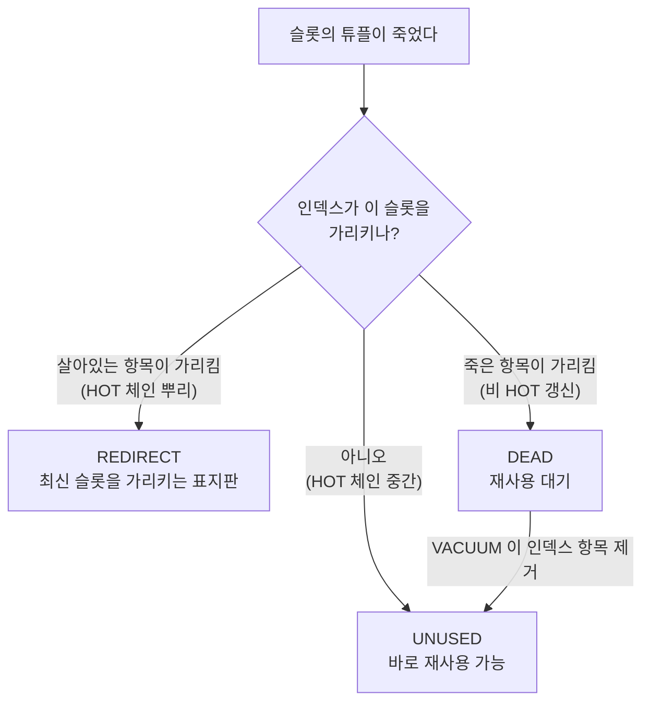

[섹션3 정리 글](/study/database/section-3-internals/)을 쓰면서 가장 안 풀린 게
페이지 안의 라인 포인터였다. "목차가 있고 본문 위치를 가리킨다" 는 설명을 읽어도
[`ctid`](/study/database/section-3-internals/#ctid-는-트랜잭션-id-가-아니다 "tuple identifier. 트랜잭션 ID 가 아니라 (블록번호, 라인 포인터 번호) 쌍으로 힙 안의 자리를 가리키는 주소값이다") 의 두 번째 숫자를 계속 행 번호로 착각했고, VACUUM 이 어떤 슬롯은 남기고
어떤 슬롯은 비우는 기준도 감이 안 왔다.

PostgreSQL 은 `pageinspect` 로 페이지 바이트를 그대로 열어 볼 수 있다.
직접 열어 보니 착각이 세 개 걸러졌다.

- `ctid` 의 두 번째 숫자는 **행 번호가 아니다.** 슬롯 5개에 살아있는 행이 3개였다
- VACUUM 이 슬롯을 남기는 기준은 **인덱스가 가리킬 수 있는가** 하나다. 체인의 뿌리라는
  지위는 아무 보호력이 없었다
- 슬롯 상태는 3개가 아니라 **4개**다. `LP_DEAD` 라는 대기 상태가 있다

아래 출력은 전부 다음 「준비」 절의 순서대로 컨테이너를 띄워 직접 받은 것이다.
`relfilenode` 번호만 환경마다 다르고 나머지는 그대로 재현된다.

## 준비

```bash
docker run -d --name pg-lab \
  -e POSTGRES_PASSWORD=pw -e POSTGRES_HOST_AUTH_METHOD=trust \
  postgres:17
docker exec -it -u postgres pg-lab psql
```

```sql
CREATE EXTENSION pageinspect;
SHOW block_size;   -- 8192
```

`pageinspect` 가 주는 함수는 세 개만 쓴다.

| 함수 | 무엇을 보여주나 |
| --- | --- |
| `page_header(get_raw_page(t, n))` | 페이지 헤더 — 빈 공간의 두 경계선, WAL LSN |
| `heap_page_items(get_raw_page(t, n))` | 라인 포인터 배열 + 각 튜플의 헤더 |
| `bt_page_items(idx, n)` | B-tree 인덱스 페이지의 항목들 |

## 페이지 안의 두 경계선

### 목차와 본문이 양쪽에서 자란다

**확인할 내용** — 페이지는 헤더 뒤에 목차(라인 포인터)를 앞에서부터, 본문(튜플)을
뒤에서부터 채운다. 한 행씩 넣으면서 두 경계선이 마주 오는지 본다.

**쿼리**

```sql
CREATE TABLE grow(id int, name text);

INSERT INTO grow VALUES (1,'alice');
SELECT 1 AS 넣은행, lower, upper, upper-lower AS 빈공간 FROM page_header(get_raw_page('grow',0));
INSERT INTO grow VALUES (2,'bob');
SELECT 2 AS 넣은행, lower, upper, upper-lower AS 빈공간 FROM page_header(get_raw_page('grow',0));
INSERT INTO grow VALUES (3,'carol');
SELECT 3 AS 넣은행, lower, upper, upper-lower AS 빈공간 FROM page_header(get_raw_page('grow',0));
INSERT INTO grow SELECT i,'x'||i FROM generate_series(4,10) i;
SELECT 10 AS 넣은행, lower, upper, upper-lower AS 빈공간 FROM page_header(get_raw_page('grow',0));
```

**결과**

```text
 넣은행 | lower | upper | 빈공간
--------+-------+-------+--------
      1 |    28 |  8152 |   8124
      2 |    32 |  8120 |   8088
      3 |    36 |  8080 |   8044
     10 |    64 |  7856 |   7792
```

`lower` 는 한 행마다 정확히 **4바이트씩** 늘어난다. 라인 포인터 하나가 4바이트라는
뜻이고, `24 + 4N` 이 그대로 맞는다(24 는 페이지 헤더 크기). `upper` 는 반대로
내려온다. 둘이 만나면 그 페이지는 꽉 찬 것이다.

목차 칸을 몇 개 잡아둘지 미리 정하지 않아도 되게 만든 구조다.
→ [정리 글의 해당 절](/study/database/section-3-internals/#페이지-안에는-목차가-있다)

## 라인 포인터를 따라간다

### 배열의 네 시점을 이어서 본다

**확인할 내용** — 3행을 넣고 1번 행을 두 번 고친 뒤 VACUUM 까지 돌리는 동안
**같은 라인 포인터 배열**이 어떻게 변하는지. 형식을 바꾸지 않고 한 표로 봐야
흐름이 보인다.

**쿼리**

```sql
CREATE TABLE trace(id int primary key, name text);
CREATE TEMP TABLE snap(step text, lp int, off int, len int, flags int, nextv text);

INSERT INTO trace VALUES (1,'v0'),(2,'bob'),(3,'carol');
INSERT INTO snap SELECT '1', lp, lp_off, lp_len, lp_flags, t_ctid::text FROM heap_page_items(get_raw_page('trace',0));
UPDATE trace SET name='v1' WHERE id=1;
INSERT INTO snap SELECT '2', lp, lp_off, lp_len, lp_flags, t_ctid::text FROM heap_page_items(get_raw_page('trace',0));
UPDATE trace SET name='v2' WHERE id=1;
INSERT INTO snap SELECT '3', lp, lp_off, lp_len, lp_flags, t_ctid::text FROM heap_page_items(get_raw_page('trace',0));
VACUUM trace;
INSERT INTO snap SELECT '4', lp, lp_off, lp_len, lp_flags, t_ctid::text FROM heap_page_items(get_raw_page('trace',0));

SELECT lp,
  max(CASE WHEN step='1' THEN fmt END) AS "① INSERT 3건",
  max(CASE WHEN step='2' THEN fmt END) AS "② 첫 수정",
  max(CASE WHEN step='3' THEN fmt END) AS "③ 두번째 수정",
  max(CASE WHEN step='4' THEN fmt END) AS "④ VACUUM 후"
FROM (SELECT step, lp,
        CASE flags WHEN 0 THEN 'UNUSED' WHEN 2 THEN 'REDIRECT→'||off
                   ELSE off||' → '||nextv END AS fmt FROM snap) t
GROUP BY lp ORDER BY lp;
```

**결과**

```text
 lp | ① INSERT 3건 |  ② 첫 수정   | ③ 두번째 수정 | ④ VACUUM 후
----+--------------+--------------+---------------+--------------
  1 | 8160 → (0,1) | 8160 → (0,4) | 8160 → (0,4)  | REDIRECT→5
  2 | 8128 → (0,2) | 8128 → (0,2) | 8128 → (0,2)  | 8160 → (0,2)
  3 | 8088 → (0,3) | 8088 → (0,3) | 8088 → (0,3)  | 8120 → (0,3)
  4 |              | 8056 → (0,4) | 8056 → (0,5)  | UNUSED
  5 |              |              | 8024 → (0,5)  | 8088 → (0,5)
```

숫자는 페이지 안 본문 위치(`lp_off`), 화살표 뒤는 `t_ctid`(다음 버전)다.

- **UPDATE 한 번에 슬롯 하나가 늘어난다.** ②에서 4번, ③에서 5번이 생겼다.
  두 번 고쳤을 때 슬롯은 6번이 아니라 **5번까지**다 — 행 3개에 새 버전 2개다
- **`t_ctid` 는 다음 버전의 위치다.** 1번이 `(0,1)`(자기 자신) → `(0,4)` 로 바뀌며
  `1 → 4 → 5` 체인이 생긴다. 최신 버전은 자기 자신을 가리킨다
- **④에서 2·3번 본문이 각각 32바이트씩 뒤로 밀렸다** (`8128→8160`, `8088→8120`)

### 본문이 움직여도 ctid 와 인덱스는 그대로다

**확인할 내용** — 앞 실습에서 본문이 32바이트 움직였다. 바깥에서 보는 주소도 바뀌었는지.

**쿼리**

```sql
SELECT ctid, id, name FROM trace ORDER BY id;
SELECT itemoffset, ctid AS "가리키는 힙 lp" FROM bt_page_items('trace_pkey', 1);
```

**결과**

```text
 ctid  | id | name              itemoffset | 가리키는 힙 lp
-------+----+-------           ------------+----------------
 (0,5) |  1 | v2                        1 | (0,1)
 (0,2) |  2 | bob                       2 | (0,2)
 (0,3) |  3 | carol                     3 | (0,3)
```

**본문은 움직였는데 `ctid` 도, 인덱스 리프도 정리 전 값 그대로다.** 목차 번호는
안 건드리고 목차에 적힌 위치만 고쳤기 때문이다. 이게 목차층을 한 단계 끼워 넣은 이유다.

`id=1` 은 인덱스가 `(0,1)` 을 가리키는데 그 자리엔 튜플이 없다. 그래도 조회가 된다.

**쿼리**

```sql
SET enable_seqscan = off;
SELECT id, name, ctid FROM trace WHERE id = 1;
```

**결과**

```text
 id | name | ctid
----+------+-------
  1 | v2   | (0,5)
```

`(0,1)` 의 표지판을 따라 5번으로 건너가 최신 버전을 찾아냈다.

### 슬롯 5개에 살아있는 행은 3개

**확인할 내용** — `ctid` 의 두 번째 숫자가 행 번호라면 구멍이 생길 수 없다.
슬롯을 전부 펼쳐 본다.

**쿼리**

```sql
SELECT lp,
       CASE lp_flags WHEN 0 THEN 'UNUSED (빈 칸)'
                     WHEN 1 THEN 'NORMAL (튜플)'
                     WHEN 2 THEN 'REDIRECT → ' || lp_off
                     WHEN 3 THEN 'DEAD' END AS 상태,
       lp_len
FROM heap_page_items(get_raw_page('trace',0));
```

**결과**

```text
 lp |      상태      | lp_len
----+----------------+--------
  1 | REDIRECT → 5   |      0
  2 | NORMAL (튜플)  |     32
  3 | NORMAL (튜플)  |     34
  4 | UNUSED (빈 칸) |      0
  5 | NORMAL (튜플)  |     31
```

**슬롯 5개에 튜플은 3개다.** 1번은 표지판, 4번은 빈 칸이다. 그리고 순서도 행 순서가
아니다 — `id=1` 인 첫 행이 5번 슬롯에 있다.

정확한 표현은 `(0,5)` = "0번 페이지 목차의 5번 칸, 그 칸이 가리키는 **행 버전**" 이다.
`id=1` 은 살면서 `(0,1) → (0,4) → (0,5)` 를 거쳤으므로 `ctid` 를 행 식별자로 쓰면 안 된다.
→ [정리 글의 해당 절](/study/database/section-3-internals/#ctid-는-행-번호가-아니라-목차-번호다)

## VACUUM 이 슬롯을 어떻게 처리하나

아래 네 실습의 결론을 먼저 그림으로 두면 따라가기 쉽다. 슬롯의 운명은
**인덱스가 그 슬롯을 가리키는가** 하나로 갈린다.




### 표지판은 HOT 일 때만 남는다

**확인할 내용** — 위에서 1번이 표지판으로 남았다. 인덱스 컬럼을 실제로 바꿔서
비 <abbr title="Heap-Only Tuple. 인덱스 컬럼 값이 바뀌지 않고 새 버전이 같은 페이지에 들어갈 때, 인덱스를 갱신하지 않고 페이지 안에서만 버전을 잇는 갱신 방식.">HOT</abbr> 갱신이 되게 하면 같은 자리가 어떻게 되는지.

**쿼리**

```sql
CREATE TABLE nonhot(id int primary key, name text);
CREATE INDEX nonhot_name_idx ON nonhot(name);   -- name 을 인덱스에 넣는다
INSERT INTO nonhot VALUES (1,'v0'),(2,'bob'),(3,'carol');
UPDATE nonhot SET name='v1' WHERE id=1;
UPDATE nonhot SET name='v2' WHERE id=1;

SELECT pg_stat_force_next_flush();
SELECT n_tup_upd, n_tup_hot_upd FROM pg_stat_user_tables WHERE relname='nonhot';

VACUUM nonhot;
SELECT lp, CASE lp_flags WHEN 0 THEN 'UNUSED (빈 칸)' WHEN 1 THEN 'NORMAL (튜플)'
                         WHEN 2 THEN 'REDIRECT → '||lp_off WHEN 3 THEN 'DEAD' END AS 상태
FROM heap_page_items(get_raw_page('nonhot',0));
```

**결과**

```text
 n_tup_upd | n_tup_hot_upd          lp |      상태
-----------+---------------        ----+----------------
         2 |             0           1 | UNUSED (빈 칸)
                                     2 | NORMAL (튜플)
   HOT 갱신이 0건                    3 | NORMAL (튜플)
                                     4 | UNUSED (빈 칸)
                                     5 | NORMAL (튜플)
```

**1번이 표지판이 아니라 그냥 빈 칸이 됐다.** 비 HOT 갱신은 새 버전에 대한 인덱스
항목을 새로 만들어서 인덱스가 `(0,5)` 를 **직접** 가리킨다. 1번을 경유할 일이
없으니 슬롯째로 회수해도 된다.

거꾸로 HOT 갱신은 인덱스를 안 건드리므로 인덱스가 여전히 `(0,1)` 을 가리킨다.
그 슬롯을 회수하면 인덱스가 허공을 가리키게 되니 표지판으로 남겨 둘 수밖에 없다.
**표지판은 HOT 이 치르는 대가다.**

### 표지판은 늘지 않고 재조정된다

**확인할 내용** — 표지판이 생긴 뒤에 또 HOT 갱신하면 표지판이 두 개로 이어지는지.

**쿼리**

```sql
CREATE TABLE redir(id int primary key, name text);
INSERT INTO redir VALUES (1,'v0'),(2,'bob'),(3,'carol');
UPDATE redir SET name='v1' WHERE id=1;
UPDATE redir SET name='v2' WHERE id=1;
VACUUM redir;
SELECT lp, CASE lp_flags WHEN 0 THEN 'UNUSED' WHEN 1 THEN 'NORMAL'
                         WHEN 2 THEN 'REDIRECT→'||lp_off END AS 상태
FROM heap_page_items(get_raw_page('redir',0));

UPDATE redir SET name='v3' WHERE id=1;
UPDATE redir SET name='v4' WHERE id=1;
VACUUM redir;
SELECT lp, CASE lp_flags WHEN 0 THEN 'UNUSED' WHEN 1 THEN 'NORMAL'
                         WHEN 2 THEN 'REDIRECT→'||lp_off END AS 상태
FROM heap_page_items(get_raw_page('redir',0));
```

**결과**

```text
2회 갱신 후                 4회 갱신 후
 lp |    상태                lp |    상태
----+------------           ----+------------
  1 | REDIRECT→5              1 | REDIRECT→6   ← 같은 1번, 대상만 바뀜
  2 | NORMAL                  2 | NORMAL
  3 | NORMAL                  3 | NORMAL
  4 | UNUSED                  4 | UNUSED
  5 | NORMAL                  5 | UNUSED       ← 옛 최신도 비워졌다
                              6 | NORMAL
```

**표지판은 뿌리 하나뿐이고 늘지 않는다.** 인덱스가 가리키는 것이 `(0,1)` 하나이므로
표지판도 하나면 충분하고, 체인이 길어지면 뿌리가 새 최신을 **직접** 가리키게 재조정된다.
중간 슬롯은 몇 개든 전부 비워진다.

### LP_DEAD — 인덱스 정리 전에는 못 비운다

**확인할 내용** — 비 HOT 죽은 튜플의 슬롯은 곧바로 `UNUSED` 가 되는지.
`VACUUM (INDEX_CLEANUP OFF)` 로 인덱스 정리를 건너뛰면 중간 상태가 드러난다.

**쿼리**

```sql
CREATE TABLE deadlp(id int primary key, name text);
CREATE INDEX deadlp_name_idx ON deadlp(name);
INSERT INTO deadlp VALUES (1,'v0'),(2,'bob'),(3,'carol');
UPDATE deadlp SET name='v1' WHERE id=1;      -- 비 HOT

VACUUM (INDEX_CLEANUP OFF) deadlp;
SELECT lp, CASE lp_flags WHEN 0 THEN 'UNUSED (재사용 가능)' WHEN 1 THEN 'NORMAL'
                         WHEN 2 THEN 'REDIRECT→'||lp_off
                         WHEN 3 THEN 'DEAD (아직 못 씀)' END AS 상태, lp_len
FROM heap_page_items(get_raw_page('deadlp',0));
SELECT count(*) AS "인덱스 항목 수" FROM bt_page_items('deadlp_name_idx', 1);
```

**결과**

```text
 lp |       상태        | lp_len          인덱스 항목 수
----+-------------------+--------        ----------------
  1 | DEAD (아직 못 씀) |      0                       4
  2 | NORMAL            |     32
  3 | NORMAL            |     34
  4 | NORMAL            |     31
```

**튜플은 사라졌는데(`lp_len = 0`) 슬롯이 `UNUSED` 가 아니라 `DEAD` 다.**
인덱스에 그 슬롯을 가리키는 죽은 항목이 아직 남아 있어서 재사용할 수 없다.

**쿼리**

```sql
VACUUM deadlp;   -- 이번엔 인덱스까지 정리
SELECT lp, CASE lp_flags WHEN 0 THEN 'UNUSED (재사용 가능)' WHEN 1 THEN 'NORMAL'
                         WHEN 3 THEN 'DEAD (아직 못 씀)' END AS 상태, lp_len
FROM heap_page_items(get_raw_page('deadlp',0));
SELECT count(*) AS "인덱스 항목 수" FROM bt_page_items('deadlp_name_idx', 1);
```

**결과**

```text
 lp |         상태         | lp_len          인덱스 항목 수
----+----------------------+--------        ----------------
  1 | UNUSED (재사용 가능) |      0                       3
  2 | NORMAL               |     32
```

인덱스 항목이 4 에서 3 으로 줄고 나서야 `UNUSED` 가 됐다.
**인덱스를 손대지 않는 정리는 `DEAD` 까지만 갈 수 있다.**

### 뿌리에 특별한 지위는 없다

**확인할 내용** — 표지판이 남는 것이 "체인의 뿌리라서" 인지, 아니면 그냥
"인덱스가 가리켜서" 인지. 행 자체를 지워서 인덱스 항목을 없애 본다.

**쿼리**

```sql
-- 위 redir 테이블: 1번이 REDIRECT→6, 6번이 최신
SELECT itemoffset, ctid AS "인덱스가 가리키는 슬롯" FROM bt_page_items('redir_pkey', 1);

DELETE FROM redir WHERE id=1;
VACUUM redir;

SELECT lp, CASE lp_flags WHEN 0 THEN 'UNUSED' WHEN 1 THEN 'NORMAL'
                         WHEN 2 THEN 'REDIRECT→'||lp_off END AS 상태
FROM heap_page_items(get_raw_page('redir',0));
SELECT itemoffset, ctid AS "인덱스가 가리키는 슬롯" FROM bt_page_items('redir_pkey', 1);
SELECT lower, (lower-24)/4 AS 슬롯칸수 FROM page_header(get_raw_page('redir',0));
```

**결과**

```text
지우기 전                              DELETE + VACUUM 후
 lp |    상태                           lp |  상태
----+------------                      ----+--------
  1 | REDIRECT→6                         1 | UNUSED
  2 | NORMAL                             2 | NORMAL
  3 | NORMAL                             3 | NORMAL
  4 | UNUSED
  5 | UNUSED                            인덱스: (0,2) (0,3)
  6 | NORMAL                            lower 36, 슬롯 3칸

인덱스: (0,1) (0,2) (0,3)
```

인덱스 항목 `(0,1)` 이 사라지자 **1번도 곧바로 `UNUSED`** 가 됐다.
뿌리라는 지위는 아무 보호력이 없다.

그래서 슬롯이 살아남는 이유는 **두 가지고 서로 독립이다.**

| 슬롯 | 살아남는 이유 | 튜플 | 인덱스 링크 |
| --- | --- | --- | --- |
| 뿌리 (REDIRECT) | 인덱스가 가리켜서 못 비움 | 없음 | 있음 |
| 최신 | 살아있는 튜플을 담고 있음 | 있음 | **없음** |
| 중간 | 둘 다 없음 | 없음 | 없음 |

최신 슬롯은 인덱스와 직접 연결이 없는데도 남는다. 경로를 보호하는 규칙이 있는 게
아니라, 양 끝이 각자 다른 이유로 남아서 결과적으로 경로가 걸어갈 수 있게 되는 것이다.

### 뒤쪽 빈 칸은 잘리고 중간 구멍은 남는다

**확인할 내용** — 위에서 슬롯이 6칸에서 3칸으로 줄었다. 빈 칸이 항상 잘리는지,
아니면 뒤쪽만 잘리는지.

**쿼리**

```sql
CREATE TABLE trunc(id int primary key, name text);
INSERT INTO trunc SELECT i, 'n'||i FROM generate_series(1,6) i;
SELECT lower, (lower-24)/4 AS 슬롯칸수 FROM page_header(get_raw_page('trunc',0));

DELETE FROM trunc WHERE id IN (5,6);   -- 뒤쪽 두 개
VACUUM trunc;
SELECT lower, (lower-24)/4 AS 슬롯칸수 FROM page_header(get_raw_page('trunc',0));

DELETE FROM trunc WHERE id = 2;        -- 중간 한 개
VACUUM trunc;
SELECT lower, (lower-24)/4 AS 슬롯칸수 FROM page_header(get_raw_page('trunc',0));
SELECT lp, CASE lp_flags WHEN 0 THEN 'UNUSED' WHEN 1 THEN 'NORMAL' END AS 상태
FROM heap_page_items(get_raw_page('trunc',0));
```

**결과**

```text
6행 삽입              → lower 48, 슬롯 6칸
뒤쪽 2개 삭제 + VACUUM → lower 40, 슬롯 4칸    ← 잘렸다
중간 1개 삭제 + VACUUM → lower 40, 슬롯 4칸    ← 안 줄었다

 lp |  상태
----+--------
  1 | NORMAL
  2 | UNUSED   ← 중간 구멍은 남는다
  3 | NORMAL
  4 | NORMAL
```

**뒤쪽 연속된 빈 칸만 잘라내고 중간 구멍은 남긴다.** 힙 파일이 뒤쪽 빈 페이지만
잘라내는 것과 같은 패턴이다. 그리고 번호를 당기지는 않는다 — 2번 구멍이 그대로 있고
3·4번이 앞으로 밀리지 않았다. 당기면 인덱스가 들고 있는 주소가 전부 어긋난다.

### 빈 칸은 재사용된다

**확인할 내용** — 중간에 남은 2번 구멍에 새 행이 들어가는지, 아니면 뒤에 붙는지.

**쿼리**

```sql
INSERT INTO trunc VALUES (7,'n7');
SELECT ctid, id FROM trunc WHERE id=7;
SELECT lower, (lower-24)/4 AS 슬롯칸수 FROM page_header(get_raw_page('trunc',0));
```

**결과**

```text
 ctid  | id           lower | 슬롯칸수
-------+----         -------+----------
 (0,2) |  7             40 |        4
```

맨 끝이 아니라 **비어 있던 2번 칸**으로 들어갔고, 목차 배열은 4칸 그대로다.
"슬롯을 비운다" 는 것은 슬롯을 없애는 게 아니라 **재사용 대기로 돌린다**는 뜻이다.

## 힙과 인덱스는 별개의 배열이다

### 힙의 lp 와 인덱스의 itemoffset 은 다른 것이다

**확인할 내용** — 인덱스에도 항목 번호가 있고 힙에도 슬롯 번호가 있다. 둘이
같은 것인지.

**쿼리**

```sql
SELECT relname, relkind, pg_relation_filepath(oid) AS 파일
FROM pg_class WHERE relname IN ('trace','trace_pkey') ORDER BY relkind;
```

**결과**

```text
  relname   | relkind |     파일
------------+---------+--------------
 trace      | r       | base/5/16434     ← 힙
 trace_pkey | i       | base/5/16439     ← 인덱스
```

**다른 파일이다.** (번호는 환경마다 다르다.)

| | 힙의 `lp` | 인덱스의 `itemoffset` |
| --- | --- | --- |
| 무엇을 가리키나 | 같은 페이지 안의 본문 위치 | 힙의 `(블록, lp)` |
| 개수 (위 `trace`) | 5 (빈 칸 포함) | 3 |
| 번호가 서로 대응하나 | **아니오** |

`itemoffset` 은 "이 인덱스 페이지의 몇 번째 항목" 일 뿐이다. 앞의 출력에서
`itemoffset 1` 이 `(0,1)` 을 가리킨 것은 우연이다 — 키 순서(`id` 1,2,3)와 삽입 순서가
같았을 뿐이고, 힙 쪽엔 빈 칸이 있어 개수부터 어긋나 있다.

그리고 인덱스가 가리키는 것은 튜플이 아니라 **라인 포인터**다. 조회는 3단이 된다.

```text
① 인덱스 리프          ② 힙 페이지의 목차          ③ 힙 페이지의 본문
   키 → (0,3)     ──▶     3번 칸: "8120"      ──▶     8120 바이트 자리
```

인덱스가 아는 것은 "0번 블록의 3번 칸" 까지다. 이것이 앞의 모든 결과의 이유다 —
본문이 움직여도 목차 칸만 고치면 되고, 1번 칸이 "5번으로 가라" 로 바뀌면 한 칸 더
건너갈 수 있고, 슬롯 번호는 당길 수 없다.

## 정리 — 무엇을 확인했나

| 확인한 주장 | 확인 방법 | 결과 |
| --- | --- | --- |
| 라인 포인터는 4바이트, 목차는 앞에서 자란다 | `page_header` 의 `lower` 를 행마다 관찰 | `24 + 4N` 정확히 일치 |
| UPDATE 한 번에 슬롯 하나 | 배열을 네 시점으로 추적 | 3행 + 2회 갱신 = 슬롯 5칸 |
| 본문이 움직여도 `ctid` 는 그대로 | VACUUM 전후 `lp_off` 와 `ctid` 비교 | 본문 32바이트 이동, `ctid` 불변 |
| `ctid` 두번째 숫자는 행 번호가 아니다 | 슬롯 전체 펼치기 | 슬롯 5개에 튜플 3개, `id=1` 이 5번 |
| 표지판은 HOT 일 때만 | 비 HOT 갱신과 비교 | HOT → REDIRECT / 비 HOT → UNUSED |
| 표지판은 늘지 않는다 | 4회 갱신 후 관찰 | 뿌리 하나가 `→5` 에서 `→6` 으로 재조정 |
| 슬롯 상태는 4개 | `VACUUM (INDEX_CLEANUP OFF)` | `DEAD` 대기 상태 확인, 인덱스 정리 후 `UNUSED` |
| 뿌리에 특별한 지위 없음 | 행을 DELETE 후 VACUUM | 인덱스 항목이 사라지자 뿌리도 `UNUSED` |
| 뒤쪽 빈 칸은 잘린다 | 뒤쪽 삭제 vs 중간 삭제 | 6칸 → 4칸 / 중간은 그대로 |
| 빈 칸은 재사용된다 | 구멍이 있는 상태에서 INSERT | 맨 끝이 아니라 `(0,2)` 로 |

슬롯 상태와 그 이유를 한 표로 모으면 이렇다.

| 상태 | 튜플 | 인덱스가 가리키나 | 재사용 |
| --- | --- | --- | --- |
| `NORMAL` | 있음 | 있을 수도, 없을 수도 | — |
| `REDIRECT` | 없음 | **살아있는** 항목이 가리킴 | 불가 |
| `DEAD` | 없음 | **죽은** 항목이 아직 가리킴 | 아직 불가 |
| `UNUSED` | 없음 | 아무도 안 가리킴 | 가능 |

기준은 하나다 — **인덱스가 이 슬롯을 가리킬 수 있는가.**

→ [정리 글: 슬롯 상태 네 개와 그 기준](/study/database/section-3-internals/#슬롯-상태-네-개와-그-기준)

## 정리하기

```bash
docker rm -f pg-lab
```

## 참고

- [섹션3: 데이터베이스 내부](/study/database/section-3-internals/) — 이 실습의 정리 글
- [Fundamentals of Database Engineering](https://www.udemy.com/course/database-engineering-korean/) — Hussein Nasser
- [PostgreSQL: Database Page Layout](https://www.postgresql.org/docs/17/storage-page-layout.html)
- [PostgreSQL: pageinspect](https://www.postgresql.org/docs/17/pageinspect.html)
- [PostgreSQL: Heap-Only Tuples](https://www.postgresql.org/docs/17/storage-hot.html)
