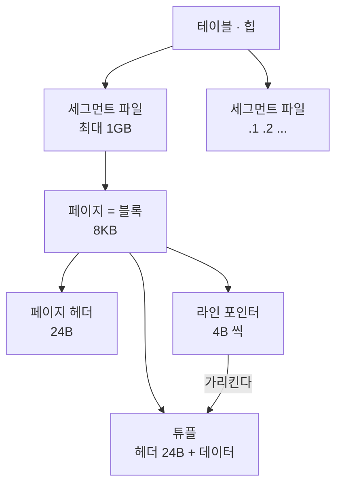
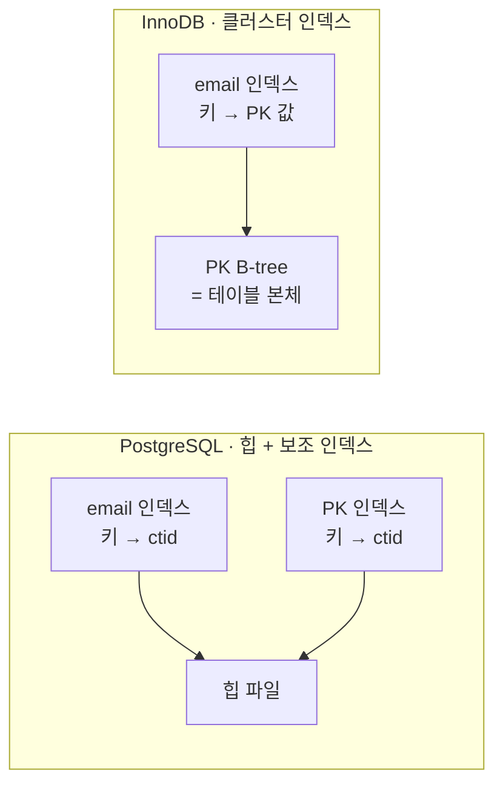
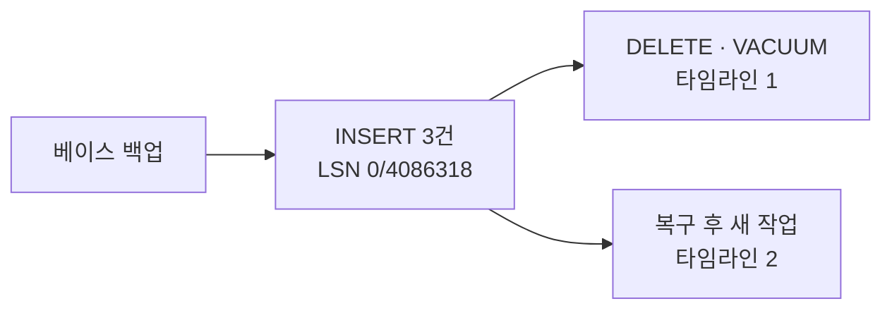

강의에서 테이블은 [힙](/study/database/section-2-acid/#힙heap은-메모리가-아니다 "DB 에서 힙은 디스크에 영속 저장되는, 정렬돼 있지 않은 테이블 데이터 파일이다. 프로그래밍의 힙 메모리와 이름만 같다") 에 저장되고 인덱스는 별도의 B-tree 라는 것까지는 배웠다.
그런데 페이지 안에 정확히 무엇이 들어 있는지, 그리고 VACUUM 이 지워 버린 데이터를
나중에 되살릴 수 있는지가 안 풀렸다.

파고들어 얻은 결론은 두 개다.

- **PostgreSQL 에는 특별한 인덱스가 없다.** PK 인덱스도 나머지와 똑같은 보조 인덱스고,
  UNIQUE 제약은 PK 인덱스가 있든 없든 자기 B-tree 를 새로 만든다.
- **VACUUM 이 지운 것은 되살아나지 않는다.** 과거 시점 복구는 되돌리기가 아니라
  백업에서 다시 감는 것이고, 목표를 VACUUM 이전으로 잡으면 그 VACUUM 은 애초에 일어나지 않는다.

세 층으로 나눠 정리했다. **공부 내용**은 강의가 알려준 것,
**심화**는 거기서 파고든 것, **보충 개념**은 그걸 이해하려다 걸린 DB 일반 용어다.

아래 출력은 전부 PostgreSQL 17 컨테이너에서 직접 받은 것이다.
페이지 바이트를 열어 확인하는 과정은 [실습 글](/study/database/section-3-internals-lab/)로 따로 뺐다.

## 공부 내용 — 힙, 페이지, 인덱스, WAL

PostgreSQL 이 디스크에 두는 것은 크게 넷이다.

| 무엇 | 어디에 | 담는 것 |
| --- | --- | --- |
| 힙 | `base/<DB>/<relfilenode>` | 테이블 본체. 순서 없이 쌓인 <abbr title="같은 행의 시점별 사본. PostgreSQL 은 UPDATE 때 덮어쓰지 않고 새 버전을 추가한다.">행 버전</abbr>들 |
| 인덱스 | 같은 디렉터리의 **다른 파일** | B-tree. 리프가 힙의 위치를 가리킨다 |
| <abbr title="Write-Ahead Log. 데이터 파일을 고치기 전에 변경 내용을 먼저 순차 기록해 두는 로그. 크래시 복구와 과거 시점 복구의 재료가 된다.">WAL</abbr> | `pg_wal/` 의 16MB 세그먼트 | 무엇이 어떻게 바뀌었는지의 물리 기록 |
| `pg_xact` | `pg_xact/` | 각 트랜잭션이 커밋됐는지 abort 됐는지 |

여기서 이 섹션의 핵심은 **테이블 본체와 인덱스가 완전히 다른 파일**이라는 점이다.
InnoDB 는 테이블 자체가 PK 로 정렬된 B-tree 지만, PostgreSQL 의 힙은 정렬돼 있지 않다.
그래서 PostgreSQL 에는 클러스터 인덱스가 없다.

힙 파일은 다시 세그먼트와 페이지로 나뉜다.



[`ctid`](#ctid-는-트랜잭션-id-가-아니다 "tuple identifier. 트랜잭션 ID 가 아니라 (블록번호, 라인 포인터 번호) 쌍으로 힙 안의 자리를 가리키는 주소값이다") 가 바로 이 그림의 아래 두 층이다.
`(7,47)` 은 7번 페이지의 47번 [라인 포인터](#페이지-안에는-목차가-있다 "페이지 안 몇 번째 항목이 어디 있는지만 적어 둔 4바이트짜리 목차 한 칸") 를 뜻한다 —
**두 번째 숫자는 "몇 번째 행" 이 아니라 "목차 몇 번 칸" 이다.** 이걸 행 번호로 읽으면
아래 내용이 전부 어긋난다.

## 심화 — 파고들어 알게 된 것

### 페이지 안에는 목차가 있다

페이지 하나는 **공책 한 권**이라고 보면 된다. 표지 안쪽에 이 공책 자체에 대한
메모(페이지 헤더)가 있고, 그 뒤로 **목차가 앞에서부터**, **본문이 뒤에서부터** 채워진다.

<figure class="diagram">
<svg viewBox="0 0 680 250" role="img" aria-label="8KB 페이지 안의 배치. 왼쪽부터 페이지 헤더, 앞에서 뒤로 자라는 라인 포인터 목차, 빈 공간, 오른쪽 끝에서 왼쪽으로 자라는 튜플들. 목차 3번 칸이 본문3을 가리킨다.">
  <defs>
    <marker id="ah" viewBox="0 0 10 10" refX="9" refY="5" markerWidth="6" markerHeight="6" orient="auto"><path d="M0 0 L10 5 L0 10 z" class="d-arrow" /></marker>
  </defs>
  <text x="20" y="22" class="d-title">페이지 = 블록 · 8192 바이트</text>
  <text x="76" y="60" class="d-accent">목차 (라인 포인터) →</text>
  <text x="660" y="60" class="d-accent" text-anchor="end">← 튜플 (행 버전)</text>
  <rect x="20" y="70" width="56" height="46" rx="3" class="d-box-dim" />
  <rect x="76" y="70" width="26" height="46" rx="2" class="d-box-accent" />
  <rect x="102" y="70" width="26" height="46" rx="2" class="d-box-accent" />
  <rect x="128" y="70" width="26" height="46" rx="2" class="d-box-accent" />
  <rect x="154" y="70" width="316" height="46" rx="3" class="d-box" />
  <rect x="470" y="70" width="66" height="46" rx="3" class="d-box-accent" />
  <rect x="536" y="70" width="66" height="46" rx="3" class="d-box-accent" />
  <rect x="602" y="70" width="58" height="46" rx="3" class="d-box-accent" />
  <text x="48" y="98" class="d-mono-muted" text-anchor="middle">24B</text>
  <text x="89" y="98" class="d-mono" text-anchor="middle">①</text>
  <text x="115" y="98" class="d-mono" text-anchor="middle">②</text>
  <text x="141" y="98" class="d-mono" text-anchor="middle">③</text>
  <text x="312" y="98" class="d-muted" text-anchor="middle">아직 빈 공간</text>
  <text x="503" y="98" class="d-mono" text-anchor="middle">본문③</text>
  <text x="569" y="98" class="d-mono" text-anchor="middle">본문②</text>
  <text x="631" y="98" class="d-mono" text-anchor="middle">본문①</text>
  <text x="20" y="150" class="d-muted">페이지 헤더</text>
  <path d="M154 118 L154 134" class="d-line" />
  <text x="162" y="150" class="d-mono-muted">lower</text>
  <path d="M470 118 L470 134" class="d-line" />
  <text x="470" y="150" class="d-mono-muted" text-anchor="middle">upper</text>
  <path d="M141 118 L141 192 L503 192 L503 122" class="d-line" marker-end="url(#ah)" />
  <text x="322" y="216" class="d-muted" text-anchor="middle">목차 ③번 칸에는 "본문③은 8120 바이트 자리" 라고만 적혀 있다</text>
</svg>
<figcaption>목차는 앞에서 뒤로, 본문은 뒤에서 앞으로 자란다. 둘이 만나면 그 페이지는 꽉 찬 것이다.</figcaption>
</figure>

목차 한 칸이 라인 포인터다. `{본문 위치, 플래그, 길이}` 만 담은 4바이트짜리이고,
**`ctid = (0,3)` 의 `3` 은 이 목차 번호**지 본문 위치가 아니다. 이 구분이 이 절의 전부다.

한 행씩 넣으면서 두 경계선을 보면 그대로 보인다.

| 넣은 행 수 | `lower` (목차 끝) | `upper` (본문 끝) | 남은 빈 공간 |
| --- | --- | --- | --- |
| 1 | 28 | 8152 | 8124 |
| 2 | 32 | 8120 | 8088 |
| 3 | 36 | 8080 | 8044 |
| 10 | 64 | 7856 | 7792 |

목차는 한 행마다 정확히 4바이트씩 늘고(`24 + 4N`), 본문은 뒤에서 앞으로 내려온다.
목차 칸을 몇 개 잡아둘지 **미리 정하지 않아도 되게** 만든 구조다.

### ctid 는 행 번호가 아니라 목차 번호다

`ctid = (0, 3)` 의 두 번째 숫자를 "3번째 행" 으로 읽으면 아래가 전부 어긋난다.
**목차 3번 칸**이고, 그 칸이 가리키는 것은 행이 아니라 **행의 한 버전**이다.

같은 페이지를 슬롯 단위로 펼쳐 보면 바로 드러난다. 3행을 넣고 1번 행을 두 번 고친 뒤
VACUUM 을 돌린 상태다.

```text
 lp |      상태
----+----------------
  1 | REDIRECT → 5     ← 튜플 없음. "5번으로 가라"
  2 | NORMAL (튜플)
  3 | NORMAL (튜플)
  4 | UNUSED (빈 칸)   ← 아무것도 없음
  5 | NORMAL (튜플)    ← id=1 의 최신 버전
```

**슬롯 5개에 살아있는 행은 3개다.** 행 번호라면 이런 구멍이 생길 수 없고,
`id=1` 인 첫 행이 5번 칸에 있을 일도 없다. `id=1` 은 살면서
`(0,1) → (0,4) → (0,5)` 를 거쳤다. 그래서 `ctid` 를 애플리케이션의 행 식별자로 쓰면
안 된다 — UPDATE 한 번에 바뀐다.

### 목차 번호라서 본문이 움직여도 안 깨진다

간접층을 끼운 이유는 하나다. VACUUM 이 죽은 버전을 걷어내면 남은 본문을 뒤로
밀어붙이는데, 그때 **본문은 움직이고 목차 번호는 안 움직인다.**

직접 확인한 결과가 이렇다. 2·3번 본문이 각각 32바이트 이동했는데
(`8128 → 8160`, `8088 → 8120`) `SELECT ctid` 값도, 인덱스 리프의 값도 정리 전 그대로였다.
목차 칸에 적힌 위치만 갱신됐기 때문이다.

**인덱스가 가리키는 것이 튜플이 아니라 라인 포인터**라서 성립하는 일이다. 조회는 3단이 된다.

```text
① 인덱스 리프          ② 힙 페이지의 목차          ③ 힙 페이지의 본문
   키 → (0,3)     ──▶     3번 칸: "8120"      ──▶     8120 바이트 자리
```

인덱스가 아는 것은 "0번 블록의 3번 칸" 까지다. 본문의 바이트 위치는 목차 칸에만 있다.
그래서 세 가지가 한꺼번에 설명된다.

- 본문이 움직여도 인덱스를 안 고쳐도 된다 — 목차 칸만 고치면 된다
- 1번 칸이 "5번으로 가라" 로 바뀌면 한 칸 더 건너갈 수 있다 (<abbr title="Heap-Only Tuple. 인덱스 컬럼 값이 바뀌지 않고 새 버전이 같은 페이지에 들어갈 때, 인덱스를 갱신하지 않고 페이지 안에서만 버전을 잇는 갱신 방식.">HOT</abbr> 체인)
- **슬롯 번호는 당길 수 없다** — 인덱스가 그 번호를 들고 있다. 그래서 4번 구멍이 남는다

InnoDB 는 이 3단이 **보조 인덱스 → PK B-tree → 행**이다. 둘 다 두 번 건너뛰지만
PostgreSQL 의 두 번째 건너뛰기는 같은 페이지 안이라 디스크 접근이 늘지 않는다.

### 슬롯 상태 네 개와 그 기준

위 출력에 `REDIRECT`·`UNUSED` 가 나왔는데, 상태는 넷이고 **전부 한 가지 기준으로 갈린다.**

| 상태 | 튜플 | 인덱스가 이 슬롯을 가리키나 | 재사용 |
| --- | --- | --- | --- |
| `NORMAL` | 있음 | 있을 수도, 없을 수도 | — |
| `REDIRECT` | 없음 | **살아있는** 항목이 가리킴 | 불가 |
| `DEAD` | 없음 | **죽은** 항목이 아직 가리킴 | 아직 불가 |
| `UNUSED` | 없음 | 아무도 안 가리킴 | 가능 |

방향을 헷갈리기 쉽다. "인덱스가 안 가리키니 의미가 없어서 지운다" 가 아니라
**지우는 것이 기본이고, 가리키는 것이 남아 있으면 지울 수 없다.**

그래서 HOT 체인의 뿌리만 표지판으로 남는다 — 인덱스가 여전히 뿌리를 가리키기 때문이다.
중간 버전은 인덱스가 애초에 가리킨 적이 없어 곧바로 비워지고, 비 HOT 갱신에서는
VACUUM 이 죽은 인덱스 항목을 먼저 제거해야 슬롯을 비울 수 있다(그 사이가 `DEAD`).
뿌리라는 지위 자체에는 아무 보호력이 없다 — 행을 지우면 뿌리도 곧바로 `UNUSED` 가 된다.

### 세 가지 헤더가 각각 무엇에 대한 정보인가

페이지 헤더, 라인 포인터, 튜플 헤더가 한 페이지 안에 같이 있어서 헷갈리기 쉬운데,
**무엇에 대한 정보인지**로 나누면 겹치지 않는다.

| | 무엇에 대한 정보인가 | 개수 | 대표 필드 |
| --- | --- | --- | --- |
| **페이지 헤더** | 이 8KB 덩어리 자체 | 페이지당 1 | `lower`·`upper`(어디까지 찼나), `lsn`(마지막으로 고친 WAL 위치), `checksum` |
| **라인 포인터** | "n번 항목은 이 페이지 어디에 있나" | 항목당 1 | `lp_off`·`lp_len`·`lp_flags` |
| **튜플 헤더** | 이 행 **버전** 하나 | 버전당 1 | `t_xmin`·`t_xmax`(누가 만들고 지웠나), `t_ctid`(다음 버전 위치) |

**페이지 헤더에는 행 이야기가 한 줄도 없다.** 공책 표지에 "몇 쪽까지 썼음, 마지막 수정일"
만 적혀 있는 것과 같다. 행의 생사는 전부 튜플 헤더에 있고, 그걸 찾아가는 길이 라인 포인터다.

`t_hoff = 24` 가 튜플 헤더 크기(실제 23바이트 + 정렬 패딩)이고 그 뒤부터 사용자 데이터다.
`'bob'` 행이 `24 + 4(int) + 4(문자열) = 32` 바이트였는데, 데이터 8바이트에 헤더가 24바이트다.
짧은 행일수록 이 비율이 크고, 한 행을 세 번 고치면 (VACUUM 전까지) 이게 네 벌 쌓인다.

### 모든 인덱스가 보조 인덱스다

InnoDB 를 먼저 배운 사람이 흔히 하는 착각이 "PK 기준 B-tree 가 중심에 있고
나머지가 거기에 붙는다"는 그림이다. PostgreSQL 은 그렇지 않다.

```sql
CREATE TABLE member (
  id    bigint GENERATED ALWAYS AS IDENTITY PRIMARY KEY,
  email text UNIQUE,
  name  text
);
CREATE INDEX member_name_idx ON member(name);
```

```text
     relname      | relkind | relfilenode | bytes
------------------+---------+-------------+--------
 member           | r       |       16430 | 303104
 member_pkey      | i       |       16435 | 131072
 member_email_key | i       |       16437 | 294912
 member_name_idx  | i       |       16439 | 270336
```

`relfilenode` 가 네 개, 곧 **디스크상 독립된 파일이 네 개**다.
`member_email_key` 는 `member_pkey` 를 참조하지 않고 `email → ctid` 매핑을 처음부터 다시 만든다.
크기도 pkey(131KB)보다 email(294KB)이 큰데, 키가 문자열이라서다.
PK 인덱스를 재활용했다면 이런 차이가 나지 않는다.

인덱스 리프를 직접 열어 보면 확실하다.

```text
 itemoffset |  ctid  |                data
------------+--------+------------------------------------
          1 | (8,1)  | 19 75 31 31 33 31 40 78 2e 63 6f 6d
          2 | (7,47) | 19 75 31 30 30 30 40 78 2e 63 6f 6d
```

`data` 는 이메일 문자열 자체이고 `ctid` 는 힙 위치다. PK 값은 어디에도 없다.
그래서 **UNIQUE 제약은 PK 인덱스가 있어도 자기 B-tree 를 새로 만든다.**
둘은 서로를 알지 못한다.

PK 를 선언하지 않으면 인덱스는 아예 0개다. InnoDB 가 숨은 `row_id` 로
클러스터 인덱스를 강제로 만드는 것과 다르다.



**조회는 PostgreSQL 이 유리하다.** email 로 찾을 때 PK 인덱스는 등장조차 하지 않는다.

```text
 Index Scan using member_email_key on member
   Index Cond: (email = 'u4321@x.com'::text)
   Buffers: shared hit=3
```

인덱스 2페이지 + 힙 1페이지로 끝났다. InnoDB 라면 email 인덱스에서 PK 를 얻고
PK B-tree 를 한 번 더 타야 한다.

**쓰기는 불리하다.** `ctid` 를 직접 가리키므로 행이 새 위치로 옮겨가면
그 테이블의 **모든 인덱스**를 갱신해야 한다. 이걸 피하는 장치가 HOT 이다.

```text
          갱신 종류           | n_tup_upd | n_tup_hot_upd
-----------------------------+-----------+---------------
 비인덱스 컬럼만 수정        |       100 |           100
 인덱스 컬럼 값이 실제로 변경 |       100 |             0
```

조건은 두 개다. 인덱스 컬럼의 **값이 실제로 바뀌지 않았을 것**, 그리고
새 버전이 **같은 페이지에 들어갈 자리가 있을 것**. 두 번째 조건 때문에
<abbr title="페이지를 처음 채울 때 남겨 둘 여유 공간 비율. 낮추면 같은 페이지에 새 버전이 들어갈 자리가 생겨 HOT 갱신이 유지될 확률이 올라간다.">`fillfactor`</abbr> 튜닝이 의미가 있고, 인덱스를 많이 만들수록 HOT 이 깨질 확률이 올라간다.

첫 번째 조건은 SET 절에 무엇을 썼는지가 아니라 **값 비교**로 판정한다.
`SET indexed = 'z'` 처럼 인덱스 컬럼을 써도 원래 값이 `'z'` 였으면 HOT 이 유지된다.

### VACUUM 은 아무도 못 보는 것만 지운다

UPDATE 는 덮어쓰기가 아니라 새 버전 추가다. 한 행을 세 번 고치면 디스크에는 네 개가 쌓인다.

```text
사용자가 보는 것          디스크에 실제로 있는 것
 id | name          lp | lp_len | t_xmin | t_xmax
----+------        ----+--------+--------+--------
  1 | ddd            1 |     32 |    780 |    781
                     2 |     32 |    781 |    782
                     3 |     32 |    782 |    783
                     4 |     32 |    783 |      0
```

VACUUM 이 지우는 것은 **튜플 헤더가 아니라 죽은 행 버전 전체**다.
`lp_len` 이 32 에서 0 이 되고 살아있는 것만 남는다.
튜플 헤더는 지우는 대상이 아니라 `t_xmax` 로 죽음을 판정하는 **근거**다.

여기서 조건이 하나 붙는다. 죽은 버전이라고 아무 때나 지우면
먼저 시작한 트랜잭션이 봐야 할 값이 사라진다. 그래서 VACUUM 은
**살아있는 어떤 [스냅샷](/study/database/section-2-acid/#스냅샷과-가시성-검사--select-가-버전을-고르는-법 "트랜잭션이 시작할 때 메모리에 만드는 값. 어느 행 버전이 자기에게 보여야 하는지 판정하는 기준이 된다") 도 볼 수 없게 된 것**만 지운다.

세션 A 가 REPEATABLE READ 스냅샷을 잡고 있는 동안 세션 B 에서
UPDATE 후 VACUUM 을 돌리면 이렇게 갈린다.

| | `lp 1` (옛 버전) | `lp 2` (새 버전) |
| --- | --- | --- |
| 세션 A 가 살아있는 동안 | `lp_len=32` 남아있음 | `lp_len=32` |
| 세션 A 종료 후 다시 VACUUM | `lp_len=0` 제거됨 | `lp_len=32` |

같은 `VACUUM` 명령인데 첫 번째는 아무것도 못 지웠다.
판단 근거는 `pg_stat_activity.backend_xmin` 이다.

**그래서 오래 열어둔 트랜잭션 하나가 VACUUM 전체를 막는다.**
"장시간 트랜잭션을 열어두지 마라"는 조언의 실제 이유가 이것이다.

### 과거 시점 복구는 롤백이 아니라 재생이다

VACUUM 이 죽은 버전을 지워 버리면 현재 DB 안에는 과거로 갈 재료가 없다.
그럼 과거 시점으로 되돌릴 수 있나. **WAL 만으로는 안 된다.**

PostgreSQL 의 WAL 은 **redo 전용**이라
<abbr title="변경을 되돌리기 위해 이전 값을 따로 적어 두는 로그. InnoDB·Oracle 은 이걸로 롤백하고, PostgreSQL 은 옛 버전을 힙에 남기는 방식이라 두지 않는다.">undo</abbr> 로그가 없다.
옛 버전을 힙에 그대로 남기는 방식이라 필요가 없었다.

그래서 과거 시점 복구는 **베이스 백업에서 원하는 지점까지 앞으로 감는다.**
현재 DB 를 건드리는 게 아니라 별개 인스턴스를 세운다.

실제로 돌려 보면 이렇다. `INSERT` 3건을 넣고(LSN `0/4086318`)
전부 `DELETE` 한 뒤 `VACUUM` 까지 돌리면 원본 힙은 0바이트가 된다.
그 상태에서 백업을 복원해 `recovery_target_lsn = '0/4086318'` 로 재생하면,

```text
복구된 인스턴스                    원본
 lp | lp_len | t_xmin              heap_bytes | rows
----+--------+--------            ------------+------
  1 |     32 |    741                       0 |    0
  2 |     32 |    741
  3 |     32 |    741
```

**`t_xmin=741` 이 그대로 돌아왔다.** 새 행이 추가된 게 아니라
같은 블록, 같은 라인 포인터에 같은 XID 를 가진 같은 32바이트가 다시 만들어졌다.
WAL 이 논리적 명령이 아니라 **물리 기록**이기 때문이다.

```text
desc: INSERT+INIT off: 1, blkref #0: rel 1663/5/16429 blk 0
desc: INSERT      off: 2, blkref #0: rel 1663/5/16429 blk 0
desc: INSERT      off: 3, blkref #0: rel 1663/5/16429 blk 0
                                    ← 복구 목표 LSN 0/4086318
desc: DELETE xmax: 742, off: 1, blkref #0: rel 1663/5/16429 blk 0
desc: PRUNE_VACUUM_SCAN    ndead: 3, dead: [1,2,3]
desc: PRUNE_VACUUM_CLEANUP nunused: 3, unused: [1,2,3]
```

`"id=1 을 지워라"`가 아니라 `"relfilenode 16429 의 블록 0, 슬롯 1 을 이렇게 바꿔라"`다.
`DELETE` 레코드가 `xmax` 만 쓰는 것도 눈여겨볼 만하다. 행 내용을 지우지 않고 도장만 찍는다.

그리고 **VACUUM 도 WAL 에 기록된다.** 위의 `PRUNE_VACUUM_*` 이 그것이다.
그래서 결론이 깔끔해진다. 복구 목표를 VACUUM 이전으로 잡으면 재생이 거기까지만 가므로,
**지워진 것을 되살리는 게 아니라 지우는 사건에 도달하지 않는다.**

같은 이유로 평범한 `ROLLBACK` 도 아무것도 되돌리지 않는다.

```text
사용자가 보는 것          디스크
 id |   note               lp | t_xmin | txid_status
----+-----------          ----+--------+-------------
  1 | committed             1 |    787 | committed
                            2 |    788 | aborted
```

롤백된 행이 디스크에 멀쩡히 남아 있고, 그 XID 가 abort 됐다는 사실만
[`pg_xact`](/study/database/section-2-acid/#pg_xact--트랜잭션이-성공했는지만-적어-둔-파일 "각 트랜잭션이 커밋됐는지 abort 됐는지만 2비트로 적어 둔 파일") 에 기록된다.
롤백 비용이 사실상 0 인 대신 청소 비용을 VACUUM 에 몰아둔 설계다.

### 타임라인은 갈라지기만 하고 합쳐지지 않는다

복구한 인스턴스에서 원본과 다른 작업을 하면 WAL 이 어떻게 되나.
**타임라인이 갈라진다.** WAL 파일명 앞 8자리가 그 번호다.

```text
원본 (타임라인 1)                복구본 (타임라인 2)
000000010000000000000005        000000010000000000000004   ← 분기 전 (공유)
000000010000000000000006        000000020000000000000004   ← 여기부터 갈라짐
000000010000000000000007        000000020000000000000005
                                00000002.history
```

`00000002.history` 에는 한 줄이 들어 있다.

```text
1	0/4086360	after LSN 0/4086318
```

"타임라인 2 는 타임라인 1 에서 LSN `0/4086318` 직후에 갈라졌다"는 뜻이다.



**원본 WAL 은 변조되지 않는다.** 아카이브에는 타임라인 1 이 그대로 남아 있어서,
같은 백업으로 다른 시점을 몇 번이든 다시 고를 수 있다. 그때마다 타임라인 3, 4 가 생긴다.

그럼 git 처럼 두 갈래를 합칠 수 있나. **없다.** 이유가 셋이다.

**같은 물리 주소에 다른 행이 앉아 있다.** 두 타임라인의 같은 블록 0, 라인 포인터 1 을 비교하면,

```text
타임라인 1                       타임라인 2
 lp | lp_len | t_xmin            lp | lp_len | t_xmin
----+--------+--------          ----+--------+--------
  1 |     32 |    755             1 |     32 |    741
                                  2 |     32 |    741
   ↑ id=5                         3 |     32 |    741
```

`(0,1)` 이 한쪽에서는 `id=5`, 다른 쪽에서는 `id=1` 이다.
WAL 레코드는 "몇 번 블록 몇 번 슬롯"만 들고 있으므로 교차 적용하면 엉뚱한 행을 덮어쓴다.
git 이 텍스트 줄 내용을 보고 병합하는 것과 달리 병합할 근거가 없다.

**LSN 과 XID 가 재사용된다.** `0/04086408` 이 타임라인 1 에서는 `DELETE xmax: 742` 인데
타임라인 2 에서는 다른 내용이다. XID `742` 도 한쪽에서는 DELETE, 다른 쪽에서는 INSERT 였다.
분기점 값에서 카운터가 다시 출발하기 때문이다.

**재생 자체가 막혀 있다.** redo 는 각 레코드를 적용하기 전에
[페이지 LSN](/study/database/section-2-acid/#lsn--재생을-두-번-해도-안전한-이유 "페이지 헤더에 적힌 마지막 변경 위치. 이미 반영된 WAL 을 건너뛰는 데 쓴다") 을 확인하고
이미 앞서 있으면 건너뛴다. 어느 방향으로 부어도 병합이 아니다.

## 실습 — 페이지를 직접 열어보기

위 내용은 전부 `pageinspect` 로 페이지 바이트를 열어 확인한 것이다.
읽고 나서도 "정말 그런가" 가 안 풀리면 직접 돌려 보는 게 빠르다.
Docker 한 줄로 끝난다.

| | 확인하는 것 |
| --- | --- |
| 페이지 구조 | 목차와 본문이 양쪽에서 자라는지 (`24 + 4N` 이 맞는지) |
| `ctid` | 두 번째 숫자가 행 번호가 아닌지 (슬롯 5개에 행 3개) |
| 간접층 | 본문이 움직였을 때 `ctid` 와 인덱스가 그대로인지 |
| 슬롯 상태 | 표지판이 HOT 일 때만 생기는지, `DEAD` 가 언제 나오는지 |
| VACUUM 기준 | 행을 지우면 체인 뿌리도 비워지는지 |

→ **[섹션3 실습: 페이지 안을 직접 열어보기](/study/database/section-3-internals-lab/)**

## 보충 개념 — 주제와는 별개로 몰라서 막혔던 것들

### 페이지와 블록은 같은 말이다

포함 관계가 아니다. 같은 8KB 를 파일 관점에서 부르면 블록, 내용 관점에서 부르면 페이지다.

```sql
SHOW block_size;   -- 8192
```

`pg_relation_size() / block_size` 와 `pg_class.relpages` 가 같은 수를 세는 것도 그래서다.
페이지 안에 들어 있는 것은 더 작은 블록이 아니라 라인 포인터와 튜플이다.

### ctid 는 트랜잭션 ID 가 아니다

이름이 헷갈리게 생겼다. `ctid` 의 `c` 는 transaction 이 아니라 **current** 다.
PostgreSQL 소스의 `t_ctid` 에 *"current TID of this or newer row version"* 이라고
적혀 있다 — "이 버전 또는 더 새로운 버전의 주소". 그래서 `t_ctid` 가 다음 버전을 가리킨다.
`c` 가 command 를 뜻하는 것은 `cmin`/`cmax` 쪽이다.

시스템 컬럼을 타입까지 보면 구분된다.

```text
   컬럼   | 타입
----------+------
 ctid     | tid    ← tuple identifier. 물리 주소
 xmin     | xid    ← transaction id. 이 버전을 만든 트랜잭션
 xmax     | xid    ← 이 버전을 지운 트랜잭션
 cmin     | cid    ← command id. 트랜잭션 안에서 몇 번째 명령인가
 cmax     | cid
 tableoid | oid    ← 이 행이 속한 테이블
```

한 트랜잭션에서 두 테이블에 넣어 보면 둘의 성격이 갈린다.

```sql
BEGIN;
  INSERT INTO a VALUES ('한 트랜잭션');
  INSERT INTO b VALUES ('한 트랜잭션');   -- b 에는 미리 2행이 있던 상태
COMMIT;
```

```text
 테이블 | ctid  | xmin | xmax
--------+-------+------+------
 a      | (0,1) |  790 |    0    ← xmin 은 같다
 b      | (0,3) |  790 |    0    ← ctid 는 다르다
```

`xmin` 이 같은 것은 같은 트랜잭션이니 당연하고, `ctid` 가 다른 것은 **테이블이 다르면
파일이 다르고 자리도 다르기 때문**이다. 트랜잭션과는 무관하다.

거꾸로 서로 다른 테이블에서 겹치기도 한다.

```text
 테이블 | ctid  |      v
--------+-------+-------------
 a      | (0,1) | 한 트랜잭션
 b      | (0,1) | 미리1          ← 같은 (0,1) 인데 완전히 다른 행
```

**`ctid` 는 그 relation 안에서만 유일하다.** `(0,1)` 만으로는 어느 행인지 알 수 없고
`tableoid` 까지 있어야 특정된다.

| | `ctid` | `xmin` / `xmax` |
| --- | --- | --- |
| 무엇 | **주소** — (블록번호, 라인 포인터 번호) | **트랜잭션 ID** |
| 유일한 범위 | relation 안에서만 | **클러스터 전체** |
| 같은 트랜잭션, 다른 테이블 | 서로 무관 | **같음** |
| 언제 바뀌나 | UPDATE, `VACUUM FULL`, `CLUSTER` | 안 바뀜 |

한 문장으로, **`ctid` 는 "이 행 버전이 지금 어디 놓여 있나", `xmin`/`xmax` 는
"누가 만들고 누가 지웠나"** 다.

### relfilenode — 릴레이션 하나가 파일 하나

테이블도 인덱스도 `pg_class` 에 등록된 relation 이고, 각자 파일을 갖는다.
"인덱스 저장소"라는 별도 영역이 있는 게 아니라 같은 디렉터리에 나란히 놓인다.

```sql
SELECT pg_relation_filepath('member');   -- base/5/16430
```

한 파일에는 한 relation 만 들어가므로, 같은 테이블의 페이지 사이에
다른 테이블 페이지가 끼어드는 일은 없다. 다만 **1GB 마다 파일이 쪼개진다.**

```text
1073741824  base/5/16457      ← 정확히 1GB
 130965504  base/5/16457.1
```

그래서 "같은 테이블의 페이지가 인접한가"의 답은 층마다 다르다.
한 파일 안에서는 블록 번호 순서로 나란히 놓이지만, 파일이 갈리면 보장이 없고,
그 파일이 디스크 어느 자리에 흩어지는지는 파일시스템 소관이다.
PostgreSQL 이 보장하는 것은 **논리적 순서**까지다.

### FSM — 지운 자리는 파일이 아니라 목록에서 회수된다

VACUUM 은 빈 자리를 <abbr title="Free Space Map. 각 페이지에 남은 여유 공간을 따로 기록해 둔 파일. 새 행을 넣을 자리를 여기서 찾는다.">FSM</abbr> 에 등록하고, 다음 INSERT 가 그 자리를 쓴다.
173블록짜리 테이블에서 앞쪽 3000행을 지우고 VACUUM 한 뒤 한 행을 넣으면
맨 끝이 아니라 **0번 블록**으로 들어간다.

```sql
INSERT INTO reuse VALUES (99999, 'new');
-- ctid → (0,1)
```

그래서 "PK 순서 = 물리 순서"는 갓 적재한 테이블에서나 성립한다.

다만 **뒤쪽 페이지가 전부 비면 그만큼은 잘라낸다.** 전체 행을 지우고 VACUUM 하면
힙이 0바이트가 된다. 중간에 생긴 구멍을 메우지 못할 뿐이고,
파일을 물리적으로 다시 쓰려면 `VACUUM FULL` 이 필요하다. 이건 배타 락을 잡는다.

### 물리 WAL 과 논리 디코딩 — 같은 WAL, 다른 해석

`wal_level = logical` 로 올리면 같은 WAL 을 행 단위로 디코딩할 수 있다.

```text
BEGIN 790
table public.ldemo: INSERT: id[integer]:1 name[text]:'a'
COMMIT 790
BEGIN 791
table public.ldemo: UPDATE: id[integer]:1 name[text]:'Z'
COMMIT 791
BEGIN 792
table public.ldemo: DELETE: id[integer]:2
COMMIT 792
```

블록 번호도 라인 포인터도 LSN 도 없다. 테이블명과 컬럼값만 남았고,
`VACUUM` 은 아예 사라졌다. 물리 정리는 논리적으로 의미가 없기 때문이다.

이 형태는 물리 레이아웃과 무관하므로 **다른 클러스터에 적용할 수 있다.**
논리 복제와 버전이 다른 서버 간 이관이 이 경로다.
다만 기본은 단방향이고, 양방향으로 구성하면 충돌 해결은 애플리케이션 몫이다.
git 식 3-way merge 를 DB 가 대신해 주지는 않는다.

### 타임라인 ID 는 LSN 안에 없다

LSN 은 Log Sequence Number, WAL 스트림 시작점부터의 **바이트 오프셋**이다.
`0/4086318` 은 상위 32비트와 하위 32비트를 슬래시로 끊어 쓴 표기이고,
타임라인이 들어갈 자리가 없다.

같은 LSN 을 두 인스턴스에 넣으면 답이 갈린다.

```sql
SELECT pg_walfile_name('0/4086318');
-- 타임라인 1 →  000000010000000000000004
-- 타임라인 2 →  000000020000000000000004
```

`pg_walfile_name()` 이 LSN 에서 타임라인을 뽑는 게 아니라
**그 인스턴스의 현재 타임라인을 가져다 붙이기** 때문이다.
24자 파일명은 `타임라인 ID(8) + LSN 상위 32비트(8) + 세그먼트 번호(8)` 이고,
뒤 16자만 LSN 에서 계산된다.

그래서 위치를 특정하려면 `(타임라인, LSN)` 쌍이 필요하고,
복구 설정도 `recovery_target_lsn` 과 `recovery_target_timeline` 으로 나뉘어 있다.

## 정리

| 질문 | 답 |
| --- | --- |
| 인덱스 리프가 가리키는 것 | PK 가 아니라 `ctid`(블록, 라인 포인터) |
| UNIQUE 는 PK 인덱스를 재활용하나 | 아니다. 자기 B-tree 를 새로 만든다 |
| `ctid` 는 행의 영구 주소인가 | 아니다. `VACUUM FULL`·`CLUSTER` 로 전부 바뀐다 |
| VACUUM 이 지우는 것 | 죽은 행 버전 전체. 단 살아있는 스냅샷이 볼 수 있으면 못 지운다 |
| 지워진 데이터를 WAL 로 되살리나 | 못 한다. 베이스 백업에서 재생하되 목표를 그 이전으로 잡는다 |
| 복구본과 원본의 WAL | 타임라인이 갈라진다. 병합은 불가능 |

다음에 이 근처에서 막히면 이 순서로 본다.

1. **"디스크에 어떻게 놓였나"와 "무엇이 보이나"를 분리한다.**
   `ctid`·페이지·세그먼트는 배치의 문제고, `t_xmin`/`t_xmax`·스냅샷은 가시성의 문제다.
   VACUUM 은 이 둘이 만나는 자리에 있다.
2. **간접층이 있는지 찾는다.** 라인 포인터, `ctid`, 타임라인 ID 는 전부
   "직접 가리키면 깨지는 것"을 한 단계 미뤄 두려고 존재한다.
   깨지는 시나리오를 떠올리면 왜 있는지가 설명된다.
3. **PostgreSQL 에 undo 가 없다는 것에서 출발한다.** 롤백이 싼 이유,
   VACUUM 이 필요한 이유, 과거 복구가 재생인 이유가 전부 여기서 나온다.

## 참고

- [섹션3 실습: 페이지 안을 직접 열어보기](/study/database/section-3-internals-lab/) — 이 글의 주장을 직접 확인
- [Fundamentals of Database Engineering](https://www.udemy.com/course/database-engineering-korean/) — Hussein Nasser
- [PostgreSQL: Database Page Layout](https://www.postgresql.org/docs/17/storage-page-layout.html)
- [PostgreSQL: Database File Layout](https://www.postgresql.org/docs/17/storage-file-layout.html)
- [PostgreSQL: Routine Vacuuming](https://www.postgresql.org/docs/17/routine-vacuuming.html)
- [PostgreSQL: Continuous Archiving and Point-in-Time Recovery](https://www.postgresql.org/docs/17/continuous-archiving.html)
- [PostgreSQL: Logical Decoding](https://www.postgresql.org/docs/17/logicaldecoding.html)
