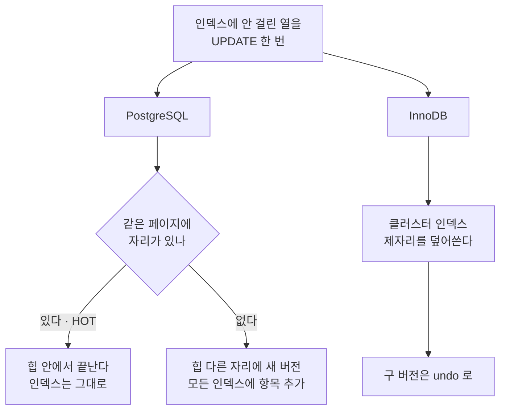
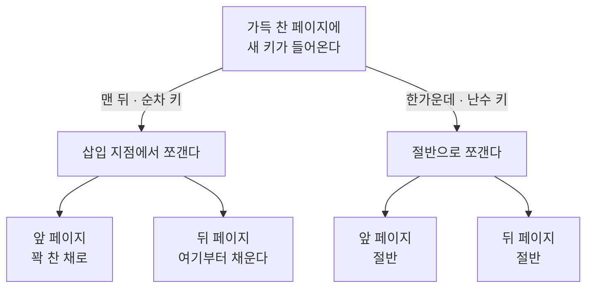

[섹션4,5: 데이터베이스 인덱싱과 B+트리](/study/database/section-4-indexing/)를 쓰면서
트리 모양까지는 잡혔는데 질문이 하나 남았다.

**InnoDB 는 테이블 자체가 B+트리다.** PostgreSQL 은 힙이 따로 있고 인덱스는 전부 그 위치를
가리키는데, InnoDB 는 PK 인덱스의 리프가 곧 행이다. 그러면 쓰기가 쌓일수록 인덱스 본체가
직접 망가질 테고, PostgreSQL 은 인덱스만 다시 만들면 되지만 InnoDB 는 테이블을 통째로 다시
만들어야 하니 **더 자주 신경 써야 하는 것 아닌가** 싶었다.

**재 보니 반대였다. 한 축만 빼고.** 갱신과 삭제가 만든 빈 공간은 InnoDB 가 스스로 되돌린다.
대신 난수 PK(UUIDv4 같은)로 흐트러진 것만은 **스스로 못 고치고**, 고치는 비용이
PostgreSQL 보다 크다.

아래 수치는 전부 PostgreSQL 17 과 MySQL 8.4 컨테이너에서 직접 받은 것이다.

## 공부 내용 — 구 버전을 어디에 두느냐

둘 다 <abbr title="Multi-Version Concurrency Control. 행을 덮어쓰는 대신 여러 버전을 두고, 읽는 쪽에 맞는 버전을 골라 주는 방식.">MVCC</abbr> 인데
**덮어쓰기 전 내용을 두는 자리**가 다르다. 아래 모든 차이가 이 하나에서 나온다.

| | PostgreSQL | InnoDB |
| --- | --- | --- |
| UPDATE 가 하는 일 | 새 버전을 다른 자리에 추가한다 | 제자리를 덮어쓴다 |
| 구 버전이 가는 곳 | 힙에 그대로 남는다 | <abbr title="undo log. 덮어쓰기 전의 내용을 모아 두는 별도 저장 공간. 롤백과 과거 버전 재구성에 쓰인다.">undo 로그</abbr> |
| 인덱스 리프가 든 것 | 값 + 힙 위치(ctid) | 값 + PK (보조 인덱스) |



PostgreSQL 은 [모든 인덱스가 힙 위치를 직접 들고 있어서](/study/database/section-3-internals/#모든-인덱스가-보조-인덱스다 "PostgreSQL 에는 클러스터 인덱스가 없다. PK 인덱스를 포함한 모든 인덱스가 값과 ctid 만 들고 있다")
행이 새 자리로 가면 인덱스도 따라가야 한다. 이걸 피하는 장치가 <abbr title="Heap Only Tuple.">HOT</abbr> 이고, HOT 이 걸리려면
같은 페이지에 자리가 남아 있어야 해서 <abbr title="페이지를 처음 채울 때 남겨 둘 여유 공간 비율. 100 이면 꽉 채운다.">`fillfactor`</abbr> 를 낮춰 둔다.

InnoDB 는 행이 제자리에 있으니 따라갈 일이 없고, 보조 인덱스는 애초에 위치가 아니라 PK 를
들고 있어서 행이 움직여도 상관없다. **HOT 이 하려던 일을 구조가 이미 하고 있는 셈이다.**
그래서 InnoDB 에는 HOT 에 해당하는 장치도 `fillfactor` 에 해당하는 손잡이도 없다.

## 심화 — 갱신·삭제·삽입이 각각 남기는 것

### PostgreSQL 은 HOT 을 걸어도 인덱스가 부푼다

정말 `fillfactor` 로 막히는지 재 봤다. 20만 행에서 **인덱스에 안 걸린 열만** 다섯 번 전면
갱신하고, 갱신 한 번마다 VACUUM 을 돌렸다.

| fillfactor | | 힙 페이지 | 인덱스 페이지 | 리프 밀도 | HOT 비율 |
| --- | --- | --- | --- | --- | --- |
| 100 (기본) | 적재 직후 | 2,062 | 551 | 90.0% | |
| 100 (기본) | 5회 갱신 후 | 4,124 | **1,099** | 45.2% | 0.0% |
| 70 | 적재 직후 | 2,986 | 551 | 90.0% | |
| 70 | 5회 갱신 후 | 5,554 | **1,099** | 45.7% | 79.5% |

`fillfactor` 를 70 으로 낮추니 HOT 비율이 0% 에서 79.5% 로 올라갔다. 그런데 **인덱스는 양쪽 다
551 → 1,099 페이지로 똑같이 두 배가 됐다.**

HOT 을 79.5% 나 걸었는데 왜 같은 자리에서 끝났나. 남은 20.5% 를 세어 보면 답이 나온다.

```text
갱신 100만 건 × 비HOT 20.5% = 205,000 건
원래 인덱스 항목                200,000 개
```

**비HOT 갱신만으로 원래 항목 수와 맞먹는 항목이 새로 들어왔다.** 리프를 한 번 쪼개기에 충분한
양이고, 한 번 쪼개진 뒤에는 갱신마다 VACUUM 이 죽은 항목을 걷어 가므로 더 늘지도 줄지도 않는다.
양쪽이 같은 종착점에 멈춘 이유가 이것이다.

힙은 오히려 `fillfactor` 70 쪽이 더 크다 — 처음부터 30% 를 비워 두고 시작했으니 당연하다.

HOT 이 쓸모없다는 말이 아니다. 전면 갱신은 HOT 에게 최악의 조건이고(한 페이지의 모든 행이
동시에 새 자리를 요구한다), 일부 행만 띄엄띄엄 갱신되는 실제 OLTP 는 이야기가 다르다.
요점은 결과가 아니라 **PostgreSQL 에는 이런 장치와 손잡이가 필요하다는 사실** 쪽에 있다.

### InnoDB 는 갱신 흔적을 안 남긴다

같은 조건으로 재 봤다. 20만 행, 인덱스에 안 걸린 열만 다섯 번 전면 갱신,
<abbr title="purge. 더 이상 아무도 볼 필요가 없어진 구 버전과 삭제 표시된 레코드를 백그라운드에서 실제로 걷어 내는 InnoDB 의 작업.">purge</abbr> 완료 후.

| | 클러스터 인덱스 | 보조 인덱스 | 채움률 | 파일 |
| --- | --- | --- | --- | --- |
| 5회 갱신 후 | 955 페이지 | 218 페이지 | 92.1% / 95.3% | 27.0 MB |
| 한 번도 안 건드림 | 955 페이지 | 218 페이지 | 92.1% / 95.3% | 27.0 MB |

페이지 수도 채움률도 파일 크기까지 같다. 갱신이 흔적을 안 남겼다.

> undo 가 공짜인지도 확인해 봤다. 읽기 뷰를 붙잡은 트랜잭션을 열어 둔 채 — 즉 purge 가 아무것도
> 못 걷어 가는 상태로 — 같은 갱신을 돌렸는데 트리는 한 바이트도 안 늘었다(27.0 MB 그대로).
> 고정폭 비인덱스 열 갱신이라 undo 가 전부 받아냈다. 삭제가 섞이거나 가변폭 열이면 달라질 수
> 있는데 그건 재 보지 않았다.

### 삭제로 비워진 페이지는 알아서 합친다

50만 행 중 90% 를 흩뿌려 지우고, **같은 5만 행을 처음부터 적재한 테이블**과 나란히 놓았다.

| | 페이지 | 밀도 |
| --- | --- | --- |
| PostgreSQL · 삭제 + VACUUM | **1,374** | 9.3% |
| PostgreSQL · REINDEX 후 | 139 | 89.8% |
| InnoDB · 삭제 + purge | 239 | 92.0% |
| InnoDB · 새로 적재 | 240 | 91.7% |

PostgreSQL 은 페이지가 한 장도 안 줄었다. VACUUM 이 죽은 항목을 걷어 가긴 하지만, nbtree 는
**완전히 빈** 페이지만 트리에서 떼어 내고 반쯤 빈 페이지는 그대로 매달아 둔다.

InnoDB 는 새로 적재한 것과 한 장 차이로 같아졌다. 채움률이
<abbr title="MERGE_THRESHOLD. InnoDB 인덱스 페이지의 병합 기준선. 기본값 50(%)이고, 삭제·갱신으로 채움률이 이 밑으로 떨어지면 형제 페이지와 합치기를 시도한다.">병합 기준선</abbr>
밑으로 떨어지면 형제 페이지와 합쳐지기 때문이다. 병합 카운터를 페이지 감소량과 맞춰 보면
정확히 떨어진다.

```text
클러스터 인덱스   2,387 →  239 페이지   =  2,148 장 사라짐
보조 인덱스         541 →   55 페이지   =    486 장 사라짐
                                          ───────
                                            2,634 장

index_page_merge_successful                 2,634 번
```

사라진 페이지 수와 병합 성공 횟수가 한 장도 안 틀린다.

**이 차이가 읽기 비용으로 그대로 나온다.** 아래는 PostgreSQL 안에서의 비교다. 같은 5만 건을
인덱스로 읽게 강제했다.

| PostgreSQL 인덱스 상태 | 읽은 페이지 |
| --- | --- |
| 90% 삭제 후 (밀도 9.3%) | 1,370 |
| `REINDEX` 후 (밀도 89.8%) | 139 |

10배다. "인덱스가 커지면 캐시 히트가 떨어진다"는 말이 가리키는 게 이 수치다.

여기서 한 발 더 나가 "그러면 부푼 인덱스는 실행 계획까지 바꾸겠네"라고 생각했는데,
그건 틀렸다. 무엇이 계획을 바꾸는지는
[상관도](#상관도--인덱스가-부풀면-비트맵-스캔을-타는가 "인덱스 키 순서와 힙에 놓인 물리 순서가 얼마나 일치하는지")에 따로 적었다.

### 그런데 삽입으로 쪼개진 페이지는 못 합친다

여기서 뒤집힌다. 같은 `BINARY(16)` PK 로 50만 행을 넣되 **순서만** 다르게 했다.

| PK | 클러스터 인덱스 페이지 | 채움률 | 파일 |
| --- | --- | --- | --- |
| 오름차순 | 2,520 | 92.2% | 48 MB |
| 난수 (MD5) | 3,563 | **65.3%** | **72 MB** |

같은 데이터인데 파일이 1.5배다. 그리고 순차 쪽 92.2% 가 눈에 띈다 — 페이지를 절반씩 나눠
쪼갰다면 50% 근처에 머물러야 한다. **오른쪽 끝에 순차로 들어올 때는 삽입 지점에서 쪼개
앞쪽 페이지를 꽉 찬 채로 남긴다**는 뜻이다.



순차 키는 쪼개고 나서도 앞쪽 페이지가 그대로 꽉 차 있다. 난수 키는 쪼갤 때마다
**두 장 모두 절반짜리가 된다.** 채움률 92.2% 와 65.3% 의 차이가 여기서 나온다.

**[앞 절의 병합](#삭제로-비워진-페이지는-알아서-합친다)은 이걸 못 고친다.** 이유가 두 겹이다.

- **65.3% 는 병합 기준선(50%) 위다.** 애초에 병합 대상이 아니다
- **병합은 삭제·갱신으로 채움률이 떨어질 때 걸린다.** 삽입으로 쪼개진 페이지를 돌아다니며
  다시 합쳐 주는 동작은 없다

그래서 PK 를 UUIDv4 로 잡으면 안 된다. 순서가 보장되는 UUIDv7 이나 MySQL 의
`UUID_TO_BIN(값, 1)` 을 쓴다.

> 이걸 재다 한 번 헛다리를 짚었다. 난수 키를 처음에 `UUID_TO_BIN(UUID())` 로 만들었는데
> 순차 쪽과 차이가 안 났다. `UUID()` 는 v1 이고 스왑 없이 넣으면 앞자리가 `time_low` 인데,
> 짧은 적재 구간에서는 이 값이 단조 증가한다. 난수가 아니라 사실상 순차였던 것이다.

### 고쳐 놔도 쓰기가 계속되면 돌아온다

그러면 `OPTIMIZE TABLE` 로 고치면 되지 않나. 고쳐 놓고 난수 키를 더 넣어 봤다.

| | 행 수 | 페이지 | 채움률 | 파일 |
| --- | --- | --- | --- | --- |
| 난수 PK 로 적재 | 50만 | 3,556 | 65.2% | 72 MB |
| `OPTIMIZE TABLE` 후 | 50만 | 2,516 | **92.2%** | 52 MB |
| 난수 키 20만 건 더 삽입 | 70만 | 5,184 | **62.8%** | **104 MB** |

행은 1.4배 늘었는데 페이지는 2.06배, 파일은 2배가 됐다. **한 번 고쳐도 쓰기가 계속되면 바로
원래대로 돌아간다.** 이 축은 명령으로 관리하는 게 아니라 **PK 설계로 끝내야 하는 문제**다.

`OPTIMIZE TABLE` 이 실제로 무슨 일을 하는지는 MySQL 이 직접 말해 준다.

```text
Table does not support optimize, doing recreate + analyze instead
```

InnoDB 에서 이건 **테이블 전체를 다시 만드는 일**이다. 클러스터 인덱스도 보조 인덱스도 전부.
PostgreSQL 의 `REINDEX` 가 문제 있는 인덱스 하나만 골라 다시 만드는 것과 단위가 다르다.

### 파일은 어느 쪽도 저절로 줄지 않는다

한 가지 헷갈리기 쉬운 것. InnoDB 가 페이지를 합쳐도 **`.ibd` 파일은 안 줄어든다.**
[삭제 실험](#삭제로-비워진-페이지는-알아서-합친다)에서 파일은 56MB 그대로였다. 비워진 페이지는 테이블스페이스의 free list 로 들어가
**재사용**된다 — 45만 건을 다시 넣어 보니 56MB → 68MB 로, 필요분 대부분이 재사용됐다.

그래서 **삭제로 비워진 경우에 한해** InnoDB 는 파일만 크고 트리는 조밀한 상태가 된다.
스캔 비용도 트리 높이도 멀쩡하다. PostgreSQL 은 같은 상황에서 **읽어야 할 페이지 수 자체가**
늘어난다. 이름은 둘 다 "단편화"지만 아픈 곳이 다르다.

난수 PK 쪽은 이 위안이 없다. 트리 자체가 성글어진 것이라 스캔 비용이 그대로 늘어난다.

## 보충 개념

### 상관도 — 인덱스가 부풀면 비트맵 스캔을 타는가

"인덱스가 부풀면 인덱스 스캔을 못 타고 비트맵 스캔으로 떨어진다"고 알고 있었다.
재 보니 아니었다.

<abbr title="physical correlation. 인덱스 키 순서와 힙에 놓인 물리 순서가 얼마나 일치하는지. 1 이면 같은 순서, 0 에 가까우면 뒤섞여 있다.">상관도</abbr>와
인덱스 밀도를 따로따로 되돌려 보면 갈린다.

| 조치 | 상관도 | 리프 밀도 | 실행 계획 |
| --- | --- | --- | --- |
| 무작위 갱신 후 | 0.14 | 45.2% | Bitmap Heap Scan |
| `REINDEX` — 인덱스만 복구 | 0.14 | **90.0%** | Bitmap Heap Scan |
| `CLUSTER` — 힙 순서만 복구 | **1.0** | 90.0% | Index Scan |

밀도를 새 인덱스와 같게 되돌려도 계획은 안 바뀌고, 힙 순서를 되돌리니 바뀐다. 비트맵 스캔은
**힙을 랜덤하게 짚어야 하는가**의 문제지 인덱스가 성긴 것과는 별개다.

인덱스 팽창이 계획에 영향을 아예 안 주는 건 아니다. 너무 커지면 플래너가 인덱스를 통째로 버리고
Seq Scan 을 고른다. 다만 그건 "인덱스가 비싸졌다"는 판단이라 비트맵 스캔과는 다른 이야기다.

**InnoDB 에는 이 축 자체가 없다.** 리프가 곧 행이라 PK 순서와 물리 순서가 항상 같다.

## 정리

| 물음 | 답 |
| --- | --- |
| 갱신이 인덱스를 부풀리나 | PostgreSQL 은 부푼다. InnoDB 는 구 버전이 undo 로 빠져 흔적이 안 남는다 |
| HOT 으로 막히나 | 줄기는 하지만 막히지는 않는다. 비HOT 20.5% 만으로 리프가 한 번 쪼개졌다 |
| 반쯤 빈 페이지는 누가 치우나 | PostgreSQL 은 안 치운다. InnoDB 는 기준선 밑이면 형제와 합친다 |
| 그럼 InnoDB 는 손 안 대도 되나 | 갱신·삭제는 그렇다. **난수 PK 만은 스스로 못 고친다** |
| 난수 PK 는 어떻게 되돌리나 | `OPTIMIZE TABLE` = 테이블 전체 재생성. 그나마도 쓰기가 계속되면 돌아온다 |
| 파일 크기는 줄어드나 | 어느 쪽도 저절로는 안 준다. 비워진 페이지를 재사용할 뿐이다 |

정리하면 **InnoDB 의 인덱스 유지보수는 "주기적으로 무엇을 돌린다"가 아니라 "PK 를 순차로 잡는다"는
설계 결정 하나로 끝난다.** 그 결정을 틀렸을 때 회복 수단이 PostgreSQL 보다 비싸다는 게 대가다.

| | PostgreSQL | InnoDB |
| --- | --- | --- |
| 구 버전이 사는 곳 | 힙 + 모든 인덱스 | undo 로그 |
| 인덱스에 안 걸린 열 UPDATE | 인덱스도 같이 부푼다 | 흔적이 안 남는다 |
| 반쯤 빈 페이지 | 트리에 그대로 남는다 | 기준선 밑이면 병합한다 |
| 갱신·삭제 후 되돌리는 명령 | `REINDEX CONCURRENTLY` | 필요 없다 |
| 난수 PK 로 성글어진 트리 | 해당 없음 (힙이 따로다) | `OPTIMIZE TABLE` = 테이블 재생성 |
| 되돌리는 단위 | 인덱스 하나 | 테이블 전체 |
| 평소에 돌리는 손잡이 | `fillfactor`, HOT, autovacuum | PK 를 순차로 |
| 진짜 약점 | 갱신·삭제로 인한 팽창 | 난수 PK 삽입 |

## 참고

- [Fundamentals of Database Engineering](https://www.udemy.com/course/database-engineering-korean/) — Hussein Nasser
- [README.HOT](https://github.com/postgres/postgres/blob/master/src/backend/access/heap/README.HOT) — HOT 이 걸리는 조건과 걸릴 때 인덱스를 왜 안 건드리는지
- [Routine Reindexing](https://www.postgresql.org/docs/current/routine-reindex.html) — 반쯤 빈 페이지가 회수되지 않는다는 것이 여기 적혀 있다
- [InnoDB Multi-Versioning](https://dev.mysql.com/doc/refman/8.4/en/innodb-multi-versioning.html) — 구 버전이 undo 로 가고 purge 가 걷어 가는 구조
- [Clustered and Secondary Indexes](https://dev.mysql.com/doc/refman/8.4/en/innodb-index-types.html) — 보조 인덱스가 PK 를 들고 있는 이유
- [Configuring the Merge Threshold for Index Pages](https://dev.mysql.com/doc/refman/8.4/en/index-page-merge-threshold.html) — `MERGE_THRESHOLD` 기본값 50%
- [OPTIMIZE TABLE](https://dev.mysql.com/doc/refman/8.4/en/optimize-table.html) — InnoDB 에서는 재생성으로 처리된다
