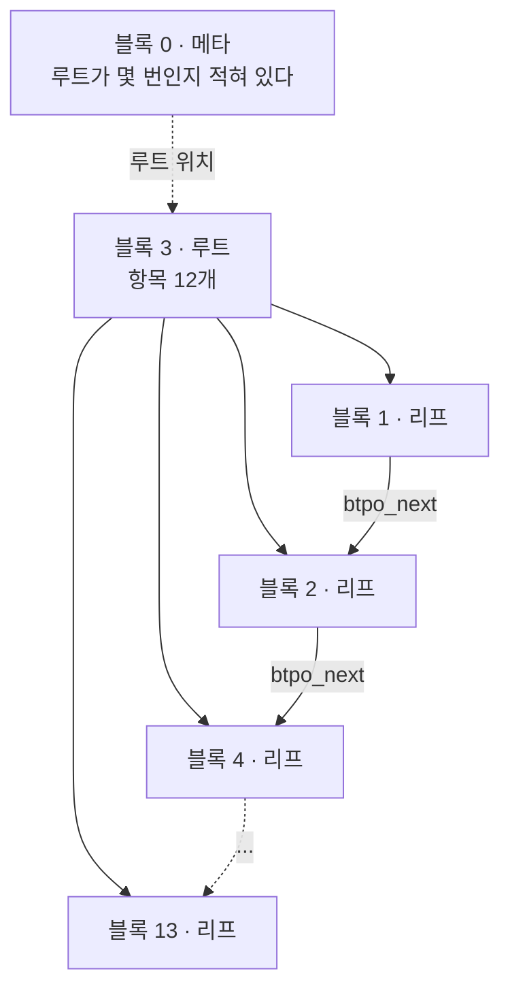

[섹션4 정리 글](/study/database/section-4-indexing/)을 쓰면서 가장 안 믿겼던 것은
"인덱스 안에 값이 통째로 복사돼 들어 있다" 와 "non-key column 은 내부 페이지에서 잘려 나간다"
두 문장이었다. 둘 다 <abbr title="PostgreSQL 기본 제공 확장. 페이지 안의 바이트를 그대로 읽어서 보여 준다. 운영 DB 에서 켤 일은 거의 없고, 구조를 확인할 때 쓴다.">pageinspect</abbr> 로 페이지를 직접 열면 눈으로 확인된다.

세 부분으로 나눴다. **1부**는 인덱스가 파일 안에서 어떻게 생겼는지,
**2부**는 `key column` 과 `non-key column` 이 어디서 갈리는지,
**3부**는 중복 제거와 플래너의 선택이다. 1부를 건너뛰면 2부의 덤프가 안 읽힌다.

아래 출력은 전부 PostgreSQL 17 컨테이너에서 직접 받은 것이다.
난수를 쓰지 않아서 그대로 따라 하면 같은 값이 나온다.

## 준비

```bash
docker run --name pglab -e POSTGRES_PASSWORD=pw -d postgres:17
docker exec -it pglab psql -U postgres
```

```sql
create extension pageinspect;

-- big : 크기와 트리 높이용 (b 는 64자)
create table big(id bigint, a int, b text);
insert into big select g, (g % 1000000)::int, md5(g::text) || md5((g+1)::text)
from generate_series(1, 2000000) g;
create index big_a   on big(a);
create index big_ab  on big(a, b);          -- b 가 key column
create index big_inc on big(a) include (b); -- b 가 non-key column

-- mini : 루트 페이지를 통째로 보기용 (b 는 10자)
create table mini(a int, b text);
insert into mini select (g / 3)::int, 'name-' || lpad(g::text, 5, '0')
from generate_series(1, 3000) g;
create index mini_ab  on mini(a, b);
create index mini_inc on mini(a) include (b);

-- dup : 중복 제거용 (값 1000가지, 값당 2000행)
create table dup(a int);
insert into dup select g % 1000 from generate_series(1, 2000000) g;
create index dup_on  on dup(a) with (deduplicate_items = on);
create index dup_off on dup(a) with (deduplicate_items = off);

vacuum analyze big, mini, dup;
```

## 1부 — 인덱스는 파일 안에서 어떻게 생겼나

### 인덱스는 테이블과 다른 파일이다

**확인할 내용** — 루트·내부·리프 페이지가 힙 안에 있는 게 아니라는 것.

**쿼리**

```sql
select c.relname, c.relkind, pg_relation_filepath(c.oid) as filepath,
       c.relpages, pg_size_pretty(pg_relation_size(c.oid)) as size
from pg_class c where c.relname in ('big','big_a','big_ab','big_inc')
order by c.relkind desc, c.relname;
```

**결과**

```text
 relname | relkind |   filepath   | relpages |  size
---------+---------+--------------+----------+--------
 big     | r       | base/5/16429 |    26667 | 208 MB
 big_a   | i       | base/5/16434 |     4947 | 39 MB
 big_ab  | i       | base/5/16435 |    23204 | 181 MB
 big_inc | i       | base/5/16436 |    23088 | 180 MB
```

`relfilenode` 가 넷 다 다르다. 테이블 하나와 인덱스 셋이 각각 자기 파일을 갖는다.

### 1GB 를 넘기면 파일이 쪼개진다

**확인할 내용** — `pg_relation_filepath` 가 알려주는 건 파일이 아니라 **접두사**라는 것.

**쿼리**

```sql
create table wide(id int, pad text);
insert into wide select g, repeat('x', 500) from generate_series(1, 2300000) g;
vacuum analyze wide;
checkpoint;

select pg_relation_filepath('wide') as filepath,
       pg_size_pretty(pg_relation_size('wide')) as size,
       pg_relation_size('wide') / 8192 as blocks;
```

```bash
ls -l /var/lib/postgresql/data/base/5/16473*
```

**결과**

```text
   filepath   |  size   | blocks
--------------+---------+--------
 base/5/16473 | 1198 MB | 153334

base/5/16473           1,073,741,824 bytes   ← 정확히 1GB
base/5/16473.1           182,370,304 bytes   ← 넘친 만큼
base/5/16473_fsm             327,680 bytes   ← 빈 공간 지도 (다른 포크)
base/5/16473_vm               40,960 bytes   ← 가시성 맵 (다른 포크)
```

1GB ÷ 8KB = **131,072** 로 딱 떨어진다. 그래서 페이지가 두 파일에 걸쳐 잘리는 일이
구조적으로 생기지 않는다.

### 블록 번호는 (파일, 오프셋)으로 정확히 번역된다

**확인할 내용** — 페이지가 논리 단위가 아니라 파일 안의 연속된 8,192바이트라는 것.

**쿼리** — PostgreSQL 이 읽은 페이지와 파일에서 `dd` 로 꺼낸 8KB 의 해시를 비교한다.

```sql
select md5(get_raw_page('wide', 131072));
```

```bash
dd if=/var/lib/postgresql/data/base/5/16473.1 bs=8192 skip=0 count=1 status=none | md5sum
```

**결과**

```text
블록번호 | PostgreSQL 이 읽은 페이지        | 파일에서 직접 꺼낸 바이트         | 일치
---------+----------------------------------+----------------------------------+------
       5 | 8180798f8a32cafa156b61a7637d846e | 8180798f8a32cafa156b61a7637d846e | O   16473   의 5번째 8KB
  131071 | 70dc262629b665a37df2cd5b916304a0 | 70dc262629b665a37df2cd5b916304a0 | O   16473   의 마지막 8KB
  131072 | 3d1bc853bbadd94a220756cc0273e168 | 3d1bc853bbadd94a220756cc0273e168 | O   16473.1 의 0번째 8KB
  131073 | fd277abd2f9c5f976fc5ed7830c7fffd | fd277abd2f9c5f976fc5ed7830c7fffd | O   16473.1 의 1번째 8KB
```

```text
파일 번호      = 블록번호 ÷ 131072
파일 안 오프셋 = (블록번호 % 131072) × 8192
```

### 인덱스 파일 안에는 페이지 종류가 있다

**확인할 내용** — 힙 페이지에는 없는 구분(메타·루트·내부·리프)이 인덱스 파일에는 있다는 것.

**쿼리**

```sql
select blkno, type, live_items, btpo_prev, btpo_next
from bt_multi_page_stats('mini_ab', 1, 13);
```

**결과** (0번은 메타 페이지라 이 함수가 거부한다)

```text
 blkno | type | live_items | btpo_prev | btpo_next
-------+------+------------+-----------+-----------
     1 | l    |        262 |         0 |         2
     2 | l    |        262 |         1 |         4
     3 | r    |         12 |         0 |         0     ← 루트가 3번이다
     4 | l    |        262 |         2 |         5
     5 | l    |        262 |         4 |         6
   ...
    13 | l    |        129 |        12 |         0
```



리프끼리는 `btpo_prev` / `btpo_next` 로 좌우가 이어져 있다.

### 루트는 0번이 아니고 자라면서 옮겨 다닌다

**확인할 내용** — 루트가 한 장뿐이고, 넘치면 쪼개지는 게 아니라 위에 새로 생긴다는 것.

**쿼리**

```sql
create table grow(a int);
create index grow_a on grow(a);
create table growlog(행수 bigint, 루트블록 int, 레벨 int, 단수 int);

do $$
declare n bigint := 0; step bigint;
begin
  foreach step in array array[100, 900, 4000, 15000, 80000, 400000, 1500000, 3000000] loop
    insert into grow select generate_series(n+1, n+step);
    n := n + step;
    insert into growlog select n, (bt_metap('grow_a')).root, (bt_metap('grow_a')).level,
                                  (bt_metap('grow_a')).level + 1;
  end loop;
end $$;

select * from growlog;
```

**결과**

```text
  행수   | 루트블록 | 레벨 | 단수
---------+----------+------+------
     100 |        1 |    0 |    1     ← 루트가 곧 리프
    1000 |        3 |    1 |    2     ← 리프 분할 → 3번에 새 루트
    5000 |        3 |    1 |    2
   20000 |        3 |    1 |    2
  100000 |        3 |    1 |    2
  500000 |      412 |    2 |    3     ← 또 넘침 → 412번에 새 루트
 2000000 |      412 |    2 |    3
 5000000 |      412 |    2 |    3
```

루트가 `1 → 3 → 412` 로 옮겨 다닌다. 그래서 0번 메타 페이지에 "루트는 412번"이라고 적어 둔다.

### 페이지 안에서 lp 와 항목은 반대 방향으로 자란다

**확인할 내용** — 항목이 쌓인 순서는 삽입 순서이고, 정렬을 들고 있는 건 라인 포인터 배열이라는 것.

**쿼리** — `10, 20, 30` 을 넣고, 그다음 가운데에 끼어야 하는 `15` 를 넣는다.

```sql
create table slot(a int);
create index slot_a on slot(a);
insert into slot values (10),(20),(30);

select i.itemoffset,
       ((get_byte(p,24+(i.itemoffset-1)*4) | (get_byte(p,24+(i.itemoffset-1)*4+1)<<8)) & 32767)
         as "항목 물리주소"
from (select get_raw_page('slot_a',1) as p) g, bt_page_items('slot_a',1) i;

select lower, upper from page_header(get_raw_page('slot_a',1));
```

**결과**

```text
 lp 번호 | 항목 물리주소 | 키 값
       1 |          8160 |    10
       2 |          8144 |    20
       3 |          8128 |    30        ← 주소가 줄어든다 (뒤에서 앞으로 쌓인다)

 lp 배열 끝(lower) = 36    항목 시작(upper) = 8128
```

**쿼리**

```sql
insert into slot values (15);
```

**결과**

```text
 lp 번호 | 항목 물리주소 | 키 값
       1 |          8160 |    10
       2 |          8112 |    15        ← 가장 최근 = 가장 작은 주소
       3 |          8144 |    20
       4 |          8128 |    30

 lp 배열 끝(lower) = 40    항목 시작(upper) = 8112
```

`15` 는 물리적으로 맨 앞(8112)인데 lp 번호는 2번이다. **기존 항목은 하나도 안 움직였고**,
lp 배열에서 4바이트짜리 두 칸만 밀려났다. 정렬을 유지하면서 삽입을 싸게 만드는 배치다.

### high key 와 형제 링크가 스캔의 끝을 정한다

**확인할 내용** — 같은 값이 여러 페이지에 걸쳐 있어도 찾아다닐 필요가 없다는 것.

**쿼리**

```sql
create or replace function av(d text) returns int language sql immutable as $$
  select case when d is null or length(d) < 11 then null
    else ('x'||substr(replace(substr(d,1,11),' ',''),7,2)||substr(replace(substr(d,1,11),' ',''),5,2)
            ||substr(replace(substr(d,1,11),' ',''),3,2)||substr(replace(substr(d,1,11),' ',''),1,2))::bit(32)::int
  end $$;

select p.blkno,
       (select av(data) from bt_page_items('dup_on', p.blkno) where itemoffset = 1) as "high key",
       (select min(av(data)) from bt_page_items('dup_on', p.blkno) where itemoffset > 1) as "담긴 값 최소",
       (select max(av(data)) from bt_page_items('dup_on', p.blkno) where itemoffset > 1) as "담긴 값 최대",
       p.btpo_next as "다음 리프"
from bt_multi_page_stats('dup_on', 1, 6) p where p.type = 'l';
```

**결과**

```text
 blkno | high key | 담긴 값 최소 | 담긴 값 최대 | 다음 리프
-------+----------+--------------+--------------+-----------
     1 |        0 |            0 |            0 |         2
     2 |        1 |            0 |            1 |         4
     4 |        1 |            1 |            1 |         5
     5 |        2 |            1 |            2 |         6
     6 |        2 |            2 |            2 |         7
```

`a=0` 은 리프 1·2번에, `a=1` 은 2·4·5번에 걸쳐 있다. 실제로 읽는 페이지 수가 이와 맞는다.

**쿼리**

```sql
explain (analyze, buffers, costs off, timing off) select count(*) from dup where a = 0;
explain (analyze, buffers, costs off, timing off) select count(*) from dup where a = 1;
```

**결과**

```text
 a = 0  →  Buffers: shared hit=5      (메타1 + 루트1 + 내부1 + 리프 2장)
 a = 1  →  Buffers: shared hit=6      (메타1 + 루트1 + 내부1 + 리프 3장)
```

> high key 가 `0` 인데 2번 페이지에도 `0` 이 있는 건, 실제 경계가 `(0, 힙TID)` 이기 때문이다.
> PostgreSQL 은 힙 TID 를 마지막 키 열처럼 취급해 모든 키를 유일하게 만든다.

## 2부 — key column 과 non-key column 은 어디서 갈리나

### 리프 항목에는 값의 복사본이 있다

**확인할 내용** — 인덱스가 포인터만 들고 있는 게 아니라는 것.

**쿼리**

```sql
select itemoffset, ctid, itemlen, left(data, 44) as data
from bt_page_items('mini_ab', 1) limit 5;
```

**결과**

```text
 itemoffset | ctid  | itemlen |                     data
------------+-------+---------+----------------------------------------------
          1 | (1,2) |      24 | 57 00 00 00 17 6e 61 6d 65 2d 30 30 32 36 32
          2 | (0,1) |      24 | 00 00 00 00 17 6e 61 6d 65 2d 30 30 30 30 31
          3 | (0,2) |      24 | 00 00 00 00 17 6e 61 6d 65 2d 30 30 30 30 32
          4 | (0,3) |      24 | 01 00 00 00 17 6e 61 6d 65 2d 30 30 30 30 33
          5 | (0,4) |      24 | 01 00 00 00 17 6e 61 6d 65 2d 30 30 30 30 34
```

`data` 를 읽으면 이렇다.

```text
00 00 00 00    →  int4 0                       a 값
17             →  varlena 짧은 헤더 (길이 11)
6e 61 6d 65 2d →  'n' 'a' 'm' 'e' '-'           b 값 시작
30 30 30 30 31 →  '0' '0' '0' '0' '1'
```

`b` 문자열이 인덱스 페이지 안에 그대로 들어 있다. 탐색을 하려면 값을 비교해야 하니
당연한 구조인데, 인덱스를 "포인터 목록"으로 알고 있으면 이 자리에서 막힌다.

1번 항목만 `ctid` 가 튀는데, 이건 실제 항목이 아니라 1부에서 본 <abbr title="이 페이지에 들어올 수 있는 값의 상한. 실제 행이 아니라 페이지 경계를 나타내는 표식이다.">high key</abbr> 다.

### 두 인덱스의 리프는 바이트까지 같다

**확인할 내용** — `key column` 으로 넣든 `non-key column` 으로 넣든 리프는 동일하다는 것.

**쿼리**

```sql
select itemoffset, ctid, itemlen, left(data, 44) as data
from bt_page_items('mini_inc', 1) limit 5;
```

**결과**

```text
 itemoffset |   ctid   | itemlen |                     data
------------+----------+---------+----------------------------------------------
          1 | (1,4097) |      24 | 57 00 00 00 00 00 00 00
          2 | (0,1)    |      24 | 00 00 00 00 17 6e 61 6d 65 2d 30 30 30 30 31
          3 | (0,2)    |      24 | 00 00 00 00 17 6e 61 6d 65 2d 30 30 30 30 32
          4 | (0,3)    |      24 | 01 00 00 00 17 6e 61 6d 65 2d 30 30 30 30 33
          5 | (0,4)    |      24 | 01 00 00 00 17 6e 61 6d 65 2d 30 30 30 30 34
```

2번 줄부터는 앞의 `mini_ab` 와 **한 바이트도 다르지 않다.**
다른 것은 1번 줄(high key)뿐이다 — 거기서는 이미 `b` 가 잘려 있다.

### 내부 페이지에서 non-key column 은 사라진다

**확인할 내용** — 정리 글의 핵심 주장.

**쿼리**

```sql
select itemoffset, ctid, itemlen, left(data, 44) as data from bt_page_items('mini_ab', 3) limit 4;
select itemoffset, ctid, itemlen, left(data, 44) as data from bt_page_items('mini_inc', 3) limit 4;
```

**결과**

```text
-- mini_ab : (a, b) 복합키의 루트 페이지
 itemoffset | ctid  | itemlen |                     data
------------+-------+---------+----------------------------------------------
          1 | (1,0) |       8 |
          2 | (2,2) |      24 | 57 00 00 00 17 6e 61 6d 65 2d 30 30 32 36 32
          3 | (4,2) |      24 | ae 00 00 00 17 6e 61 6d 65 2d 30 30 35 32 33
          4 | (5,2) |      24 | 05 01 00 00 17 6e 61 6d 65 2d 30 30 37 38 34

-- mini_inc : (a) INCLUDE (b) 의 루트 페이지
 itemoffset |   ctid   | itemlen |          data
------------+----------+---------+-------------------------
          1 | (1,0)    |       8 |
          2 | (2,4097) |      24 | 57 00 00 00 00 00 00 00
          3 | (4,4097) |      24 | ae 00 00 00 00 00 00 00
          4 | (5,4097) |      24 | 05 01 00 00 00 00 00 00
```

`a` 경계값(`57 00 00 00` = 87, `ae 00 00 00` = 174)은 양쪽에 똑같이 있는데
`name-00262` 가 아래쪽에는 없다. 여기서 `ctid` 는 힙 주소가 아니라 **내려갈 자식 블록 번호**다.

1번 항목이 길이 8에 내용이 비어 있는 건 맨 왼쪽 다운링크(minus infinity)다.
하한이 없으므로 키를 저장하지 않는다.

> `b` 가 10자로 짧아서 두 인덱스 모두 24바이트로 같게 나왔다.
> 크기 차이는 `b` 가 길어져야 벌어진다 — 다음 절의 `big` 에서 확인한다.

### 팬아웃과 트리 높이

**확인할 내용** — 잘라낸 바이트가 팬아웃을 거쳐 트리 높이로 이어지는지.

**쿼리**

```sql
select 'big_ab' as idx, type, count(*) as pages, round(avg(live_items)) as items_per_page,
       round(avg(avg_item_size)) as item_bytes
from bt_multi_page_stats('big_ab', 1, -1) group by type
union all
select 'big_inc', type, count(*), round(avg(live_items)), round(avg(avg_item_size))
from bt_multi_page_stats('big_inc', 1, -1) group by type order by 1, 2;

select c.relname, pg_size_pretty(pg_relation_size(c.oid)) as size,
       (bt_metap(c.relname)).level as tree_level
from pg_class c where c.relname in ('big_a','big_ab','big_inc') order by 1;
```

**결과**

```text
   idx   | type | pages | items_per_page | item_bytes
---------+------+-------+----------------+------------
 big_ab  | r    |     1 |              4 |         62
 big_ab  | i    |   213 |            110 |         48
 big_ab  | l    | 22989 |             88 |         80
 big_inc | r    |     1 |             97 |         19
 big_inc | i    |    97 |            238 |         19
 big_inc | l    | 22989 |             88 |         79

 relname |  size  | tree_level
---------+--------+------------
 big_a   | 39 MB  |          2
 big_ab  | 181 MB |          3
 big_inc | 180 MB |          2
```

**리프는 22,989장으로 똑같다.** 갈리는 건 내부 항목 크기(48B vs 19B)와 그로 인한
<abbr title="fan-out. 내부 페이지 하나가 거느리는 자식 페이지 수. 8KB ÷ 항목 크기로 정해진다.">팬아웃</abbr>(110 vs 238)이고, 그 결과가 트리 높이다. `level` 은 루트의 층 번호이고 리프가 0이므로
`level 3` 은 4단, `level 2` 는 3단이다.

```text
(a, b)            22,989 ÷ 110 = 209장 필요 → 루트 한 장(110개)에 안 들어감 → 4단
(a) INCLUDE (b)   22,989 ÷ 238 =  97장 필요 → 루트 한 장(238개)에 들어감  → 3단
```

실측 내부 페이지가 213장과 97장, 루트 항목이 4개와 97개다. 계산과 맞는다.

### 조회 한 번에 읽는 페이지 수

**확인할 내용** — 층수 차이가 실제 I/O 로 나타나는지.

**쿼리**

```sql
begin; drop index big_a, big_ab;
explain (analyze, buffers, costs off, timing off) select a, b from big where a = 777777;
rollback;

begin; drop index big_a, big_inc;
explain (analyze, buffers, costs off, timing off) select a, b from big where a = 777777;
rollback;
```

인덱스를 지우고 `rollback` 하면 원래대로 돌아온다. PostgreSQL 은 DDL 도 트랜잭션 안에서
되돌릴 수 있어서, <abbr title="쿼리를 어떤 방법으로 실행할지 고르는 옵티마이저. 통계를 보고 비용을 추정해 계획을 만든다.">플래너</abbr>에게 선택지를 하나만 주고 싶을 때 쓰기 좋다.

**결과**

```text
 Index Only Scan using big_inc on big     ← 3단
   Heap Fetches: 0
   Buffers: shared hit=2 read=2           (4장)

 Index Only Scan using big_ab on big      ← 4단
   Heap Fetches: 0
   Buffers: shared hit=1 read=4           (5장)
```

메타 페이지 1장에 트리 높이를 더한 수다.

### 그 열로는 트리를 내려갈 수 없다

**확인할 내용** — `non-key column` 은 조건에 써도 탐색에 쓰이지 않고 리프에서 걸러진다는 것.

**쿼리**

```sql
begin; drop index big_a, big_ab;
explain (analyze, costs off, timing off) select id from big
 where a = 12345 and b = (select b from big where id = 12345);
rollback;
```

**결과**

```text
-- (a) INCLUDE (b)
 Index Scan using big_inc on big (actual rows=1 loops=1)
   Index Cond: (a = 12345)
   Filter: (b = (InitPlan 1).col1)
   Rows Removed by Filter: 1

-- (a, b)
 Index Scan using big_ab on big (actual rows=1 loops=1)
   Index Cond: ((a = 12345) AND (b = (InitPlan 1).col1))
```

`Index Cond` 에 들어가면 트리 탐색에 쓰인 것이고, `Filter` 로 빠지면 이미 도착한 리프에서
하나씩 비교한 것이다. `Rows Removed by Filter: 1` 이 그 증거다.

### 정렬에 쓸 수 없다

**쿼리**

```sql
begin; drop index big_a, big_ab;
explain (costs off) select a, b from big order by a, b limit 10;
rollback;
```

**결과**

```text
-- (a) INCLUDE (b)              -- (a, b)
 Limit                           Limit
   ->  Incremental Sort            ->  Index Only Scan using big_ab on big
         Sort Key: a, b
         Presorted Key: a
         ->  Index Only Scan using big_inc on big
```

`Presorted Key: a` 가 "a 까지는 정렬돼 있다" 는 뜻이다. `b` 는 다시 맞춰야 한다.

### UNIQUE 는 key column 에만 걸린다

**확인할 내용** — 이건 `non-key column` 이 더 할 수 있는 일이다.

**쿼리**

```sql
create table u(id int, b text);
insert into u values (1, 'x'), (1, 'y');

create unique index u_ab  on u(id, b);
create unique index u_inc on u(id) include (b);
```

**결과**

```text
CREATE INDEX
ERROR:  could not create unique index "u_inc"
DETAIL:  Key (id)=(1) is duplicated.
```

`(id, b)` 복합 유니크는 `b` 만 다르면 같은 `id` 를 통과시킨다.
`(id) INCLUDE (b)` 는 `id` 만 보고 막는다.

## 3부 — 중복 제거와 플래너의 선택

### 중복 제거만 켜고 끄면

**확인할 내용** — 크기 차이가 어디서 나오는지. 키도 데이터도 같고 옵션만 다른 두 인덱스다.

**쿼리**

```sql
select c.relname, pg_size_pretty(pg_relation_size(c.oid)) as size,
       (bt_metap(c.relname)).level as tree_level
from pg_class c where c.relname in ('dup_on','dup_off') order by 1;

select 'dup_on' as idx, count(*) as leaf_pages, sum(live_items) as leaf_items,
       round(avg(avg_item_size)) as item_bytes
from bt_multi_page_stats('dup_on', 1, -1) where type='l'
union all
select 'dup_off', count(*), sum(live_items), round(avg(avg_item_size))
from bt_multi_page_stats('dup_off', 1, -1) where type='l' order by 1;
```

**결과**

```text
 relname | size  | tree_level
---------+-------+------------
 dup_off | 43 MB |          2
 dup_on  | 14 MB |          2      ← 트리 높이는 같다

   idx   | leaf_pages | leaf_items | item_bytes
---------+------------+------------+------------
 dup_off |       5465 |    2005464 |         16
 dup_on  |       1778 |      17777 |        691
```

**항목 수가 답이다.** 끄면 행 수만큼(200만) 생기고, 켜면 17,777개로 준다.

### 항목 하나가 TID 를 여러 개 들고 있다

**확인할 내용** — 중복 제거된 항목이 "첫 행"이 아니라 "전부"를 가리킨다는 것.

**쿼리**

```sql
select itemoffset, itemlen, coalesce(array_length(tids,1),1) as tid개수, tids[1:3] as 앞_세_개
from bt_page_items('dup_on', 1) limit 4;
```

**결과**

```text
 itemoffset | itemlen | tid개수 |                앞_세_개
------------+---------+---------+-----------------------------------------
          1 |      24 |       1 |
          2 |     808 |     132 | {"(4,96)","(8,192)","(13,62)"}
          3 |     808 |     132 | {"(588,112)","(592,208)","(597,78)"}
          4 |     808 |     132 | {"(1172,128)","(1176,224)","(1181,94)"}
```

항목 하나가 힙 TID 를 132개 들고 있다. 그리고 그 TID 들이 힙 블록 4·8·13 으로 흩어져 있다 —
**힙은 정렬돼 있지 않으므로 첫 행만 가리켜서는 나머지를 찾을 방법이 없다.** 그래서 전부 적는다.

항목이 132개에서 끊기는 건 개수 제한이 아니라 크기 제한이다.
소스에 <abbr title="posting list. 같은 키 값을 가진 행들의 힙 TID 를 하나의 인덱스 항목 안에 이어 붙인 목록.">posting list</abbr> 상한이 **페이지의 1/6** 으로 박혀 있고, 이유는 "나중에 이 페이지를
가를 자리를 남겨두려고" 다.

### 훑을 때만 갈린다

**확인할 내용** — 중복 제거가 점 조회 I/O 를 줄여 주지는 않는다는 것.

**쿼리**

```sql
begin; drop index dup_off;
explain (analyze, buffers, costs off, timing off) select count(*) from dup where a = 500;
explain (analyze, buffers, costs off, timing off) select a from dup where a = 500 limit 1;
rollback;
```

**결과**

```text
한 값(2,000행) 전부 훑기      점 조회 (LIMIT 1)
  dup_on  : 6장                 dup_on  : 4장
  dup_off : 9장                 dup_off : 4장   ← 같다
```

점 조회는 트리 높이가 같으니 똑같다. **갈리는 건 훑기 시작할 때**이고,
읽을 리프 페이지 수가 1,778장 대 5,465장이라 훑는 양에 비례해 벌어진다.

### 중복이 많으면 플래너가 인덱스를 버린다

**확인할 내용** — "중복이 많으면 풀스캔이 낫다"가 어디서부터 참인지.

**쿼리**

```sql
create table c5(a int, pad text);
insert into c5 select g % 5, repeat('x',60) from generate_series(1,2000000) g;
create index on c5(a);
vacuum analyze c5;

set enable_seqscan=off; set enable_bitmapscan=off;   -- 일반 Index Scan 만
explain select pad from c5 where a = 0;
set enable_seqscan=off; set enable_indexscan=off;    -- Bitmap 만
explain select pad from c5 where a = 0;
set enable_indexscan=off; set enable_bitmapscan=off; -- Seq 만
explain select pad from c5 where a = 0;
```

**결과** (값 가짓수를 5000 / 50 / 5 / 2 / 1 로 바꿔가며 같은 측정을 반복했다)

```text
값 가짓수 | 한 값의 비율 | 일반 Index Scan | Bitmap Heap Scan | Seq Scan | 실제 선택
----------+--------------+-----------------+------------------+----------+------------------
    5,000 |      0.020%  |       1,587     |       1,439      |  36,148  | Bitmap Heap Scan
       50 |      2.000%  |      86,407     |      26,728      |  39,889  | Bitmap Heap Scan
        5 |     20.000%  |     103,155     |      33,941      |  49,692  | Bitmap Heap Scan
        2 |     50.000%  |      98,711     |      48,337      |  49,692  | Bitmap Heap Scan
        1 |    100.000%  |      66,475     |      71,972      |  49,692  | Seq Scan
```

**일반 `Index Scan` 만 놓고 보면 2% 만 돼도 풀스캔이 두 배 싸다.** 그런데 그 사이를
<abbr title="인덱스에서 TID 를 전부 모아 블록 번호순으로 정렬한 뒤 힙을 한 번씩만 읽는 실행 방식. 랜덤 I/O 를 순차 I/O 로 바꾼다.">Bitmap Heap Scan</abbr> 이 메운다 — TID 를 전부 모아 블록 번호순으로 정렬한 뒤 힙을 앞에서
뒤로 한 번씩만 읽어서 랜덤 I/O 를 순차 I/O 로 바꾼다. 그래서 실제 전환은 거의 100% 에서다.

## 정리 — 무엇을 확인했나

| 정리 글의 주장 | 확인 방법 | 결과 |
| --- | --- | --- |
| 인덱스는 테이블과 다른 파일이다 | `pg_relation_filepath` | 넷 다 다른 `relfilenode` |
| 릴레이션 하나가 1GB 마다 쪼개진다 | `ls` + `dd` 해시 비교 | `16473`, `16473.1`, 바이트 일치 |
| 페이지가 파일에 걸치지 않는다 | 1GB ÷ 8KB | 131,072 로 딱 떨어짐 |
| 인덱스 파일에도 페이지 종류가 있다 | `bt_multi_page_stats` | 메타·루트·리프가 한 파일 안에 |
| 루트는 0번이 아니고 옮겨 다닌다 | 행을 늘리며 `bt_metap` | `1 → 3 → 412` |
| lp 는 정렬, 항목은 삽입 순서 | 원시 페이지에서 lp 오프셋 파싱 | `15` 가 물리 8112 / lp 2번 |
| 스캔의 끝은 high key 와 형제 링크 | high key 표 + `Buffers` | 리프 2장·3장과 정확히 일치 |
| 인덱스 리프에 값의 복사본이 있다 | `bt_page_items` 의 `data` | `6e 61 6d 65 2d` = `name-` |
| 리프는 두 인덱스가 같다 | 바이트 비교 | high key 말고는 동일 |
| 내부 페이지에서 비키 열은 잘린다 | 루트 페이지 비교 | `b` 가 한쪽에만 있음 |
| 잘린 만큼 팬아웃이 커진다 | `avg_item_size`, `live_items` | 48B/110개 → 19B/238개 |
| 그래서 트리가 한 층 얕아진다 | `bt_metap` 의 `level` | 3 → 2 (4단 → 3단) |
| 그만큼 읽는 페이지가 준다 | `explain (buffers)` | 5장 → 4장 |
| 비키 열로는 탐색·정렬을 못 한다 | `explain` | `Filter`, `Incremental Sort` |
| UNIQUE 는 키 열에만 걸린다 | 중복 `id` 에 유니크 생성 | 복합키는 통과, `INCLUDE` 는 거부 |
| `INCLUDE` 는 중복 제거를 못 쓴다 | `deduplicate_items` 켜고 끄기 | 14MB/1,778장 vs 43MB/5,465장 |
| 중복 제거는 점 조회를 안 줄인다 | `LIMIT 1` 과 전체 훑기 비교 | 4장 = 4장 / 6장 vs 9장 |
| 중복이 아주 많으면 풀스캔 | 카디널리티별 비용 비교 | 100% 에서 `Seq Scan` 전환 |

## 정리하기

```bash
docker rm -f pglab
```

## 참고

- [섹션4: 데이터베이스 인덱싱](/study/database/section-4-indexing/) — 이 실습의 정리 글
- [섹션3 실습: 페이지 안을 직접 열어보기](/study/database/section-3-internals-lab/) — 힙 쪽 페이지 구조
- [pageinspect](https://www.postgresql.org/docs/current/pageinspect.html) — PostgreSQL 공식 문서
- [nbtree README](https://github.com/postgres/postgres/blob/master/src/backend/access/nbtree/README) — 피벗 튜플, 접미 절단, 힙 TID 타이브레이커
- [B-Tree Deduplication](https://www.postgresql.org/docs/current/btree.html#BTREE-DEDUPLICATION) — `deduplicate_items` 와 `INCLUDE` 의 관계
