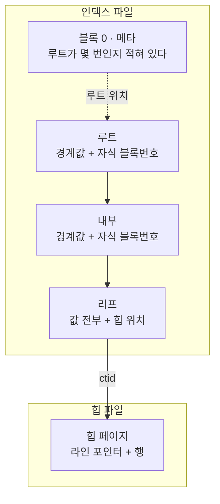
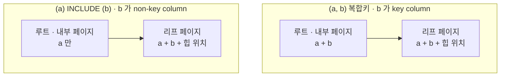

이 섹션에서 제일 오래 막힌 건 인덱스의 쓰임새가 아니라 **인덱스가 디스크에서 어떻게
생겼는가**였다. 페이지가 파일 어디에 있는지, 리프에 무엇이 들어 있는지가 안 잡힌 채로
"열을 `key column` 으로 넣을지 `non-key column` 으로 넣을지" 같은 이야기를 들으니
한 줄도 안 남았다. 그래서 구조부터 세우고 그 위에 강의 내용을 얹는다.

특히 두 가지를 잘못 알고 있었다.

- **인덱스는 힙의 위치만 들고 있는 게 아니다.** 정렬된 값의 복사본과 힙 위치가 한 쌍으로
  저장된다. 비교할 값이 없으면 애초에 트리를 타고 내려갈 수가 없다.
  이걸 모르니 "값을 인덱스에 올린다"는 말 자체가 이해되지 않았다.
- **`key column` 과 `non-key column` 의 차이는 유일성(UNIQUE) 여부가 아니라, 그 값이
  내부 페이지까지 올라가느냐다.** `non-key column` 으로 넣어서 얻는 것은 크기가 아니라
  **높이**다. 200만 행에서 4단이 3단이 됐고, 조회 한 번에 읽는 페이지가 5장에서 4장으로 줄었다.

**공부 내용**은 강의가 알려준 것, **심화**는 거기서 파고든 것,
**보충 개념**은 그걸 이해하려다 걸린 DB 일반 용어다.
구조는 셋 중 어디에도 안 들어가서 맨 앞에 따로 뒀다 — 이게 없으면 나머지가 안 읽힌다.

아래 수치와 출력은 전부 PostgreSQL 17 컨테이너에서 직접 받은 것이다.
재현 과정은 [실습 글](/study/database/section-4-indexing-lab/)로 따로 뺐다.

## 인덱스는 디스크에서 어떻게 생겼나

### 릴레이션 하나가 파일 여러 개다

테이블도 파일, 인덱스도 파일이다. 서로 **다른 파일**이다.

```text
 relname | relkind |   filepath   | relpages |  size
---------+---------+--------------+----------+--------
 big     | r       | base/5/16429 |    26667 | 208 MB    ← 힙 파일
 big_ab  | i       | base/5/16435 |    23204 | 181 MB    ← 인덱스 파일
```

그리고 파일 하나가 릴레이션 하나인 것도 아니다. **1GB 마다 잘린다.**
자세한 건 [세그먼트와 포크](#세그먼트와-포크--릴레이션-하나에-파일이-여럿인-이유)에 뺐고,
여기서 중요한 건 **블록 번호가 논리 주소**라는 점이다.

```text
【논리】 릴레이션
             │  1GB 마다 파일을 자른다
             ▼
【파일】 16435        16435.1        16435_fsm
             │  파일을 8,192 바이트씩 자른다
             │  1GB ÷ 8KB = 131,072 로 딱 떨어져 페이지가 파일에 걸치지 않는다
             ▼
【블록】  0   1   2  …  131,071 │ 131,072  …
          └───── 16435 ────────┘ └── 16435.1 ──
```

위층(인덱스, `ctid`, 실행 계획)은 릴레이션 전체를 **0번부터 이어지는 하나의 블록 배열**로만
본다. 파일 경계는 저장 계층이 알아서 처리한다.

### 페이지 안에서는 양쪽에서 자란다

페이지 하나(8KB) 안은 이렇게 생겼다. **라인 포인터 배열은 앞에서 뒤로, 항목은 뒤에서 앞으로**
자라고 가운데가 빈 공간이다.

`10, 20, 30` 을 차례로 넣고 그다음 `15` 를 넣은 인덱스 페이지를 실제로 찍으면 이렇다.

```text
 lp 번호 | 항목 물리주소 | 키 값
       1 |          8160 |    10
       2 |          8112 |    15     ← 가장 최근에 넣은 것이 주소가 가장 작다
       3 |          8144 |    20
       4 |          8128 |    30
```

```text
          페이지 (주소 0이 위, 8192가 아래)
   0 ┌──────────────────────────────┐
     │ 헤더                          │
  24 ├──────────────────────────────┤
     │ lp1→8160  lp2→8112           │  ↓ 앞에서 뒤로 자란다
     │ lp3→8144  lp4→8128           │    순서 = 키 정렬 순서
  40 ├──────────────────────────────┤ lower
     │          빈 공간              │
8112 ├──────────────────────────────┤ upper
     │ [15]  ← 최근                  │  ↑ 뒤에서 앞으로 자란다
8128 │ [30]                         │    순서 = 삽입 순서
8144 │ [20]                         │
8160 │ [10]  ← 오래됨                │
8192 └──────────────────────────────┘
```

**여기가 핵심이다.** `15` 는 물리적으로 맨 앞(8112)에 있는데 lp 번호는 2번이다.
항목이 쌓인 순서는 **삽입 순서**이고, lp 배열이 들고 있는 순서는 **키 순서**다.
둘은 아무 관계가 없다.

그래서 `15` 를 넣을 때 PostgreSQL 은 **기존 항목을 하나도 옮기지 않는다.**
빈 공간 맨 앞에 쓰고, lp 배열에서 4바이트짜리 두 칸만 밀어 자리를 만든다.
정렬을 유지하면서 삽입을 싸게 만드는 게 이 배치의 목적이다.

### 인덱스 파일의 페이지는 역할이 나뉜다

힙 페이지는 전부 같은 역할이지만, 인덱스 페이지는 넷으로 나뉜다.

```text
   인덱스 파일                        힙 파일
   ┌──────────────────────┐          ┌──────────────┐
   │ 0     메타 (항상)     │          │ 0    데이터   │
   │ 1     리프           │          │ 1    데이터   │
   │ 2     리프           │          │ 2    데이터   │
   │ 3     내부           │          │ …            │
   │ …                    │          └──────────────┘
   │ 412   루트 (유동)     │          역할 구분이 없다
   └──────────────────────┘
```

**0번만 메타 페이지로 고정**이고, 나머지는 만들어진 순서대로 아무 번호나 받는다.
리프 다음에 내부가 오고 루트가 412번에 있는 게 정상이다.



### 트리는 루트가 넘칠 때 한 층 자란다

**루트는 언제나 정확히 한 장이다.** 8KB 를 넘기면 쪼개지는 게 아니라, 분할한 뒤
**그 위에 새 루트를 한 장 만든다.** 행을 늘려가며 추적하면 이렇게 보인다.

```text
  행수   | 루트블록 | 레벨 | 단수
---------+----------+------+------
     100 |        1 |    0 |    1     ← 루트가 곧 리프. 페이지 한 장이 전부
    1000 |        3 |    1 |    2     ← 리프가 분할 → 3번에 새 루트
  100000 |        3 |    1 |    2
  500000 |      412 |    2 |    3     ← 또 넘침 → 412번에 새 루트
 5000000 |      412 |    2 |    3
```

루트가 `1 → 3 → 412` 로 옮겨 다닌다. 그래서 메타 페이지가 필요하다 — 매번 루트를 찾아
헤맬 수 없으니 0번에 "루트는 412번"이라고 적어 둔다.

**이 글의 결론은 전부 이 한 문장에서 나온다.** 루트 한 장이 자식을 많이 거느릴수록
넘치는 시점이 늦게 오고, 트리가 낮게 유지된다.

### 스캔은 이진 탐색으로 시작해 오른쪽으로 간다

lp 배열이 키 순서로 정렬돼 있으니 **페이지 안에서는 이진 탐색**이다.
`a = 0` 을 찾으면 첫 위치를 곧장 잡고, 거기서부터 lp 번호를 `+1` 씩 올리며 읽는다.
같은 값은 반드시 연속해 있으므로 다른 값을 만나면 거기가 끝이다.

페이지를 다 읽었는데 아직 조건에 맞으면 **루트로 되돌아가지 않고 옆으로 간다.**
어디까지가 이 페이지인지는 **high key**(리프의 1번 항목)가, 다음이 어디인지는
**형제 링크**(페이지 헤더의 `btpo_next`)가 알려준다.

```text
 blkno | high key (상한) | 담긴 값 최소 | 담긴 값 최대 | 다음 리프
-------+-----------------+--------------+--------------+-----------
     1 |               0 |            0 |            0 |         2
     2 |               1 |            0 |            1 |         4
     4 |               1 |            1 |            1 |         5
     5 |               2 |            1 |            2 |         6
```

값 하나가 리프 여러 장에 걸쳐 있어도 "그 값이 또 어디 있나"를 찾아다닐 필요가 없다.
실제로 재 보면 `a=0` 은 5장(리프 2장), `a=1` 은 6장(리프 3장)을 읽는데 위 표와 정확히 맞는다.

## 공부 내용 — 열을 넣는 자리가 둘이다

### 용어를 먼저 맞춰 둔다

강의는 "식별자 / 비식별자"라고 불렀지만 **공식 용어는 영어뿐이다.**
PostgreSQL 문서는 `key column` 과 `non-key column` 이라고 쓰고, 한국어 문서는
이 절이 번역돼 있지 않다. 한국어 표현이 쓰인 곳은 SQL Server 문서 정도인데
거기서는 "키 열 / 키가 아닌 열"이다. 이 글은 헷갈리지 않게 **원어를 그대로 쓴다.**

| 이 글 | PostgreSQL 공식 | SQL Server 한국어 문서 | 강의 |
| --- | --- | --- | --- |
| `key column` | key column | 키 열 | 식별자 |
| `non-key column` | non-key column | 키가 아닌 열 | 비식별자 |

데이터 모델링에는 **식별관계 / 비식별관계**라는 전혀 다른 용어가 이미 있다.
부모 테이블의 키가 자식 테이블의 PK 에 포함되느냐를 가리키는 말이고, 인덱스와는 관계가 없다.
이름이 겹칠 뿐이다.

### key column 과 non-key column

```sql
CREATE INDEX big_ab  ON big(a, b);            -- b 도 key column
CREATE INDEX big_inc ON big(a) INCLUDE (b);   -- b 는 non-key column
```

두 인덱스는 **같은 열 두 개를 담고 있지만 할 수 있는 일이 다르다.**

| | `key column` | `non-key column` |
| --- | --- | --- |
| 트리를 타고 내려갈 때 쓰인다 | O | X |
| 정렬 순서를 만든다 | O | X |
| 힙에 안 가고 값을 돌려준다 | O | O |
| UNIQUE 의 대상이 된다 | O | X |
| 내부 페이지에 올라간다 | O | X |
| <abbr title="같은 키 값을 가진 항목을 하나로 묶고 힙 위치 목록만 이어 붙여 저장하는 최적화. PostgreSQL 13 부터 B-tree 기본 동작이다.">중복 제거</abbr>를 쓸 수 있다 | O | **X** |

강의의 결론인 "테이블이 클수록 `non-key column` 이 낫다"는 **다섯째 줄에서 나온다.**
나머지 줄은 그 대가다.

경계는 인덱스 정의에 숫자로 박혀 있다. `indnatts` 는 담고 있는 열 수,
`indnkeyatts` 는 그중 앞에서 몇 개까지가 `key column` 인지다.

```text
  index  | indnatts | indnkeyatts
---------+----------+-------------
 big_a   |        1 |           1
 big_ab  |        2 |           2
 big_inc |        2 |           1     ← 앞의 1개까지만 탐색에 쓴다
```

## 심화 — 왜 테이블이 클수록 non-key column 인가

### 인덱스가 값을 저장하는 이유는 두 개다

여기서 막혔던 이유가 이거였다. 인덱스가 값을 들고 있는 이유를 하나로만 알고 있으면
`non-key column` 은 앞뒤가 맞지 않는다. 이유는 둘이다.

| 이유 | 무엇을 위해 | 그래서 필요한 곳 |
| --- | --- | --- |
| 비교하려고 | 어느 자식으로 내려갈지 정하려고 | 내부 페이지 + 리프 |
| 힙에 안 가려고 | 결과 값을 그 자리에서 돌려주려고 | 리프만 |

`key column` 은 둘 다 해당돼서 위아래 전부 올라간다. **`non-key column` 은 두 번째만
해당되는 열이다** — 비교에는 안 쓰는데 값은 들고 있는다.



### 리프는 똑같고 내부 페이지만 다르다

3000행짜리 작은 테이블은 트리가 2단이라 루트 페이지를 통째로 찍어 볼 수 있다.
`b` 는 `name-00001` 같은 10글자 문자열이다.

`(a, b)` 복합키의 루트 페이지다. `6e 61 6d 65 2d` 가 `name-` 이다.

```text
 itemoffset |  ctid  | itemlen |                     data
------------+--------+---------+----------------------------------------------
          1 | (1,0)  |       8 |
          2 | (2,2)  |      24 | 57 00 00 00 17 6e 61 6d 65 2d 30 30 32 36 32
          3 | (4,2)  |      24 | ae 00 00 00 17 6e 61 6d 65 2d 30 30 35 32 33
```

`(a) INCLUDE (b)` 의 루트 페이지는 같은 자리에서 `b` 가 사라져 있다.

```text
 itemoffset |   ctid    | itemlen |          data
------------+-----------+---------+-------------------------
          1 | (1,0)     |       8 |
          2 | (2,4097)  |      24 | 57 00 00 00 00 00 00 00
          3 | (4,4097)  |      24 | ae 00 00 00 00 00 00 00
```

반면 **리프 페이지는 두 인덱스가 바이트까지 같다.**

```text
 itemoffset | ctid  | itemlen |                     data
------------+-------+---------+----------------------------------------------
          2 | (0,1) |      24 | 00 00 00 00 17 6e 61 6d 65 2d 30 30 30 30 31
          3 | (0,2) |      24 | 00 00 00 00 17 6e 61 6d 65 2d 30 30 30 30 32
```

1번 항목이 `(1,0)` 에 길이 8이고 내용이 비어 있는 건 [minus infinity](#피벗-튜플--내부-페이지-항목은-데이터가-아니다 "맨 왼쪽 자식으로 가는 다운링크. 하한이 없으므로 키를 저장하지 않는다") 다.

### non-key column 은 예외 없이 잘린다

내부 페이지 항목은 경계값이고, 경계값이 되려면 **정렬 기준이어야 한다.**
`(a, b)` 에서 `b` 는 두 번째 정렬 기준이므로 자격이 있다.
`(a) INCLUDE (b)` 에서 `b` 는 정렬과 무관하므로 자격이 없다.

그래서 PostgreSQL 은 내부 페이지로 올라가는 항목에서 필요 없는 뒤쪽 열을 잘라낸다
(<abbr title="suffix truncation. 내부 페이지의 경계값에서, 자식 페이지를 구분하는 데 필요 없는 뒤쪽 열을 떼어 내는 최적화.">접미 절단</abbr>).
차이는 **조건부냐 무조건이냐**다.

- 복합키의 `b` — `a` 에 중복이 있으면 `b` 가 있어야 페이지가 구분되므로 **살아남는 경우가 많다**
- `non-key column` 의 `b` — 구분에 쓸 수 없으므로 **항상 잘린다**

근거도 명시돼 있다. 내부 페이지 항목에 대해 공식 README 는 이렇게 말한다.

> The actual key stored in the item is irrelevant, and need not be stored at all.

### 트리가 한 층 얕아진다

200만 행(`b` 는 64자 텍스트, 테이블 208MB)에서 잰 값이다.

| 인덱스 | 내부 항목 크기 | 내부 페이지 하나에 담기는 항목 | 내부 페이지 | 리프 페이지 | 트리 |
| --- | --- | --- | --- | --- | --- |
| `(a, b)` | 48 B | 110개 | 213 | 22,989 | **4단** |
| `(a) INCLUDE (b)` | 19 B | 238개 | 97 | 22,989 | **3단** |

**리프 수는 똑같다.** 리프에 든 내용이 같으니 당연하다. 갈리는 건 그 22,989장을 몇 층으로
덮느냐이고, 그건 <abbr title="fan-out. 내부 페이지 하나가 거느리는 자식 페이지 수. 8KB ÷ 항목 크기로 정해진다.">팬아웃</abbr>이 정한다.

```text
(a, b)            팬아웃 110 · 22,989 ÷ 110 = 209장의 내부 페이지가 필요
                  209장은 루트 한 장(110개)에 안 들어간다 → 내부 층을 한 겹 더 → 4단

(a) INCLUDE (b)   팬아웃 238 · 22,989 ÷ 238 = 97장의 내부 페이지가 필요
                  97장은 루트 한 장(238개)에 들어간다 → 내부 층 한 겹으로 끝 → 3단
```

실측 내부 페이지가 213장과 97장, 루트에 든 항목이 4개와 97개다. 계산과 맞는다.
[계산 방법](#팬아웃으로-트리-높이-계산하기)은 따로 정리했다.

### 조회 한 번에 읽는 페이지가 한 장 준다

```text
 Index Only Scan using big_inc on big     ← 3단
   Buffers: shared hit=4

 Index Only Scan using big_ab on big      ← 4단
   Buffers: shared hit=2 read=3
```

4장과 5장이다. 메타 페이지 1장에 트리 높이를 더한 수이고, 다른 키로 반복해도 같았다.
행이 늘수록 팬아웃이 작은 쪽이 먼저 층을 하나 더 쌓으므로 이 격차는 벌어진다.

### 인덱스는 작아지지 않는다, 오히려 커질 수 있다

여기서 착각하기 쉽다. 같은 테이블에 인덱스 세 개를 만들어 재면 이렇다.

| 인덱스 | 크기 |
| --- | --- |
| `(a)` | 39 MB |
| `(a, b)` | 181 MB |
| `(a) INCLUDE (b)` | 180 MB |

`b` 를 끼워 넣는 순간 39MB 가 180MB 가 된다. 리프마다 64바이트 문자열을 복제하니
당연하고, **이건 `key column` 이든 `non-key column` 이든 똑같다.**

**다만 이 표는 데이터 모양이 바뀌면 뒤집힌다.** 공식 문서에 한 줄로 못 박혀 있다.

> `INCLUDE` indexes can never use deduplication.

`a` 1000가지 × `b` 50가지 = 5만 가지 조합이 200만 행에 반복되는 데이터로 다시 재면 이렇다.

| 인덱스 | 크기 | 리프 페이지 |
| --- | --- | --- |
| `(a, b)` | 14 MB | 1,786 |
| `(a) INCLUDE (b)` | 60 MB | 7,663 |

**4배 차이다.** `non-key column` 으로 넣어서 얻는 것은 크기가 아니라 높이이고,
크기는 데이터에 달렸으니 재 봐야 한다.

### 중복 제거가 실제로 줄이는 것

중복 제거를 **켜고 끄기만 한** 같은 인덱스 두 개로 격리하면 정체가 보인다.

```sql
CREATE INDEX idx_dedup   ON t(a) WITH (deduplicate_items = on);
CREATE INDEX idx_nodedup ON t(a) WITH (deduplicate_items = off);
```

```text
   인덱스     | 크기  | 리프 페이지 |   항목 수  | 항목 크기 | 트리
--------------+-------+------------+-----------+----------+------
 idx_dedup    | 14 MB |      1,778 |    17,777 |   691 B  | 3단
 idx_nodedup  | 43 MB |      5,465 | 2,005,464 |    16 B  | 3단
```

**항목 수가 답이다.** 중복 제거를 끄면 항목이 행 수만큼(200만) 생기고, 켜면 17,777개로 준다.
항목 하나가 힙 TID 를 112개씩 목록으로 들고 있기 때문이다.

```text
중복 제거 X    [a=0|TID][a=0|TID][a=0|TID] … 2,000번    ← 'a=0' 을 2,000번 적는다
중복 제거 O    [a=0|TID 112개][a=0|TID 112개] … 18번    ← 'a=0' 을 18번만 적는다
```

행 하나를 저장하는 원가로 따지면 이렇다.

```text
중복 제거 X : 항목 16B + lp 4B                    = 20.00 B / 행
중복 제거 O : (항목 691B + lp 4B) ÷ 112.5행       =  6.18 B / 행
                                         비율 3.24 배
실측 리프 페이지 5,465 ÷ 1,778 = 3.07 배
```

세 가지를 헷갈리지 않는 게 중요하다.

- **트리 높이는 안 바뀐다.** 둘 다 3단이다. 중복 제거는 리프 수를 줄이지 팬아웃을 키우지 않는다
- **탐색 방식도 안 바뀐다.** 이진 탐색 후 오른쪽으로 가는 건 같다
- **점 조회 I/O 도 같다.** 갈리는 건 훑을 때다 — 한 값(2,000행)을 다 읽으면 6장 대 9장이다

그리고 중복 제거는 **삽입할 때마다 하는 게 아니다.**

```c
/* If the target page cannot fit newitem, try to avoid splitting the
 * page on insert by performing deletion or deduplication now */
if (PageGetFreeSpace(page) < insertstate->itemsz)
    _bt_delete_or_dedup_one_page(...);
```

페이지에 자리가 없을 때만 돈다. 목적이 "쓰기를 싸게"가 아니라 **페이지 분할을 미루는 것**이기
때문이다. 분할은 부모 내부 페이지까지 고쳐야 해서 위로 번진다.

### 그 열로는 찾아 내려갈 수 없다

`non-key column` 으로 넘긴 대가는 실행 계획에 그대로 드러난다.

```text
-- (a) INCLUDE (b)
 Index Scan using big_inc on big
   Index Cond: (a = 12345)
   Filter: (b = '827ccb...'::text)
   Rows Removed by Filter: 1

-- (a, b)
 Index Scan using big_ab on big
   Index Cond: ((a = 12345) AND (b = '827ccb...'::text))
```

`Index Cond` 에 들어가면 트리 탐색에 쓰인 것이고, `Filter` 로 빠지면 이미 도착한
리프에서 하나씩 비교한 것이다.

정렬도 마찬가지다. `order by a, b` 에 복합키는 정렬 없이 그대로 읽지만,
`non-key column` 쪽은 `a` 까지만 정렬돼 있어 나머지를 다시 맞춘다.

```text
-- (a) INCLUDE (b)              -- (a, b)
 Incremental Sort                Index Only Scan using big_ab on big
   Sort Key: a, b
   Presorted Key: a
```

### UNIQUE 는 key column 에만 걸린다

이건 오히려 `non-key column` 이 **더 할 수 있는** 일이다. 같은 `id` 두 행이 있는 테이블에
두 종류의 유니크 인덱스를 만들어 보면 갈린다.

```sql
insert into u values (1, 'x'), (1, 'y');

create unique index u_ab  on u(id, b);          -- 만들어진다
create unique index u_inc on u(id) include (b); -- 실패한다
```

```text
ERROR:  could not create unique index "u_inc"
DETAIL:  Key (id)=(1) is duplicated.
```

`(id, b)` 복합 유니크는 `b` 만 다르면 같은 `id` 를 허용한다.
**"`id` 는 유일해야 하는데 `b` 도 같이 읽고 싶다"** 는 복합키로 표현할 수 없다.

### 그래서 언제 무엇을 쓰나

판단 기준은 하나다. **그 열을 조건이나 정렬에 쓰는가, 결과로 읽기만 하는가.**

| 그 열을 | 어떻게 넣나 |
| --- | --- |
| `WHERE` 조건이나 `ORDER BY` 에 쓴다 | `key column` |
| 결과로 읽기만 한다 | `non-key column` |
| 유일성은 앞 열에만 걸고 싶다 | `non-key column` (복합키로는 불가능) |
| 같은 값이 크게 반복된다 | 크기를 재 보고 정한다 (복합키가 훨씬 작을 수 있다) |
| 쓰지 않는다 | 인덱스에 넣지 않는다 |

읽기만 하는 열이라면 `non-key column` 이 맞고, **테이블이 클수록 더 맞다.**
`INCLUDE` 는 PostgreSQL 11+ 와 SQL Server 의 문법이다.
MySQL InnoDB 에는 없어서 복합키로만 가능하다.

## 실습 — 직접 확인해보기

위의 바이트 덤프와 수치는 전부 재현할 수 있다.
[섹션4 실습: 인덱스 페이지 안을 직접 열어보기](/study/database/section-4-indexing-lab/)
에서 컨테이너 하나로 처음부터 따라가며 확인한다.

## 보충 개념 — 주제와는 별개로 몰라서 막혔던 것들

### 세그먼트와 포크 — 릴레이션 하나에 파일이 여럿인 이유

1.2GB 짜리 테이블을 만들면 파일이 이렇게 생긴다.

```text
base/5/16429           1,073,741,824 bytes   ← 정확히 1GB
base/5/16429.1           182,370,304 bytes   ← 넘친 만큼
base/5/16429_fsm             327,680 bytes   ← 빈 공간 지도 (다른 포크)
base/5/16429_vm               40,960 bytes   ← 가시성 맵 (다른 포크)
```

`pg_relation_filepath` 가 알려주는 건 **접두사**다. 1GB 마다 `.1`, `.2` 로 이어지고,
`_fsm` · `_vm` 은 같은 릴레이션의 다른 포크로 **자기만의 블록 번호 공간**을 갖는다.

```text
파일 번호      = 블록번호 ÷ 131072
파일 안 오프셋 = (블록번호 % 131072) × 8192 바이트
```

경계가 페이지 크기로 딱 떨어지므로 **페이지가 두 파일에 걸쳐 잘리는 일은 없다.**
실제로 `get_raw_page(…, 131072)` 와 `.1` 파일의 첫 8KB 는 바이트 단위로 같다.

### 피벗 튜플 — 내부 페이지 항목은 데이터가 아니다

내부 페이지의 항목을 <abbr title="pivot tuple. 내부 페이지에서 자식 페이지를 가르는 경계값 항목. 실제 행이 아니다.">피벗 튜플</abbr>이라고 부른다.
생김새는 리프 항목과 같지만 뜻이 다르다.

| | 6바이트 포인터가 가리키는 곳 | 값 부분에 든 것 |
| --- | --- | --- |
| 리프 항목 | 힙의 `(블록, 라인 포인터)` | 그 행의 인덱스 열 값 전부 |
| 피벗 튜플 | **같은 인덱스 파일의 자식 블록번호** | 자식 페이지를 가르는 경계값 |

> On a non-leaf page, the data items are down-links to child pages with bounding keys.
> The key in each data item is a **strict lower bound** for keys on that child page …
> The first data item on each such page has no lower bound — or lower bound of minus infinity.

각 페이지의 첫 항목인 **high key** 도 같은 성격이다. 실제 행이 아니라
"이 페이지에는 여기까지만 들어온다"는 표식이다.

그리고 키가 겹쳐도 모호함이 없다. PostgreSQL 은 **힙 TID 를 마지막 키 열처럼 취급**해서
모든 키를 유일하게 만든다.

> The requirement that all btree keys be unique is satisfied by treating heap TID as a
> tiebreaker attribute.

그래서 내려갈 때 비교는 `<` `=` `>` 세 갈래가 아니라 사실상 두 갈래다.

### 팬아웃으로 트리 높이 계산하기

필요한 건 **리프 페이지 수**와 **팬아웃** 둘뿐이다.

```text
단수 = ceil(log_팬아웃(리프 페이지 수)) + 1
```

지금까지 잰 네 인덱스에 전부 적용하면 이렇다.

```text
인덱스                     리프    팬아웃   계산   실측
(a, b)      · big        22,989     110      4     4   일치
(a) INCLUDE · big        22,989     238      3     3   일치
(a, b)      · d           1,778     163      3     3   일치
(a) INCLUDE · d           7,663     203      3     3   일치
```

팬아웃은 `live_items` 를 재는 게 정확하다. 바이트로 어림잡으려면 페이지가 꽉 차 있지 않다는
걸 감안해야 한다 — 위 네 인덱스 모두 내부 페이지가 67~70% 만 차 있었다.

### 커버링 인덱스와 Index Only Scan

필요한 열이 전부 인덱스 안에 있어서 힙에 갈 필요가 없는 인덱스를
<abbr title="covering index. 쿼리가 요구하는 열을 인덱스만으로 전부 채울 수 있는 인덱스.">커버링 인덱스</abbr>라고 부르고,
그때 나오는 실행 계획이 `Index Only Scan` 이다. `Heap Fetches: 0` 이 힙을 한 번도
안 갔다는 뜻이다.

이름과 달리 **완전히 공짜는 아니다.** 인덱스에는 그 행이 지금 보이는 버전인지가
적혀 있지 않아서, PostgreSQL 은 <abbr title="visibility map. 페이지 단위로 '이 페이지의 모든 행이 모두에게 보인다'를 표시해 둔 별도 포크. VACUUM 이 갱신한다.">가시성 맵</abbr>을 함께 본다.
맵에 표시가 없는 페이지의 행은 결국 힙을 확인해야 하고, 그 횟수가 `Heap Fetches` 에 잡힌다.

### 중복이 많으면 플래너가 인덱스를 버린다

중복이 아주 많은 열은 인덱스를 타 봐야 힙을 온통 헤집게 된다. 200만 행에서 값 가짓수를
바꿔가며 비용을 재면 전환점이 보인다.

```text
값 가짓수 | 한 값의 비율 | 일반 Index Scan | Bitmap Heap Scan | Seq Scan
----------+--------------+-----------------+------------------+----------
    5,000 |      0.020%  |       1,591     |       1,442      |  36,148
       50 |      2.000%  |      86,670     |      26,720      |  39,909
        5 |     20.000%  |     103,627     |      34,220      |  49,692
        2 |     50.000%  |      98,037     |      48,189      |  49,692
        1 |    100.000%  |          —      |      66,475      |  49,692  ← Seq 전환
```

**일반 `Index Scan` 만 놓고 보면 2% 만 돼도 풀스캔이 두 배 싸다.** 그런데 그 사이를
`Bitmap Heap Scan` 이 메운다 — 인덱스에서 TID 를 전부 모아 **블록 번호순으로 정렬한 뒤**
힙을 앞에서 뒤로 한 번씩만 읽는 방식이라, 랜덤 I/O 가 순차 I/O 가 된다.
그래서 실제 전환은 거의 100% 에서야 일어난다.

그리고 **힙이 아예 필요 없는 쿼리라면 20% 를 긁어도 인덱스가 이긴다.** 중복이 많은 열에
인덱스를 거는 주된 이유가 이것이다 — 커버링 인덱스이거나, 복합 인덱스의 뒤쪽 열이거나.

## 정리

| 물음 | 답 |
| --- | --- |
| 식별자와 비식별자의 차이가 유일성인가 | 아니다. 값이 내부 페이지까지 올라가느냐다 |
| 인덱스는 힙 위치만 들고 있나 | 아니다. 값의 복사본과 위치가 한 쌍이다 |
| `non-key column` 으로 넣으면 인덱스가 작아지나 | 아니다. 트리가 얕아질 뿐이고, 크기는 오히려 커질 수 있다 |
| `non-key column` 으로 무엇을 포기하나 | 그 열로 찾아 내려가기, 정렬, 유니크 대상, 중복 제거 |
| `non-key column` 으로 무엇을 얻나 | 팬아웃, 낮은 트리, 앞 열에만 거는 유니크 |

다음에 이 근처에서 막히면 순서는 이렇다. 먼저 **그 열을 조건·정렬에 쓰는지**를 본다.
쓴다면 `key column` 밖에 선택지가 없다. 읽기만 한다면 `indnkeyatts` 를 줄이는 쪽,
즉 `INCLUDE` 가 맞다. 그다음 `bt_metap` 으로 트리 높이를 재서 실제로 한 층 줄었는지
확인한다. 크기(`pg_relation_size`)로 판단하면 헛짚는다 — 데이터에 따라 같게도,
몇 배로 커지게도 나오기 때문이다.

## 참고

- [Fundamentals of Database Engineering](https://www.udemy.com/course/database-engineering-korean/) — Hussein Nasser
- [CREATE INDEX](https://www.postgresql.org/docs/current/sql-createindex.html) — PostgreSQL 공식 문서, `INCLUDE` 절
- [B-Tree Deduplication](https://www.postgresql.org/docs/current/btree.html#BTREE-DEDUPLICATION) — "INCLUDE indexes can never use deduplication"
- [nbtree README](https://github.com/postgres/postgres/blob/master/src/backend/access/nbtree/README) — 피벗 튜플, 접미 절단, 힙 TID 타이브레이커. 공식 문서가 아니라 여기에 있다
- [Index-Only Scans and Covering Indexes](https://www.postgresql.org/docs/current/indexes-index-only-scans.html) — 가시성 맵과의 관계
- [pageinspect](https://www.postgresql.org/docs/current/pageinspect.html) — `bt_metap`, `bt_page_items`, `heap_page_items`
- [포함된 열을 사용하여 인덱스 만들기](https://learn.microsoft.com/ko-kr/sql/relational-databases/indexes/create-indexes-with-included-columns) — SQL Server 한국어 문서. "키 열 / 키가 아닌 열" 표현이 쓰인 곳
