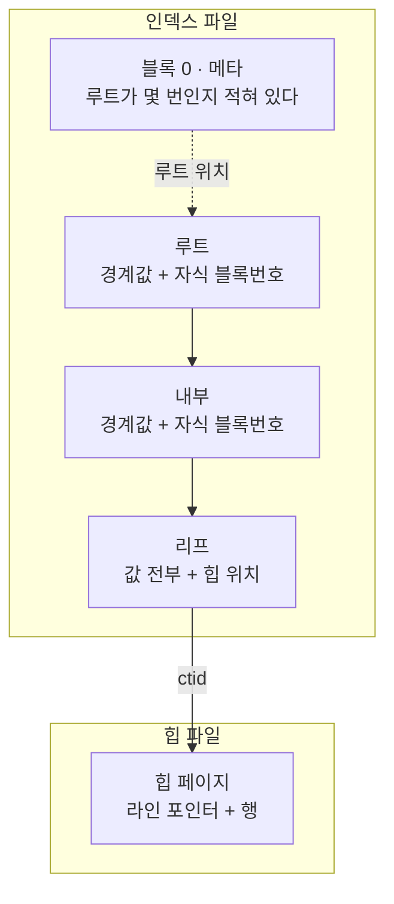

섹션4 를 들으면서 제일 오래 막힌 건 인덱스의 쓰임새가 아니라 **인덱스가 디스크에서
어떻게 생겼는가**였다. 페이지가 파일 어디에 있는지, 교과서에서 본 B+트리 그림이
그 페이지들과 어떻게 대응되는지가 안 잡히니 그 위에 무슨 이야기를 얹어도 안 남았다.

**이 글은 그 바닥을 깔아 두는 글이다.** 강의에서 배운 개별 주제는 이걸 전제로 따로 쓴다.

- [섹션4: key column 과 non-key column](/study/database/section-4-key-vs-nonkey/) — 열을 어느 자리에 넣느냐가 왜 트리 높이를 바꾸는가

잘못 알고 있던 것 하나를 먼저 적어 둔다. **인덱스는 힙의 위치만 들고 있는 게 아니다.**
정렬된 값의 복사본과 힙 위치가 한 쌍으로 저장된다. 비교할 값이 없으면 애초에 트리를
타고 내려갈 수가 없다.

아래 수치와 출력은 전부 PostgreSQL 17 컨테이너에서 직접 받은 것이다.
재현 과정은 [실습 글](/study/database/section-4-indexing-lab/)로 따로 뺐다.

## 파일과 페이지
### 릴레이션 하나가 파일 여러 개다

테이블도 파일, 인덱스도 파일이다. 서로 **다른 파일**이다.

```text
 relname | relkind |   filepath   | relpages |  size
---------+---------+--------------+----------+--------
 big     | r       | base/5/16429 |    26667 | 208 MB    ← 힙 파일
 big_ab  | i       | base/5/16435 |    23204 | 181 MB    ← 인덱스 파일
```

그리고 파일 하나가 릴레이션 하나인 것도 아니다. **1GB 마다 잘린다.**
자세한 건 [세그먼트와 포크](#세그먼트와-포크--릴레이션-하나에-파일이-여럿인-이유)에 뺐고,
여기서 중요한 건 **블록 번호가 논리 주소**라는 점이다.

```text
【논리】 릴레이션
             │  1GB 마다 파일을 자른다
             ▼
【파일】 16435        16435.1        16435_fsm
             │  파일을 8,192 바이트씩 자른다
             │  1GB ÷ 8KB = 131,072 로 딱 떨어져 페이지가 파일에 걸치지 않는다
             ▼
【블록】  0   1   2  …  131,071 │ 131,072  …
          └───── 16435 ────────┘ └── 16435.1 ──
```

위층(인덱스, [`ctid`](/study/database/section-3-internals/#ctid-는-트랜잭션-id-가-아니다 "tuple identifier. (블록번호, 라인 포인터 번호) 쌍으로 힙 안의 자리를 가리키는 주소값이다"), 실행 계획)은 릴레이션 전체를 **0번부터 이어지는 하나의 블록 배열**로만
본다. 파일 경계는 저장 계층이 알아서 처리한다.
### 페이지 안에서는 양쪽에서 자란다

페이지 하나(8KB) 안은 이렇게 생겼다. **<abbr title="line pointer. 페이지 안 몇 번째 항목이 어디 있는지만 적어 둔 4바이트짜리 목차 한 칸. lp 라고 줄여 쓴다.">라인 포인터</abbr> 배열은 앞에서 뒤로, 항목은 뒤에서 앞으로**
자라고 가운데가 빈 공간이다. **힙 페이지와 인덱스 페이지의 배치가 같다** —
담는 것과 lp 배열의 뜻만 다르다.

| | **힙 페이지** | **인덱스 페이지** |
| --- | --- | --- |
| 항목에 든 것 | 행 하나 | 키 값 + 힙 위치 |
| lp 배열 순서의 뜻 | 아무 의미 없다 | **키 정렬 순서** |
| lp 가 있는 이유 | `ctid` 주소를 고정하려고 | **이진 탐색이 되게 하려고** |

아래는 **인덱스 페이지**다. `10, 20, 30` 을 차례로 넣고 그다음 `15` 를 넣은 것을
실제로 찍었다.

```text
[인덱스 페이지]
 lp 번호 | 항목 물리주소 | 키 값
       1 |          8160 |    10
       2 |          8112 |    15     ← 가장 최근에 넣은 것이 주소가 가장 작다
       3 |          8144 |    20
       4 |          8128 |    30
```

```text
          인덱스 페이지 (주소 0이 위, 8192가 아래)
   0 ┌──────────────────────────────┐
     │ 헤더                          │
  24 ├──────────────────────────────┤
     │ lp1→8160  lp2→8112           │  ↓ 앞에서 뒤로 자란다
     │ lp3→8144  lp4→8128           │    순서 = 키 정렬 순서
  40 ├──────────────────────────────┤ lower
     │          빈 공간              │
8112 ├──────────────────────────────┤ upper
     │ [15]  ← 최근                  │  ↑ 뒤에서 앞으로 자란다
8128 │ [30]                         │    순서 = 삽입 순서
8144 │ [20]                         │
8160 │ [10]  ← 오래됨                │
8192 └──────────────────────────────┘
```

**다른 테이블의 힙 페이지**를 같은 식으로 찍으면 항목이 행이고 lp 순서에는 뜻이 없다
([섹션3 실습](/study/database/section-3-internals-lab/#목차와-본문이-양쪽에서-자란다)에서 본 그것이다).

```text
[힙 페이지]
 lp | lp_off | lp_len
  1 |   8152 |     39
  2 |   8112 |     39
  3 |   8072 |     39
```

**여기가 핵심이다.** `15` 는 물리적으로 맨 앞(8112)에 있는데 lp 번호는 2번이다.
항목이 쌓인 순서는 **삽입 순서**이고, lp 배열이 들고 있는 순서는 **키 순서**다.
둘은 아무 관계가 없다.

그래서 `15` 를 넣을 때 PostgreSQL 은 **기존 항목을 하나도 옮기지 않는다.**
빈 공간 맨 앞에 쓰고, lp 배열에서 4바이트짜리 두 칸만 밀어 자리를 만든다.
정렬을 유지하면서 삽입을 싸게 만드는 게 이 배치의 목적이다.
### 인덱스 파일의 페이지는 역할이 나뉜다

힙 페이지는 전부 같은 역할이지만, 인덱스 페이지는 넷으로 나뉜다.

```text
   인덱스 파일                        힙 파일
   ┌──────────────────────┐          ┌──────────────┐
   │ 0     메타 (항상)     │          │ 0    데이터   │
   │ 1     리프           │          │ 1    데이터   │
   │ 2     리프           │          │ 2    데이터   │
   │ 3     내부           │          │ …            │
   │ …                    │          └──────────────┘
   │ 412   루트 (유동)     │          역할 구분이 없다
   └──────────────────────┘
```

**0번만 <abbr title="인덱스 파일의 0번 블록. 데이터가 아니라 이 인덱스에 대한 정보를 담는다. 루트가 몇 번 블록인지가 여기 적혀 있다.">메타 페이지</abbr>로 고정**이고, 나머지는 만들어진 순서대로 아무 번호나 받는다.
리프 다음에 내부가 오고 루트가 412번에 있는 게 정상이다.



## B+트리와 페이지의 매핑
### B+트리의 노드 하나가 페이지 한 장이다

교과서의 B+트리 그림은 이렇게 생겼다. 노드 안에 키가 몇 개 있고, 그 사이사이로
자식이 갈라진다.

```text
             [ 87 | 174 | 261 ]          ← 노드 하나
           ┌──────┼──────┼──────┐
         <87   87~174 174~261  ≥261       ← 자식 넷
```

**이 노드 하나가 8KB 페이지 한 장이다.** 그리고 노드 안의 "키들과 자식 포인터들"이
그 페이지 안의 **항목들**이다. 라인 포인터 배열이 그 항목들을 키 순서로 들고 있다.

| 교과서 용어 | PostgreSQL 에서 |
| --- | --- |
| 노드 | 페이지 한 장 (8KB) |
| 노드 안의 키 하나 | 항목 하나에 든 **경계값** |
| 자식을 가리키는 포인터 | 같은 항목의 `t_tid` 에 든 **자식 블록번호** |
| 노드의 차수(자식 수) | 페이지에 들어간 **항목 수** = [팬아웃](#팬아웃으로-트리-높이-계산하기 "fan-out. 내부 페이지 하나가 거느리는 자식 페이지 수. 8KB ÷ 항목 크기로 정해지고, 이게 클수록 트리가 낮아진다") |
### 키 k개와 자식 k+1개가 항목 k+1개로 저장된다

교과서 그림에서 늘 걸리는 게 "키는 3개인데 자식은 4개" 다. 페이지에서는 이걸
**첫 항목에 경계값을 안 넣는 것**으로 해결한다.

3000행짜리 인덱스의 루트 페이지 전체다.

```text
[인덱스 페이지 · 루트(블록 3)]
 항목 번호 | t_tid → 자식 블록 | 바이트 | 경계값 a
-----------+-------------------+--------+----------
         1 | (1,0)             |      8 | (없음)     ← 맨 왼쪽 자식. 하한이 없다
         2 | (2,2)             |     24 | 87
         3 | (4,2)             |     24 | 174
         4 | (5,2)             |     24 | 261
         5 | (6,2)             |     24 | 348
         6 | (7,2)             |     24 | 435
         7 | (8,2)             |     24 | 522
         8 | (9,2)             |     24 | 609
         9 | (10,2)            |     24 | 696
        10 | (11,2)            |     24 | 783
        11 | (12,2)            |     24 | 870
        12 | (13,2)            |     24 | 957
```

**항목 12개 = 경계값 11개 + 자식 12개.** 1번 항목만 길이가 8바이트고 값이 비어 있는데,
그게 교과서의 "맨 왼쪽 가지"다. 공식 README 도 이렇게 말한다.

> The first data item on each such page has no lower bound — or lower bound of
> **minus infinity** … The actual key stored in the item is irrelevant.

그림으로 겹쳐 보면 이렇다.

```text
 교과서    [   87   |   174   |   261   ]        ← 키 3개
          ┌────────┼─────────┼─────────┐
 자식      <87    87~174   174~261    ≥261       ← 자식 4개

 페이지    항목1     항목2     항목3     항목4     ← 항목 4개
          (없음)     (87)     (174)     (261)     ← 경계값은 3개뿐
            ↓         ↓         ↓         ↓
 t_tid     블록1     블록2     블록4     블록5
```
### 대소비교가 '항목 고르기'로 바뀐다

그래서 탐색은 "값을 비교해 가지를 고르는 일"이 **"항목 번호를 고르는 일"** 이 된다.
규칙은 하나다 — **경계값이 찾는 키보다 작은 마지막 항목**을 고른다.
비교하는 건 항목 자체가 아니라 항목에 든 경계값이다.

`a = 200` 을 찾는다고 해 보자.

```text
  항목  |  경계값  |  경계값 < 200 ?
--------+----------+------------------
  항목1 |  (없음)  |  ✓   맨 왼쪽이라 하한이 없다
  항목2 |    87    |  ✓
  항목3 |   174    |  ✓   ← 조건을 만족하는 마지막 항목
  항목4 |   261    |  ✗
                      → 항목3 의 t_tid = 블록 4 로 내려간다
```

실제로 블록 4 가 담고 있는 범위를 찍어 보면 맞는다.

여기서 **high key** 가 처음 나온다. 페이지의 1번 항목이 데이터가 아니라 **그 페이지의
상한**인 경우가 있는데, 그걸 high key 라고 부른다. 실제 행이 아니라 "이 페이지에는
여기까지만 들어온다"는 표식이다.

**단, 각 층의 맨 오른쪽 페이지에는 high key 가 없다.** 오른쪽에 더 갈 데가 없으니
상한도 없다(공식 README 의 표현으로는 "암묵적으로 양의 무한대"). 그 페이지들은
1번 항목부터 바로 데이터이거나 다운링크다.

```text
 리프 블록 | high key | 담긴 값 최소 | 담긴 값 최대
-----------+----------+--------------+--------------
         2 |      174 |           87 |          174
         4 |      261 |          174 |          261     ← 200 이 여기 있다
         5 |      348 |          261 |          348
```

```text
 Index Only Scan using mini_ab on mini (actual rows=3 loops=1)
   Index Cond: (a = 200)
   Buffers: shared hit=3        ← 메타 1 + 루트 1 + 리프 1
```

**이 "경계값 비교로 항목 고르기"가 라인 포인터 배열 위의 이진 탐색이다.**
항목 수가 곧 팬아웃이고, 그래서 **항목을 몇 바이트로 만드느냐가 트리 높이를 정한다** —
아래 이야기가 전부 여기서 갈라진다.

### 경계는 왼쪽에 붙는다 — `[a, b)`

경계값이 딱 걸리면 어느 쪽으로 가는지가 남는다. 페이지 네 장의 high key 와 담긴 값을
나란히 찍어 보면 규칙이 보인다.

```text
 페이지 | high key     | 담긴 데이터
--------+--------------+---------------------------
      1 | name-00262   | name-00001 ~ name-00261
      2 | name-00523   | name-00262 ~ name-00522
      4 | name-00784   | name-00523 ~ name-00783
      5 | name-01045   | name-00784 ~ name-01044
```

**각 페이지의 high key 가 다음 페이지의 첫 데이터와 정확히 같다.** 그리고 페이지는
자기 high key **미만**만 담는다. 즉 페이지 하나가 맡는 범위는

```text
[ 이전 경계값 , 내 high key )      ← 왼쪽 닫힘, 오른쪽 열림
```

프로그래밍에서 쓰는 `a <= x < b` 와 같은 모양이다.

공식 README 에는 Lehman & Yao 의 표기 그대로 `Ki < v <= Ki+1` 이라고 적혀 있어서
반대로 보인다. 어긋나지 않는다 — **경계값은 잘린 키**라서 떨어져 나간 뒤쪽 열이
minus infinity 로 취급되고, 그래서 **실제 키와 절대 같아지지 않는다.**
같아질 수 없으니 `<` 와 `<=` 가 같은 말이 된다.

이건 B-트리 안의 규약이고 SQL 의 규약은 또 다르다. `BETWEEN a AND b` 는 **양끝 모두
포함**(`[a, b]`)이고, PostgreSQL 의 범위 타입은 기본이 **`[a, b)`** 다.

```text
 BETWEEN 1 AND 5   →  1 포함, 5 포함        [1, 5]
 int4range(1, 5)   →  1 포함, 5 제외        [1, 5)
 tsrange(...)      →  ["2026-01-01", "2026-02-01")
```
### 경계값은 필요한 만큼만 남긴다 — 접미 절단

팬아웃은 **한 페이지에 경계값이 몇 개 들어가느냐**다. 그런데 페이지는 8KB 로 고정이다.

```text
팬아웃 = 8KB ÷ 경계값 항목 하나의 크기
```

**개수를 늘리려면 하나를 작게 만드는 수밖에 없다.** 그 일을 하는 게
<abbr title="suffix truncation. 내부 페이지로 올라가는 경계값에서, 자식을 가르는 데 필요 없는 뒤쪽을 떼어 내는 최적화.">접미 절단</abbr>이다.

#### 먼저, `t_tid` 와 꼬리 heap TID 는 다른 것이다

여기서 "heap TID 를 뗀다"는 말이 나오는데, **항목 헤더의 `t_tid` 필드와는 다른 것**이다.
피벗 튜플은 이렇게 생겼다(`nbtree.h`).

```c
 *  t_tid | t_info | key values | [heap TID]
 *
 * We store the number of columns present inside pivot tuples by abusing
 * their t_tid offset field, since pivot tuples never need to store a real
 * offset (pivot tuples generally store a downlink in t_tid, though).
```

| 이름 | 어디 | 무엇을 가리키나 |
| --- | --- | --- |
| `t_tid` — 리프의 **데이터** 항목 | 튜플 헤더 6 B | **힙**의 `(블록, 라인 포인터)` |
| `t_tid` — **피벗** (내부·high key) | 튜플 헤더 6 B | **자식 인덱스 블록** = 다운링크 |
| **꼬리 heap TID** — 피벗에만 | 튜플 **맨 끝** 8 B | 키의 **마지막 열**. 값 비교용 |

접미 절단이 떼는 건 **세 번째**다. `t_tid` 는 건드리지 않는다 —
리프는 힙을, 피벗은 자식 블록을 계속 가리킨다.

그래서 덤프의 `ctid` 열을 이렇게 읽는다.

```text
 (208, 4097)
   │      └── 오프셋 자리. 진짜 오프셋이 아니라 재사용된다
   │          하위 12비트 = 키 열 개수        → 1개
   │          0x1000 비트 = 꼬리에 heap TID 있음
   └───────── 블록 번호 = 자식 인덱스 블록 (다운링크)
```

`4098` 이면 `0x1002` 이니 **키 열 2개 + 꼬리 heap TID** 다.

**언제 일어나나 — 모든 B-tree 인덱스에서, 페이지가 갈라져 경계값을 위층으로 올릴 때마다다.**
복합 인덱스만의 이야기가 아니다. 키가 실제로는 이렇게 생겼기 때문이다.

```text
인덱스가 (a, b) 라면      키 = (a, b, 힙 TID)
인덱스가 (a) 라면         키 = (a,    힙 TID)
                                      └ 중복 키를 유일하게 만들려고 붙는 마지막 열
```

접미 절단은 이 키를 **뒤에서부터** 훑으며 자식을 가르는 데 필요 없는 것을 뗀다.
앞은 정렬의 첫 기준이라 절대 못 자른다. 그래서 **뗄 수 있는 양이 인덱스마다 다르다.**

| 인덱스 | 뗄 수 있는 것 |
| --- | --- |
| 단일 `(a)` | 힙 TID |
| 복합 `(a, b)` | 힙 TID → `b` |
| 복합 `(a, b, c)` | 힙 TID → `c` → `b` |

#### 단일 열 인덱스에서

`a` 만으로 자식이 갈리면 **힙 TID 까지 떼어 낸다.** 갈리지 않으면 남긴다.
같은 200만 행에 `(a)` 인덱스 하나씩, `a` 의 중복 여부만 다르게 해서 재 봤다.

```text
[a 가 유일]   항목 16B   ctid (289,1)      09 96 01 00 00 00 00 00
                                           └─ a ─┘   힙 TID 가 없다

[a 에 중복]   항목 24B   ctid (208,4097)   03 00 00 00 00 00 00 00
                                └ 잘린 피벗에 힙 TID 가 붙었다는 표시
```

```text
 인덱스      | 내부 항목 | 팬아웃
 a 가 유일   |    16 B   |  274
 a 에 중복   |    24 B   |  203
```

#### 복합 인덱스에서

뗄 게 하나 더 있으니 차이가 커진다. `b` 는 64자 텍스트다.

```text
[a 가 유일]   항목 16B   85 60 00 00 00 00 00 00
                          └─ a ─┘  b 도 힙 TID 도 사라졌다

[a 에 중복]   항목 80B   04 f7 04 00 83 65 65 34 61 31 35 61 62 6…
                          └─ a ─┘ └── b 문자열이 그대로 ──
```

```text
 인덱스      | 내부 항목 | 팬아웃 | 트리
 a 가 유일   |    16 B   |   285  | 3단
 a 에 중복   |    80 B   |   110  | 4단
```

#### 기준은 UNIQUE 선언이 아니다

"유일한 키냐"로 정해지는 게 아니다. 판단은 인덱스 단위가 아니라 **분할 지점마다**
따로 이뤄진다. 그래서 **한 인덱스 안에서도 섞인다.**

앞쪽 100만 행은 값이 전부 다르고 뒤쪽 100만 행은 열 가지 값만 반복되는 열에
`(a)` 인덱스 하나를 만들어 루트 페이지를 찍으면 이렇다.

```text
 항목 크기 |  경계값  |    ctid
-----------+----------+-------------
     16 B  |   103945 | (289,1)        ┐
     16 B  |   207889 | (575,1)        │ 값이 전부 다른 구간
     16 B  |   311833 | (860,1)        │ → 힙 TID 를 뗐다
     …                                 ┘
     24 B  |  2000000 | (2824,4097)    ┐
     24 B  |  2000001 | (3028,4097)    │ 같은 값이 몰린 구간
     24 B  |  2000001 | (3232,4097)    │ → 힙 TID 를 남겼다
     24 B  |  2000002 | (3436,4097)    ┘
```

경계값 `2000001` 이 **두 번** 나오는 게 결정적이다. 같은 값이 페이지 두 장에 걸쳐 있어서
`a` 만으로는 어느 쪽인지 말할 수 없다. 그래서 그 자리만 힙 TID 를 붙여 둔다.
인덱스 전체로 세면 반반이다.

```text
 항목 크기 | 개수
     16 B  | 2,732
     24 B  | 2,732
```

**이 인덱스는 UNIQUE 가 아니다.** 반대로 `UNIQUE` 로 선언한 인덱스도 16 B 로 같게 나온다 —
선언이 아니라 **값이 실제로 갈리느냐**가 전부다.

#### 값이 전부 다르면 100% 잘린다

정리하면 이렇다. **값이 전부 다르면 모든 분할 지점이 최소 크기로 잘린다 — 예외가 없다.**
겹치기 시작하면 그때부터 자리마다 갈린다.

같은 `(a, b)` 복합 인덱스 셋에 200만 행씩 넣고 **무엇이 겹치는지만** 다르게 해서
내부 항목을 전수로 셌다(`b` 는 16자).

| 겹침 | 내부 항목 분포 | 팬아웃 |
| --- | --- | --- |
| `a` 가 전부 다름 | **16 B 가 9,852개 — 전부** | 282 |
| `a` 는 2개씩 겹침, `(a, b)` 는 다름 | 16 B 4,926 / 32 B 4,926 | 202 |
| `(a, b)` 도 4개씩 겹침 | 16 B 2,463 / 40 B 7,389 | 150 |

- **16 B** — `a` 만 남았다. `b` 도 힙 TID 도 뗐다
- **32 B** — `a` + `b`. 힙 TID 만 뗐다
- **40 B** — `a` + `b` + 힙 TID. 더 뗄 게 없다

첫 줄이 질문의 답이다. `UNIQUE` 로 선언하지 않아도 **값의 모양이 unique 하면** 9,852개가
하나도 빠짐없이 16 B 다. 아래로 내려갈수록 뗄 수 있는 자리가 줄고, 그만큼 팬아웃이 깎인다.

리프는 어느 경우든 그대로다. **잘려 나가는 건 위층으로 올라가는 복사본뿐**이고,
그래서 인덱스 크기는 거의 안 변하는데 트리 높이만 바뀐다.

> 위 수치는 중복 제거를 꺼서 접미 절단만 보이게 잰 것이다.
> 중복 제거는 리프를 건드리고 접미 절단은 내부 페이지를 건드려서, 서로 다른 층의 이야기다.

### 인덱스는 왜 값을 저장하나

포인터만 들고 있으면 될 것 같은데 값까지 저장한다. 이유가 둘이고, 둘이 필요로 하는
자리가 다르다.

| 이유 | 무엇을 위해 | 그래서 필요한 곳 |
| --- | --- | --- |
| 비교하려고 | 어느 자식으로 내려갈지 정하려고 | 내부 페이지 + 리프 |
| 힙에 안 가려고 | 결과 값을 그 자리에서 돌려주려고 | 리프만 |

**위층은 첫 번째만, 리프는 둘 다 필요하다.** 내부 페이지가 경계값만 들고 있어도 되는 게
그래서이고, 리프가 값을 통째로 복사해 두는 것도 그래서다.
### 트리는 루트가 넘칠 때 한 층 자란다

**루트는 언제나 정확히 한 장이다.** 8KB 를 넘기면 쪼개지는 게 아니라, 분할한 뒤
**그 위에 새 루트를 한 장 만든다.** 행을 늘려가며 추적하면 이렇게 보인다.

```text
  행수   | 루트블록 | 레벨 | 단수
---------+----------+------+------
     100 |        1 |    0 |    1     ← 루트가 곧 리프. 페이지 한 장이 전부
    1000 |        3 |    1 |    2     ← 리프가 분할 → 3번에 새 루트
  100000 |        3 |    1 |    2
  500000 |      412 |    2 |    3     ← 또 넘침 → 412번에 새 루트
 5000000 |      412 |    2 |    3
```

루트가 `1 → 3 → 412` 로 옮겨 다닌다. 그래서 메타 페이지가 필요하다 — 매번 루트를 찾아
헤맬 수 없으니 0번에 "루트는 412번"이라고 적어 둔다.

**이 글의 결론은 전부 이 한 문장에서 나온다.** 루트 한 장이 자식을 많이 거느릴수록
넘치는 시점이 늦게 오고, 트리가 낮게 유지된다.
### 스캔은 이진 탐색으로 시작해 오른쪽으로 간다

lp 배열이 키 순서로 정렬돼 있으니 **페이지 안에서는 이진 탐색**이다.
`a = 0` 을 찾으면 첫 위치를 곧장 잡고, 거기서부터 lp 번호를 `+1` 씩 올리며 읽는다.
같은 값은 반드시 연속해 있으므로 다른 값을 만나면 거기가 끝이다.

페이지를 다 읽었는데 아직 조건에 맞으면 **루트로 되돌아가지 않고 옆으로 간다.**
이때 **둘이 짝으로 쓰인다.** 이름이 비슷해 보이지만 서로 다른 것이다.

| | high key | 형제 링크 |
| --- | --- | --- |
| 무엇인가 | **값** 하나 (그 페이지의 상한) | **블록 번호** |
| 어디에 있나 | 페이지 안 **1번 항목** | 페이지 **헤더**(`btpo_next`) |
| 무엇을 알려주나 | 여기서 **멈출지 말지** | 멈추지 않는다면 **어디로 갈지** |

high key 는 옆 페이지를 가리키는 포인터가 **아니다.** 다만 값이 옆 페이지와 맞물려
있는데, 그 이야기는 [경계는 왼쪽에 붙는다](#경계는-왼쪽에-붙는다--a-b)에서 다뤘다.

```text
 blkno | high key (상한) | 담긴 값 최소 | 담긴 값 최대 | 다음 리프
-------+-----------------+--------------+--------------+-----------
     1 |               0 |            0 |            0 |         2
     2 |               1 |            0 |            1 |         4
     4 |               1 |            1 |            1 |         5
     5 |               2 |            1 |            2 |         6
```

값 하나가 리프 여러 장에 걸쳐 있어도 "그 값이 또 어디 있나"를 찾아다닐 필요가 없다.
실제로 재 보면 `a=0` 은 5장(리프 2장), `a=1` 은 6장(리프 3장)을 읽는데 위 표와 정확히 맞는다.

## 보충 개념
### 세그먼트와 포크 — 릴레이션 하나에 파일이 여럿인 이유

1.2GB 짜리 테이블을 만들면 파일이 이렇게 생긴다.

```text
base/5/16429           1,073,741,824 bytes   ← 정확히 1GB
base/5/16429.1           182,370,304 bytes   ← 넘친 만큼
base/5/16429_fsm             327,680 bytes   ← 빈 공간 지도 (다른 포크)
base/5/16429_vm               40,960 bytes   ← 가시성 맵 (다른 포크)
```

`pg_relation_filepath` 가 알려주는 건 **접두사**다. 1GB 마다 `.1`, `.2` 로 이어지고,
`_fsm` · `_vm` 은 같은 릴레이션의 다른 포크로 **자기만의 블록 번호 공간**을 갖는다.

```text
파일 번호      = 블록번호 ÷ 131072
파일 안 오프셋 = (블록번호 % 131072) × 8192 바이트
```

경계가 페이지 크기로 딱 떨어지므로 **페이지가 두 파일에 걸쳐 잘리는 일은 없다.**
실제로 `get_raw_page(…, 131072)` 와 `.1` 파일의 첫 8KB 는 바이트 단위로 같다.
### 피벗 튜플 — 내부 페이지 항목은 데이터가 아니다

내부 페이지의 항목을 <abbr title="pivot tuple. 내부 페이지에서 자식 페이지를 가르는 경계값 항목. 실제 행이 아니다.">피벗 튜플</abbr>이라고 부른다.
생김새는 리프 항목과 같지만 뜻이 다르다.

| | 6바이트 포인터가 가리키는 곳 | 값 부분에 든 것 |
| --- | --- | --- |
| 리프 항목 | 힙의 `(블록, 라인 포인터)` | 그 행의 인덱스 열 값 전부 |
| 피벗 튜플 | **같은 인덱스 파일의 자식 블록번호** | 자식 페이지를 가르는 경계값 |

> On a non-leaf page, the data items are down-links to child pages with bounding keys.
> The key in each data item is a **strict lower bound** for keys on that child page …
> The first data item on each such page has no lower bound — or lower bound of minus infinity.

각 페이지의 첫 항목인 **high key** 도 같은 성격이다. 실제 행이 아니라
"이 페이지에는 여기까지만 들어온다"는 표식이다.

그리고 키가 겹쳐도 모호함이 없다. PostgreSQL 은 **힙 TID 를 마지막 키 열처럼 취급**해서
모든 키를 유일하게 만든다.

> The requirement that all btree keys be unique is satisfied by treating heap TID as a
> tiebreaker attribute.

그래서 내려갈 때 비교는 `<` `=` `>` 세 갈래가 아니라 사실상 두 갈래다.
### 팬아웃으로 트리 높이 계산하기

필요한 건 **리프 페이지 수**와 **팬아웃** 둘뿐이다.

```text
단수 = ceil(log_팬아웃(리프 페이지 수)) + 1
```

실제 인덱스 네 개에 적용해 보면 계산과 실측이 맞는다.

```text
 내부 항목 크기 |    리프    | 팬아웃 | 계산 | 실측
----------------+------------+--------+------+------
          48 B  |   22,989   |   110  |  4단 |  4단   일치
          19 B  |   22,989   |   238  |  3단 |  3단   일치
          30 B  |    1,778   |   163  |  3단 |  3단   일치
          23 B  |    7,663   |   203  |  3단 |  3단   일치
```

**첫 두 줄이 이 글의 요점이다.** 리프 수가 똑같은데 내부 항목이 48바이트냐 19바이트냐로
팬아웃이 갈리고, 그게 그대로 층수가 된다.

팬아웃은 `live_items` 를 재는 게 정확하다. 바이트로 어림잡으려면 페이지가 꽉 차 있지 않다는
걸 감안해야 한다 — 위 네 인덱스 모두 내부 페이지가 67~70% 만 차 있었다.

## 실습 — 직접 확인해보기

위의 바이트 덤프와 수치는 전부 재현할 수 있다.
[섹션4 실습: 인덱스 페이지 안을 직접 열어보기](/study/database/section-4-indexing-lab/)의 **1부**가 이 글에 해당한다.

## 정리

| 물음 | 답 |
| --- | --- |
| 페이지는 논리 단위인가 | 아니다. 파일 안의 연속된 8,192바이트다 |
| 한 페이지가 두 파일에 걸칠 수 있나 | 없다. 1GB ÷ 8KB = 131,072 로 딱 떨어진다 |
| 힙 페이지와 인덱스 페이지가 다른가 | 배치는 같다. 담는 것과 lp 배열의 뜻이 다르다 |
| 루트는 0번 블록인가 | 아니다. 0번은 메타 페이지고 루트는 자라면서 옮겨 다닌다 |
| 교과서의 노드는 무엇인가 | 페이지 한 장. 키와 자식 포인터가 그 안의 항목들이다 |
| 키 k개에 자식이 k+1개인 이유 | 첫 항목에 경계값을 안 넣기 때문이다 (minus infinity) |
| 대소비교는 어떻게 일어나나 | lp 배열 위의 이진 탐색. 경계값이 찾는 키보다 작은 마지막 항목을 고른다 |

다음에 인덱스 근처에서 막히면 순서는 이렇다. 먼저 **어느 파일의 몇 번 블록인지**를 잡고,
`bt_metap` 으로 루트와 층수를 본 다음, `bt_page_items` 로 그 페이지의 항목을 연다.
내부 페이지면 항목이 경계값과 자식 블록번호, 리프면 값과 힙 위치다.

## 참고

- [Fundamentals of Database Engineering](https://www.udemy.com/course/database-engineering-korean/) — Hussein Nasser
- [nbtree README](https://github.com/postgres/postgres/blob/master/src/backend/access/nbtree/README) — 피벗 튜플, minus infinity, 힙 TID 타이브레이커. 공식 문서가 아니라 여기에 있다
- [Database Physical Storage](https://www.postgresql.org/docs/current/storage.html) — 세그먼트와 포크
- [pageinspect](https://www.postgresql.org/docs/current/pageinspect.html) — `bt_metap`, `bt_page_items`, `heap_page_items`
