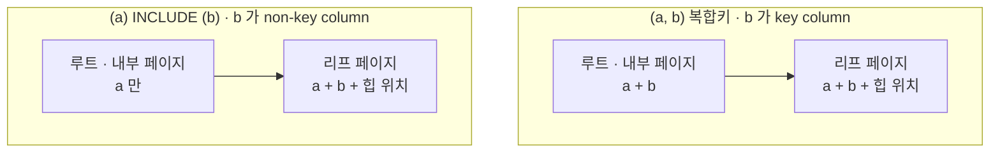

강의는 인덱스를 만들 때 열을 `key column`(식별자)으로 넣을지 `non-key column`(비식별자)으로
넣을지 고를 수 있고, 테이블이 클수록 후자가 낫다고 했다. 그런데 왜 그런지는 말해 주지 않았다.
나는 둘의 차이가 유일성(UNIQUE) 여부인 줄 알았다.

파고들어 얻은 결론은 이거다. **차이는 유일성이 아니라, 그 값이 내부 페이지까지
올라가느냐다.** `non-key column` 으로 넣어서 얻는 것은 크기가 아니라 **높이**다.
200만 행에서 4단이 3단이 됐고, 조회 한 번에 읽는 페이지가 5장에서 4장으로 줄었다.

이 글은 **인덱스의 구조를 전제로 한다.** 파일과 페이지, 내부 페이지의 항목이 무엇인지가
안 잡혀 있으면 아래가 안 읽힌다. 그건 [섹션4: 데이터베이스 인덱싱](/study/database/section-4-indexing/)에 따로 정리했다.

**공부 내용**은 강의가 알려준 것, **심화**는 거기서 파고든 것,
**보충 개념**은 그걸 이해하려다 걸린 DB 일반 용어다.

아래 수치와 출력은 전부 PostgreSQL 17 컨테이너에서 직접 받은 것이다.
재현 과정은 [실습 글](/study/database/section-4-indexing-lab/)로 따로 뺐다.

## 공부 내용 — 열을 넣는 자리가 둘이다
### 용어를 먼저 맞춰 둔다

강의는 "식별자 / 비식별자"라고 불렀지만 **공식 용어는 영어뿐이다.**
PostgreSQL 문서는 `key column` 과 `non-key column` 이라고 쓰고, 한국어 문서는
이 절이 번역돼 있지 않다. 한국어 표현이 쓰인 곳은 SQL Server 문서 정도인데
거기서는 "키 열 / 키가 아닌 열"이다. 이 글은 헷갈리지 않게 **원어를 그대로 쓴다.**

| 이 글 | PostgreSQL 공식 | SQL Server 한국어 문서 | 강의 |
| --- | --- | --- | --- |
| `key column` | key column | 키 열 | 식별자 |
| `non-key column` | non-key column | 키가 아닌 열 | 비식별자 |

데이터 모델링에는 **식별관계 / 비식별관계**라는 전혀 다른 용어가 이미 있다.
부모 테이블의 키가 자식 테이블의 PK 에 포함되느냐를 가리키는 말이고, 인덱스와는 관계가 없다.
이름이 겹칠 뿐이다.
### key column 과 non-key column

```sql
CREATE INDEX big_ab  ON big(a, b);            -- b 도 key column
CREATE INDEX big_inc ON big(a) INCLUDE (b);   -- b 는 non-key column
```

두 인덱스는 **같은 열 두 개를 담고 있지만 할 수 있는 일이 다르다.**

| | `key column` | `non-key column` |
| --- | --- | --- |
| 트리를 타고 내려갈 때 쓰인다 | O | X |
| 정렬 순서를 만든다 | O | X |
| 힙에 안 가고 값을 돌려준다 | O | O |
| UNIQUE 의 대상이 된다 | O | X |
| 내부 페이지에 올라간다 | O | X |
| <abbr title="같은 키 값을 가진 항목을 하나로 묶고 힙 위치 목록만 이어 붙여 저장하는 최적화. PostgreSQL 13 부터 B-tree 기본 동작이다.">중복 제거</abbr>를 쓸 수 있다 | O | **X** |

강의의 결론인 "테이블이 클수록 `non-key column` 이 낫다"는 **다섯째 줄에서 나온다.**
나머지 줄은 그 대가다.

경계는 인덱스 정의에 숫자로 박혀 있다. `indnatts` 는 담고 있는 열 수,
`indnkeyatts` 는 그중 앞에서 몇 개까지가 `key column` 인지다.

```text
  index  | indnatts | indnkeyatts
---------+----------+-------------
 big_a   |        1 |           1
 big_ab  |        2 |           2
 big_inc |        2 |           1     ← 앞의 1개까지만 탐색에 쓴다
```

## 심화 — 파고들어 알게 된 것
### 인덱스가 값을 저장하는 이유가 두 개라서 가능하다

인덱스가 값을 들고 있는 이유를 하나로만 알고 있으면 `non-key column` 은 앞뒤가 맞지 않는다.
[이유는 둘이다](/study/database/section-4-indexing/#인덱스는-왜-값을-저장하나 "비교하려고 · 힙에 안 가려고. 앞의 것은 내부 페이지와 리프 둘 다, 뒤의 것은 리프만 필요로 한다").

`key column` 은 둘 다 해당돼서 위아래 전부 올라간다. **`non-key column` 은 두 번째만
해당되는 열이다** — 비교에는 안 쓰는데 값은 들고 있는다.


### key column 과 non-key column 은 내부 페이지에서 갈린다

3000행짜리 작은 테이블은 트리가 2단이라 루트 페이지를 통째로 찍어 볼 수 있다.
`b` 는 `name-00001` 같은 10글자 문자열이다.

`(a, b)` 복합키의 루트 페이지다. `6e 61 6d 65 2d` 가 `name-` 이다.

```text
 itemoffset |  ctid  | itemlen |                     data
------------+--------+---------+----------------------------------------------
          1 | (1,0)  |       8 |
          2 | (2,2)  |      24 | 57 00 00 00 17 6e 61 6d 65 2d 30 30 32 36 32
          3 | (4,2)  |      24 | ae 00 00 00 17 6e 61 6d 65 2d 30 30 35 32 33
```

`(a) INCLUDE (b)` 의 루트 페이지는 같은 자리에서 `b` 가 사라져 있다.

```text
 itemoffset |   ctid    | itemlen |          data
------------+-----------+---------+-------------------------
          1 | (1,0)     |       8 |
          2 | (2,4097)  |      24 | 57 00 00 00 00 00 00 00
          3 | (4,4097)  |      24 | ae 00 00 00 00 00 00 00
```

반면 **리프 페이지는 두 인덱스가 바이트까지 같다.**

```text
 itemoffset | ctid  | itemlen |                     data
------------+-------+---------+----------------------------------------------
          2 | (0,1) |      24 | 00 00 00 00 17 6e 61 6d 65 2d 30 30 30 30 31
          3 | (0,2) |      24 | 00 00 00 00 17 6e 61 6d 65 2d 30 30 30 30 32
```

1번 항목이 `(1,0)` 에 길이 8이고 내용이 비어 있는 건 [minus infinity](/study/database/section-4-indexing/#피벗-튜플--내부-페이지-항목은-데이터가-아니다 "맨 왼쪽 자식으로 가는 다운링크. 하한이 없으므로 키를 저장하지 않는다") 다.
### non-key column 은 예외 없이 잘린다

내부 페이지 항목은 경계값이고, 경계값이 되려면 **정렬 기준이어야 한다.**
`(a, b)` 에서 `b` 는 두 번째 정렬 기준이므로 자격이 있다.
`(a) INCLUDE (b)` 에서 `b` 는 정렬과 무관하므로 자격이 없다.

그래서 PostgreSQL 은 내부 페이지로 올라가는 항목에서 필요 없는 뒤쪽 열을 잘라낸다
(<abbr title="suffix truncation. 내부 페이지의 경계값에서, 자식 페이지를 구분하는 데 필요 없는 뒤쪽 열을 떼어 내는 최적화.">접미 절단</abbr>).
차이는 **조건부냐 무조건이냐**다.

- 복합키의 `b` — `a` 에 중복이 있으면 `b` 가 있어야 페이지가 구분되므로 **살아남는 경우가 많다**
- `non-key column` 의 `b` — 구분에 쓸 수 없으므로 **항상 잘린다**

근거도 명시돼 있다. 내부 페이지 항목에 대해 공식 README 는 이렇게 말한다.

> The actual key stored in the item is irrelevant, and need not be stored at all.
### 팬아웃이 커지면 트리가 한 층 얕아진다

200만 행(`b` 는 64자 텍스트, 테이블 208MB)에서 잰 값이다.

| 인덱스 | 내부 항목 크기 | 내부 페이지 하나에 담기는 항목 | 내부 페이지 | 리프 페이지 | 트리 |
| --- | --- | --- | --- | --- | --- |
| `(a, b)` | 48 B | 110개 | 213 | 22,989 | **4단** |
| `(a) INCLUDE (b)` | 19 B | 238개 | 97 | 22,989 | **3단** |

**리프 수는 똑같다.** 리프에 든 내용이 같으니 당연하다. 갈리는 건 그 22,989장을 몇 층으로
덮느냐이고, 그건 <abbr title="fan-out. 내부 페이지 하나가 거느리는 자식 페이지 수. 8KB ÷ 항목 크기로 정해진다.">팬아웃</abbr>이 정한다.

```text
(a, b)            팬아웃 110 · 22,989 ÷ 110 = 209장의 내부 페이지가 필요
                  209장은 루트 한 장(110개)에 안 들어간다 → 내부 층을 한 겹 더 → 4단

(a) INCLUDE (b)   팬아웃 238 · 22,989 ÷ 238 = 97장의 내부 페이지가 필요
                  97장은 루트 한 장(238개)에 들어간다 → 내부 층 한 겹으로 끝 → 3단
```

실측 내부 페이지가 213장과 97장, 루트에 든 항목이 4개와 97개다. 계산과 맞는다.
[계산 방법](/study/database/section-4-indexing/#팬아웃으로-트리-높이-계산하기)은 따로 정리했다.
### 조회 한 번에 읽는 페이지가 한 장 준다

```text
 Index Only Scan using big_inc on big     ← 3단
   Buffers: shared hit=4

 Index Only Scan using big_ab on big      ← 4단
   Buffers: shared hit=2 read=3
```

4장과 5장이다. 메타 페이지 1장에 트리 높이를 더한 수이고, 다른 키로 반복해도 같았다.
행이 늘수록 팬아웃이 작은 쪽이 먼저 층을 하나 더 쌓으므로 이 격차는 벌어진다.
### 인덱스는 작아지지 않는다, 오히려 커질 수 있다

여기서 착각하기 쉽다. 같은 테이블에 인덱스 세 개를 만들어 재면 이렇다.

| 인덱스 | 크기 |
| --- | --- |
| `(a)` | 39 MB |
| `(a, b)` | 181 MB |
| `(a) INCLUDE (b)` | 180 MB |

`b` 를 끼워 넣는 순간 39MB 가 180MB 가 된다. 리프마다 64바이트 문자열을 복제하니
당연하고, **이건 `key column` 이든 `non-key column` 이든 똑같다.**

**다만 이 표는 데이터 모양이 바뀌면 뒤집힌다.** 공식 문서에 한 줄로 못 박혀 있다.

> `INCLUDE` indexes can never use deduplication.

`a` 1000가지 × `b` 50가지 = 5만 가지 조합이 200만 행에 반복되는 데이터로 다시 재면 이렇다.

| 인덱스 | 크기 | 리프 페이지 |
| --- | --- | --- |
| `(a, b)` | 14 MB | 1,786 |
| `(a) INCLUDE (b)` | 60 MB | 7,663 |

**4배 차이다.** `non-key column` 으로 넣어서 얻는 것은 크기가 아니라 높이이고,
크기는 데이터에 달렸으니 재 봐야 한다.
### 중복 제거가 실제로 줄이는 것

중복 제거를 **켜고 끄기만 한** 같은 인덱스 두 개로 격리하면 정체가 보인다.

```sql
CREATE INDEX idx_dedup   ON t(a) WITH (deduplicate_items = on);
CREATE INDEX idx_nodedup ON t(a) WITH (deduplicate_items = off);
```

```text
   인덱스     | 크기  | 리프 페이지 |   항목 수  | 항목 크기 | 트리
--------------+-------+------------+-----------+----------+------
 idx_dedup    | 14 MB |      1,778 |    17,777 |   691 B  | 3단
 idx_nodedup  | 43 MB |      5,465 | 2,005,464 |    16 B  | 3단
```

**항목 수가 답이다.** 중복 제거를 끄면 항목이 행 수만큼(200만) 생기고, 켜면 17,777개로 준다.
항목 하나가 힙 TID 를 112개씩 목록으로 들고 있기 때문이다.

```text
중복 제거 X    [a=0|TID][a=0|TID][a=0|TID] … 2,000번    ← 'a=0' 을 2,000번 적는다
중복 제거 O    [a=0|TID 112개][a=0|TID 112개] … 18번    ← 'a=0' 을 18번만 적는다
```

행 하나를 저장하는 원가로 따지면 이렇다.

```text
중복 제거 X : 항목 16B + lp 4B                    = 20.00 B / 행
중복 제거 O : (항목 691B + lp 4B) ÷ 112.5행       =  6.18 B / 행
                                         비율 3.24 배
실측 리프 페이지 5,465 ÷ 1,778 = 3.07 배
```

세 가지를 헷갈리지 않는 게 중요하다.

- **트리 높이는 안 바뀐다.** 둘 다 3단이다. 중복 제거는 리프 수를 줄이지 팬아웃을 키우지 않는다
- **탐색 방식도 안 바뀐다.** 이진 탐색 후 오른쪽으로 가는 건 같다
- **점 조회 I/O 도 같다.** 갈리는 건 훑을 때다 — 한 값(2,000행)을 다 읽으면 6장 대 9장이다

그리고 중복 제거는 **삽입할 때마다 하는 게 아니다.**

```c
/* If the target page cannot fit newitem, try to avoid splitting the
 * page on insert by performing deletion or deduplication now */
if (PageGetFreeSpace(page) < insertstate->itemsz)
    _bt_delete_or_dedup_one_page(...);
```

페이지에 자리가 없을 때만 돈다. 목적이 "쓰기를 싸게"가 아니라 **페이지 분할을 미루는 것**이기
때문이다. 분할은 부모 내부 페이지까지 고쳐야 해서 위로 번진다.
### 그 열로는 찾아 내려갈 수 없다

`non-key column` 으로 넘긴 대가는 실행 계획에 그대로 드러난다.

```text
-- (a) INCLUDE (b)
 Index Scan using big_inc on big
   Index Cond: (a = 12345)
   Filter: (b = '827ccb...'::text)
   Rows Removed by Filter: 1

-- (a, b)
 Index Scan using big_ab on big
   Index Cond: ((a = 12345) AND (b = '827ccb...'::text))
```

`Index Cond` 에 들어가면 트리 탐색에 쓰인 것이고, `Filter` 로 빠지면 이미 도착한
리프에서 하나씩 비교한 것이다.

정렬도 마찬가지다. `order by a, b` 에 복합키는 정렬 없이 그대로 읽지만,
`non-key column` 쪽은 `a` 까지만 정렬돼 있어 나머지를 다시 맞춘다.

```text
-- (a) INCLUDE (b)              -- (a, b)
 Incremental Sort                Index Only Scan using big_ab on big
   Sort Key: a, b
   Presorted Key: a
```
### UNIQUE 는 key column 에만 걸린다

이건 오히려 `non-key column` 이 **더 할 수 있는** 일이다. 같은 `id` 두 행이 있는 테이블에
두 종류의 유니크 인덱스를 만들어 보면 갈린다.

```sql
insert into u values (1, 'x'), (1, 'y');

create unique index u_ab  on u(id, b);          -- 만들어진다
create unique index u_inc on u(id) include (b); -- 실패한다
```

```text
ERROR:  could not create unique index "u_inc"
DETAIL:  Key (id)=(1) is duplicated.
```

`(id, b)` 복합 유니크는 `b` 만 다르면 같은 `id` 를 허용한다.
**"`id` 는 유일해야 하는데 `b` 도 같이 읽고 싶다"** 는 복합키로 표현할 수 없다.
### 그래서 언제 무엇을 쓰나

판단 기준은 하나다. **그 열을 조건이나 정렬에 쓰는가, 결과로 읽기만 하는가.**

| 그 열을 | 어떻게 넣나 |
| --- | --- |
| `WHERE` 조건이나 `ORDER BY` 에 쓴다 | `key column` |
| 결과로 읽기만 한다 | `non-key column` |
| 유일성은 앞 열에만 걸고 싶다 | `non-key column` (복합키로는 불가능) |
| 같은 값이 크게 반복된다 | 크기를 재 보고 정한다 (복합키가 훨씬 작을 수 있다) |
| 쓰지 않는다 | 인덱스에 넣지 않는다 |

읽기만 하는 열이라면 `non-key column` 이 맞고, **테이블이 클수록 더 맞다.**
`INCLUDE` 는 PostgreSQL 11+ 와 SQL Server 의 문법이다.
MySQL InnoDB 에는 없어서 복합키로만 가능하다.

## 실습 — 직접 확인해보기

위의 바이트 덤프와 수치는 전부 재현할 수 있다.
[섹션4 실습: 인덱스 페이지 안을 직접 열어보기](/study/database/section-4-indexing-lab/)의 **2·3부**가 이 글에 해당한다.

## 보충 개념 — 주제와는 별개로 몰라서 막혔던 것들
### 커버링 인덱스와 Index Only Scan

필요한 열이 전부 인덱스 안에 있어서 힙에 갈 필요가 없는 인덱스를
<abbr title="covering index. 쿼리가 요구하는 열을 인덱스만으로 전부 채울 수 있는 인덱스.">커버링 인덱스</abbr>라고 부르고,
그때 나오는 실행 계획이 `Index Only Scan` 이다. `Heap Fetches: 0` 이 힙을 한 번도
안 갔다는 뜻이다.

이름과 달리 **완전히 공짜는 아니다.** 인덱스에는 그 행이 지금 보이는 버전인지가
적혀 있지 않아서, PostgreSQL 은 <abbr title="visibility map. 페이지 단위로 '이 페이지의 모든 행이 모두에게 보인다'를 표시해 둔 별도 포크. VACUUM 이 갱신한다.">가시성 맵</abbr>을 함께 본다.
맵에 표시가 없는 페이지의 행은 결국 힙을 확인해야 하고, 그 횟수가 `Heap Fetches` 에 잡힌다.
### 중복이 많으면 플래너가 인덱스를 버린다

중복이 아주 많은 열은 인덱스를 타 봐야 힙을 온통 헤집게 된다. 200만 행에서 값 가짓수를
바꿔가며 비용을 재면 전환점이 보인다.

```text
값 가짓수 | 한 값의 비율 | 일반 Index Scan | Bitmap Heap Scan | Seq Scan
----------+--------------+-----------------+------------------+----------
    5,000 |      0.020%  |       1,591     |       1,442      |  36,148
       50 |      2.000%  |      86,670     |      26,720      |  39,909
        5 |     20.000%  |     103,627     |      34,220      |  49,692
        2 |     50.000%  |      98,037     |      48,189      |  49,692
        1 |    100.000%  |          —      |      66,475      |  49,692  ← Seq 전환
```

**일반 `Index Scan` 만 놓고 보면 2% 만 돼도 풀스캔이 두 배 싸다.** 그런데 그 사이를
`Bitmap Heap Scan` 이 메운다 — 인덱스에서 TID 를 전부 모아 **블록 번호순으로 정렬한 뒤**
힙을 앞에서 뒤로 한 번씩만 읽는 방식이라, 랜덤 I/O 가 순차 I/O 가 된다.
그래서 실제 전환은 거의 100% 에서야 일어난다.

그리고 **힙이 아예 필요 없는 쿼리라면 20% 를 긁어도 인덱스가 이긴다.** 중복이 많은 열에
인덱스를 거는 주된 이유가 이것이다 — 커버링 인덱스이거나, 복합 인덱스의 뒤쪽 열이거나.

## 정리

| 물음 | 답 |
| --- | --- |
| 둘의 차이가 유일성인가 | 아니다. 값이 내부 페이지까지 올라가느냐다 |
| `non-key column` 으로 넣으면 인덱스가 작아지나 | 아니다. 트리가 얕아질 뿐이고, 크기는 오히려 커질 수 있다 |
| 무엇을 포기하나 | 그 열로 찾아 내려가기, 정렬, 유니크 대상, 중복 제거 |
| 무엇을 얻나 | 팬아웃, 낮은 트리, 앞 열에만 거는 유니크 |

다음에 이 근처에서 막히면 순서는 이렇다. 먼저 **그 열을 조건·정렬에 쓰는지**를 본다.
쓴다면 `key column` 밖에 선택지가 없다. 읽기만 한다면 `indnkeyatts` 를 줄이는 쪽,
즉 `INCLUDE` 가 맞다. 그다음 `bt_metap` 으로 트리 높이를 재서 실제로 한 층 줄었는지
확인한다. 크기(`pg_relation_size`)로 판단하면 헛짚는다 — 데이터에 따라 같게도,
몇 배로 커지게도 나오기 때문이다.

## 참고

- [Fundamentals of Database Engineering](https://www.udemy.com/course/database-engineering-korean/) — Hussein Nasser
- [CREATE INDEX](https://www.postgresql.org/docs/current/sql-createindex.html) — PostgreSQL 공식 문서, `INCLUDE` 절
- [B-Tree Deduplication](https://www.postgresql.org/docs/current/btree.html#BTREE-DEDUPLICATION) — "INCLUDE indexes can never use deduplication"
- [Index-Only Scans and Covering Indexes](https://www.postgresql.org/docs/current/indexes-index-only-scans.html) — 가시성 맵과의 관계
- [포함된 열을 사용하여 인덱스 만들기](https://learn.microsoft.com/ko-kr/sql/relational-databases/indexes/create-indexes-with-included-columns) — SQL Server 한국어 문서. "키 열 / 키가 아닌 열" 표현이 쓰인 곳
