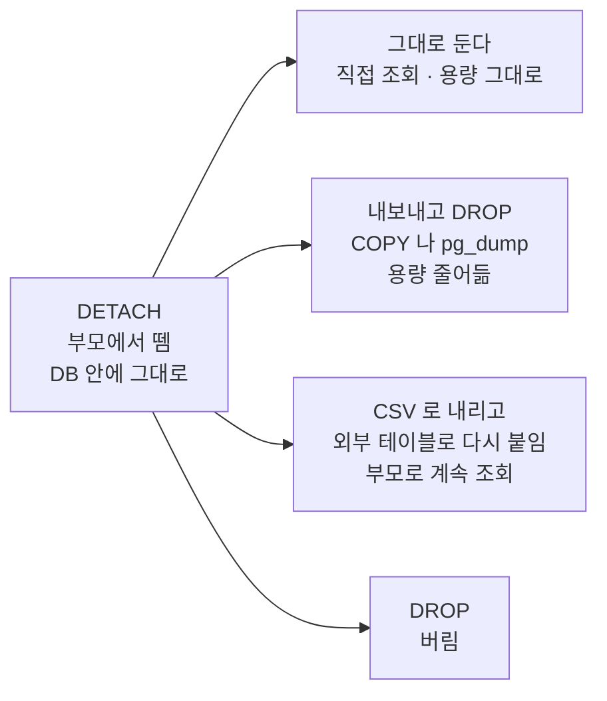
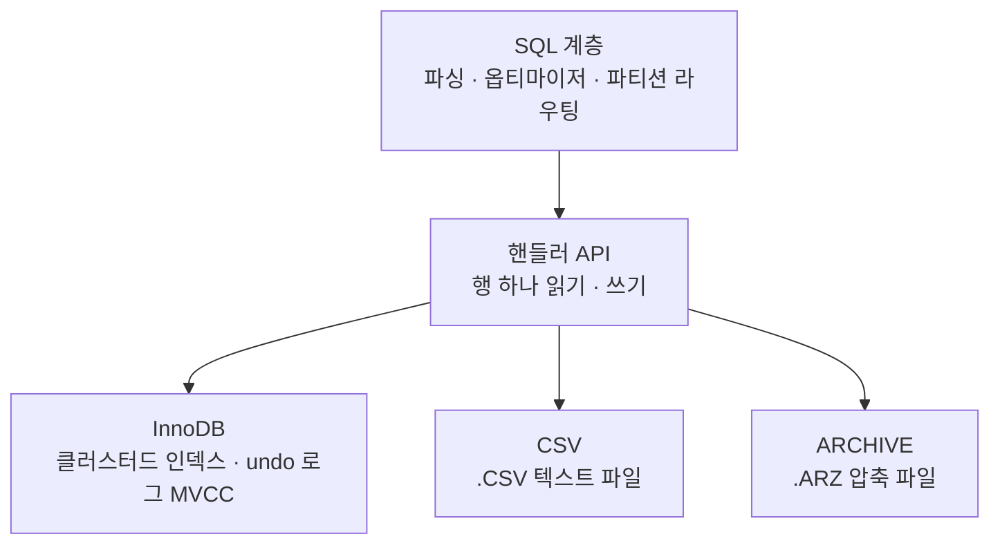

강의는 파티셔닝의 장점을 이야기하면서 MySQL·MariaDB 는 잘 안 쓰는 데이터를 CSV 로 바꿔
보관할 수 있다고 했다. 힙도 인덱스도 아닌 그냥 텍스트 파일로 바꾼다는 말이라 이상했다.
MariaDB 는 저장 구조나 <abbr title="Multi-Version Concurrency Control. 행을 덮어쓰는 대신 여러 버전을 두고, 읽는 쪽에 맞는 버전을 골라 주는 방식">MVCC</abbr> 가 달라서 되는 건가?
게다가 Postgres 의 pg_partman 은 기본 설정에서 보관 기간이 지난 파티션을 detach 만 하는데, 그걸로 보관이 끝나는 건가?

파고들어 얻은 결론은 셋이다.

- **detach 는 떼어 내기일 뿐 보관이 아니다.** 떼어 낸 데이터는 DB 안에 일반 테이블로 남고,
  디스크 사용량도 그대로다. CSV 로 내리는 건 그다음 단계다.
- **MariaDB 에서 되는 이유는 저장 엔진을 테이블마다 고르는 구조라서다.** 힙이나 MVCC 차이와는
  관계가 없다. CSV 엔진으로 바꾸는 순간 인덱스도 트랜잭션도 MVCC 도 사라진다.
- **Postgres 는 CSV 를 외부 테이블로 만들어 파티션으로 다시 붙일 수 있다.** 옛날 데이터는 CSV,
  최근 데이터는 힙에 두고 부모 테이블 하나로 둘 다 조회된다. 대신 대가가 있다.

이 글은 [섹션6: 데이터베이스 파티셔닝](/study/database/section-6-partitioning/)을 전제로 한다.
부모 테이블에는 파일이 없고 파티션 하나하나가 완전한 테이블이라는 것이 그 글의 결론이다.

**공부 내용**은 강의가 알려준 것, **심화**는 거기서 파고든 것,
**보충 개념**은 그걸 이해하려다 걸린 DB 일반 용어다.
아래 출력은 전부 MariaDB 11.4 와 PostgreSQL 17 컨테이너에서 직접 받은 것이다.
따라 할 명령은 [직접 해 보기](#직접-해-보기)에 모았다.

## 공부 내용 — 안 쓰는 파티션은 싸게 보관한다

파티셔닝의 장점 중 하나는 오래된 데이터를 파티션 단위로 다룰 수 있다는 것이다.
`DELETE` 로 수백만 행을 지우는 대신 파티션 하나를 떼어 내거나 버리면 된다.
강의는 여기에 더해 MySQL·MariaDB 에서는 잘 안 쓰는 파티션을 CSV 로 바꿔 보관할 수 있다고 했다.

## 심화 — 떼어 내기와 어디에 둘지는 다른 단계다

여기부터는 강의 밖이다.

### detach 는 떼어 내기일 뿐이다

pg_partman 에 보관 기간을 2달로 주고 유지보수를 돌렸다. `retention_keep_table` 이 기본값 `true` 면
기간이 지난 파티션을 지우지 않고 떼어 내기만 한다.
`retention_schema = 'archive'` 를 같이 주면 떼어 낸 테이블을
[스키마](#스키마 "테이블을 묶는 이름공간. 같은 DB 안에서 public.events 와 archive.events 는 다른 테이블이다") `archive` 로 옮긴다.
6월 파티션에 10만 행을 넣고 단계별로 쟀다.

| 단계 | DB 크기 | 부모로 본 6월 | 6월 데이터가 있는 곳 |
| --- | --- | --- | --- |
| 처음 | 32 MB | 100000 건 | `events_p20260601` (파티션) |
| detach 후 | **32 MB** | **0 건** | `archive.events_p20260601` (일반 테이블) |
| CSV 로 내보내고 DROP | **8 MB** | 0 건 | `/tmp/events_2026_06.csv` (23 MB) |

detach 뒤에는 부모로 조회하면 안 나오고, 떼어 낸 테이블 이름으로 직접 조회해야 10만 건이 나온다.
**DB 로만 조회되는 상태이고 용량은 그대로다.** 용량이 빠진 건
[COPY](#copy "테이블과 파일 사이에서 행을 대량으로 옮기는 PostgreSQL 명령") 로 CSV 를 쓰고 테이블을 DROP 한 뒤다.

detach 가 하는 일은 부모에서 빼는 것이다. 부모로 하는 조회와 플래닝이 이 파티션을 더 이상
고려하지 않고, 유지보수 대상도 줄어든다. 떼어 낸 테이블을 어떻게 할지는 따로 정해야 한다.



[pg_partman 문서](https://github.com/pgpartman/pg_partman/blob/master/doc/pg_partman.md)에 따르면 `retention_keep_table = false` 면 DROP 까지 한다(이건 돌려 보지 않았다).
파일로 빼는 건 직접 해야 한다.
패키지에 `archive` 스키마의 테이블을 `pg_dump` 로 내보내는 `dump_partition.py` 가 들어 있는 건
확인했지만 돌려 보지는 않았다.

### MariaDB 는 저장 엔진을 고른다

MySQL 계열에서 CSV 로 바꾸는 게 되는 이유는 구조에 있다. SQL 을 해석하고 계획을 세우는 계층과
실제로 행을 저장하는 계층이 분리돼 있고, 저장하는 쪽을 **테이블마다 고를 수 있다.**
InnoDB 는 그 엔진 중 하나일 뿐이다.



SQL 계층은 엔진에 "행 하나 줘", "행 하나 써" 하고 요청만 한다. 그래서 **클러스터드 인덱스도,
undo 로그로 만든 MVCC 도, 트랜잭션도 전부 InnoDB 안에 있는 기능이다.** 서버 전체의 기능이
아니라서 엔진을 CSV 로 바꾸면 이것들이 같이 사라진다.

설치된 엔진 목록을 보면 트랜잭션을 지원하는 건 InnoDB 뿐이다.

```text
+--------+--------------+---------+
| ENGINE | TRANSACTIONS | SUPPORT |
+--------+--------------+---------+
| CSV    | NO           | YES     |
| Aria   | NO           | YES     |
| MyISAM | NO           | YES     |
| InnoDB | YES          | DEFAULT |
+--------+--------------+---------+
```

### MariaDB 에서 파티션을 CSV 로 내린다

연도별로 파티션한 InnoDB 테이블에서 2025 파티션만 CSV 로 바꾸려 했다.

```text
ALTER TABLE orders REORGANIZE PARTITION p2025 INTO
  (PARTITION p2025 VALUES LESS THAN (2026) ENGINE=CSV);
ERROR 1497 (HY000): The mix of handlers in the partitions is not allowed in this version of MariaDB
```

**한 파티션 테이블 안에서는 엔진을 섞을 수 없다.** 그래서 파티션을 독립 테이블로 떼어 낸 뒤
엔진을 바꾼다.

```sql
ALTER TABLE orders CONVERT PARTITION p2025 TO TABLE orders_2025;   -- 떼어 내기
ALTER TABLE orders_2025 ENGINE=CSV;                                -- 엔진 교체
```

데이터 디렉터리에서 `orders#P#p2025.ibd` 가 사라지고 `orders_2025.CSV` 가 생겼다.

```text
orders#P#p2026.ibd
orders.frm
orders.par
orders_2025.CSM
orders_2025.CSV
orders_2025.frm
```

`.CSV` 는 그냥 텍스트다. 다른 도구로 바로 열 수 있다.

```text
1,"2025-03-01",10
2,"2025-04-01",20
```

떼어 낸 뒤에는 `orders` 로 조회하면 2026년 행만 나온다. 2025년 데이터는 `orders_2025` 로 따로 조회해야 한다.

### CSV 엔진이 잃는 것

| 시도 | 결과 |
| --- | --- |
| 인덱스 생성 | `Too many keys specified; max 0 keys allowed` |
| NULL 허용 컬럼 | `The storage engine for the table doesn't support nullable columns` |
| `id = 2` 조회 | `EXPLAIN` 에서 `type: ALL`. 항상 파일 전체를 읽는다 |
| `BEGIN; INSERT ...; ROLLBACK;` | **ROLLBACK 이 안 된다.** 넣은 행이 파일에 남는다 |

마지막 줄은 파일을 직접 보면 확인된다. `(9, '2025-12-01', 90)` 을 넣고 ROLLBACK 한 뒤다.

```text
1,"2025-03-01",10
2,"2025-04-01",20
9,"2025-12-01",90
```

같은 용도로 ARCHIVE 엔진도 있다. 데이터를 압축(`.ARZ`)해서 저장하고, `UPDATE` 와 `DELETE` 는
`Storage engine ARCHIVE of the table ... doesn't have this option` 으로 거부한다. 넣고 읽기만 된다.
MariaDB 11.4 기본 설치에서는 꺼져 있어서 `INSTALL SONAME 'ha_archive'` 로 켜야 했다.

MySQL 도 같은 저장 엔진 구조지만 이 글에서는 MariaDB 만 돌려 봤다.

### Postgres 는 외부 테이블을 파티션으로 붙인다

Postgres 의 MVCC 는 힙 튜플 헤더의 <abbr title="행을 만든 트랜잭션과 지운 트랜잭션의 번호. 힙의 행마다 붙어 있고, 읽는 쪽은 이걸 보고 어느 버전이 보이는지 고른다">xmin/xmax</abbr> 에 박혀 있다. 테이블 저장 방식을 갈아 끼우는
API(table access method)가 12 버전부터 있지만 기본 설치에는 heap 하나뿐이라,
`ENGINE=CSV` 같은 한 줄 전환은 없다.

대신 <abbr title="Foreign Data Wrapper. DB 밖의 데이터(파일, 다른 DB)를 테이블처럼 조회하게 해 주는 PostgreSQL 기능">FDW</abbr>
로 만든 **외부 테이블을 파티션으로 붙일 수 있다.** `file_fdw` 는 서버의 CSV 파일을 테이블처럼 읽는다.

```sql
alter table orders detach partition orders_2025;
copy orders_2025 to '/tmp/orders_2025.csv' csv;       -- CSV 로 내보내고
drop table orders_2025;

create extension file_fdw;
create server files foreign data wrapper file_fdw;
create foreign table orders_2025 (id bigint, created date, amount int)
  server files options (filename '/tmp/orders_2025.csv', format 'csv');
alter table orders attach partition orders_2025
  for values from ('2025-01-01') to ('2026-01-01');   -- 다시 붙인다
```

```text
select tableoid::regclass, * from orders order by id;

  tableoid   | id |  created   | amount
-------------+----+------------+--------
 orders_2025 |  1 | 2025-03-01 |     10     ← CSV 파일 (relkind f)
 orders_2025 |  2 | 2025-04-01 |     20
 orders_2026 |  3 | 2026-05-01 |     30     ← 힙 (relkind r)
```

MariaDB 와 달리 **CSV 파티션과 힙 파티션이 한 테이블 안에 같이 있다.** 부모로 조회하면 둘 다 나온다.
옛날 데이터는 싼 파일로, 최근 데이터는 인덱스가 있는 힙으로 두는 핫/콜드 분리가 된다.

### 붙이면 생기는 제약

**프루닝은 된다.** 최근 데이터만 조회하면 CSV 는 열지 않는다.

```text
where created >= '2026-01-01'
 Seq Scan on orders_2026 orders
   Filter: (created >= '2026-01-01'::date)
```

**옛날 데이터를 찾으면 파일을 통째로 읽는다.** 인덱스가 없다.

```text
where id = 1
 Append
   ->  Foreign Scan on orders_2025 orders_1
         Filter: (id = 1)
         Foreign File: /tmp/orders_2025.csv
   ->  Seq Scan on orders_2026 orders_2
         Filter: (id = 1)
```

**쓰기가 안 된다.** `file_fdw` 는 읽기 전용이다.

```text
insert into orders values (9, '2025-12-01', 90);
ERROR:  cannot insert into foreign table "orders_2025"
```

**인덱스는 건너뛰고, PK 는 아예 못 건다.** 부모에 `create index` 를 걸면 힙 파티션에만 생긴다.
유니크는 거부된다.

```text
alter table orders add primary key (id, created);
ERROR:  cannot create unique index on partitioned table "orders"
DETAIL:  Table "orders" contains partitions that are foreign tables.
```

CSV 파티션을 붙이려면 PK 를 포기해야 한다. 가장 큰 대가다.

### 범위를 벗어난 행은 보였다 안 보였다 한다

일반 파티션은 범위 밖 값을 넣으면 에러가 난다. CSV 파일은 DB 를 거치지 않고 고칠 수 있어서
Postgres 가 범위를 검사하지 않는다. `2030-01-01` 행을 CSV 에 직접 한 줄 추가했다.

```text
select * from orders;                               → 2030-01-01 행이 나온다 (orders_2025 에서)
select * from orders where created = '2030-01-01';  → 0행
```

두 번째 쿼리는 프루닝이 "2030 은 `orders_2025` 범위가 아니다"라고 판단해서 CSV 를 아예 안 연다.
**같은 데이터가 조회 방법에 따라 보였다 안 보였다 한다.** CSV 로 내릴 때 범위에 맞는 행만 넣고,
그 뒤로 파일을 건드리지 않아야 한다.

## 직접 해 보기

### MariaDB

```bash
docker run --name mdb -e MARIADB_ROOT_PASSWORD=pw -d mariadb:11.4
docker exec -it mdb mariadb -uroot -ppw
```

```sql
CREATE DATABASE lab; USE lab;
CREATE TABLE orders (id bigint NOT NULL, created date NOT NULL, amount int NOT NULL)
  ENGINE=InnoDB PARTITION BY RANGE (YEAR(created)) (
  PARTITION p2025 VALUES LESS THAN (2026), PARTITION p2026 VALUES LESS THAN (2027));
INSERT INTO orders VALUES (1,'2025-03-01',10),(2,'2025-04-01',20),(3,'2026-05-01',30);

ALTER TABLE orders REORGANIZE PARTITION p2025 INTO
  (PARTITION p2025 VALUES LESS THAN (2026) ENGINE=CSV);          -- 에러 1497

ALTER TABLE orders CONVERT PARTITION p2025 TO TABLE orders_2025;
ALTER TABLE orders_2025 ENGINE=CSV;
SELECT * FROM orders;
EXPLAIN SELECT * FROM orders_2025 WHERE id = 2;

BEGIN; INSERT INTO orders_2025 VALUES (9,'2025-12-01',90); ROLLBACK;

INSTALL SONAME 'ha_archive';
CREATE TABLE orders_2025_arc ENGINE=ARCHIVE AS SELECT * FROM orders_2025;
UPDATE orders_2025_arc SET amount = 0 WHERE id = 1;              -- 거부
```

```bash
docker exec mdb ls /var/lib/mysql/lab/
docker exec mdb cat /var/lib/mysql/lab/orders_2025.CSV
```

### PostgreSQL

```bash
docker run --name pgarc -e POSTGRES_PASSWORD=pw -d postgres:17
docker exec -it pgarc psql -U postgres
```

```sql
create table orders (id bigint, created date, amount int) partition by range (created);
create table orders_2025 partition of orders for values from ('2025-01-01') to ('2026-01-01');
create table orders_2026 partition of orders for values from ('2026-01-01') to ('2027-01-01');
insert into orders values (1,'2025-03-01',10),(2,'2025-04-01',20),(3,'2026-05-01',30);

alter table orders detach partition orders_2025;
copy orders_2025 to '/tmp/orders_2025.csv' csv;
drop table orders_2025;
create extension file_fdw;
create server files foreign data wrapper file_fdw;
create foreign table orders_2025 (id bigint, created date, amount int)
  server files options (filename '/tmp/orders_2025.csv', format 'csv');
alter table orders attach partition orders_2025 for values from ('2025-01-01') to ('2026-01-01');

select tableoid::regclass, * from orders order by id;
explain (costs off) select * from orders where created >= '2026-01-01';
explain (costs off) select * from orders where id = 1;
insert into orders values (9, '2025-12-01', 90);                 -- 거부
alter table orders add primary key (id, created);                -- 거부
```

범위를 벗어난 행은 psql 을 나와서 파일에 직접 추가한다.

```bash
docker exec pgarc sh -c "echo '4,2030-01-01,40' >> /tmp/orders_2025.csv"
```

```sql
select tableoid::regclass, * from orders order by id;
select tableoid::regclass, * from orders where created = '2030-01-01';
```

pg_partman 의 보관 설정은 [섹션6 실습](/study/database/section-6-partitioning-lab/)의
pg_partman 절과 같은 방법으로 설치한 뒤 `partman.part_config` 의 `retention`,
`retention_keep_table`, `retention_schema` 를 채우고 `run_maintenance()` 를 돌리면 된다.

정리:

```bash
docker rm -f mdb pgarc
```

## 보충 개념 — 주제와는 별개로 몰라서 막혔던 것들

### 스키마

PostgreSQL 에서 스키마는 DB 안의 이름공간이다. 테이블 이름 앞에 `archive.` 처럼 붙는 부분이고,
아무것도 안 붙이면 `public` 이다. `public.events_p20260601` 과 `archive.events_p20260601` 은
다른 테이블이다. 권한을 스키마 단위로 줄 수 있고, `pg_dump -n archive` 처럼 스키마만 골라
내보낼 수도 있어서 보관용 테이블을 한곳에 모을 때 쓴다.

MySQL·MariaDB 에서는 스키마와 데이터베이스가 같은 말이다.

### COPY

테이블과 파일 사이에서 행을 대량으로 옮기는 PostgreSQL 명령이다.
`copy 테이블 to '파일' csv` 는 내보내기, `copy 테이블 from '파일' csv` 는 들여오기다.
여기서 파일 경로는 **DB 서버 쪽** 경로다. 클라이언트 쪽 파일을 다루려면 psql 의 `\copy` 를 쓴다.

## 정리

| | MariaDB | PostgreSQL |
| --- | --- | --- |
| CSV 로 보관하는 방법 | 파티션을 테이블로 떼어 내고 `ENGINE=CSV` | `COPY` 로 내보내고 file_fdw 외부 테이블로 |
| 원래 테이블로 계속 조회 | 안 된다. 엔진을 섞을 수 없다 | 된다. 외부 테이블을 파티션으로 붙인다 |
| 잃는 것 | 인덱스, NULL, 트랜잭션, MVCC | 인덱스, 쓰기, MVCC, 테이블 전체의 PK |
| 범위 검사 | 떼어 냈으니 해당 없음 | DB 가 안 한다. 파일 관리자 책임 |
| 가능한 이유 | 저장 엔진을 테이블마다 고른다 | FDW 로 외부 데이터를 테이블처럼 다룬다 |

다음에 "오래된 파티션을 보관한다"는 말을 들으면 두 단계로 나눠서 본다. 먼저 **부모에서 떼어 내는가**
(detach), 다음으로 **떼어 낸 데이터를 어디에 두는가**(그대로 / 파일 / 외부 테이블 / 버림).
앞의 것만으로는 용량도 조회 방식도 달라지지 않는다.

## 참고

- [Fundamentals of Database Engineering](https://www.udemy.com/course/database-engineering-korean/) — Hussein Nasser
- [섹션6: 데이터베이스 파티셔닝](/study/database/section-6-partitioning/)
- [MariaDB: CSV](https://mariadb.com/docs/server/server-usage/storage-engines/csv)
- [MariaDB: ARCHIVE](https://mariadb.com/docs/server/server-usage/storage-engines/archive)
- [MariaDB: ALTER TABLE](https://mariadb.com/docs/server/reference/sql-statements/data-definition/alter/alter-table) — `CONVERT PARTITION`
- [PostgreSQL 17: file_fdw](https://www.postgresql.org/docs/17/file-fdw.html)
- [PostgreSQL 17: Table Access Method Interface](https://www.postgresql.org/docs/17/tableam.html)
- [pg_partman](https://github.com/pgpartman/pg_partman)
