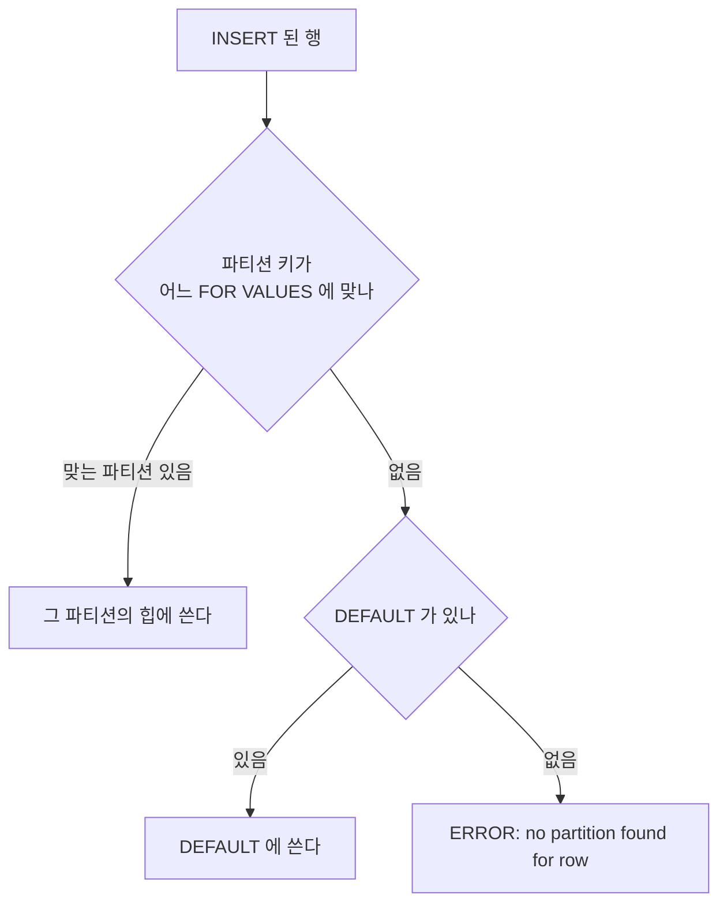

[섹션6: 데이터베이스 파티셔닝](/study/database/section-6-partitioning/)을 쓰면서 가장 안 믿겼던 것은
"부모 테이블에는 파일이 없다"였다. 강의에서 부모에도 크기가 찍히는 걸 봤기 때문이다.
이 글은 그 문장부터 시작해서, 정리 글의 주장을 하나씩 컨테이너에서 확인한다.

네 부로 나눴다. **1부**는 파일과 카탈로그, **2부**는 행이 들어가는 곳,
**3부**는 조회, **4부**는 제약이다. 부마다 테이블을 새로 만들어서 어느 부부터 해도 된다.

아래 출력은 전부 PostgreSQL 17 컨테이너에서 직접 받은 것이다.
파일 경로(`base/5/16387`)의 숫자는 환경마다 다르다. pg_partman 이 만드는 파티션 이름은
실행한 날짜(여기서는 2026-09-27)에 따라 달라진다.

## 준비

```bash
docker run --name pgpart -e POSTGRES_PASSWORD=pw -d postgres:17
docker exec -it pgpart psql -U postgres
```

2부 끝의 pg_partman 실습만 확장 설치가 필요하다. 그 절에서 따로 적는다.

## 1부 — 부모에는 파일이 없다

```sql
create table orders (id bigint, created date, amount int) partition by range (created);
create table orders_2025 partition of orders
  for values from ('2025-01-01') to ('2026-01-01');

-- 2026 은 일반 테이블로 만들어 채운 뒤 붙인다
create table orders_2026 (id bigint, created date, amount int);
insert into orders_2026 select g, date '2026-01-01' + (g % 365), g from generate_series(1, 1000) g;
alter table orders attach partition orders_2026
  for values from ('2026-01-01') to ('2027-01-01');

create index orders_created_idx on orders (created);
insert into orders select g, date '2025-01-01' + (g % 365), g from generate_series(1001, 1500) g;
```

### 파일은 파티션에만 있다

**확인할 내용** — 부모 테이블과 부모 인덱스에 실제 파일이 있는지.
([정리 글](/study/database/section-6-partitioning/#부모에는-힙도-인덱스도-없다))

**쿼리**

```sql
select relname, relkind, pg_relation_filepath(oid) as filepath, pg_relation_size(oid) as bytes
from pg_class where relname like 'orders%' order by relname;
```

**결과**

```text
         relname         | relkind |   filepath   | bytes
-------------------------+---------+--------------+-------
 orders                  | p       |              |     0
 orders_2025             | r       | base/5/16387 | 24576
 orders_2025_created_idx | i       | base/5/16394 | 32768
 orders_2026             | r       | base/5/16390 | 49152
 orders_2026_created_idx | i       | base/5/16395 | 40960
 orders_created_idx      | I       |              |     0
```

부모(`p`)와 부모 인덱스(`I`)는 파일 경로가 비어 있다. 부모에 건 인덱스 하나가
파티션마다 진짜 인덱스(`i`)로 하나씩 생겼다.

### 규칙은 카탈로그에 있다

**확인할 내용** — 파일이 없는 부모의 "나누는 방식"과 파티션의 범위가 어디에 저장되는지.
([정리 글](/study/database/section-6-partitioning/#파티셔닝-정보는-카탈로그에-있다))

**쿼리**

```sql
select partrelid::regclass, partstrat, partattrs from pg_partitioned_table;

select relname, relispartition, pg_get_expr(relpartbound, oid) as bound
from pg_class where relname like 'orders%' order by relname;

select inhrelid::regclass as child, inhparent::regclass as parent from pg_inherits order by 1;
```

**결과**

```text
 partrelid | partstrat | partattrs
-----------+-----------+-----------
 orders    | r         | 2

         relname         | relispartition |                      bound
-------------------------+----------------+--------------------------------------------------
 orders                  | f              |
 orders_2025             | t              | FOR VALUES FROM ('2025-01-01') TO ('2026-01-01')
 orders_2025_created_idx | t              |
 orders_2026             | t              | FOR VALUES FROM ('2026-01-01') TO ('2027-01-01')
 orders_2026_created_idx | t              |
 orders_created_idx      | f              |

          child          |       parent
-------------------------+--------------------
 orders_2025             | orders
 orders_2026             | orders
 orders_2025_created_idx | orders_created_idx
 orders_2026_created_idx | orders_created_idx
```

`partstrat = r` 은 RANGE, `partattrs = 2` 는 두 번째 컬럼(`created`)이다.
인덱스도 테이블과 똑같이 부모-자식 관계로 묶여 있다.

### DETACH 해도 파일은 그대로다

**확인할 내용** — attach/detach 가 데이터를 옮기는지, 카탈로그만 바꾸는지.

**쿼리**

```sql
alter table orders detach partition orders_2026;

select relname, relkind, relispartition, pg_relation_filepath(oid) as filepath
from pg_class where relname in ('orders_2026', 'orders_2026_created_idx');
select count(*) from orders_2026;
select count(*) from orders;
```

**결과**

```text
         relname         | relkind | relispartition |   filepath
-------------------------+---------+----------------+--------------
 orders_2026             | r       | f              | base/5/16390
 orders_2026_created_idx | i       | f              | base/5/16395

 count
-------
  1000

 count
-------
   500
```

파일 경로가 앞의 표와 같다. `relispartition` 만 `f` 로 바뀌었다.
떼어 낸 테이블은 1000행을 그대로 갖고 있고, 부모로는 2025년 500행만 보인다.

**쿼리**

```sql
alter table orders attach partition orders_2026
  for values from ('2026-01-01') to ('2027-01-01');
select count(*) from orders;
```

**결과**

```text
 count
-------
  1500
```

### 부모 크기는 합산이다

**확인할 내용** — 부모에 찍히는 크기가 어디서 오는지.
([정리 글](/study/database/section-6-partitioning/#부모-크기는-합산-값이다))

**쿼리**

```sql
select pg_relation_size('orders') as rel, pg_table_size('orders') as tbl,
       pg_total_relation_size('orders') as total, pg_relation_size('orders_created_idx') as idx;
```

**결과**

```text
 rel | tbl | total | idx
-----+-----+-------+-----
   0 |   0 |     0 |   0
```

**쿼리**

```sql
\dP+
```

**결과**

```text
                                 List of partitioned relations
 Schema |        Name        |  Owner   |       Type        | Table  | Total size | Description
--------+--------------------+----------+-------------------+--------+------------+-------------
 public | orders             | postgres | partitioned table |        | 120 kB     |
 public | orders_created_idx | postgres | partitioned index | orders | 72 kB      |
```

**쿼리**

```sql
select relid, pg_size_pretty(pg_table_size(relid)) from pg_partition_tree('orders') where isleaf;
select relid, pg_size_pretty(pg_relation_size(relid)) from pg_partition_tree('orders_created_idx') where isleaf;
```

**결과**

```text
    relid    | pg_size_pretty
-------------+----------------
 orders_2025 | 48 kB
 orders_2026 | 72 kB

          relid          | pg_size_pretty
-------------------------+----------------
 orders_2025_created_idx | 32 kB
 orders_2026_created_idx | 40 kB
```

48 + 72 = 120, 32 + 40 = 72. `\dP+` 의 숫자는 파티션을 더한 값이다.
부모를 직접 재면 어떤 함수로도 0이다.

## 2부 — 행이 들어가는 곳

```sql
create table t (id bigint, created date) partition by range (created);
create table t_2025 partition of t for values from ('2030-01-01') to ('2031-01-01');  -- 일부러 어긋나게
create table banana partition of t for values from ('2025-01-01') to ('2026-01-01');
```

2부에서 확인하는 흐름은 이렇다. 이름은 어디에도 끼지 않는다.



### 이름이 아니라 범위가 정한다

**확인할 내용** — 파티션 이름의 숫자가 라우팅에 영향을 주는지.
([정리 글](/study/database/section-6-partitioning/#행을-보내는-건-이름이-아니라-for-values-다))

**쿼리**

```sql
insert into t values (1, '2025-05-01'), (2, '2030-05-01');
select tableoid::regclass as partition, * from t order by id;
```

**결과**

```text
 partition | id |  created
-----------+----+------------
 banana    |  1 | 2025-05-01
 t_2025    |  2 | 2030-05-01
```

`tableoid` 는 그 행이 실제로 들어 있는 테이블이다. 이름이 `t_2025` 여도 범위가 2030년이면
2030년 행이 들어간다.

### 범위 밖, 겹침, 경계값

**확인할 내용** — 어느 범위에도 안 맞는 행, 겹치는 범위, `TO` 의 경계값이 어떻게 처리되는지.

**쿼리**

```sql
insert into t values (3, '2027-05-01');
```

**결과**

```text
ERROR:  no partition of relation "t" found for row
DETAIL:  Partition key of the failing row contains (created) = (2027-05-01).
```

**쿼리**

```sql
create table t_x partition of t for values from ('2025-06-01') to ('2025-07-01');
```

**결과**

```text
ERROR:  partition "t_x" would overlap partition "banana"
```

**쿼리**

```sql
insert into t values (4, '2026-01-01');
insert into t values (5, '2025-12-31');
select tableoid::regclass as partition, * from t where id = 5;
```

**결과**

```text
ERROR:  no partition of relation "t" found for row
DETAIL:  Partition key of the failing row contains (created) = (2026-01-01).

 partition | id |  created
-----------+----+------------
 banana    |  5 | 2025-12-31
```

`banana` 의 범위는 `TO ('2026-01-01')` 인데 `2026-01-01` 은 못 들어간다. 범위는 `[FROM, TO)` 다.

### DEFAULT 에 쌓이면 파티션을 못 만든다

**확인할 내용** — DEFAULT 파티션이 안 맞는 행을 받는지, 그 뒤에 새 파티션을 만들 수 있는지.
([정리 글](/study/database/section-6-partitioning/#파티션은-미리-만들어-둔다))

**쿼리**

```sql
create table t_default partition of t default;
insert into t values (3, '2027-05-01');
select tableoid::regclass as partition, * from t where id = 3;
```

**결과**

```text
 partition | id |  created
-----------+----+------------
 t_default |  3 | 2027-05-01
```

**쿼리**

```sql
create table t_2027 partition of t for values from ('2027-01-01') to ('2028-01-01');
create table t_2028 partition of t for values from ('2028-01-01') to ('2029-01-01');
select relname from pg_class where relname in ('t_2027', 't_2028');
```

**결과**

```text
ERROR:  updated partition constraint for default partition "t_default" would be violated by some row

 relname
---------
 t_2028
```

DEFAULT 에 2027년 행이 있어서 2027 파티션은 거부되고, 겹치는 행이 없는 2028 파티션은 만들어진다.

### NULL 은 방식마다 다른 곳으로 간다

**확인할 내용** — 파티션 키가 NULL 인 행이 RANGE, LIST, HASH 에서 각각 어디로 가는지.
([정리 글](/study/database/section-6-partitioning/#range-list-hash--나누는-방식-세-가지))

```sql
create table m_range (id int, created date) partition by range (created);
create table m_range_2025 partition of m_range for values from ('2025-01-01') to ('2026-01-01');
create table m_range_2026 partition of m_range for values from ('2026-01-01') to ('2027-01-01');
create table m_list (id int, region text) partition by list (region);
create table m_list_asia partition of m_list for values in ('kr', 'jp');
create table m_list_eu partition of m_list for values in ('de', 'fr');
create table m_hash (id int) partition by hash (id);
create table m_hash_0 partition of m_hash for values with (modulus 3, remainder 0);
create table m_hash_1 partition of m_hash for values with (modulus 3, remainder 1);
create table m_hash_2 partition of m_hash for values with (modulus 3, remainder 2);
```

**쿼리** — RANGE

```sql
insert into m_range values (1, null);
create table m_range_null partition of m_range for values from (null) to ('2025-01-01');
create table m_range_min partition of m_range for values from (minvalue) to ('2025-01-01');
insert into m_range values (1, null);
```

**결과**

```text
ERROR:  no partition of relation "m_range" found for row
DETAIL:  Partition key of the failing row contains (created) = (null).
ERROR:  cannot specify NULL in range bound
ERROR:  no partition of relation "m_range" found for row
DETAIL:  Partition key of the failing row contains (created) = (null).
```

NULL 경계는 못 만들고, `minvalue` 로 가장 작은 쪽을 열어 둬도 NULL 은 안 들어간다.

**쿼리**

```sql
create table m_range_default partition of m_range default;
insert into m_range values (1, null);
select tableoid::regclass as partition, * from m_range;
```

**결과**

```text
    partition    | id | created
-----------------+----+---------
 m_range_default |  1 |
```

**쿼리** — LIST

```sql
create table m_list_null partition of m_list for values in (null);
insert into m_list values (1, null), (2, 'kr');
select tableoid::regclass as partition, * from m_list order by id;
explain (costs off) select * from m_list where region is null;
```

**결과**

```text
  partition  | id | region
-------------+----+--------
 m_list_null |  1 |
 m_list_asia |  2 | kr

 Seq Scan on m_list_null m_list
   Filter: (region IS NULL)
```

**쿼리** — HASH

```sql
insert into m_hash values (null), (null);
select tableoid::regclass as partition, count(*) from m_hash where id is null group by 1;
create table m_hash_default partition of m_hash default;
```

**결과**

```text
 partition | count
-----------+-------
 m_hash_0  |     2

ERROR:  a hash-partitioned table may not have a default partition
```

NULL 은 전부 `remainder 0` 으로 가고, HASH 에는 DEFAULT 도 둘 수 없다.

**쿼리** — PK 가 있으면

```sql
create table m_pk (id int, created date, primary key (id, created)) partition by range (created);
select attname, attnotnull from pg_attribute where attrelid = 'm_pk'::regclass and attname = 'created';
```

**결과**

```text
 attname | attnotnull
---------+------------
 created | t
```

PK 에 들어간 파티션 키는 자동으로 NOT NULL 이 된다.

### 트리거로는 파티션을 못 만든다

**확인할 내용** — 새 달의 행이 들어오는 순간 트리거로 그달 파티션을 만들 수 있는지.

파티션을 만드는 함수를 먼저 준비한다. 이미 있으면 건너뛴다.

```sql
create table logs (id bigint, created date) partition by range (created);
create table logs_2026_09 partition of logs for values from ('2026-09-01') to ('2026-10-01');

create function make_month(d date) returns void language plpgsql as $$
declare s date := date_trunc('month', d); n text := 'logs_' || to_char(d, 'YYYY_MM');
begin
  if to_regclass(n) is null then
    execute format('create table %I partition of logs for values from (%L) to (%L)',
                   n, s, s + interval '1 month');
  end if;
end $$;
```

**쿼리** — 부모에 행 트리거

```sql
create function auto_row() returns trigger language plpgsql as $$
begin perform make_month(new.created); return new; end $$;
create trigger tr_row before insert on logs for each row execute function auto_row();
insert into logs values (1, '2026-10-05');
drop trigger tr_row on logs;
```

**결과**

```text
ERROR:  no partition of relation "logs" found for row
DETAIL:  Partition key of the failing row contains (created) = (2026-10-05).
```

**쿼리** — 부모에 문장 트리거

```sql
create function auto_stmt() returns trigger language plpgsql as $$
begin perform make_month(date '2026-10-05'); return null; end $$;
create trigger tr_stmt before insert on logs for each statement execute function auto_stmt();
insert into logs values (1, '2026-10-05');
drop trigger tr_stmt on logs;
```

**결과**

```text
ERROR:  cannot CREATE TABLE .. PARTITION OF "logs" because it is being used by active queries in this session
```

**쿼리** — DEFAULT 에 행 트리거

```sql
create table logs_default partition of logs default;
create trigger tr_def before insert on logs_default for each row execute function auto_row();
insert into logs values (1, '2026-10-05');
drop table logs_default;
```

**결과**

```text
ERROR:  cannot CREATE TABLE .. PARTITION OF "logs" because it is being used by active queries in this session
```

행 트리거는 파티션을 찾는 단계에서 이미 실패한다. 나머지 둘은 트리거까지는 실행되지만,
INSERT 가 쓰고 있는 테이블에 파티션을 붙이는 DDL 이 막힌다.

**쿼리** — 같은 함수로 미리 만들어 두기

```sql
select make_month((date '2026-09-01' + (i || ' month')::interval)::date) from generate_series(0, 3) i;
insert into logs values (1, '2026-10-05'), (2, '2026-12-31');
select tableoid::regclass as partition, * from logs order by id;
```

**결과**

```text
  partition   | id |  created
--------------+----+------------
 logs_2026_10 |  1 | 2026-10-05
 logs_2026_12 |  2 | 2026-12-31
```

### pg_partman 으로 미리 만든다

**확인할 내용** — pg_partman 이 파티션을 미리 만드는 방식과, 데이터가 없을 때의 함정.

pg_partman 은 기본 이미지에 없어서 컨테이너 안에 설치한다.

```bash
docker exec pgpart sh -c 'apt-get update -qq && apt-get install -y -qq postgresql-17-partman'
```

**쿼리**

```sql
create schema partman;
create extension pg_partman schema partman;

create table events (id bigint, created timestamptz not null) partition by range (created);
select partman.create_parent(p_parent_table => 'public.events', p_control => 'created',
                             p_interval => '1 month', p_premake => 3);
select relname, pg_get_expr(relpartbound, oid) as bound
from pg_class where relispartition and relname like 'events%' order by relname;
```

**결과**

```text
     relname      |                                  bound
------------------+--------------------------------------------------------------------------
 events_default   | DEFAULT
 events_p20260601 | FOR VALUES FROM ('2026-06-01 00:00:00+00') TO ('2026-07-01 00:00:00+00')
 events_p20260701 | FOR VALUES FROM ('2026-07-01 00:00:00+00') TO ('2026-08-01 00:00:00+00')
 events_p20260801 | FOR VALUES FROM ('2026-08-01 00:00:00+00') TO ('2026-09-01 00:00:00+00')
 events_p20260901 | FOR VALUES FROM ('2026-09-01 00:00:00+00') TO ('2026-10-01 00:00:00+00')
 events_p20261001 | FOR VALUES FROM ('2026-10-01 00:00:00+00') TO ('2026-11-01 00:00:00+00')
 events_p20261101 | FOR VALUES FROM ('2026-11-01 00:00:00+00') TO ('2026-12-01 00:00:00+00')
 events_p20261201 | FOR VALUES FROM ('2026-12-01 00:00:00+00') TO ('2027-01-01 00:00:00+00')
```

실행일(9월) 기준으로 앞뒤 3달 치와 DEFAULT 가 한 번에 생겼다.

**쿼리** — 미리 만들 개수를 늘리고 유지보수를 돌린다

```sql
update partman.part_config set premake = 5 where parent_table = 'public.events';
select partman.run_maintenance('public.events');
select relname from pg_class where relispartition and relname like 'events_p2027%' order by 1;
```

**결과**

```text
 relname
---------
(0 rows)
```

아무것도 안 생겼다.

**쿼리**

```sql
select infinite_time_partitions from partman.part_config where parent_table = 'public.events';
update partman.part_config set infinite_time_partitions = true where parent_table = 'public.events';
select partman.run_maintenance('public.events');
select relname from pg_class where relispartition and relname like 'events_p2027%' order by 1;
```

**결과**

```text
 infinite_time_partitions
--------------------------
 f

     relname
------------------
 events_p20270101
 events_p20270201
 events_p20270301
```

기본값 `false` 에서는 최근 데이터가 있어야 앞으로의 파티션을 만든다. 비어 있는 테이블이라
안 만들었던 것이다. `true` 로 바꾸자 2027년 파티션이 생겼다.
실제로는 `run_maintenance()` 를 pg_cron 같은 스케줄러로 매일 돌린다.

## 3부 — 조회

행 100만 건을 파티션 없는 테이블과 연도별 파티션 10개에 똑같이 넣는다.
병렬 실행을 끄는 건 계획을 읽기 쉽게 하려는 것이다.

```sql
create table plain (id bigint, created date, status text);
insert into plain select g, date '2017-01-01' + (g % 3650), 'done' from generate_series(1, 1000000) g;

create table part (id bigint, created date, status text) partition by range (created);
do $$ begin for y in 2017..2026 loop
  execute format('create table part_%s partition of part for values from (%L) to (%L)',
                 y, y || '-01-01', (y + 1) || '-01-01');
end loop; end $$;
insert into part select * from plain;

create index on plain (id);
create index on plain (id, created);
create index part_id on part (id);
create index part_id_created on part (id, created);
analyze;

set max_parallel_workers_per_gather = 0;
```

### 프루닝이 되는 조건과 안 되는 조건

**확인할 내용** — 어떤 조건에서 파티션이 걸러지고, 어떤 조건에서 안 걸러지는지.
([정리 글](/study/database/section-6-partitioning/#파티션-프루닝--답이-없는-파티션은-안-연다))

**쿼리** — 상수 조건

```sql
explain (costs off) select * from part where created = '2020-10-27';
explain (costs off) select * from part where created >= '2025-06-01';
```

**결과**

```text
 Seq Scan on part_2020 part
   Filter: (created = '2020-10-27'::date)

 Append
   ->  Seq Scan on part_2025 part_1
         Filter: (created >= '2025-06-01'::date)
   ->  Seq Scan on part_2026 part_2
         Filter: (created >= '2025-06-01'::date)
```

**쿼리** — 파티션 키에 함수

```sql
explain (costs off) select * from part where extract(year from created) = 2025;
```

**결과**

```text
 Append
   ->  Seq Scan on part_2017 part_1
         Filter: (EXTRACT(year FROM created) = '2025'::numeric)
   ->  Seq Scan on part_2018 part_2
         Filter: (EXTRACT(year FROM created) = '2025'::numeric)
   ...
   ->  Seq Scan on part_2026 part_10
         Filter: (EXTRACT(year FROM created) = '2025'::numeric)
```

10개 전부 읽는다.

**쿼리** — 파라미터

```sql
set plan_cache_mode = force_generic_plan;
prepare q(date) as select * from part where created = $1;
explain (analyze, costs off, timing off, summary off) execute q('2020-10-27');
reset plan_cache_mode;
```

**결과**

```text
 Append (actual rows=274 loops=1)
   Subplans Removed: 9
   ->  Seq Scan on part_2020 part_1 (actual rows=274 loops=1)
         Filter: (created = $1)
         Rows Removed by Filter: 100010
```

`force_generic_plan` 은 값을 모르는 계획을 강제로 쓰게 한다. 계획 시점에는 못 거르고,
실행을 시작하면서 9개를 걸렀다(`Subplans Removed: 9`).

**쿼리** — 프루닝 끄기

```sql
set enable_partition_pruning = off;
explain (costs off) select * from part where created = '2020-10-27';
reset enable_partition_pruning;
```

**결과**

```text
 Append
   ->  Seq Scan on part_2017 part_1
         Filter: (created = '2020-10-27'::date)
   ...
   ->  Seq Scan on part_2026 part_10
         Filter: (created = '2020-10-27'::date)
```

같은 쿼리가 10개를 다 읽는다. 첫 번째 쿼리와 비교하면 프루닝이 한 일이 보인다.

### 방식마다 걸러지는 조건이 다르다

**확인할 내용** — RANGE, LIST, HASH 가 각각 어떤 조건에서 파티션을 거르는지.
([정리 글](/study/database/section-6-partitioning/#range-list-hash--나누는-방식-세-가지))
2부의 `m_*` 는 NULL 파티션이 붙어 결과가 달라지므로 새 테이블을 쓴다.

```sql
create table q_range (id int, created date) partition by range (created);
create table q_range_2025 partition of q_range for values from ('2025-01-01') to ('2026-01-01');
create table q_range_2026 partition of q_range for values from ('2026-01-01') to ('2027-01-01');
create table q_list (id int, region text) partition by list (region);
create table q_list_asia partition of q_list for values in ('kr', 'jp');
create table q_list_eu partition of q_list for values in ('de', 'fr');
create table q_hash (id int) partition by hash (id);
create table q_hash_0 partition of q_hash for values with (modulus 3, remainder 0);
create table q_hash_1 partition of q_hash for values with (modulus 3, remainder 1);
create table q_hash_2 partition of q_hash for values with (modulus 3, remainder 2);
insert into q_hash select generate_series(1, 9000);
```

**쿼리** — HASH 의 분포

```sql
select tableoid::regclass as partition, count(*) from q_hash group by 1 order by 1;
```

**결과**

```text
 partition | count
-----------+-------
 q_hash_0  |  2942
 q_hash_1  |  3036
 q_hash_2  |  3022
```

**쿼리** — RANGE

```sql
explain (costs off) select * from q_range where created = '2025-05-01';
explain (costs off) select * from q_range where created < '2025-12-01';
```

**결과**

```text
 Seq Scan on q_range_2025 q_range
   Filter: (created = '2025-05-01'::date)

 Seq Scan on q_range_2025 q_range
   Filter: (created < '2025-12-01'::date)
```

**쿼리** — LIST

```sql
explain (costs off) select * from q_list where region = 'kr';
explain (costs off) select * from q_list where region in ('kr', 'de');
explain (costs off) select * from q_list where region < 'e';
```

**결과**

```text
 Seq Scan on q_list_asia q_list
   Filter: (region = 'kr'::text)

 Append
   ->  Seq Scan on q_list_eu q_list_1
         Filter: (region = ANY ('{kr,de}'::text[]))
   ->  Seq Scan on q_list_asia q_list_2
         Filter: (region = ANY ('{kr,de}'::text[]))

 Seq Scan on q_list_eu q_list
   Filter: (region < 'e'::text)
```

`region < 'e'` 에서 `('kr', 'jp')` 는 전부 `'e'` 보다 뒤라서 빠졌다.

**쿼리** — HASH

```sql
explain (costs off) select * from q_hash where id = 42;
explain (costs off) select * from q_hash where id in (1, 2);
explain (costs off) select * from q_hash where id < 10;
```

**결과**

```text
 Seq Scan on q_hash_0 q_hash
   Filter: (id = 42)

 Append
   ->  Seq Scan on q_hash_0 q_hash_1
         Filter: (id = ANY ('{1,2}'::integer[]))
   ->  Seq Scan on q_hash_2
         Filter: (id = ANY ('{1,2}'::integer[]))

 Append
   ->  Seq Scan on q_hash_0 q_hash_1
         Filter: (id < 10)
   ->  Seq Scan on q_hash_1 q_hash_2
         Filter: (id < 10)
   ->  Seq Scan on q_hash_2 q_hash_3
         Filter: (id < 10)
```

HASH 는 `=` 와 `IN` 만 거르고, 범위 조건은 3개를 다 읽는다. 해시를 거치면 값의 대소가 사라진다.

### 파티션 키 없이 조회하면 전부 탄다

**확인할 내용** — `id` 로만 찾을 때 인덱스를 몇 번 타는지.
([정리 글](/study/database/section-6-partitioning/#scattered-index-scan-은-스캔-종류가-아니다))

**쿼리**

```sql
explain (analyze, costs off, timing off, summary off) select * from part where id = 12345;
```

**결과**

```text
 Append (actual rows=1 loops=1)
   ->  Index Scan using part_2017_id_idx on part_2017 part_1 (actual rows=0 loops=1)
         Index Cond: (id = 12345)
   ->  Index Scan using part_2018_id_idx on part_2018 part_2 (actual rows=0 loops=1)
         Index Cond: (id = 12345)
   ->  Index Scan using part_2019_id_idx on part_2019 part_3 (actual rows=0 loops=1)
         Index Cond: (id = 12345)
   ->  Index Scan using part_2020_id_idx on part_2020 part_4 (actual rows=1 loops=1)
         Index Cond: (id = 12345)
   ->  Index Scan using part_2021_id_idx on part_2021 part_5 (actual rows=0 loops=1)
         Index Cond: (id = 12345)
   ->  Index Scan using part_2022_id_idx on part_2022 part_6 (actual rows=0 loops=1)
         Index Cond: (id = 12345)
   ->  Index Scan using part_2023_id_idx on part_2023 part_7 (actual rows=0 loops=1)
         Index Cond: (id = 12345)
   ->  Index Scan using part_2024_id_idx on part_2024 part_8 (actual rows=0 loops=1)
         Index Cond: (id = 12345)
   ->  Index Scan using part_2025_id_idx on part_2025 part_9 (actual rows=0 loops=1)
         Index Cond: (id = 12345)
   ->  Index Scan using part_2026_id_idx on part_2026 part_10 (actual rows=0 loops=1)
         Index Cond: (id = 12345)
```

**쿼리**

```sql
explain (analyze, costs off, timing off, summary off)
select * from part where id = 12345 and created = '2020-10-27';
```

**결과**

```text
 Index Scan using part_2020_id_idx on part_2020 part (actual rows=1 loops=1)
   Index Cond: (id = 12345)
   Filter: (created = '2020-10-27'::date)
```

찾은 건 `part_2020` 한 곳인데 `id` 만으로는 인덱스를 10번 탄다. 파티션 키를 같이 주면 한 번이다.

### 파티션마다 스캔 방식이 다르다

**확인할 내용** — 같은 쿼리에서 파티션별로 다른 스캔 방식이 나오는지.

**쿼리**

```sql
create table jobs (id bigint, created date, status text) partition by range (created);
create table jobs_2025 partition of jobs for values from ('2025-01-01') to ('2026-01-01');
create table jobs_2026 partition of jobs for values from ('2026-01-01') to ('2027-01-01');
-- 2025: 'done' 이 99% / 2026: 'done' 이 1%
insert into jobs select g, '2025-05-01', case when g % 100 = 0 then 'new' else 'done' end
from generate_series(1, 100000) g;
insert into jobs select g, '2026-05-01', case when g % 100 = 0 then 'done' else 'new' end
from generate_series(1, 100000) g;
create index on jobs (status);
analyze jobs;

explain (costs off) select * from jobs where status = 'done';
```

**결과**

```text
 Append
   ->  Seq Scan on jobs_2025 jobs_1
         Filter: (status = 'done'::text)
   ->  Index Scan using jobs_2026_status_idx on jobs_2026 jobs_2
         Index Cond: (status = 'done'::text)
```

거의 전부 해당하는 2025 는 통째로 읽고, 드문 2026 은 인덱스를 탄다. 통계가 파티션마다 따로 있다.

### 인덱스는 커지지 않는다

**확인할 내용** — 인덱스가 파티션 수만큼 생기면 전체 크기도 늘어나는지.
([정리 글](/study/database/section-6-partitioning/#인덱스는-쪼개질-뿐-커지지-않는다))

**쿼리**

```sql
select 'plain (id)' as idx, pg_size_pretty(pg_relation_size('plain_id_idx'))
union all select 'plain (id, created)', pg_size_pretty(pg_relation_size('plain_id_created_idx'))
union all select 'part (id) 10개 합', pg_size_pretty(sum(pg_relation_size(relid))) from pg_partition_tree('part_id')
union all select 'part (id, created) 10개 합', pg_size_pretty(sum(pg_relation_size(relid))) from pg_partition_tree('part_id_created');
```

**결과**

```text
            idx             | pg_size_pretty
----------------------------+----------------
 plain (id)                 | 21 MB
 plain (id, created)        | 30 MB
 part (id) 10개 합          | 22 MB
 part (id, created) 10개 합 | 30 MB
```

**쿼리**

```sql
create extension pageinspect;
select 'plain_id_idx' as idx, level from bt_metap('plain_id_idx')
union all select 'part_2020_id_idx', level from bt_metap('part_2020_id_idx');
```

**결과**

```text
       idx        | level
------------------+-------
 plain_id_idx     |     2
 part_2020_id_idx |     1
```

합은 거의 같고, 트리 하나는 한 층 얕아졌다. `level` 은 루트의 높이로, 0이면 루트가 곧 리프다.

## 4부 — 제약

```sql
create table pay (id bigint, created date, amount int) partition by range (created);
create table pay_2025 partition of pay for values from ('2025-01-01') to ('2026-01-01');
create table pay_2026 partition of pay for values from ('2026-01-01') to ('2027-01-01');
```

### 파티션 키 없는 PK 는 거부된다

**확인할 내용** — 파티션 테이블에 `id` 만으로 PK 를 걸 수 있는지.
([정리 글](/study/database/section-6-partitioning/#유니크는-파티션-안에서만-보장된다))

**쿼리**

```sql
alter table pay add primary key (id);
```

**결과**

```text
ERROR:  unique constraint on partitioned table must include all partitioning columns
DETAIL:  PRIMARY KEY constraint on table "pay" lacks column "created" which is part of the partition key.
```

**쿼리**

```sql
alter table pay add primary key (id, created);
select indexrelid::regclass, pg_get_indexdef(indexrelid) from pg_index
where indrelid in ('pay_2025'::regclass, 'pay_2026'::regclass);
```

**결과**

```text
  indexrelid   |                                pg_get_indexdef
---------------+--------------------------------------------------------------------------------
 pay_2025_pkey | CREATE UNIQUE INDEX pay_2025_pkey ON public.pay_2025 USING btree (id, created)
 pay_2026_pkey | CREATE UNIQUE INDEX pay_2026_pkey ON public.pay_2026 USING btree (id, created)
```

유니크 인덱스도 파티션마다 따로 생긴다.

### id 가 세 개 들어간다

**확인할 내용** — `(id, created)` PK 가 막는 것과 막지 않는 것.

**쿼리**

```sql
insert into pay values (1, '2025-05-01', 10);
insert into pay values (1, '2025-05-01', 20);   -- 같은 조합
insert into pay values (1, '2026-05-01', 30);   -- 다른 파티션
insert into pay values (1, '2025-07-01', 40);   -- 같은 파티션, 다른 날짜
select tableoid::regclass as partition, * from pay order by created;
```

**결과**

```text
ERROR:  duplicate key value violates unique constraint "pay_2025_pkey"
DETAIL:  Key (id, created)=(1, 2025-05-01) already exists.

 partition | id |  created   | amount
-----------+----+------------+--------
 pay_2025  |  1 | 2025-05-01 |     10
 pay_2025  |  1 | 2025-07-01 |     40
 pay_2026  |  1 | 2026-05-01 |     30
```

중복은 부모 제약이 아니라 `pay_2025_pkey`(자식 인덱스)가 잡았다. 조합이 다르면 `id` 는 몇 개든 들어간다.

### FK 는 복합으로만 걸린다

**확인할 내용** — 파티션 테이블을 참조하는 FK 를 `id` 하나로 걸 수 있는지.
([정리 글](/study/database/section-6-partitioning/#파티션-키가-따라다닌다))

**쿼리**

```sql
create table pay_items (item_id int, pay_id bigint references pay (id));
```

**결과**

```text
ERROR:  there is no unique constraint matching given keys for referenced table "pay"
```

**쿼리**

```sql
create table pay_items (item_id int, pay_id bigint, pay_created date,
  foreign key (pay_id, pay_created) references pay (id, created));
insert into pay_items values (100, 1, '2025-05-01');
insert into pay_items values (101, 1, '2025-12-31');   -- 없는 조합
```

**결과**

```text
ERROR:  insert or update on table "pay_items" violates foreign key constraint "pay_items_pay_id_pay_created_fkey"
DETAIL:  Key (pay_id, pay_created)=(1, 2025-12-31) is not present in table "pay".
```

### id 로만 조인하면 틀린다

**확인할 내용** — 복합 FK 를 걸어 둔 상태에서 조인을 `id` 로만 하면 어떻게 되는지.

**쿼리**

```sql
select i.item_id, p.* from pay_items i join pay p on p.id = i.pay_id order by p.created;
select i.item_id, p.* from pay_items i join pay p on p.id = i.pay_id and p.created = i.pay_created;
```

**결과**

```text
 item_id | id |  created   | amount
---------+----+------------+--------
     100 |  1 | 2025-05-01 |     10
     100 |  1 | 2025-07-01 |     40
     100 |  1 | 2026-05-01 |     30

 item_id | id |  created   | amount
---------+----+------------+--------
     100 |  1 | 2025-05-01 |     10
```

`pay_items` 한 행이 참조하는 건 2025-05-01 결제 하나인데 `id` 로만 조인하면 세 행이 붙는다.

**쿼리** — 두 컬럼으로 조인할 때의 계획

```sql
set enable_hashjoin = off; set enable_mergejoin = off;   -- nested loop 로 고정
explain (analyze, costs off, timing off, summary off)
select * from pay_items i join pay p on p.id = i.pay_id and p.created = i.pay_created;
```

**결과**

```text
 Nested Loop (actual rows=1 loops=1)
   ->  Seq Scan on pay_items i (actual rows=1 loops=1)
   ->  Append (actual rows=1 loops=1)
         ->  Index Scan using pay_2025_pkey on pay_2025 p_1 (actual rows=1 loops=1)
               Index Cond: ((id = i.pay_id) AND (created = i.pay_created))
         ->  Index Scan using pay_2026_pkey on pay_2026 p_2 (never executed)
               Index Cond: ((id = i.pay_id) AND (created = i.pay_created))
```

`pay_created` 는 `pay_items` 를 읽어야 알 수 있는 값인데도, 실행 중에 2026 파티션을 건너뛰었다
(`never executed`).

## 정리 — 무엇을 확인했나

| 정리 글의 주장 | 확인 방법 | 결과 |
| --- | --- | --- |
| 부모에는 파일이 없다 | `pg_relation_filepath` | 부모 `p`·`I` 는 경로 없음, 크기 0 |
| attach/detach 는 카탈로그만 바꾼다 | detach 전후 파일 경로 | 같은 파일, 1000행 그대로 |
| 부모 크기는 합산이다 | `\dP+` vs 파티션별 크기 | 120 kB = 48 + 72 |
| 이름이 아니라 범위가 행을 보낸다 | 이름과 범위를 어긋나게 | `t_2025` 에 2030년 행 |
| 범위는 `[FROM, TO)` 다 | 경계값 INSERT | `2026-01-01` 은 `TO ('2026-01-01')` 에 못 들어감 |
| DEFAULT 에 쌓이면 파티션을 못 만든다 | DEFAULT 에 2027년 행 후 생성 | 2027 거부, 2028 생성 |
| RANGE 는 NULL 을 DEFAULT 로만 받는다 | NULL 경계, `minvalue`, DEFAULT | 앞의 둘 실패, DEFAULT 로 감 |
| LIST 는 NULL 전용 파티션을 둘 수 있다 | `in (null)` + `is null` 조회 | 그 파티션 하나만 읽음 |
| HASH 의 NULL 은 `remainder 0` 으로 간다 | NULL 두 행 | 둘 다 `m_hash_0`, DEFAULT 는 거부 |
| PK 의 파티션 키는 NOT NULL 이 된다 | `attnotnull` | `t` |
| 트리거로 파티션을 못 만든다 | 행·문장·DEFAULT 트리거 | 셋 다 실패 |
| pg_partman 은 데이터가 있어야 미리 만든다 | `infinite_time_partitions` 전후 | `false` 0개, `true` 3개 |
| 파티션 키에 함수를 씌우면 프루닝이 안 된다 | `extract(year ...)` | 10개 전부 스캔 |
| HASH 는 `=`·`IN` 만 거른다 | `=`, `IN`, `<` 비교 | 1개, 2개, 3개 전부 |
| LIST 는 `<` 로도 거른다 | `region < 'e'` | `q_list_eu` 하나 |
| 파라미터는 실행 시작 시점에 거른다 | generic plan | `Subplans Removed: 9` |
| 파티션 키 없이 찾으면 전부 탄다 | `id` 로만 조회 | Index Scan 10번 |
| 스캔 방식은 파티션마다 고른다 | 분포가 다른 두 파티션 | Seq Scan + Index Scan |
| 인덱스는 커지지 않는다 | 크기 합 비교 | 21 MB vs 22 MB |
| PK 에 파티션 키가 필요하다 | `primary key (id)` | 거부 |
| 유니크는 조합에만 걸린다 | 같은 `id` 세 번 | 세 행 다 들어감 |
| FK 는 복합으로만 걸린다 | `references pay (id)` | 거부 |
| `id` 로만 조인하면 틀린다 | 조인 조건 비교 | 3행 vs 1행 |
| 두 컬럼 조인은 실행 중에 거른다 | nested loop 계획 | `never executed` |

## 정리하기

```bash
docker rm -f pgpart
```

## 참고

- [섹션6: 데이터베이스 파티셔닝](/study/database/section-6-partitioning/) — 이 실습의 정리 글
- [섹션6: 안 쓰는 파티션을 CSV 로 내리기](/study/database/section-6-partition-archive/)
- [PostgreSQL 17: Table Partitioning](https://www.postgresql.org/docs/17/ddl-partitioning.html)
- [pg_partman](https://github.com/pgpartman/pg_partman)
