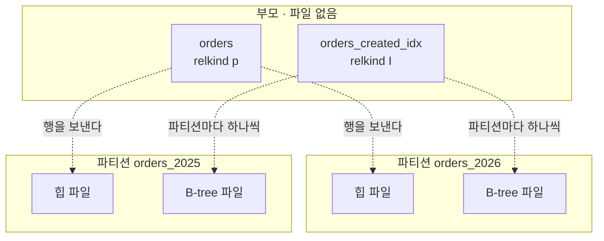
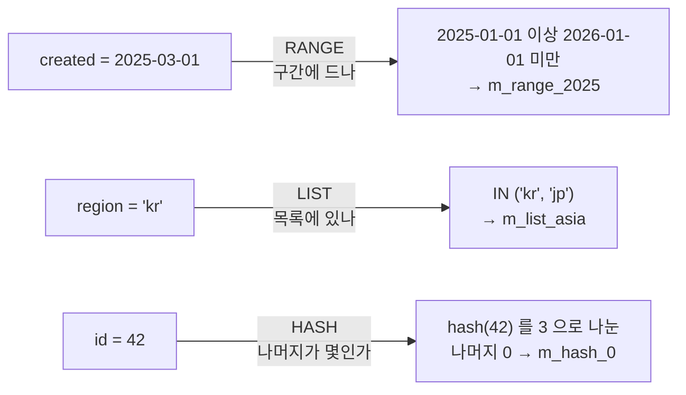
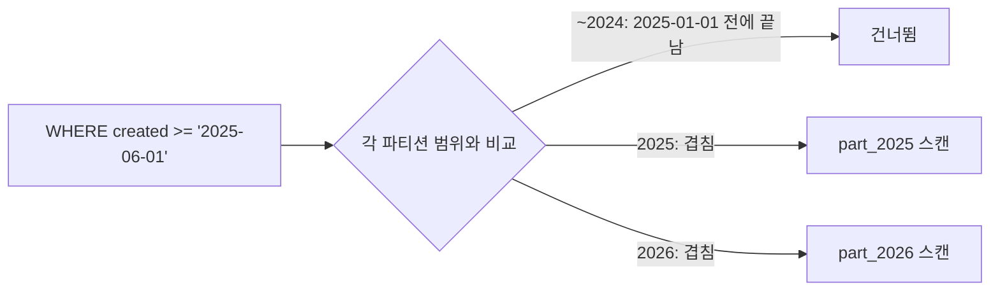

강의는 파티션 테이블을 만들 때 부모를 `PARTITION BY` 로 만들고, 평범한 테이블을 따로 만들어
거기에 `ATTACH` 하는 흐름을 보여 줬다. 그걸 보고 궁금해졌다. 그러면 파티셔닝된 테이블에서
힙과 인덱스는 어디에 있는가. 부모에 데이터가 있고 파티션은 그 조각인가?

파고들어 얻은 결론은 이거다. **부모에는 힙도 인덱스도 없다. 파티션 하나하나가 자기 힙 파일과
자기 B-tree 를 가진 완전한 테이블이고, 부모는 "이 행을 어느 파티션으로 보낼지" 규칙만 들고 있는
껍데기다.** 나머지는 거의 다 이 한 줄에서 따라 나온다. 유니크가 파티션 안에서만 보장되는 것,
FK 가 복합 키로만 걸리는 것, 파티션 키 없이 조회하면 모든 파티션을 뒤지는 것.

**공부 내용**은 강의가 알려준 것, **심화**는 거기서 파고든 것,
**보충 개념**은 그걸 이해하려다 걸린 DB 일반 용어다.

아래 수치와 출력은 전부 PostgreSQL 17 컨테이너에서 직접 받은 것이다.
재현 과정은 [실습 글](/study/database/section-6-partitioning-lab/)로 따로 뺐다.

## 공부 내용 — 테이블을 기준 컬럼으로 쪼갠다

파티셔닝은 큰 테이블 하나를 기준 컬럼(파티션 키)의 값에 따라 여러 테이블로 나눠 두는 것이다.
쿼리는 여전히 부모 테이블 하나에 던진다.

강의가 보여 준 흐름은 이렇다.

```sql
create table orders (id bigint, created date, amount int)
  partition by range (created);                        -- 부모: 나누는 방식과 기준 컬럼

create table orders_2026 (id bigint, created date, amount int);   -- 평범한 테이블
alter table orders attach partition orders_2026
  for values from ('2026-01-01') to ('2027-01-01');    -- 부모에 붙인다

create index on orders (created);                      -- 부모에 인덱스를 건다
```

강의에서 본 것과 거기서 생긴 질문을 정리하면 이렇다. 질문의 답은 전부 심화에 있다.

| 강의에서 본 것 | 거기서 생긴 질문 |
| --- | --- |
| 일반 테이블을 만들어 `ATTACH` 한다 | 그러면 힙과 인덱스는 어디에 있나 |
| 테이블·인덱스별 크기를 출력하니 부모에도 크기가 찍힌다 | 부모에 파일이 있다는 뜻인가 |
| 파티션 이름에 기간을 붙인다 (`orders_2026`) | 이름의 숫자를 보고 행을 나누나 |
| 파티션 키 없이 조회하면 *scattered index scan* 이 된다 | 그건 어떤 스캔인가 |
| MySQL·MariaDB 는 안 쓰는 파티션을 CSV 로 바꿔 보관할 수 있다 | 이건 [별도 글](/study/database/section-6-partition-archive/)로 뺐다 |

## 심화 — 부모는 껍데기, 파티션은 완전한 테이블

여기부터는 강의 밖이다.

### 부모에는 힙도 인덱스도 없다

`orders_2025` 는 `PARTITION OF` 로 만들고, `orders_2026` 은 일반 테이블로 만들어 1000행을 넣은 뒤
`ATTACH` 했다. 부모에 인덱스를 걸고, 부모로 2025년 500행을 더 넣었다.
그리고 테이블과 인덱스마다 파일 위치와 크기를 찍었다.

| relname | [relkind](#시스템-카탈로그 "pg_class 에서 이 객체가 무엇인지 나타내는 한 글자. r 은 일반 테이블, i 는 인덱스, p 는 파티션드 테이블, I 는 파티션드 인덱스") | 파일 | 크기 |
| --- | --- | --- | --- |
| `orders` | **p** | 없음 | 0 |
| `orders_2025` | r | `base/5/16387` | 24 KB |
| `orders_2026` | r | `base/5/16390` | 48 KB |
| `orders_created_idx` | **I** | 없음 | 0 |
| `orders_2025_created_idx` | i | `base/5/16394` | 32 KB |
| `orders_2026_created_idx` | i | `base/5/16395` | 40 KB |



- **힙:** 부모에는 데이터 파일이 없다. `insert into orders` 는 `created` 를 보고
  해당 파티션의 힙에 한 줄을 쓴다.
- **인덱스:** 부모의 인덱스도 껍데기다. 부모에 `create index` 를 걸면 파티션마다
  진짜 B-tree 가 하나씩 생긴다. **파티션 전체를 아우르는 하나의 B-tree 는 없다.**

그래서 "일반 테이블을 만들어 attach 한다"는 그림이 정확하다. 파티션은 처음부터 완전한 테이블이다.
`detach` 해 보면 확인된다. `orders_2026` 은 같은 파일(`base/5/16390`), 같은 인덱스,
1000행을 그대로 가진 채 일반 테이블로 돌아온다. **attach 와 detach 는 데이터를 옮기지 않고
카탈로그만 바꾼다.**

### 파티셔닝 정보는 카탈로그에 있다

부모에 파일이 없으니 "나누는 방식"과 "각 파티션의 범위"는 전부
[시스템 카탈로그](#시스템-카탈로그 "DB 가 자기 자신의 테이블·인덱스·제약 정보를 저장해 두는 내부 테이블들")에 들어 있다.

| 카탈로그 | 들어 있는 것 | 실제 값 |
| --- | --- | --- |
| `pg_partitioned_table` | 부모의 나누는 방식과 키 컬럼 | `partstrat = r` (RANGE), `partattrs = 2` (2번째 컬럼 `created`) |
| `pg_class.relpartbound` | 각 파티션의 범위 | `FOR VALUES FROM ('2025-01-01') TO ('2026-01-01')` |
| `pg_inherits` | 부모-자식 관계 | `orders_2025 → orders`, `orders_2025_created_idx → orders_created_idx` |
| `pg_constraint` | 제약. 자식 제약은 부모 제약을 가리킨다 | 아래 유니크 절의 `pay` 에 PK 를 걸면 `pay_2025_pkey` 의 `conparentid` 가 `pay_pkey` |

`insert into orders` 가 들어오면 Postgres 는 이 카탈로그에서 파티션 키와 범위를 읽고,
행을 넣을 파티션 하나를 골라 그 파티션의 힙과 인덱스에만 쓴다.

### 행을 보내는 건 이름이 아니라 FOR VALUES 다

파티션 이름에 `2025` 를 붙이는 건 관례일 뿐이다. 이름과 범위를 일부러 어긋나게 만들어 봤다.

```sql
create table t_2025 partition of t for values from ('2030-01-01') to ('2031-01-01');
create table banana partition of t for values from ('2025-01-01') to ('2026-01-01');
```

```text
 partition | id |  created
-----------+----+------------
 banana    |  1 | 2025-05-01
 t_2025    |  2 | 2030-05-01
```

`t_2025` 에는 2030년 행이 들어간다. DB 는 이름을 보지 않는다. 범위는 파티션을 만들 때 적는
`FOR VALUES` 절이 정하고, 그 값이 위의 `relpartbound` 에 저장된다.

`FOR VALUES` 의 모양은 나누는 방식마다 다르다. 그건 [다음 절](#range-list-hash--나누는-방식-세-가지)에서 본다.
RANGE 에서 범위와 관련해 확인한 동작은 이렇다.

| 상황 | 결과 |
| --- | --- |
| 어느 범위에도 안 맞는 행 | `no partition of relation "t" found for row` — INSERT 실패 |
| 범위가 겹치는 파티션 생성 | `partition "t_x" would overlap partition "banana"` — 거부 |
| 경계값 `2026-01-01` | `banana` 의 `TO ('2026-01-01')` 에 들어가지 않는다 |
| DEFAULT 가 있을 때 | 안 맞는 행은 DEFAULT 로 간다 |

### RANGE, LIST, HASH — 나누는 방식 세 가지

부모의 `PARTITION BY` 에서 방식을 고르고, 파티션마다 그 방식에 맞는 `FOR VALUES` 를 적는다.

```sql
-- RANGE: 연속된 구간. FROM 은 포함, TO 는 미포함 [FROM, TO)
create table m_range (id int, created date) partition by range (created);
create table m_range_2025 partition of m_range for values from ('2025-01-01') to ('2026-01-01');

-- LIST: 정해진 값 목록
create table m_list (id int, region text) partition by list (region);
create table m_list_asia partition of m_list for values in ('kr', 'jp');

-- HASH: 해시값을 modulus 로 나눈 나머지
create table m_hash (id int) partition by hash (id);
create table m_hash_0 partition of m_hash for values with (modulus 3, remainder 0);

-- DEFAULT: 어느 파티션에도 안 맞는 행 (RANGE, LIST 에서만)
create table m_range_default partition of m_range default;
```

같은 "행 하나가 들어온다"도 방식마다 파티션을 고르는 방법이 다르다.



셋을 나란히 놓으면 이렇다.

| | RANGE | LIST | HASH |
| --- | --- | --- | --- |
| 나누는 기준 | 연속된 구간 | 정해진 값 목록 | 해시값의 나머지 |
| 맞는 데이터 | 날짜·기간, 번호 구간 | 지역·상태처럼 값 종류가 정해진 것 | 자연스러운 구간이 없는 것 (`id`) |
| 걸러지는 조건 | `=`, 범위 조건 | `=`, `IN`, 범위 조건 | `=`, `IN` 만 |
| NULL | DEFAULT 로만 | `IN (NULL)` 파티션 | `remainder 0` 파티션 |
| 오래된 데이터 떼어 내기 | 기간 단위로 된다 | 값 기준이라 기간과 무관 | 안 된다. 시간과 무관하게 섞인다 |
| 행 분포 | 기간마다 다르다 | 값마다 다르다 | 고르다 |

**HASH 는 고르게 흩는 대신 순서를 버린다.** 9000행을 파티션 3개에 넣으니 2942 / 3036 / 3022 로
갈렸다. 대신 해시를 거치면 값의 대소가 사라져서 범위 조건으로는 거를 수 없다.

```text
where id = 42        → m_hash_0 하나
where id in (1, 2)   → m_hash_0, m_hash_2
where id < 10        → 3개 전부
```

**LIST 는 `<` 로도 걸러진다.** 파티션마다 값 목록이 적혀 있어서, 목록의 값이 조건에 맞을 수 있는지
하나씩 비교할 수 있다. `region < 'e'` 에서 `('kr', 'jp')` 는 전부 `'e'` 보다 뒤라서 빠지고,
`'de'` 가 든 `('de', 'fr')` 만 남았다. RANGE 는 `=` 이든 `<` 든 구간과 겹치는 파티션만 남는다.

**NULL 은 방식마다 갈 곳이 다르다.**

- **RANGE:** 범위 경계에 NULL 을 쓸 수 없다(`cannot specify NULL in range bound`).
  `from (minvalue)` 로 가장 작은 쪽을 열어 둬도 NULL 은 안 들어간다. NULL 은 대소 비교의 대상이
  아니기 때문이다. DEFAULT 가 있어야 들어가고, 없으면 `no partition ... (created) = (null)` 로 실패한다.
- **LIST:** `for values in (null)` 로 NULL 전용 파티션을 만들 수 있다. `where region is null` 은
  그 파티션만 읽는다.
- **HASH:** 따로 지정할 수 없고 전부 `remainder 0` 파티션으로 간다. NULL 이 많으면 이 파티션만 커진다.

그렇다고 NULL 을 허용할 일은 많지 않다. [PK 에는 파티션 키가 들어가야 하고](#유니크는-파티션-안에서만-보장된다 "파티션 안에서만 확인하고 끝나게 하려고. 같은 키면 같은 파티션으로 가니 거기서 중복을 잡는다"),
PK 컬럼은 자동으로 NOT NULL 이 된다. `primary key (id, created)` 를 걸자 `created` 의
`attnotnull` 이 `t` 로 바뀌었다. 기간 파티션에서 NULL 을 허용하면 그 행이 DEFAULT 에 쌓이기도 한다.
**파티션 키는 보통 NOT NULL 로 두고, NULL 이 의미 있는 값인 LIST 에서만 `IN (NULL)` 파티션을 따로 둔다.**

### 파티션은 미리 만들어 둔다

Postgres 는 달이 바뀌어도 파티션을 알아서 만들지 않는다. 안 만들어 두면
그달 1일부터 INSERT 가 위의 `no partition` 에러로 실패한다.

**트리거로 "새 달 행이 들어오는 순간 만들기"는 안 된다.** 세 자리 모두 막혔다.

| 트리거 위치 | 결과 |
| --- | --- |
| 부모에 BEFORE INSERT **행** 트리거 | `no partition of relation "logs" found for row` |
| 부모에 BEFORE INSERT **문장** 트리거 | `cannot CREATE TABLE .. PARTITION OF "logs" because it is being used by active queries in this session` |
| DEFAULT 파티션에 행 트리거 | 위와 같은 에러 |

행 트리거는 부모에 걸어도 실제로는 각 파티션에 복제돼서 실행된다.
그래서 행이 갈 파티션을 먼저 찾아야 하는데, 찾는 단계에서 이미 실패한다.
문장 트리거와 DEFAULT 트리거는 실행까지는 되지만, INSERT 가 쓰고 있는 테이블에
파티션을 추가하는 DDL 을 Postgres 가 막는다.

그래서 **스케줄러로 몇 달 치를 미리 만들어 둔다.** 보통은
<abbr title="PostgreSQL 확장. 기간·번호 기준 파티션을 미리 만들고, 보관 기간이 지난 파티션을 떼어 내거나 지워 준다.">pg_partman</abbr> 을
<abbr title="PostgreSQL 확장. DB 안에서 cron 문법으로 SQL 을 주기적으로 실행한다.">pg_cron</abbr> 으로 돌린다.

```sql
select partman.create_parent(
  p_parent_table => 'public.events', p_control => 'created',
  p_interval => '1 month', p_premake => 3);            -- 앞으로 3달 치를 미리

select cron.schedule('partman-maint', '0 3 * * *',
  $$select partman.run_maintenance()$$);               -- 매일 03시에 채워 넣는다
```

`create_parent` 한 번에 실행한 달 앞뒤로 3달 치 파티션과 `events_default` 가 같이 생긴다.
함정이 하나 있었다. **기본값 `infinite_time_partitions = false` 에서는 최근 데이터가 들어와야
앞으로의 파티션을 만든다.** 데이터 없이 `run_maintenance()` 를 돌렸더니 아무것도 안 생겼고,
이 값을 `true` 로 바꾸자 2027년 파티션이 생겼다(2026년 9월에 돌린 결과다). 한동안 비어 있을 테이블이면 켜 둔다.

DEFAULT 는 스케줄러가 멈췄을 때 INSERT 가 실패하지 않게 받아 주는 안전망이다.
다만 **DEFAULT 에 행이 쌓이면 그 범위의 파티션을 나중에 못 만든다.**
`t_default` 에 `2027-05-01` 행이 들어간 상태에서 2027 파티션을 만들면 이렇다.

```text
create table t_2027 partition of t for values from ('2027-01-01') to ('2028-01-01');
ERROR:  updated partition constraint for default partition "t_default" would be violated by some row
```

DEFAULT 에 이미 2027년 행이 있어서, 새 파티션이 생기면 그 행이 규칙상 있으면 안 되는 곳에 있게 된다.
그 행을 먼저 DEFAULT 에서 빼내야 한다. 그래서 DEFAULT 에 행이 생기면 알림을 받게 해 두는 게 좋다.

### 파티션 프루닝 — 답이 없는 파티션은 안 연다

**파티션 프루닝(partition pruning)은 쿼리 조건을 보고 "이 파티션에는 답이 있을 수 없다"고
판단한 파티션을 아예 읽지 않는 것이다.** 데이터를 열어 보는 게 아니라 카탈로그의
범위 정의만 보고 판단한다.



거르는 시점은 셋이다.

| 시점 | 언제 쓰이나 | 계획에서 보이는 모습 |
| --- | --- | --- |
| 계획 시점 | 조건 값이 상수일 때 | 제외된 파티션이 계획에 아예 없다 |
| 실행 시작 시점 | 값이 [파라미터](#prepared-statement-와-generic-plan "값 자리를 $1 로 비워 둔 채 계획을 미리 세워 두는 방식. 계획 시점에는 값을 모른다")일 때 | `Subplans Removed: 9` |
| 실행 중 | 값이 조인 상대에서 한 행씩 올 때 | 해당 파티션에 `(never executed)` |

**파티션 키에 함수를 씌우면 걸러지지 않는다.**

```sql
where extract(year from created) = 2025                  -- 파티션 10개 전부 Seq Scan
where created >= '2025-01-01' and created < '2026-01-01' -- part_2025 하나
```

플래너는 `extract(year ...)` 의 결과가 파티션 범위와 어떻게 대응하는지 모른다.
사람 눈에는 뻔해도 안 걸러진다. 인덱스 컬럼에 함수를 씌우면 인덱스를 못 타는 것과 같은 함정이다.

### scattered index scan 은 스캔 종류가 아니다

Postgres 실행 계획에 나오는 인덱스 스캔은 Index Scan, Index Only Scan, Bitmap Index Scan 셋뿐이다.
"scattered index scan" 이라는 노드는 없다. 파티셔닝 맥락에서는 **파티션 키 없이 조회해서
인덱스 탐색이 모든 파티션으로 흩어지는 상황**을 가리키는 말로 읽는 게 맞다.
분산 DB 에서 샤드 키 없는 쿼리를 모든 샤드에 뿌리는
[scatter-gather](#scatter-gather "요청을 모든 조각에 뿌리고 결과를 한데 모으는 방식") 와 같은 모양이다.

파티션 10개에 행 100만 건을 넣고 `id` 로만 조회했다.

```text
 Append (actual rows=1 loops=1)
   ->  Index Scan using part_2017_id_idx on part_2017 part_1 (actual rows=0 loops=1)
   ->  Index Scan using part_2018_id_idx on part_2018 part_2 (actual rows=0 loops=1)
   ...
   ->  Index Scan using part_2020_id_idx on part_2020 part_4 (actual rows=1 loops=1)
   ...
   ->  Index Scan using part_2026_id_idx on part_2026 part_10 (actual rows=0 loops=1)
```

[Append](#append-노드 "하위 노드들의 결과를 차례로 이어 붙이는 실행 계획 노드") 아래에
평범한 Index Scan 이 파티션 수만큼 반복된다. 찾은 건 한 곳인데 B-tree 는 10번 탔다.
`and created = '2020-10-27'` 을 붙이면 `part_2020` 하나만 탄다.

스캔 방식도 파티션마다 따로 고른다. 통계가 파티션마다 따로 있기 때문이다.
`status = 'done'` 이 2025 파티션에는 99%, 2026 파티션에는 1% 있게 만들었더니 이렇게 나왔다.

```text
 Append
   ->  Seq Scan on jobs_2025 jobs_1                              ← 거의 전부 해당
   ->  Index Scan using jobs_2026_status_idx on jobs_2026 jobs_2 ← 드물다
```

### 유니크는 파티션 안에서만 보장된다

B-tree 가 파티션마다 따로 있으니, 한 B-tree 는 다른 파티션에 같은 값이 있는지 모른다.
그래서 `id` 만으로 PK 를 걸면 거부된다.

```text
alter table pay add primary key (id);
ERROR:  unique constraint on partitioned table must include all partitioning columns
DETAIL:  PRIMARY KEY constraint on table "pay" lacks column "created" which is part of the partition key.
```

`(id, created)` 는 된다. 이게 왜 전체 유니크를 보장하는지는 두 단계로 풀린다.

1. 두 행의 `(id, created)` 가 같으면 `created` 도 같다.
2. `created` 가 같으면 **반드시 같은 파티션**으로 간다. 그 파티션의 B-tree 하나가 중복을 잡는다.

**제약이 파티션을 돌며 확인하는 게 아니다.** 다른 파티션에 있는 두 행은 `created` 가 달라서
`(id, created)` 도 반드시 다르다. 파티션을 넘나드는 중복은 애초에 생길 수 없게 짜 놓은 것이다.
실제로 중복 에러는 부모 제약이 아니라 `pay_2025_pkey`(자식)에서 난다.

그런데 이건 **`(id, created)` 조합의 유니크이지 `id` 의 유니크가 아니다.**

```text
 partition | id |  created   | amount
-----------+----+------------+--------
 pay_2025  |  1 | 2025-05-01 |     10
 pay_2025  |  1 | 2025-07-01 |     40
 pay_2026  |  1 | 2026-05-01 |     30     ← id = 1 이 세 개
```

DB 가 "겹쳐도 괜찮다"고 판단한 게 아니다. `id` 전역 유니크를 지키려면 모든 파티션의 인덱스를
뒤지고, 동시에 들어오는 INSERT 끼리의 경합까지 막아야 한다. 그래서 Postgres 는
**파티션 하나 안에서 확인하면 끝나는 제약만 허용한다.** `id` 가 안 겹치게 하는 책임은
설계로 넘어온다. 시퀀스나 UUID 로 애초에 겹치지 않게 만드는 게 보통이다.

이 제약은 UNIQUE 에만 걸린다. 일반 인덱스는 `(id)` 만으로도 만들 수 있다.

### 파티션 키가 따라다닌다

PK 가 `(id, created)` 가 되면 `id` 가 쓰이던 모든 곳에 `created` 가 따라붙는다.

**FK 는 복합 키로만 걸린다.** FK 는 참조 대상에 UNIQUE 가 있어야 걸리는데,
유니크한 게 `(id, created)` 뿐이다.

```text
create table pay_items (item_id int, pay_id bigint references pay (id));
ERROR:  there is no unique constraint matching given keys for referenced table "pay"
```

```sql
create table pay_items (item_id int, pay_id bigint, pay_created date,
  foreign key (pay_id, pay_created) references pay (id, created));
```

**조인도 두 컬럼으로 걸어야 한다.** FK 가 복합이어도 조인 조건이 알아서 복합이 되지는 않는다.
위의 `id = 1` 이 세 개인 상태에서 `pay_items` 한 행을 조인하면 이렇다.

```text
on p.id = i.pay_id                               → 3행   ← 틀린 결과
on p.id = i.pay_id and p.created = i.pay_created → 1행
```

`id` 를 시퀀스로 뽑아 실제로 안 겹친다면 결과는 맞는다. 대신 매번 모든 파티션을 탄다.
두 컬럼으로 걸면 실행 중에도 프루닝이 된다.

```text
 Nested Loop (actual rows=1 loops=1)
   ->  Seq Scan on pay_items i (actual rows=1 loops=1)
   ->  Append (actual rows=1 loops=1)
         ->  Index Scan using pay_2025_pkey on pay_2025 p_1 (actual rows=1 loops=1)
         ->  Index Scan using pay_2026_pkey on pay_2026 p_2 (never executed)
```

그래서 **다른 테이블이 많이 참조하는 테이블은 파티션 대상으로 잘 고르지 않는다.**
로그, 이벤트, 이력처럼 쌓이기만 하고 참조가 적은 테이블이 파티셔닝에 맞다.

### 인덱스는 쪼개질 뿐 커지지 않는다

파티션이 N개면 인덱스 정의 하나당 B-tree 가 N개 생긴다. 그러면 인덱스가 N배로 커질 것 같지만
아니다. 행 100만 건으로 쟀다.

| 인덱스 | 파티션 없음 (1개) | 파티션 10개 (10개 합) |
| --- | --- | --- |
| `(id)` | 21 MB | 22 MB |
| `(id, created)` | 30 MB | 30 MB |

파티션 인덱스는 **자기 파티션의 행만** 담는다. 100만 개를 한 트리에 넣든 10만 개씩 열 트리에
넣든 엔트리는 100만 개다. 파티션마다 메타 페이지 같은 고정 비용이 조금 붙을 뿐이다.
`(id, created)` 가 더 큰 건 파티션 때문이 아니라 엔트리마다 컬럼이 하나 더 붙어서다.
파티션이 없어도 30MB 다. 트리 하나는 오히려 한 층 얕아졌다(루트의 level 2 → 1).

파티션 수가 늘 때 드는 비용은 크기가 아니라 여기에 있다.

- 프루닝이 안 되는 쿼리는 B-tree 를 N번 탄다
- 플래너가 파티션마다 계획을 세운다. 수천 개가 되면 눈에 띈다
- 테이블 × 인덱스 수만큼 파일이 생기고 VACUUM·통계도 그만큼 따로 돈다

### 부모 크기는 합산 값이다

부모에 크기가 찍힌다면 그건 파티션들을 더한 값이다. 부모를 직접 재면 무엇으로 재도 0이다.

```text
pg_relation_size('orders')        → 0
pg_total_relation_size('orders')  → 0
\dt+ orders                       → 0 bytes
```

크기가 나오는 건 `\dP+` 다. 파티션드 테이블과 인덱스만 모아 보여 주면서 파티션 크기를 더한다.

```text
        Name        |       Type        | Total size
--------------------+-------------------+------------
 orders             | partitioned table | 120 kB
 orders_created_idx | partitioned index | 72 kB
```

| | orders_2025 | orders_2026 | 합 |
| --- | --- | --- | --- |
| 테이블 | 48 kB | 72 kB | **120 kB** |
| 인덱스 | 32 kB | 40 kB | **72 kB** |

SQL 로 직접 더하려면 `pg_partition_tree()` 로 파티션을 펼친다.

```sql
select pg_size_pretty(sum(pg_table_size(relid))) from pg_partition_tree('orders');
```

이 표에서 `orders_2025` 는 48 kB 인데, 첫 절의 표에서는 24 KB 였다.
`pg_relation_size` 는 본체 파일만, `pg_table_size` 는
<abbr title="Free Space Map. 페이지마다 빈 공간이 얼마나 남았는지 적어 둔 부속 파일">FSM</abbr>,
<abbr title="Visibility Map. 페이지의 모든 행이 모두에게 보이는지 적어 둔 부속 파일">VM</abbr>,
<abbr title="한 페이지에 안 들어가는 긴 값을 따로 떼어 저장하는 부속 테이블">TOAST</abbr>
같은 부속 파일까지 센다. `\dP+` 는 뒤의 것을 쓴다.

## 실습 — 직접 확인해보기

위의 표와 출력은 전부 [섹션6 실습: 파티션을 직접 쪼개 보기](/study/database/section-6-partitioning-lab/)에서
받은 것이다. 파일·카탈로그, 행이 들어가는 곳, 조회, 제약 네 부로 나눠 따라 할 수 있게 적었다.

오래된 파티션을 떼어 내 CSV 로 보관하는 이야기는
[섹션6: 안 쓰는 파티션을 CSV 로 내리기](/study/database/section-6-partition-archive/)에 따로 정리했다.

## 보충 개념 — 주제와는 별개로 몰라서 막혔던 것들

### 시스템 카탈로그

DB 가 자기 자신에 대한 정보를 저장해 두는 내부 테이블들이다. 테이블·인덱스·제약·함수가
무엇이고 어디에 있는지가 전부 여기 있고, 평범한 테이블처럼 `select` 로 읽을 수 있다.

가장 자주 보는 건 `pg_class` 다. 테이블과 인덱스가 한 줄씩 들어 있고,
`relkind` 한 글자로 종류를 구분한다.

| relkind | 뜻 |
| --- | --- |
| `r` | 일반 테이블 (파티션도 여기) |
| `i` | 인덱스 |
| `p` | 파티션드 테이블 (부모) |
| `I` | 파티션드 인덱스 (부모 인덱스) |
| `f` | 외부 테이블 |

### Append 노드

실행 계획에서 **하위 노드들의 결과를 차례로 이어 붙이는** 노드다. 파티션 테이블을 조회하면
부모 아래에 파티션별 스캔이 달리고, 그 위를 `Append` 가 묶는다. `UNION ALL` 에서도 나온다.
프루닝으로 파티션이 하나만 남으면 `Append` 없이 그 파티션의 스캔만 나온다.

### prepared statement 와 generic plan

`prepare q(date) as select ... where created = $1` 처럼 값 자리를 비워 두고 SQL 을 미리 준비해
두는 것이 prepared statement 다. 애플리케이션 드라이버가 뒤에서 자주 쓴다.

Postgres 는 처음 몇 번은 넘어온 값마다 계획을 새로 세우다가(custom plan), 값과 무관한 계획
하나(generic plan)를 재사용하는 쪽으로 넘어갈 수 있다. generic plan 은 계획 시점에 값을 모르므로
프루닝을 실행 시작 시점으로 미룬다. 계획에 `Subplans Removed` 가 찍히는 게 그 흔적이다.

### scatter-gather

요청을 모든 조각에 뿌리고(scatter) 결과를 모으는(gather) 방식이다. 샤딩된 DB 에서
샤드 키 없는 쿼리가 이렇게 돈다. 조각 수만큼 일이 늘어나고, 가장 느린 조각이 전체 응답 시간을 정한다.

## 정리

| 질문 | 답 |
| --- | --- |
| 힙과 인덱스는 어디에 있나 | 파티션마다 따로. 부모는 파일이 없는 껍데기 (`p`, `I`) |
| 파티션 규칙은 어디에 있나 | 카탈로그. `pg_partitioned_table`, `relpartbound`, `pg_inherits` |
| 이름의 숫자로 나누나 | 아니다. `FOR VALUES` 가 정한다 |
| 나누는 방식은 | RANGE 구간 · LIST 값 목록 · HASH 나머지. 걸러지는 조건과 NULL 이 가는 곳이 다르다 |
| 새 달 파티션은 | 자동으로 안 생긴다. 트리거로도 안 된다. pg_partman + pg_cron 으로 미리 |
| scattered index scan 은 | 스캔 종류가 아니다. 프루닝이 안 돼서 모든 파티션을 탐색하는 상황 |
| 유니크는 | 파티션 키를 포함해야 한다. 파티션 안에서만 확인하고 끝나게 하려고 |
| FK·조인은 | 복합으로만 걸린다. 조인도 두 컬럼으로 |
| 인덱스 크기는 | 개수만 N배. 합은 거의 같다 |
| 부모 크기는 | 파티션 합산 (`\dP+`). 직접 재면 0 |

다음에 이 근처에서 막히면 이 순서로 본다. 먼저 **부모는 파일이 없다**를 떠올린다.
그러면 "이건 파티션 하나 안에서 끝나는 일인가, 모든 파티션을 돌아야 하는 일인가"를 물으면 된다.
유니크, FK, 조회 성능 문제는 전부 이 질문으로 갈린다.

## 참고

- [Fundamentals of Database Engineering](https://www.udemy.com/course/database-engineering-korean/) — Hussein Nasser
- [PostgreSQL 17: Table Partitioning](https://www.postgresql.org/docs/17/ddl-partitioning.html)
- [PostgreSQL 17: CREATE TABLE](https://www.postgresql.org/docs/17/sql-createtable.html) — `PARTITION BY`, `FOR VALUES`
- [PostgreSQL 17: pg_partition_tree](https://www.postgresql.org/docs/17/functions-admin.html)
- [pg_partman](https://github.com/pgpartman/pg_partman)
- [pg_cron](https://github.com/citusdata/pg_cron)
